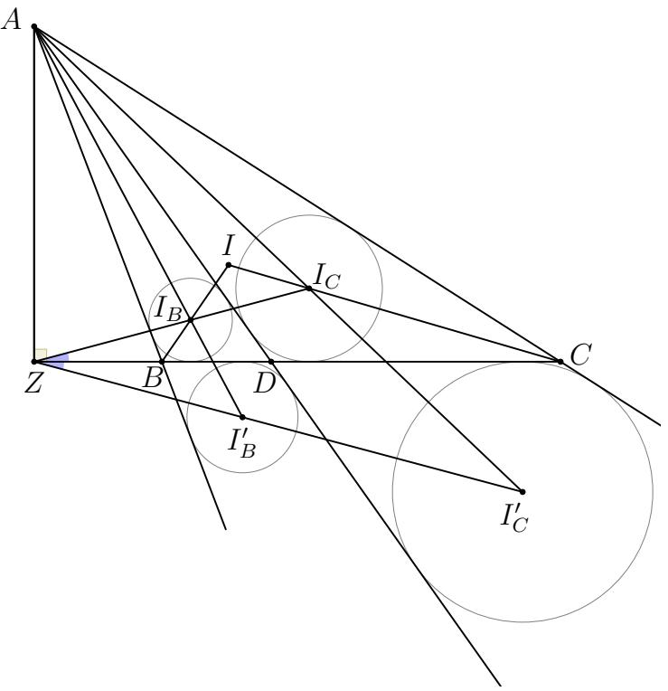

# SHORTLISTED PROBLEMS

WITH SOLUTIONS

# SHORTLISTED PROBLEMS WITH SOLUTIONS

The Shortlist has to be kept strictly confidential until the conclusion of the following International Mathematical Olympiad. IMO General Regulations \$6.6

# Contributing Countries

The Organising Committee and the Problem Selection Committee of IMO 2024 thank the following 63 countries for contributing 229 problem proposals:

Algeria， Australia， Azerbaijan， Bangladesh， Belarus， Brazil， Bulgaria,Canada， China， Colombia， Croatia， Cyprus， Czech Republic， Denmark,Dominican Republic, Ecuador, Estonia, France, Georgia, Germany, Ghana,Greece，Hong Kong，India，Indonesia，Ireland， Iran，Israel， Japan,Kazakhstan， Kosovo， Latvia， Lithuania， Luxembourg, Malaysia， Mexico,Moldova， Netherlands， New Zealand， Norway， Peru， Poland， Portugal,Romania， Senegal， Serbia， Singapore， Slovakia, Slovenia， South Africa,South Korea, Spain, Sweden, Switzerland, Syria, Taiwan, Thailand, Tunisia,Türkiye, Uganda, Ukraine, U.S.A., Uzbekistan.

# Problem Selection Committee

Aron Thomas, Yinghua Ai, Andrew Ng, Géza Kos, Ivan Guo, Alice Carlotti, James Aaronson, Sam Bealing, Adrian Agisilaou, James Cranch, Joseph Myers (chair),Harvey Yau, Maria-Romina Ivan,Michael Ren, Elisa Lorenzo Garcia

# Problems

# Algebra

# A1.

Determine all real numbers $\alpha$ such that the number

$$
\lfloor \alpha \rfloor + \lfloor 2 \alpha \rfloor + \cdot \cdot \cdot + \lfloor n \alpha \rfloor
$$

is a multiple of $n$ for every positive integer $n$ . (Here $\lfloor z \rfloor$ denotes the greatest integer less than or equal to $z$ ）

(Colombia)

# A2.

Let $n$ be a positive integer. Find the minimum possible value of

$$
S = 2 ^ { 0 } x _ { 0 } ^ { 2 } + 2 ^ { 1 } x _ { 1 } ^ { 2 } + \cdot \cdot \cdot + 2 ^ { n } x _ { n } ^ { 2 } ,
$$

where $x _ { 0 }$ ， $x _ { 1 }$ ， $\cdot \cdot \cdot$ ， $x _ { n }$ are nonnegative integers such that $x _ { 0 } + x _ { 1 } + \cdot \cdot \cdot + x _ { n } = n$ ：

(China)

# A3.

Decide whether for everysequence ( $u _ { n }$ ）of positive real numbers,

$$
\frac { 3 ^ { a _ { 1 } } + 3 ^ { a _ { 2 } } + \cdot \cdot \cdot + 3 ^ { a _ { n } } } { ( 2 ^ { a _ { 1 } } + 2 ^ { a _ { 2 } } + \cdot \cdot \cdot + 2 ^ { a _ { n } } ) ^ { 2 } } < \frac { 1 } { 2 0 2 4 }
$$

is true for at least one positive integer $n$ ：

(China)

$\left( \mathbf { A 4 . } \right)$ Let $\mathbb { Z } _ { > 0 }$ be the set of all positive integers.Determine all subsets $\boldsymbol { S }$ of $\{ 2 ^ { 0 } , 2 ^ { 1 } , 2 ^ { 2 } , \dots \}$ for which there exists a function $f \colon \mathbb { Z } _ { > 0 } \to \mathbb { Z } _ { > 0 }$ such that

$$
\begin{array} { r } { S = \{ f ( a + b ) - f ( a ) - f ( b ) \mid a , b \in \mathbb { Z } _ { > 0 } \} . } \end{array}
$$

(Thailand)

A5. Find all periodic sequences $a _ { 1 }$ $\ 1 , a _ { 2 } , \ldots$ of real numbers such that the following conditions hold for all $n \geqslant 1$ ：：

$$
a _ { n + 2 } + a _ { n } ^ { 2 } = a _ { n } + a _ { n + 1 } ^ { 2 } \qquad { \mathrm { a n d } } \qquad | a _ { n + 1 } - a _ { n } | \leqslant 1 .
$$

(Kosouo)

#

A6. Let $a _ { 0 }$ ， $a _ { 1 }$ ， $a _ { 2 }$ ,... be an infinite strictly increasing sequence of positive integers such that for each $n \geqslant 1$ we have

$$
a _ { n } \in \left\{ { \frac { a _ { n - 1 } + a _ { n + 1 } } { 2 } } , { \sqrt { a _ { n - 1 } \cdot a _ { n + 1 } } } \right\} .
$$

Let $b _ { 1 }$ ， $b _ { 2 }$ ，... be an infinite sequence of letters defined as

$$
b _ { n } = { \left\{ \begin{array} { l l } { A , } & { { \mathrm { i f ~ } } a _ { n } = { \frac { 1 } { 2 } } ( a _ { n - 1 } + a _ { n + 1 } ) ; } \\ { G , } & { { \mathrm { o t h e r w i s e } } . } \end{array} \right. }
$$

Prove that there exist positive integers $n _ { 0 }$ and $d$ such that for all $n \geqslant n _ { 0 }$ we have $b _ { n + d } = b _ { n }$

(Czech Republic)

A7. Let $\mathbb { Q }$ be the set of rational numbers. Let $f \colon \mathbb { Q } \to \mathbb { Q }$ be a function such that the following property holds: for all $x$ ， $y \in \mathbb { Q }$ ，

$$
f ( x + f ( y ) ) = f ( x ) + y \qquad { \mathrm { o r } } \qquad f ( f ( x ) + y ) = x + f ( y ) .
$$

Determine the maximum possible number of elements of $\{ f ( x ) + f ( - x ) \mid x \in \mathbb { Q } \}$

A8. Let $p \neq q$ be coprime positive integers. Determine all infinite sequences $a _ { 1 }$ ， $a _ { 2 }$ ，...of positive integers such that the following conditions hold for all $n \geqslant 1$ ：

$$
\begin{array} { r l } & { \operatorname* { m a x } ( a _ { n } , a _ { n + 1 } , \ldots , a _ { n + p } ) - \operatorname* { m i n } ( a _ { n } , a _ { n + 1 } , \ldots , a _ { n + p } ) = p \qquad \mathrm { a n d } } \\ & { \operatorname* { m a x } ( a _ { n } , a _ { n + 1 } , \ldots , a _ { n + q } ) - \operatorname* { m i n } ( a _ { n } , a _ { n + 1 } , \ldots , a _ { n + q } ) = q . } \end{array}
$$

# Combinatorics

C1. Let $n$ be a positive integer. A class of $n$ students run $n$ races, in each of which they are ranked with no draws. A student is eligible for a rating $( a , b )$ for positive integers $a$ and $b$ if they come in the top $b$ places in at least $a$ of the races. Their final score is the maximum possible value of $a - b$ across all ratings for which they are eligible.

Find the maximum possible sum of all the scores of the $n$ students.

(Australia)

C2. Let $n$ be a positive integer. The integers 1, 2,3.,..., $n ^ { 2 }$ are to be written in the cells of an $n \times n$ board such that each integer is written in exactly one cell and each cell contains exactly one integer. For every integer $d$ with $d \mid n$ ，the $d$ -division of the board is the division of the board into $( n / d ) ^ { 2 }$ nonoverlapping sub-boards, each of size $d \times d$ ， such that each cell is contained in exactly one $d \times d$ sub-board.

We say that $n$ is a cool number if the integers can be written on the $n \times n$ board such that, for each integer $d$ with $d \mid n$ and $1 < d < n$ ，in the $d$ -division of the board, the sum of the integers written in each $d \times d$ sub-board is not a multiple of $d$ ：

Determine all even cool numbers.

(Turkiye)

C3. Let $n$ be a positive integer. There are $2 n$ knights sitting at a round table. They consist of $n$ pairs of partners, each pair of which wishes to shake hands. A pair can shake hands only when next to each other. Every minute, one pair of adjacent knights swaps places.

Find the minimum number of exchanges of adjacent knights such that, regardless of the initial arrangement, every knight can meet her partner and shake hands at some time.

(Belarus)

C4. On a board with 2024 rows and 2023 columns, Turbo the snail tries to move from the first row to the last row. On each attempt,he chooses to start on any cell in the first row, then moves one step at a time to an adjacent cel sharing a common side. He wins if he reaches any cell in the last row. However, there are 2022 predetermined, hidden monsters in 2022 of the cells,one in each row except the frst and last rows,such that no two monsters share the same column. If Turbo unfortunately reaches a cell with a monster, his attempt ends and he is transported back to the first row to start a new attempt. The monsters do not move.

Suppose Turbo is allowed to take $n$ attempts. Determine the minimum value of $n$ for which he has a strategy that guarantees reaching the last row,regardless of the locations of the monsters.

(Hong Kong)

C5. Let $N$ beapositiveinteger.GoffndCeriplaygaeiwichtheytartbywiting the numbers 1, 2,..., $N$ on a board. They then take turns to make a move, starting with Geoff. Each move consists of choosing a pair of integers $( k , n )$ ， where $k \geqslant 0$ and $n$ is one of the integers on the board, and then erasing every integer $s$ on the board such that $2 ^ { k } \mid n - s$ . The game continues until the board is empty. The player who erases the last integer on the board loses.

Determine all values of $N$ for which Geoff can ensure that he wins, no matter how Ceri plays.

(Indonesia)

C6. Let $n$ and $T$ be positive integers. James has $4 n$ marbles with weights 1, 2,.., 4n. He places them on a balance scale, so that both sides have equal weight. Andrew may move a marble from one side of the scale to the other,so that the absolute difference in weights of the two sides remains at most $T$ ：

Find, in terms of $n$ , the minimum positive integer $T$ such that Andrew may make a sequence of moves such that each marble ends up on the opposite side of the scale, regardless of how James initially placed the marbles.

(Ghana)

$\left( \mathbf { C 7 . } \right)$ Let $N$ be a positive integer and let $a _ { 1 }$ ， $a _ { 2 }$ ，...be an infinite sequence of positive integers. Suppose that, for each $n > N$ ， $a _ { n }$ is equal to the number of times $a _ { n - 1 }$ appears in the list a1, a2, ..., an-1.

Prove that at least one of the sequences $a _ { 1 }$ ， $a _ { 3 }$ ， $a _ { 5 }$ ，... and $a _ { 2 }$ ， $a _ { 4 }$ ， $a _ { 6 }$ ，... is eventually periodic.

(Australia)

C8. Let $n$ be a positive integer. Given an $n \times n$ board, the unit cellin the top left corner is initially coloured black,and the other cells are coloured white. We then apply a series of colouring operations to the board. In each operation，we choose a $2 \times 2$ square with exactly one cell coloured black and we colour the remaining three cells of that $2 \times 2$ square black.

Determine all values of $n$ such that we can colour the whole board black.

# Geometry

$\left( \mathbf { G 1 . } \right)$ Let $A B C D$ be a cyclic quadrilateral such that $A C < B D < A D$ and $\angle D B A < 9 0 ^ { \circ }$ ： Point $E$ lies on the line through $\boldsymbol { D }$ parallel to $A B$ such that $E$ and $C$ lie on opposite sides of line $A D$ ,and $A C = D E$ . Point $F$ lies on the line through $A$ parallel to $\boldsymbol C \boldsymbol D$ such that $F$ and $C$ lie on opposite sides of line $A D$ ，and $B D = A F$ ：

Prove that the perpendicular bisectors of segments $B C$ and $E F$ intersect on the circumcircle of $A B C D$ ：

(Ukraine)

G2. Let $A B C$ be a triangle with $A B < A C < B C$ , incentre $I$ and incircle $\omega$ .Let $X$ be the point in the interior of side $B C$ such that the line through $X$ parallel to $A C$ is tangent to $\omega$ ： Similarly, let $Y$ be the point in the interior of side $B C$ such that the line through $Y$ parallel to $A B$ is tangent to $\omega$ . Let $A I$ intersect the circumcircle of triangle $A B C$ again at $P \neq A$ . Let $K$ and $L$ be the midpoints of $A B$ and $A C$ , respectively.

Prove that $\angle K I L + \angle Y P X = 1 8 0 ^ { \circ }$

(Poland)

G3. Let $A B C D E$ be a convex pentagon and let $M$ be the midpoint of $A B$ .Suppose that segment $A B$ is tangent to the circumcircle of triangle $C M E$ at $M$ and that $\boldsymbol { D }$ lies on the circumcircles of triangles $A M E$ and $B M C$ . Lines $A D$ and $M E$ intersect at $K$ ，and lines $B D$ and $M C$ intersect at $L$ . Points $P$ and $Q$ lie on line $E C$ so that $\angle P D C = \angle E D Q = \angle A D B$ ：

Prove that lines $K P$ ， $L Q$ ，and $M D$ are concurrent.

(Belarus)

G4. Let $A B C D$ be a quadrilateral with $A B$ parallel to $\boldsymbol C \boldsymbol D$ and $A B < C D$ Lines $A D$ and $B C$ intersect at a point $P$ .Point $X \neq C$ on the circumcircle of triangle $A B C$ is such that $P C = P X$ . Point $Y \neq D$ on the circumcircle of triangle $A B D$ is such that $P D = P Y$ ： Lines $A X$ and $B Y$ intersect at $Q$ ：

Prove that $P Q$ is parallel to $A B$

(Ukraine)

G5. Let $A B C$ be a triangle with incentre $I$ ,and let $\Omega$ be the circumcircle of triangle $B I C$ ： Let $K$ be a point in the interior of segment $B C$ such that $\angle B A K < \angle K A C$ . The angle bisector of $\angle B K A$ intersects $\Omega$ at points $W$ and $X$ such that $A$ and $W$ lie on the same side of $B C$ ,and the angle bisector of $\angle C K A$ intersects $\Omega$ at points $Y$ and $Z$ such that $A$ and $Y$ lie on the same side of $B C$

Prove that $\angle W A Y = \angle Z A X$

(Uzbekistan)

G6. Let $A B C$ be an acute triangle with $A B < A C$ ,and let $\Gamma$ be the circumcircle of $A B C$ ： Points $X$ and $Y$ lie on $\Gamma$ so that $X Y$ and $B C$ intersect on the external angle bisector of $\angle B A C$ Suppose that the tangents to $\Gamma$ at $X$ and $Y$ intersect at a point $T$ on the same side of $B C$ as $A$ ,and that $r X$ and $' l Y$ intersect $B C$ at $U$ and $V$ , respectively. Let $J$ be the centre of the excircle of triangle $T U V$ opposite the vertex $T$ ：

Prove that $A J$ bisects $\angle B A C$

G7. Let $A B C$ be a triangle with incentre $I$ such that $A B < A C < B C$ . The second intersections of $A I$ ， $B I$ ，and $\dot { C } I$ with the circumcircle of triangle $A B C$ are $M _ { A }$ ， $M _ { B }$ ，and $M _ { C }$ ， respectively. Lines $A I$ and $B C$ intersect at $\boldsymbol { D }$ and lines $B M _ { C }$ and $C M _ { B }$ intersect at $X$ . Suppose the circumcircles of triangles $X M _ { B } M _ { C }$ and $X B C$ intersect again at $S \ne X$ . Lines $B X$ and $C X$ intersect the circumcircle of triangle $S X M _ { A }$ again at $P \neq X$ and $Q \neq X$ ， respectively.

Prove that the circumcentre of triangle $S I D$ lies on $P Q$

(Thailand)

G8. Let $A B C$ be a triangle with $A B < A C < B C$ , and let $\boldsymbol { D }$ be a point in the interior of segment $B C$ .Let $E$ be a point on the circumcircle of triangle $A B C$ such that $A$ and $E$ lie on opposite sides of line $B C$ and $\angle B A D = \angle E A C$ .Let $I$ ， $I _ { B }$ ， $I _ { C }$ ， $J _ { B }$ ，and $J _ { C }$ be the incentres of triangles $A B C$ ， $A B D$ ， $A D C$ ， $A B E$ ，and $A E C$ ， respectively.

Prove that $I _ { B }$ ， $I _ { C }$ ， $J _ { B }$ ,and $J _ { C }$ are concyclic if and only if $A I$ ， $I _ { B } J _ { C }$ ,and $J _ { B } I _ { C }$ concur.

(Canada)

# Number Theory

$\left( \mathbf { N 1 . } \right)$ Find all positive integers $n$ with the following property: for all positive divisors $d$ of $n$ ， we have that $d + 1 \mid n$ or $d + 1$ is prime.

N2.Determine allfite,onemptysets $\boldsymbol { S }$ of positiveitegerssuchtatfore $a$ ， $b \in S$ there exists $c \in S$ with $a \mid b + 2 c$ ：

(Netherlands)

#

N3. Determine all sequences $a _ { 1 }$ ， $a _ { 2 }$ ，.. of positive integers such that，for any pair of positive integers $m \leqslant n$ , the arithmetic and geometric means

$$
\frac { a _ { m } + a _ { m + 1 } + \cdot \cdot \cdot + a _ { n } } { n - m + 1 } \mathrm { a n d } ( a _ { m } a _ { m + 1 } \cdot \cdot \cdot a _ { n } ) ^ { \frac { 1 } { n - m + 1 } }
$$

are both integers.

(Singapore)

$\left( \mathbf { N } 4 . \right)$ Determine all positive integers $a$ and $b$ such that there exists a positive integer $g$ such that $\operatorname* { g c d } ( a ^ { n } + b , b ^ { n } + a ) = g$ for all sufficiently large $n$ ：

(Indonesia)

#

$\left( \mathbf { N 5 . } \right)$ Let $\boldsymbol { S }$ be a finite nonempty set of prime numbers. Let $1 = b _ { 1 } < b _ { 2 } < \cdots$ be the sequence of all positive integers whose prime divisors all belong to $\boldsymbol { S }$ . Prove that, for all but finitely many positive integers $n$ , there exist positive integers $a _ { 1 }$ ， $a _ { 2 }$ ，…， $a _ { n }$ such that

$$
{ \frac { a _ { 1 } } { b _ { 1 } } } + { \frac { a _ { 2 } } { b _ { 2 } } } + \cdots + { \frac { a _ { n } } { b _ { n } } } = \left\lceil { \frac { 1 } { b _ { 1 } } } + { \frac { 1 } { b _ { 2 } } } + \cdots + { \frac { 1 } { b _ { n } } } \right\rceil .
$$

(Croatia)

N6. Let $n$ be a positive integer. We say that a polynomial $P$ with integer coefficients is $n$ -good if there exists a polynomial $Q$ of degree 2 with integer coefficients such that $Q ( k ) ( P ( k ) + Q ( k ) )$ is never divisible by $n$ for any integer $k$ ：

Determine all integers $n$ such that every polynomial with integer coefficients is an $n$ -good polynomial.

(France)

$\left( \mathbf { N 7 . } \right)$ Let $\mathbb { Z } _ { > 0 }$ denotethesetofsitiveiterset $f \colon \mathbb { Z } _ { > 0 } \to \mathbb { Z } _ { > 0 }$ be a function satisfying the following property: for $m$ ， $n \in \mathbb { Z } _ { > 0 }$ , the equation

$$
f ( m n ) ^ { 2 } = f ( m ^ { 2 } ) f ( f ( n ) ) f ( m f ( n ) )
$$

holds if and only if $m$ and $n$ are coprime.

For each positive integer $n$ , determine all the possible values of $f ( n )$

# Solutions

# Algebra

# A1.

Determine all real numbers $\alpha$ such that the number

$$
\lfloor \alpha \rfloor + \lfloor 2 \alpha \rfloor + \cdot \cdot \cdot + \lfloor n \alpha \rfloor
$$

is a multiple of $n$ for every positive integer $n$ . (Here $\lfloor z \rfloor$ denotes the greatest integer less than or equal to $z$ ）

(Colombia)

Answer: All even integers satisfy the condition of the problem and no other real number $\alpha$ does so.

Solution 1. First we will show that even integers satisfy the condition. If $\alpha = 2 m$ where $m$ is an integer then

$$
\lfloor \alpha \rfloor + \lfloor 2 \alpha \rfloor + \cdot \cdot \cdot + \lfloor n \alpha \rfloor = 2 m + 4 m + \cdot \cdot \cdot + 2 m n = m n ( n + 1 )
$$

which is a multiple of $n$ ：

Now we will show that they are the only real numbers satisfying the conditions of the problem. Let $\alpha = k + \epsilon$ where $k$ is an integer and $0 \leqslant \epsilon < 1$ . Then the number

$$
\begin{array} { r } { \lfloor \alpha \rfloor + \lfloor 2 \alpha \rfloor + \dots + \lfloor n \alpha \rfloor = k + \lfloor \epsilon \rfloor + 2 k + \lfloor 2 \epsilon \rfloor + \dots + n k + \lfloor n \epsilon \rfloor } \\ { = \displaystyle \frac { k n ( n + 1 ) } { 2 } + \lfloor \epsilon \rfloor + \lfloor 2 \epsilon \rfloor + \dots + \lfloor n \epsilon \rfloor } \end{array}
$$

has to be a multiple of $n$ . We consider two cases based on the parity of $k$ ：

Case 1: $k$ is even.

Then kn(n+1) is always a multiple of n. Thus

$$
\lfloor \epsilon \rfloor + \lfloor 2 \epsilon \rfloor + \cdot \cdot \cdot + \lfloor n \epsilon \rfloor
$$

also has to be a multiple of $n$ ：

We will prove that $\lfloor n \epsilon \rfloor = 0$ for every positive integer $n$ by strong induction. The base case $n = 1$ follows from the fact that $0 \leqslant \epsilon < 1$ . Let us suppose that $\lfloor m \epsilon \rfloor = 0$ for every $1 \leqslant m < n$ ： Then the number

$$
\lfloor \epsilon \rfloor + \lfloor 2 \epsilon \rfloor + \cdot \cdot \cdot + \lfloor n \epsilon \rfloor = \lfloor n \epsilon \rfloor
$$

has to be a multiple of $n$ .As $0 \leqslant \epsilon < 1$ then $0 \leqslant n \epsilon < n$ ， which means that the number $\lfloor n \epsilon \rfloor$ has to be equal to $0$ ：

The equality $\lfloor n \epsilon \rfloor = 0$ implies $0 \leqslant \epsilon < 1 / n$ . Since this has to happen for all $n$ ， we conclude that $\epsilon = 0$ and then $\alpha$ is an even integer.

Case 2: $k$ is odd.

We will prove that $\lfloor n \epsilon \rfloor = n - 1$ for every natural number $n$ by strong induction. The base case $n = 1$ again follows from the fact that $0 \leqslant \epsilon < 1$ . Let us suppose that $\lfloor m \epsilon \rfloor = m - 1$ for every $1 \leqslant m < n$ . We need the number

$$
{ \begin{array} { r l } & { { \frac { k n ( n + 1 ) } { 2 } } + \left\lfloor \epsilon \right\rfloor + \left\lfloor 2 \epsilon \right\rfloor + \cdot \cdot \cdot + \left\lfloor n \epsilon \right\rfloor = { \frac { k n ( n + 1 ) } { 2 } } + 0 + 1 + \cdot \cdot \cdot + ( n - 2 ) + \left\lfloor n \epsilon \right\rfloor } \\ & { \qquad = { \frac { k n ( n + 1 ) } { 2 } } + { \frac { ( n - 2 ) ( n - 1 ) } { 2 } } + \left\lfloor n \epsilon \right\rfloor } \\ & { \qquad = { \frac { k + 1 } { 2 } } n ^ { 2 } + { \frac { k - 3 } { 2 } } n + 1 + \left\lfloor n \epsilon \right\rfloor } \end{array} }
$$

to be a multiple of $n$ .As $k$ is odd, we need $1 + \lfloor n \epsilon \rfloor$ to be a multiple of $n$ . Again, as $0 \leqslant \epsilon < 1$ then $0 \leqslant n \epsilon < n$ ，S0 $\lfloor n \epsilon \rfloor = n - 1$ as we wanted.

This implies that $\textstyle 1 - { \frac { 1 } { n } } \leqslant \epsilon < 1$ for all $n$ which is absurd. So there are no other solutions in this case.

Solution 2. As in Solution 1 we check that for even integers the condition is satisfied. Then, without loss of generality we can assume $0 \leqslant \alpha < 2$ . We set $S _ { n } = \lfloor \alpha \rfloor + \lfloor 2 \alpha \rfloor + \cdot \cdot \cdot + \lfloor n \alpha \rfloor$ ： Notice that

$$
\begin{array} { l l } { { S _ { n } \equiv 0 } } & { { ( \mathrm { m o d } n ) } } \\ { { S _ { n } \equiv S _ { n } - S _ { n - 1 } = \lfloor n \alpha \rfloor } } & { { ( \mathrm { m o d } n - 1 ) } } \end{array}
$$

Since $\operatorname* { g c d } ( n , n - 1 ) = 1$ ,(1) and (2) imply that

$$
S _ { n } \equiv n { \bigl \lfloor } n \alpha { \bigr \rfloor } { \pmod { n ( n - 1 ) } } .
$$

In addition,

$$
0 \leqslant n \lfloor n \alpha \rfloor - S _ { n } = \sum _ { k = 1 } ^ { n } \left( \lfloor n \alpha \rfloor - \lfloor k \alpha \rfloor \right) < \sum _ { k = 1 } ^ { n } \left( n \alpha - k \alpha + 1 \right) = { \frac { n ( n - 1 ) } { 2 } } \alpha + n .
$$

For $n$ large enough, the RHS of (4) is less than $n ( n - 1 )$ . Then (3) forces

$$
0 = S _ { n } - n { \big \lfloor } n \alpha { \big \rfloor } = \sum _ { k = 1 } ^ { n } { \Big ( } { \big \lfloor } n \alpha { \big \rfloor } - { \big \lfloor } k \alpha { \big \rfloor } { \Big ) }
$$

for $n$ large enough.

Since $\lfloor n \alpha \rfloor - \lfloor k \alpha \rfloor \geqslant 0$ for $1 \leqslant k \leqslant n$ ， we get from (5) that, for all $n$ large enough, all these inequalities are equalities. In particular $\lfloor \alpha \rfloor = \lfloor n \alpha \rfloor$ for all $n$ large enough,which is absurd unless $\alpha = 0$ ：

Comment. An alternative ending to the previous solution is as follows.

By definition w have $S _ { n } \leqslant \alpha \frac { n ( n + 1 ) } { 2 }$ ,on the other hand (5） implies $S _ { n } \geqslant \alpha n ^ { 2 } - n$ for all $n$ largeenough, so $\alpha = 0$ ：

Solution 3. As in other solutions, without loss of generality we may assume that $0 \leqslant \alpha < 2$ ： Even integers satisfy the condition, so we assume $0 < \alpha < 2$ and we will derive a contradiction.

By induction on $n$ , we will simultaneously show that

$$
\lfloor \alpha \rfloor + \lfloor 2 \alpha \rfloor + \cdot \cdot \cdot + \lfloor n \alpha \rfloor = n ^ { 2 } ,
$$

$$
\mathrm { a n d } \qquad { \frac { 2 n - 1 } { n } } \leqslant \alpha < 2 .
$$

The base case is $n = 1$ ：If $\alpha < 1$ ， consider $\begin{array} { r } { m = \left| \frac { 1 } { \alpha } \right| > 1 } \end{array}$ ,then

$$
\lfloor \alpha \rfloor + \lfloor 2 \alpha \rfloor + \cdot \cdot \cdot + \lfloor m \alpha \rfloor = 1
$$

is not a multiple of $m$ , so we deduce (7). Hence, $\lfloor \alpha \rfloor = 1$ and (6) follows.

For the induction step: assume the induction hypothesis to be true for $n$ ,then by (7)

$$
2 n + 1 - \frac { 1 } { n } \leqslant ( n + 1 ) \alpha < 2 n + 2 .
$$

Hence,

$$
n ^ { 2 } + 2 n \leqslant \lfloor \alpha \rfloor + \lfloor 2 \alpha \rfloor + \cdot \cdot + \lfloor n \alpha \rfloor + \lfloor ( n + 1 ) \alpha \rfloor = n ^ { 2 } + \lfloor ( n + 1 ) \alpha \rfloor < n ^ { 2 } + 2 n + 2 .
$$

So, necessarily $\lfloor ( n + 1 ) \alpha \rfloor = 2 n + 1$ and

$$
\lfloor \alpha \rfloor + \lfloor 2 \alpha \rfloor + \cdot \cdot \cdot + \lfloor n \alpha \rfloor + \lfloor ( n + 1 ) \alpha \rfloor = ( n + 1 ) ^ { 2 }
$$

in order to obtain a multiple of $n + 1$ . These two equalities give (6) and (7) respectively. Finally, we notice that condition(7) being true for all $n$ gives a contradiction.

Solution 4. As in other solutions without loss of generality we will assume that $0 < \alpha < 2$ and derive a contradiction.For each $n$ ， we define

$$
b _ { n } = { \frac { \lfloor \alpha \rfloor + \lfloor 2 \alpha \rfloor + \cdot \cdot \cdot + \lfloor n \alpha \rfloor } { n } } ,
$$

which is a nonnegative integer by the problem condition and our assumption. Note that

$$
\lfloor ( n + 1 ) \alpha \rfloor \geqslant \left\lfloor \alpha \right\rfloor , \left\lfloor 2 \alpha \right\rfloor , \ldots , \left\lfloor n \alpha \right\rfloor \quad { \mathrm { a n d } } \quad \left\lfloor ( n + 1 ) \alpha \right\rfloor > \left\lfloor \alpha \right\rfloor
$$

for all $\textstyle n > { \frac { 1 } { \alpha } }$ . It follows that $b _ { n + 1 } > b _ { n } \implies b _ { n + 1 } \geqslant b _ { n } + 1$ for $\textstyle n > { \frac { 1 } { \alpha } }$ . Thus, for all such $n$ ，

$$
b _ { n } \geqslant n + C
$$

where $C$ is a fixed integer. On the other hand, the definition of $b _ { n }$ gives

$$
b _ { n } = { \frac { \lfloor \alpha \rfloor + \lfloor 2 \alpha \rfloor + \cdot \cdot \cdot + \lfloor n \alpha \rfloor } { n } } \leqslant { \frac { \alpha + 2 \alpha + \cdot \cdot \cdot + n \alpha } { n } } = { \frac { \alpha } { 2 } } ( n + 1 ) ,
$$

which is a contradiction for sufficiently large $n$

# A2.

Let $n$ be a positive integer. Find the minimum possible value of

$$
S = 2 ^ { 0 } x _ { 0 } ^ { 2 } + 2 ^ { 1 } x _ { 1 } ^ { 2 } + \cdot \cdot \cdot + 2 ^ { n } x _ { n } ^ { 2 } ,
$$

where $x _ { 0 }$ ， $x _ { 1 }$ ，··.， $x _ { n }$ are nonnegative integers such that $x _ { 0 } + x _ { 1 } + \cdot \cdot \cdot + x _ { n } = n$ ：

(China)

Answer: The minimum value is n(n+1).

Solution 1. For a fixed $n$ ，let $f ( n )$ denote the minimum possible value of $S$ . Consider the following variant: among all infinite sequences of nonnegative integers $x _ { 0 }$ ， $x _ { 1 }$ ，...,，only finitely many of which are nonzero, satisfying $x _ { 0 } + x _ { 1 } + \cdot \cdot \cdot = n$ ,let $g ( n )$ denote the minimum possible value of

$$
T = 2 ^ { 0 } x _ { 0 } ^ { 2 } + 2 ^ { 1 } x _ { 1 } ^ { 2 } + 2 ^ { 2 } x _ { 2 } ^ { 2 } + \cdot \cdot \cdot .
$$

It is clear that $g ( n ) \leqslant f ( n )$ . Conversely, it is easy to see that if a sequence $x _ { 0 }$ ， $x _ { 1 } , \ldots .$ achieves the minimum of $g ( n )$ ，then $x _ { 0 } \geqslant x _ { 1 } \geqslant \cdot \cdot \cdot$ and thus $x _ { n + 1 } = x _ { n + 2 } = \cdot \cdot \cdot = 0$ . In particular, $f ( n ) = g ( n )$ ：

Now, we hope to get an inductive formula for $g ( n )$

Note that,in order to minimise $T$ for $n \geqslant 1$ ， we must have $x _ { 0 } \geqslant 1$ since the sequence $( x _ { i } )$ is nonincreasing. Note that the minimal value of

$$
2 ^ { 1 } x _ { 1 } ^ { 2 } + 2 ^ { 2 } x _ { 2 } ^ { 2 } + \cdot \cdot \cdot = 2 ( 2 ^ { 0 } x _ { 1 } ^ { 2 } + 2 ^ { 1 } x _ { 2 } ^ { 2 } + \cdot \cdot \cdot )
$$

over all infinite sequences of nonnegative integers with $x _ { 1 } + x _ { 2 } + \cdot \cdot \cdot = m$ is exactly $2 g ( m )$ As a result, for $n \geqslant 1$ we have

$$
g ( n ) = \operatorname* { m i n } _ { x _ { 0 } \in \{ 1 , 2 , \ldots , n \} } \left( x _ { 0 } ^ { 2 } + 2 g ( n - x _ { 0 } ) \right) .
$$

We now prove $\begin{array} { r } { g ( n ) = \frac { n ( n + 1 ) } { 2 } } \end{array}$ by induction. It is clear that $g ( 0 ) = 0$ . Assume that this has been proved for $n = 0$ ， $1$ ，..., $N - 1$ . Then,

$$
\begin{array} { l } { { x _ { 0 } ^ { 2 } + 2 g ( N - x _ { 0 } ) = x _ { 0 } ^ { 2 } + ( N - x _ { 0 } ) ( N - x _ { 0 } + 1 ) } } \\ { { \ \qquad = 2 x _ { 0 } ^ { 2 } - ( 2 N + 1 ) x _ { 0 } + N ( N + 1 ) } } \\ { { \ \qquad = \displaystyle \frac 1 2 \left[ ( 2 x _ { 0 } - N ) ( 2 x _ { 0 } - N - 1 ) + N ^ { 2 } + N \right] . } } \end{array}
$$

The product of two consecutive integers $( 2 x _ { 0 } - N ) ( 2 x _ { 0 } - N - 1 )$ is always nonnegative, and it is zero precisely when $2 x _ { 0 }$ is the even number in $\{ N , N + 1 \}$ . Thus the minimum of the final expressioninequation (1) is(N2+ N),sog(N)(N+1), , completing the inductive proof.

Solution 2. Consider the following table of numbers, where the row and column indices start from O, and $a _ { i , j } = 2 ^ { i } ( 2 j + 1 )$ for $i$ ， $j \geqslant 0$ ：

<table><tr><td></td><td>j=0 1</td><td>2</td><td>3</td><td>4</td><td>5</td><td></td></tr><tr><td>i=0</td><td>1</td><td>3</td><td>5</td><td>7</td><td>9 11</td><td></td></tr><tr><td>1</td><td>2</td><td>6 10</td><td></td><td>14 18</td><td>22</td><td></td></tr><tr><td>2</td><td>4</td><td>12 20</td><td></td><td>28</td><td>36 44</td><td></td></tr><tr><td>3</td><td>8 24</td><td>40</td><td>56</td><td>72</td><td>88</td><td></td></tr><tr><td>4</td><td>16 48</td><td>80</td><td>112</td><td>144</td><td>176</td><td></td></tr><tr><td>：</td><td></td><td></td><td></td><td></td><td></td><td></td></tr></table>

Every number can be written uniquely as a product of a power of 2 and an odd number so every positive integer appears exactly once in the table above. It is easy to see that numbers in each row and each column are strictly increasing. Since the sum of the first $x$ odd positive integers is $x ^ { 2 }$ ,the sum of the first $x _ { k }$ numbers in the $k ^ { \mathrm { t h } }$ row is $2 ^ { k } x _ { k } ^ { 2 }$ ，the $k ^ { \mathrm { t h } }$ term appearing in $S$ ：

$n$ rowofthebesctatwetett Thus, the sum can be interpreted as the result of taking a total of $x _ { k }$ numbers from row $n$ $k$ numbers from the first (where $\begin{array} { r } { \sum _ { k = 1 } ^ { n } x _ { k } = n , } \end{array}$ and then computing the sum of these $n$ numbers. In particular, the minimum possible value of $S$ is the same as the sum of the smallest $n$ numbers in this table, since every row and every column of the table is strictly increasing.

Moreover, the smallest $n$ numbers, namely 1, 2,., $n$ , appear in the first $n$ rows, so the minimum of $S$ is

$$
1 + 2 + \cdots + n = { \frac { n ( n + 1 ) } { 2 } } .
$$

Comment.As can be seen from the table in Solution 2,the equality case of the problem is given by

$$
x _ { i } = \left\lfloor { \frac { n } { 2 ^ { i + 1 } } } + { \frac { 1 } { 2 } } \right\rfloor .
$$

S0 $x _ { i }$ is the result of rounding $\frac { n } { 2 ^ { i + 1 } }$ tothe nearestinteger.Tisalsogivesaprofoftheidentity

$$
n = \sum _ { i = 0 } ^ { \infty } \left\lfloor { \frac { n } { 2 ^ { i + 1 } } } + { \frac { 1 } { 2 } } \right\rfloor ,
$$

which can be separately proven by induction on $n$ : when $n$ is incremented by 1,exactly one term on the right hand side, namely the one corresponding to $i = \nu _ { 2 } ( n )$ , increases by 1 while the others remain the same.

Comment. If the condition that the $x _ { i }$ are nonnegative integers is relaxed to the $x _ { i }$ being nonnegative reals, the problem can be solved by an application of the Cauchy-Schwarz inequality:

$$
\begin{array} { c } { { ( 2 ^ { 0 } + 2 ^ { - 1 } + \dots + 2 ^ { - n } ) ( 2 ^ { 0 } x _ { 0 } ^ { 2 } + 2 ^ { 1 } x _ { 1 } ^ { 2 } + \dots + 2 ^ { n } x _ { n } ^ { 2 } ) \geqslant ( x _ { 0 } + \dots + x _ { n } ) ^ { 2 } = n ^ { 2 } } } \\ { { { } } } \\ \\ { { \Longrightarrow ~ 2 ^ { 0 } x _ { 0 } ^ { 2 } + 2 ^ { 1 } x _ { 1 } ^ { 2 } + \dots + 2 ^ { n } x _ { n } ^ { 2 } \geqslant \displaystyle \frac { n ^ { 2 } } { 2 - 2 ^ { - n } } . } } \end{array}
$$

The equality case for this relaxed problem is given by

$$
x _ { i } = { \frac { 2 ^ { - i } n } { 2 - 2 ^ { - n } } } \approx \left\lfloor { \frac { n } { 2 ^ { i + 1 } } } + { \frac { 1 } { 2 } } \right\rfloor .
$$

In fact,when the terms in the optimal sequence for the real case are allrounded to the nearest integer, we obtain the optimal sequence for the original problem.While thinking about the real case may guide one towards the equality case of the original problem,it does not seem like it can be easily continued into a full solution.

# A3.

Decide whether for every sequence ( $u _ { n }$ ） of positive real numbers,

$$
\frac { 3 ^ { a _ { 1 } } + 3 ^ { a _ { 2 } } + \cdot \cdot \cdot + 3 ^ { a _ { n } } } { ( 2 ^ { a _ { 1 } } + 2 ^ { a _ { 2 } } + \cdot \cdot \cdot + 2 ^ { a _ { n } } ) ^ { 2 } } < \frac { 1 } { 2 0 2 4 }
$$

is true for at least one positive integer $n$ ：

Comment. The question can be asked in several forms, as follows:

(i) students could be asked,as above, to show the existence of such an $n$ ， (ii) students could be asked to show that this happens for all sufficiently large $n$ ， (iii） students could be given a concrete positive integer $N$ and asked to show it for all $n > N$ ：

The solutions below provide varying bounds for $N$

Answer: The answer is “yes": there is always such an $n$ ：

Common remarks. We write ε = 2024

Solution 1. For every positive integer $n$ , let $M _ { n } = \operatorname* { m a x } ( a _ { 1 } , a _ { 2 } , \ldots , a _ { n } )$ . We frst prove that

$$
\frac { 3 ^ { a _ { 1 } } + 3 ^ { a _ { 2 } } + \cdot \cdot \cdot + 3 ^ { a _ { n } } } { ( 2 ^ { a _ { 1 } } + 2 ^ { a _ { 2 } } + \cdot \cdot \cdot + 2 ^ { a _ { n } } ) ^ { 2 } } \leqslant \bigg ( \frac { 3 } { 4 } \bigg ) ^ { M _ { n } } .
$$

For $i = 1$ ，2，，. $n$ ，from $\left( { \frac { 3 } { 2 } } \right) ^ { a _ { i } } \leqslant \left( { \frac { 3 } { 2 } } \right) ^ { M _ { n } }$ we can obain $\begin{array} { r } { 3 ^ { a _ { i } } \leqslant \left( \frac { 3 } { 4 } \right) ^ { M _ { n } } \cdot 2 ^ { M _ { n } } \cdot 2 ^ { a _ { i } } } \end{array}$ . By summing upover all $i$ ，

$$
\sum _ { i = 1 } ^ { n } 3 ^ { a _ { i } } \leqslant \left( \frac { 3 } { 4 } \right) ^ { M _ { n } } \cdot 2 ^ { M _ { n } } \cdot \sum _ { i = 1 } ^ { n } 2 ^ { a _ { i } } \leqslant \left( \frac { 3 } { 4 } \right) ^ { M _ { n } } \cdot \left( \sum _ { i = 1 } ^ { n } 2 ^ { a _ { i } } \right) ^ { 2 } ,
$$

which is equivalent to (2).

Now let $\mu = \log _ { 4 / 3 } \frac { 1 } { \varepsilon }$ ，so that $\mu$ is the positive real number with $\left( { \frac { 3 } { 4 } } \right) ^ { \mu } = \varepsilon$ . If there is an index $n$ such that $a _ { n } > \mu$ ,then $M _ { n } \geqslant a _ { n } > \mu$ , and hence

$$
{ \frac { 3 ^ { a _ { 1 } } + 3 ^ { a _ { 2 } } + \cdot \cdot \cdot + 3 ^ { a _ { n } } } { ( 2 ^ { a _ { 1 } } + 2 ^ { a _ { 2 } } + \cdot \cdot \cdot + 2 ^ { a _ { n } } ) ^ { 2 } } } \leqslant \left( { \frac { 3 } { 4 } } \right) ^ { M _ { n } } < \left( { \frac { 3 } { 4 } } \right) ^ { \mu } = \varepsilon .
$$

Otherwise we have $0 < a _ { i } \leqslant \mu$ for all positive integers $i$ ，s0

$$
{ \frac { 3 ^ { a _ { 1 } } + 3 ^ { a _ { 2 } } + \cdot \cdot \cdot + 3 ^ { a _ { n } } } { ( 2 ^ { a _ { 1 } } + 2 ^ { a _ { 2 } } + \cdot \cdot \cdot + 2 ^ { a _ { n } } ) ^ { 2 } } } \leqslant { \frac { n \cdot 3 ^ { \mu } } { ( n \cdot 1 ) ^ { 2 } } } = { \frac { 3 ^ { \mu } } { n } } .
$$

If $\textstyle n > \left\lfloor { \frac { 3 ^ { \mu } } { \varepsilon } } \right\rfloor$ , this is less than $\varepsilon$ ：

Comment.It is also possible to prove (2） by induction on $n$ . The base case $n = 1$ is clear. For the induction step, after ordering $a _ { 1 }$ ， $a _ { 2 }$ ，…， $a _ { n }$ in increasing order as $b _ { 1 } \leqslant b _ { 2 } \leqslant \cdots \leqslant b _ { n }$ , it suffices, for example, to verify that

$$
\frac { 3 ^ { b _ { 1 } } + 3 ^ { b _ { 2 } } + \cdot \cdot \cdot + 3 ^ { b _ { n } } } { ( 2 ^ { b _ { 1 } } + 2 ^ { b _ { 2 } } + \cdot \cdot \cdot + 2 ^ { b _ { n } } ) ^ { 2 } } \leqslant \frac { 3 ^ { b _ { 1 } } + 3 ^ { b _ { 2 } } + \cdot \cdot \cdot + 3 ^ { b _ { n } } } { ( 2 ^ { b _ { 1 } } + 2 ^ { b _ { 2 } } + \cdot \cdot \cdot + 2 ^ { b _ { n } } ) ( 2 ^ { b _ { 2 } } + \cdot \cdot \cdot + 2 ^ { b _ { n } } ) } \leqslant \frac { 3 ^ { b _ { 2 } } + \cdot \cdot \cdot + 3 ^ { b _ { n } } } { ( 2 ^ { b _ { 2 } } + \cdot \cdot \cdot + 2 ^ { b _ { n } } ) ^ { 2 } } .
$$

The second inequality is equivalent to $3 ^ { b _ { 1 } } \sum _ { i = 2 } ^ { n } 2 ^ { b _ { i } } \leqslant 2 ^ { b _ { 1 } } \sum _ { i = 2 } ^ { n } 3 ^ { b _ { i } }$ , which follows from $\left( { \frac { 3 } { 2 } } \right) ^ { b _ { 1 } } \leqslant \left( { \frac { 3 } { 2 } } \right) ^ { b _ { i } }$

Solution 2. We will combine two upper bounds.

First,start with the trivial estimate

$$
\frac { 3 ^ { a _ { 1 } } + \cdot \cdot \cdot + 3 ^ { a _ { n } } } { ( 2 ^ { a _ { 1 } } + \cdot \cdot \cdot + 2 ^ { a _ { n } } ) ^ { 2 } } \leqslant \frac { 3 ^ { a _ { 1 } } + \cdot \cdot \cdot + 3 ^ { a _ { n } } } { 4 ^ { a _ { 1 } } + \cdot \cdot \cdot + 4 ^ { a _ { n } } } .
$$

By applying Jensen's inequality to the convex function $x ^ { \log _ { 3 } 4 }$ we get

$$
{ \frac { 4 ^ { a _ { 1 } } + \cdot \cdot \cdot + 4 ^ { a _ { n } } } { n } } = { \frac { \left( 3 ^ { a _ { 1 } } \right) ^ { \log _ { 3 } { 4 } } + \cdot \cdot \cdot + \left( 3 ^ { a _ { n } } \right) ^ { \log _ { 3 } { 4 } } } { n } } \geqslant \left( { \frac { 3 ^ { a _ { 1 } } + \cdot \cdot \cdot + 3 ^ { a _ { n } } } { n } } \right) ^ { \log _ { 3 } { 4 } } ,
$$

SO

$$
{ \frac { 3 ^ { a _ { 1 } } + \cdot \cdot \cdot + 3 ^ { a _ { n } } } { ( 2 ^ { a _ { 1 } } + \cdot \cdot \cdot + 2 ^ { a _ { n } } ) ^ { 2 } } } \leqslant { \frac { 3 ^ { a _ { 1 } } + \cdot \cdot \cdot + 3 ^ { a _ { n } } } { 4 ^ { a _ { 1 } } + \cdot \cdot \cdot + 4 ^ { a _ { n } } } } \leqslant { \bigg ( } { \frac { n } { 3 ^ { a _ { 1 } } + \cdot \cdot \cdot + 3 ^ { a _ { n } } } } { \bigg ) } ^ { \log _ { 3 } 4 - 1 } .
$$

Hence,(1） holds true whenever

$$
3 ^ { a _ { 1 } } + \cdot \cdot \cdot + 3 ^ { a _ { n } } > \left( { \frac { 1 } { \varepsilon } } \right) ^ { \frac { 1 } { \log _ { 3 } 4 - 1 } } \cdot n .
$$

Second, trivially

$$
{ \frac { 3 ^ { a _ { 1 } } + \cdot \cdot \cdot + 3 ^ { a _ { n } } } { ( 2 ^ { a _ { 1 } } + \cdot \cdot \cdot + 2 ^ { a _ { n } } ) ^ { 2 } } } \leqslant { \frac { 3 ^ { a _ { 1 } } + \cdot \cdot \cdot + 3 ^ { a _ { n } } } { n ^ { 2 } } } ,
$$

so (1) is satisfied if

$$
3 ^ { a _ { 1 } } + \cdot \cdot \cdot + 3 ^ { a _ { n } } < \varepsilon \cdot n ^ { 2 } .
$$

$\begin{array} { r } { n > \left( \frac { 1 } { \varepsilon } \right) ^ { 1 + } \frac { 1 } { \log _ { 3 } 4 - 1 } } \end{array}$ then $\left( { \frac { 1 } { \varepsilon } } \right) { \sqrt { \log _ { 3 } 4 - 1 } } \ \cdot n < \varepsilon \cdot n ^ { 2 }$ ,and thereforeatleastoneof(3)and (4)is satisfied.

Solution 3. Define $C = \log _ { 4 / 3 } \frac { 2 } { \varepsilon }$ , so that if $a _ { i } > C$ then $3 ^ { a _ { i } } < \frac { \varepsilon } { 2 } \cdot 4 ^ { a _ { i } }$ . We divide the squence into “small” and “large” terms by how they compare to $C$ : let

$$
{ \mathcal S } _ { n } = \{ i \leqslant n \mid a _ { i } \leqslant C \} \quad \mathrm { a n d } \quad { \mathcal L } _ { n } = \{ i \leqslant n \mid a _ { i } > C \} .
$$

Then (1） is equivalent to

$$
\frac { \sum _ { i \in S _ { n } } 3 ^ { a _ { i } } } { \left( \sum _ { i \in S _ { n } } 2 ^ { a _ { i } } + \sum _ { i \in \mathcal { L } _ { n } } 2 ^ { a _ { i } } \right) ^ { 2 } } + \frac { \sum _ { i \in \mathcal { L } _ { n } } 3 ^ { a _ { i } } } { \left( \sum _ { i \in S _ { n } } 2 ^ { a _ { i } } + \sum _ { i \in \mathcal { L } _ { n } } 2 ^ { a _ { i } } \right) ^ { 2 } } < \frac { \varepsilon } { 2 } + \frac { \varepsilon } { 2 } .
$$

f ${ \mathcal { L } } _ { n }$ is nonempty, we have

$$
\frac { \sum _ { i \in \mathcal { L } _ { n } } 3 ^ { a _ { i } } } { \left( \sum _ { i \in \mathcal { S } _ { n } } 2 ^ { a _ { i } } + \sum _ { i \in \mathcal { L } _ { n } } 2 ^ { a _ { i } } \right) ^ { 2 } } < \frac { \varepsilon } { 2 } \cdot \frac { \sum _ { i \in \mathcal { L } _ { n } } 4 ^ { a _ { i } } } { \left( \sum _ { i \in \mathcal { L } _ { n } } 2 ^ { a _ { i } } \right) ^ { 2 } } \leqslant \frac { \varepsilon } { 2 } ,
$$

and this also trivially holds when ${ \mathcal { L } } _ { n }$ is empty (in which case the LHS is zero).

Now suppose that $\begin{array} { r } { n \geqslant \frac { 2 } { \varepsilon } \left( \frac { 3 } { 2 } \right) ^ { C } } \end{array}$ . Note that $\begin{array} { r } { \small \mathrm { 3 } ^ { a _ { i } } \leqslant \left( \frac { 3 } { 2 } \right) ^ { C } 2 ^ { a _ { i } } } \end{array}$ for $i \in S _ { n }$ , So we have

$$
\frac { \sum _ { i \in S _ { n } } 3 ^ { a _ { i } } } { \sum _ { i \in S _ { n } } 2 ^ { a _ { i } } + \sum _ { i \in { \cal C } _ { n } } 2 ^ { a _ { i } } \Big ) ^ { 2 } } \leqslant \frac { \left( \frac { 3 } { 2 } \right) ^ { C } \sum _ { i \in S _ { n } } 2 ^ { a _ { i } } } { \left( \sum _ { i \in S _ { n } } 2 ^ { a _ { i } } + \sum _ { i \in { \cal C } _ { n } } 2 ^ { a _ { i } } \right) ^ { 2 } } \leqslant \frac { \left( \frac { 3 } { 2 } \right) ^ { C } } { \sum _ { i \in S _ { n } } 2 ^ { a _ { i } } + \sum _ { i \in { \cal C } _ { n } } 2 ^ { a _ { i } } } < \frac { \left( \frac { 3 } { 2 } \right) ^ { C } } { n } \leqslant \frac { \left( \frac { 1 } { 2 } \right) ^ { C } } { n } .
$$

so we have (1).

Solution 4. For every index $i ~ = ~ 1$ ，2，...， $n$ ， apply the weighted AM-GM inequality to numbers $2 ^ { a _ { i } }$ and $( n - 1 )$ with weights $\log _ { 2 } { \frac { 3 } { 2 } } \approx 0 . 5 8 5$ and $\log _ { 2 } { \frac { 4 } { 3 } } \approx 0 . 4 1 5$ as

$$
\begin{array} { c } { { 2 ^ { a _ { 1 } } + 2 ^ { a _ { 2 } } + \cdot \cdot \cdot + 2 ^ { a _ { n } } \geqslant 2 ^ { a _ { i } } + ( n - 1 ) } } \\ { { > \log _ { 2 } \frac 3 2 \cdot 2 ^ { a _ { i } } + \log _ { 2 } \frac 4 3 \cdot ( n - 1 ) \geqslant \bigl ( 2 ^ { a _ { i } } \bigr ) ^ { \log _ { 2 } \frac 3 2 } \cdot ( n - 1 ) ^ { \log _ { 2 } \frac 4 3 } } } \\ { { = \biggl ( \frac 3 2 \biggr ) ^ { a _ { i } } \cdot ( n - 1 ) ^ { \log _ { 2 } \frac 4 3 } > \biggl ( \frac 3 2 \biggr ) ^ { a _ { i } } \cdot ( n - 1 ) ^ { 2 / 5 } . } } \end{array}
$$

By summing up for $i = 1 , 2 , \dots , n$

$$
( 2 ^ { a _ { 1 } } + \cdot \cdot \cdot + 2 ^ { a _ { n } } ) ^ { 2 } = \sum _ { i = 1 } ^ { n } 2 ^ { a _ { i } } { \left( 2 ^ { a _ { 1 } } + 2 ^ { a _ { 2 } } + \cdot \cdot \cdot + 2 ^ { a _ { n } } \right) } > ( n - 1 ) ^ { 2 / 5 } \sum _ { i = 1 } ^ { n } 3 ^ { a _ { i } }
$$

SO

$$
\frac { 3 ^ { a _ { 1 } } + 3 ^ { a _ { 2 } } + \cdot \cdot \cdot + 3 ^ { a _ { n } } } { ( 2 ^ { a _ { 1 } } + 2 ^ { a _ { 2 } } + \cdot \cdot \cdot + 2 ^ { a _ { n } } ) ^ { 2 } } < \frac { 1 } { ( n - 1 ) ^ { 2 / 5 } } .
$$

Ifn≥(2）0/2 then (n-1)2/5<ε.

$\left( \mathbf { A 4 . } \right)$ Let $\mathbb { Z } _ { > 0 }$ be the set of all positive integers.Determine all subsets $\boldsymbol { S }$ of $\{ 2 ^ { 0 } , 2 ^ { 1 } , 2 ^ { 2 } , \dots \}$ for which there exists a function $f \colon \mathbb { Z } _ { > 0 } \to \mathbb { Z } _ { > 0 }$ such that

$$
\begin{array} { r } { S = \{ f ( a + b ) - f ( a ) - f ( b ) \mid a , b \in \mathbb { Z } _ { > 0 } \} . } \end{array}
$$

(Thailand)

Answer: $\boldsymbol { S }$ can be any subset of size 1 or 2.

Common remarks. For this problem, it is convenient to use notation such as $\{ a , b , c \}$ for multisets rather than sets,and the subset relation is likewise that for multisets. Both solutions use the following property of powers of 2: if $2 ^ { a } + 2 ^ { b } = 2 ^ { c } + 2 ^ { d }$ ，then $\{ a , b \}$ and $\{ c , d \}$ are the same multiset. Define $e ( a , b ) = \log _ { 2 } ( f ( a + b ) - f ( a ) - f ( b ) ) = e ( b , a )$ . Thus,

$$
f ( a + b ) = 2 ^ { e ( a , b ) } + f ( a ) + f ( b ) .
$$

Solution 1. Clearly $\boldsymbol { S }$ must be nonempty. We start with constructions when $1 \leqslant | S | \leqslant 2$

·If $S = \{ 2 ^ { k } \}$ , then take $f ( x ) = c x - 2 ^ { k }$ for any integer $c > 2 ^ { k }$

· If $S = \{ 2 ^ { k } , 2 ^ { \ell } \}$ where $k > \ell$ ， then take $f ( x ) = ( 2 ^ { k } - 2 ^ { \ell } ) \lfloor \alpha x \rfloor - 2 ^ { \ell }$ ，where $\alpha > 2$ is not an integer. This works because $\lfloor \alpha ( x + y ) \rfloor - ( \lfloor \alpha x \rfloor + \lfloor \alpha y \rfloor ) \in \{ 0 , 1 \}$ for all $x$ and $y$ , and takes both values; the lower bound on $\alpha$ ensures the values of $f$ are positive.

Observe that, inductively,

$$
f ( n ) = 2 ^ { e ( 1 , 1 ) } + 2 ^ { e ( 2 , 1 ) } + \cdot \cdot \cdot + 2 ^ { e ( n - 1 , 1 ) } + n f ( 1 ) .
$$

Lemma 1. For any positive integers $n$ and $k$ ，

$$
\{ e ( 1 , 1 ) , e ( 2 , 1 ) , \ldots , e ( k - 1 , 1 ) \} \subsetneq \{ e ( n , 1 ) , e ( n + 1 , 1 ) , \ldots , e ( n + k - 1 , 1 ) \} .
$$

Proof. We work by induction on $k$ ; in the case $k = 1$ , the first multiset is empty, which provides ɔur base case.

For the induction step, suppose $k \geqslant 2$ and we know that

$$
\{ e ( 1 , 1 ) , e ( 2 , 1 ) , \ldots , e ( k - 2 , 1 ) \} \subset \{ e ( n , 1 ) , e ( n + 1 , 1 ) , \ldots , e ( n + k - 2 , 1 ) \} .
$$

By definition, $f ( n + k ) - f ( n ) - f ( k ) = 2 ^ { e ( n , k ) }$ , and using the first observation we see that

$$
- f ( n ) - f ( k ) = \left( 2 ^ { \epsilon ( n , 1 ) } + 2 ^ { \epsilon ( n + 1 , 1 ) } + \cdot \cdot \cdot 2 ^ { \epsilon ( n + k - 1 , 1 ) } \right) - \left( 2 ^ { \epsilon ( 1 , 1 ) } + 2 ^ { \epsilon ( 2 , 1 ) } + \cdot \cdot \cdot + 2 ^ { \epsilon ( k - 1 , 1 ) } \right) - \frac { 1 } { 2 ^ { k - 1 } }
$$

From the induction hypothesis, we may write

$$
\{ e ( n , 1 ) , e ( n + 1 , 1 ) , \ldots , e ( n + k - 2 , 1 ) \} = \{ e ( 1 , 1 ) , e ( 2 , 1 ) , \ldots , e ( k - 2 , 1 ) \} \cup \{ a \}
$$

for some $a$ . Thus

$$
2 ^ { e ( n , k ) } = 2 ^ { a } + 2 ^ { e ( n + k - 1 , 1 ) } - 2 ^ { e ( k - 1 , 1 ) } \ / .
$$

So $\{ e ( n , k ) , e ( k - 1 , 1 ) \} = \{ a , e ( n + k - 1 , 1 ) \}$ . Thus $e ( k - 1 , 1 ) = a$ or $e ( k - 1 , 1 ) = e ( n + k - 1 , 1 )$ ， and in either case we have our result. □

Lemma $\mathcal { Z }$ .The sequence $e ( 1 , 1 )$ ， $e ( 2 , 1 )$ ， $e ( 3 , 1 )$ ,... takes at most two different values.

Proof. Suppose for a contradiction that $k \geqslant 2$ is the least index with $e ( k , 1 ) \neq e ( 1 , 1 )$ , and that some $\ell > k$ has $e ( \ell , 1 ) \not \in \{ e ( k , 1 ) , e ( 1 , 1 ) \}$ . By Lemma 1, any block of $k$ consecutive values of the sequence has at least $k - 1$ values equal to $e ( 1 , 1 )$ . This forces

$$
e ( \ell - 1 , 1 ) = e ( \ell - 2 , 1 ) = \dots = e ( \ell - ( k - 1 ) , 1 ) = e ( 1 , 1 )
$$

and

$$
e ( \ell + 1 , 1 ) = e ( \ell + 2 , 1 ) = \cdot \cdot \cdot = e ( \ell + ( k - 1 ) , 1 ) = e ( 1 , 1 ) .
$$

But then the block $e ( \ell - 1 , 1 )$ ， $e ( \ell , 1 )$ ， $e ( \ell + 1 , 1 )$ ， $e ( \ell + 2 , 1 )$ ，.， $e ( \ell + ( k - 1 ) , 1 )$ has length $k + 1$ and does not contain $e ( k , 1 )$ , a contradiction. □

Finally, for any $a$ and $b$ we have

$$
\begin{array} { c } { { f ( a + b ) - f ( a ) - f ( b ) = \left( 2 ^ { e ( a , 1 ) } + 2 ^ { e ( a + 1 , 1 ) } + \cdot \cdot \cdot 2 ^ { e ( a + b - 1 , 1 ) } \right) - \left( 2 ^ { e ( 1 , 1 ) } + 2 ^ { e ( 2 , 1 ) } + \cdot \cdot \cdot + \cdot 2 ^ { e ( a + b - 1 , 1 ) } \right) } } \\ { { = 2 ^ { e ( i , 1 ) } } } \end{array}
$$

for some $a \leqslant i \leqslant a + b - 1$ .So $| S | \leqslant 2$ ：

Comment.In the construction of functions, $\alpha > 2$ is only necessary if $k = \ell + 1$ , to make sure $f ( 1 ) \neq 0$ Otherwise, any nonintegral $\alpha > 1$ suffices.

Solution 2. Subsets of size $1$ or 2 can be achieved as in Solution 1, and $\boldsymbol { S }$ must be nonempty. We consider such a set $\boldsymbol { S }$ with $| S | \geqslant 3$ and a corresponding function $f$ in order to achieve a contradiction. We will relate the $e ( a , b )$ to values of $e ( c , 1 )$ with $c + 1 < a + b$ , leading to a proof of Lemma 2 from Solution 1 that does not depend on Lemma 1 from that solution.

Suppose $a > 1$ . We have $f ( a + b ) - f ( a ) - f ( b ) = 2 ^ { e ( a , b ) }$ and also $f ( a ) - f ( a - 1 ) - f ( 1 ) =$ $2 ^ { e ( a - 1 , 1 ) }$ ,s0

$$
f ( a + b ) - f ( a - 1 ) - f ( 1 ) - f ( b ) = 2 ^ { e ( a , b ) } + 2 ^ { e ( a - 1 , 1 ) } .
$$

Similarly, $f ( a + b ) - f ( a - 1 ) - f ( b + 1 ) = 2 ^ { e ( a - 1 , b + 1 ) }$ and $f ( b + 1 ) - f ( 1 ) - f ( b ) = 2 ^ { e ( b , 1 ) }$ ，s0

$$
f ( a + b ) - f ( a - 1 ) - f ( 1 ) - f ( b ) = 2 ^ { e ( a - 1 , b + 1 ) } + 2 ^ { e ( b , 1 ) } .
$$

Thus either

$$
e ( a , b ) = e ( a - 1 , b + 1 ) \quad { \mathrm { a n d } } \quad e ( a - 1 , 1 ) = e ( b , 1 )
$$

or

$$
e ( a , b ) = e ( b , 1 ) \quad { \mathrm { a n d } } \quad e ( a - 1 , b + 1 ) = e ( a - 1 , 1 ) .
$$

For $n \geqslant 4$ ， we consider these possibilities as $( a , b )$ ranges over all pairs with $a + b = n$ . If the first case holds for every such pair (that is, if $e ( c , 1 ) = e ( d , 1 )$ for all $c + d = n - 1$ ), then all the $e ( a , b )$ for $a + b = n$ are equal (and the above equations do not constrain whether or not the value is the same as any $e ( c , 1 )$ with $c + 1 < n$ ). Otherwise, the values of $e ( a , b )$ with $a + b = n$ are fully determined by the values of $e ( c , 1 )$ for which $e ( c , 1 ) \neq e ( n - 1 - c , 1 )$ , and are not all equal.

Specifically, if $e ( c , 1 ) = j$ and $e ( n { - } 1 { - } c , 1 ) = k$ with $j \neq k$ , we have $e ( c , n - c ) = j = e ( n - c , c )$ and $e ( c + 1 , n - c - 1 ) = k = e ( n - c - 1 , c + 1 )$ . Every other value of $e ( a , b )$ with $a + b = n$ is then determined by the rule that $e ( a , b ) \ = \ e ( a - 1 , b + 1 )$ if $e ( a - 1 , 1 ) \ = \ e ( b , 1 )$ :if we have $e ( c , 1 ) \neq e ( n - 1 - c , 1 )$ ，and $e ( c ^ { \prime } , 1 ) \neq e ( n - 1 - c ^ { \prime } , 1 )$ ，but $e ( d , 1 ) = e ( n - 1 - d , 1 )$ for all $c < d < c ^ { \prime }$ ，then if $c < c ^ { \prime } - 1$ we have $e ( c ^ { \prime } - 1 , n - ( c ^ { \prime } - 1 ) ) = e ( c ^ { \prime } , n - c ^ { \prime } )$ ，then if $c < c ^ { \prime } - 2$ we have e(c - 2,n - (c -2)) $\mathbf { \eta } = e ( c ^ { \prime } - 1 , n - ( c ^ { \prime } - 1 ) ) = e ( c ^ { \prime } , n - c ^ { \prime } )$ ， and so on until $e ( c + 1 , n - c - 1 ) = e ( c ^ { \prime } , n - c ^ { \prime } )$ (yielding a contradiction if $e ( n - c - 1 , 1 ) \not = e ( c ^ { \prime } , 1 )$ ：， such a contradiction also arises trivially if $c + 1 = c ^ { \prime }$ and $e ( n - c - 1 , 1 ) \neq e ( c ^ { \prime } , 1 ) ,$ .If $c$ is the least integer such that $e ( c , 1 ) \neq e ( n - 1 - c , 1 )$ , the values of $e ( a , b )$ with $a < c$ are similarly determined to be equal to $e ( c , n - c )$ (and likewise for $a > n - c$ ）

In other words, if we list the values in ascending order of $a$ from 1 to $n - 1$ ， any gaps between the pairs of adjacent values determined when $e ( c , 1 ) \neq e ( n - 1 - c , 1 )$ are filled with copies of the previously determined adjacent values,and if the values on either side of such a gap are diferent， we have a contradiction (including in the degenerate cases where the pairs are adjacent or overlap, if $c + 1 = c ^ { \prime }$ ). Note in particular that every value of $e ( a , b )$ is a value of $e ( c , 1 )$ for some $c$ with $c + 1 \leqslant a + b$ ：

If $| S | \geqslant 3$ , that means that $e ( c , 1 )$ takes at least three different values. Let $m$ be such that $e ( m , 1 )$ does not equal any $e ( c , 1 )$ for $c < m$ , and there are exactly two different values of $e ( c , 1 )$ for $c < m$ (and thus $m \geqslant 3$ ）

Because $e ( m , 1 )$ does not equal any $e ( c , 1 )$ for $c < m$ , we have that all $e ( a , b )$ for $a + b = m + 1$ are equal, and $e ( c , 1 ) = e ( d , 1 )$ for all $c + d = m$ . We now consider the values of $e ( a , b )$ for $a + b = m + 2$ determined by the above rules. Since $e ( m , 1 ) \neq e ( 1 , 1 )$ , we have $e ( 1 , m + 1 ) = e ( 1 , 1 )$ and $e ( 2 , m ) = e ( m , 1 )$ . If there were any other $e ( d , 1 ) \neq e ( m + 1 - d , 1 )$ , consider the one with minimal $d > 1$ ; because $e ( m , 1 ) \neq e ( d , 1 )$ , we arrive at a contradiction. So every $e ( c , 1 ) = e ( d , 1 )$ for $c + d = m + 1$ except for $e ( m , 1 ) \neq e ( 1 , 1 )$ . But these equalities form a path connecting all $e ( c , 1 )$ for $c < m$

$$
e ( 1 , 1 ) = e ( m - 1 , 1 ) = e ( 2 , 1 ) = e ( m - 2 , 1 ) = e ( 3 , 1 ) = \cdot \cdot \cdot
$$

which contradicts the assumption we made that there were exactly two different values of $e ( c , 1 )$ for $c < m$ ：

Solution 3. Constructions for $1 \leqslant | S | \leqslant 2$ are shown in Solution 1,and $\boldsymbol { S }$ must be nonempty.   
We suppose $| S | \geqslant 3$ to derive a contradiction.

Claim 1. $e ( a , b )$ ， $e ( b , c )$ ,and $e ( a , c )$ can take at most two different values.

Proof. By expanding $f ( a + b + c ) \quad$ in three different ways, we get

$$
2 ^ { e ( a , b ) } + 2 ^ { e ( c , a + b ) } = 2 ^ { e ( b , c ) } + 2 ^ { e ( a , b + c ) } = 2 ^ { e ( a , c ) } + 2 ^ { e ( b , a + c ) } .
$$

The result follows from the equality of the three multisets of exponents.

For Claims 2 to 4, we fix $k$ and let $N$ be the smallest integer such that $e ( a , N - a + 1 ) = k$ for some $a \leqslant N$ ：

Claim 2. For any $b$ with $b \leqslant N$ , we must have $e ( b , N - b + 1 ) = k$

Proof. Suppose that $e ( a , N - a + 1 ) = k$ and $a < b$ . Expanding $f ( a + ( b - a ) + N - b + 1 )$ in two different ways, we see that

$$
2 ^ { e ( a , b - a ) } + 2 ^ { e ( b , N - b + 1 ) } = 2 ^ { e ( N - b + 1 , b - a ) } + 2 ^ { e ( N - a + 1 , a ) } .
$$

By the minimality of $N$ ， we must have $e ( b , N - b + 1 ) = e ( N - a + 1 , a )$ . The case of $a > b$ follows by replacing $a$ and $b$ with $N - a + 1$ and $N - b + 1$ ： □

Claim $\mathcal { J }$ ： $e ( a , 1 ) = e ( N - a + 1 , 1 )$ for any $a$ satisfying $1 < a < N$ ：

Proof. By Claim 2, $e ( a , N { - } a { + } 1 ) = k$ . Then by Claim 1, $e ( a , N { - } a { + } 1 )$ ， $e ( a , 1 )$ ,and $e ( N { - } a { + } 1 , 1 )$ can take at most two different values. But by the minimality of $N$ , we must have $e ( a , N { - } a { + } 1 ) \neq$ $e ( a , 1 ) = e ( N - a + 1 , 1 )$ ： □

Claim 4. $e ( a , 1 ) = e ( N - a , 1 )$ for any $a$ satisfying $1 \leqslant a < N$

Proof. By Claim 2, $e ( a , N - a + 1 ) = e ( a + 1 , N - a ) = k$ . Expanding $f ( 1 + a + ( N - a ) )$ in two different ways, we see that

$$
2 ^ { e ( 1 , a ) } + 2 ^ { e ( a + 1 , N - a ) } = 2 ^ { e ( 1 , N - a ) } + 2 ^ { e ( N - a + 1 , a ) } .
$$

Therefore $e ( 1 , a ) = e ( 1 , N - a )$ , as required.

If $| S | \geqslant 3$ , then there exist $1 < N _ { k } < N _ { \ell }$ where $N _ { k }$ and $N _ { \ell }$ are the minimal values corresponding to $k$ and $\ell$ . But Claims 3 and 4 imply that $e ( a , 1 )$ is constant for all $1 \leqslant a < N _ { \ell }$ ， which is a contradiction.

A5. Find all periodic sequences $a _ { 1 }$ ， $a _ { 2 }$ ，...of real numbers such that the following conditions hold for all $n \geqslant 1$ ：

$$
a _ { n + 2 } + a _ { n } ^ { 2 } = a _ { n } + a _ { n + 1 } ^ { 2 } \qquad { \mathrm { a n d } } \qquad | a _ { n + 1 } - a _ { n } | \leqslant 1 .
$$

Answer: The sequences satisfying the conditions of the problem are:

$$
\begin{array} { l } { { c , - c , c , - c , \ldots , } } \\ { { d , d , d , d , \ldots , } } \end{array}
$$

where $c \in [ - \frac { 1 } { 2 } , \frac { 1 } { 2 } ]$ and $d$ is any real number.

Solution 1. We rewrite the first condition as

$$
a _ { n + 2 } + a _ { n + 1 } = ( a _ { n + 1 } + a _ { n } ) ( a _ { n + 1 } - a _ { n } + 1 ) .
$$

If there exists a positive integer $m$ such that $a _ { m + 1 } + a _ { m } = 0$ , then from equation (1） we have $a _ { n + 1 } + a _ { n } = 0 $ for all positive integers $n \geqslant m$ . By the fact that the sequence $\left( a _ { i + 1 } + a _ { i } \right)$ is periodic, we get $a _ { i + 1 } + a _ { i } = 0$ for every positive integer $i$ . Thus the sequence $\left( { { a } _ { i } } \right)$ is of the form $c , - c , c , - c , \ldots$ for some $| c | \leqslant { \frac { 1 } { 2 } }$ ：

Now suppose that $a _ { n + 1 } + a _ { n } \neq 0$ for every positive integer $n$ .Let $T$ be the period of the sequence. From equation (1） we have

$$
1 = \prod _ { i = 1 } ^ { T } { \frac { a _ { i + 2 } + a _ { i + 1 } } { a _ { i + 1 } + a _ { i } } } = \prod _ { i = 1 } ^ { T } ( a _ { i + 1 } - a _ { i } + 1 ) .
$$

Combining with the second condition $| a _ { i + 1 } - a _ { i } | \leqslant 1$ ， we have $a _ { i + 1 } - a _ { i } + 1 > 0$ . Using the AM-GM inequality we get

$$
1 = \prod _ { i = 1 } ^ { T } ( a _ { i + 1 } - a _ { i } + 1 ) \leqslant \left( \frac { \sum _ { i = 1 } ^ { T } ( a _ { i + 1 } - a _ { i } + 1 ) } { T } \right) ^ { T } = 1 .
$$

So the equality holds, and thus we get

$$
a _ { 2 } - a _ { 1 } = a _ { 3 } - a _ { 2 } = \cdot \cdot \cdot = a _ { T + 1 } - a _ { T } ,
$$

which means that $\left( { { a } _ { i } } \right)$ is a constant sequence.

So all sequences satisfying the conditions of the problem are those listed above.

Solution 2. Define $s _ { n } = a _ { n + 1 } + a _ { n }$ and $d _ { n } = a _ { n + 1 } - a _ { n }$ , so the original sequence is periodic if and only if both these sequences are periodic. Rearranging the given conditions yields $s _ { n + 1 } =$ $s _ { n } ( 1 + d _ { n } )$ and $d _ { n + 1 } = d _ { n } ( s _ { n } - 1 )$ ，with $\left| d _ { n } \right| \leqslant 1$ for all $n$ ：

If $s _ { n } = 0$ for some $n$ then $s _ { i } = 0$ for all $i \geqslant n$ , and for the sequence to be periodic we must have all $s _ { i } = 0$ and the sequence $c$ ， $- c$ ， $c$ ， $- c$ ，...， for some $| c | \leqslant { \frac { 1 } { 2 } }$ .Similarly, if $d _ { n } = 0$ for some $n$ and the sequence is periodic, then all $d _ { i } = 0$ and the sequence is $c$ ， $c$ ,c.，....

We claim those are the only periodic sequences, so suppose for contradiction that we have a periodic sequence where no $s _ { i }$ or $d _ { i }$ is $0$ . Under this hypothesis, we will prove that ( $s _ { n }$ ）， $( d _ { n }$ ） have the following properties.

1. All $s _ { n }$ are positive numbers. As $\left| d _ { n } \right| \leqslant 1$ and $s _ { n + 1 } = s _ { n } ( 1 { + } d _ { n } ) \neq 0$ , it follows that $d _ { n } > - 1$ and that all $s _ { n }$ have the same sign (all positive or all negative). If all $s _ { n }$ are negative, then $| d _ { n + 1 } | = | d _ { n } ( s _ { n } - 1 ) | > | d _ { n } |$ ，s0 $| d _ { i } |$ is a strictly increasing sequence, contradicting periodicity. 2.Whenever $d _ { n } > 0$ we have $0 < s _ { n } < 1$ . Suppose for contradiction that we have $d _ { n } > 0$ and $s _ { n } \geqslant 1$ for some $n$ . Since $d _ { n + 1 } \neq 0$ we have $s _ { n } > 1$ , and then $d _ { n + 1 } > 0$ ， $s _ { n + 1 } > s _ { n } > 1$ ： Inductively, all $d _ { i } > 0$ for $i \geqslant n$ ,and $s _ { i + 1 } > s _ { i }$ for $i \geqslant n$ , contradicting periodicity.

Now we can get the desired contraction as follows. Suppose that the period of $( a _ { i } )$ is $T$ , then $\begin{array} { r } { \sum _ { i = 1 } ^ { T } d _ { i } = a _ { T + 1 } - a _ { 1 } = 0 } \end{array}$ , hence there is an $n$ such that $d _ { n } > 0$ . By property 2 we get $0 < s _ { n } < 1$ ， and in particular $s _ { n } < 2$ . Suppose that we have $s _ { i } < 2$ .If $d _ { i } < 0$ ,then $s _ { i + 1 } = s _ { i } ( 1 + d _ { i } ) < s _ { i } < 2$ ， if $d _ { i } > 0$ , then by property 2 we have $0 < s _ { i } < 1$ , and then $s _ { i + 1 } = s _ { i } ( 1 + d _ { i } ) \leqslant 2 s _ { i } < 2$ . In both cases we get $s _ { i + 1 } < 2$ ， and then by induction we get $s _ { k } < 2$ for all $k \geqslant n$ . But then we have $| d _ { k + 1 } | = | d _ { k } ( s _ { k } - 1 ) | < | d _ { k } |$ ，which contradicts the fact that $\left( d _ { k } \right)$ is periodic.

So the only periodic sequences are the two listed above.

Solution 3. Note that if $a _ { n + 1 } = - a _ { n }$ for any $n$ ，then $a _ { n + 2 } = a _ { n } = - a _ { n + 1 }$ ， yielding the first answer by periodicity. Also, if $u _ { n + 1 } = u _ { n }$ for any $n$ , then $u _ { n + 2 } = u _ { n } = u _ { n + 1 }$ , yielding the second answer by periodicity. If $u _ { n + 2 } = u _ { n }$ for any $n$ ,then $a _ { n } ^ { 2 } = a _ { n + 1 } ^ { 2 }$ s0 $a _ { n + 1 } = \pm a _ { n }$ and one of those two cases applies. Henceforth, we will assume that the sequence is neither one of the answers and $a _ { n } ~ \neq ~ a _ { n + 1 }$ ， $- a _ { n + 1 }$ ， $a _ { n + 2 }$ for all $n$ for the rest of the solution. Note that the recursion rearranges to

$$
a _ { n + 2 } - a _ { n + 1 } = ( a _ { n + 1 } ^ { 2 } - a _ { n + 1 } ) - ( a _ { n } ^ { 2 } - a _ { n } ) = ( a _ { n + 1 } - a _ { n } ) ( a _ { n + 1 } + a _ { n } - 1 ) .
$$

Claim 1. We have that $\begin{array} { r } { a _ { n } \leqslant \frac { 1 } { 2 } } \end{array}$ for all $n$ ：

Proof. First, we cannot have $\begin{array} { r } { a _ { n } > \frac { 1 } { 2 } } \end{array}$ for all $n$ . Otherwise, $a _ { n + 1 } + a _ { n } - 1$ is positive for all $n$ ，s0 (2) implies that $a _ { n + 2 } - a _ { n + 1 }$ has the same sign as $a _ { n + 1 } - a _ { n }$ for all $n$ . This would mean that the sequence is monotonic, contradicting periodicity.

On the other hand, if $\textstyle a _ { n + 1 } \leqslant { \frac { 1 } { 2 } }$ and $a _ { n + 2 } > \frac { 1 } { 2 }$ ,then

$$
a _ { n + 1 } ^ { 2 } = a _ { n + 2 } + a _ { n } ^ { 2 } - a _ { n } \geqslant a _ { n + 2 } - { \frac { 1 } { 4 } } > { \frac { 1 } { 4 } } \implies | a _ { n + 1 } | > { \frac { 1 } { 2 } } ,
$$

where we use the fact that $t ^ { 2 } - t \geqslant - \frac 1 4$ for all $t \in \mathbb { R }$ As $\textstyle a _ { n + 1 } \leqslant { \frac { 1 } { 2 } }$ , this means that $a _ { n + 1 } < - \frac { 1 } { 2 }$ S0 $| a _ { n + 1 } - a _ { n + 2 } | > 1$ , a contradiction. □

The identity (2) now implies that $a _ { n + 2 } - a _ { n + 1 }$ and $a _ { n + 1 } - a _ { n }$ are of opposite signs for all $n$ ， so that $a _ { n } < a _ { n + 1 } \iff a _ { n + 1 } > a _ { n + 2 }$

Claim $\boldsymbol { \mathcal { Z } }$ .We have that $a _ { n } > 0 \iff a _ { n + 1 } \leqslant 0$ : that is,the signs of the sequence are alternating.

Proof. First, it cannot be the case that $a _ { n } \ > \ 0$ for all $n$ . Indeed, then we would have from Claim 1 that $| a _ { n + 1 } + a _ { n } - 1 | < 1$ for all $n$ ，which by (2） means that $\left| a _ { n + 1 } - a _ { n } \right|$ is strictly decreasing in $n$ , a contradiction of the sequence's periodicity. It also cannot be the case that $a _ { n } \leqslant 0$ for all $n$ , as then we would have that $| a _ { n + 1 } + a _ { n } - 1 | > 1$ for all $n$ (noting that by the nonconstant assumption we will never have $a _ { n } = a _ { n + 1 } = 0$ s0 $\left| a _ { n + 1 } - a _ { n } \right|$ is strictly increasing in $n$ ：

Hence, if the signs of $a _ { n }$ are not alternating, then by periodicity there exists $n$ with $a _ { n } > 0$ and $a _ { n + 1 } , a _ { n + 2 } \leqslant 0$ or $a _ { n } , a _ { n + 1 } > 0$ and $a _ { n + 2 } \leqslant 0$ . In either scenario, we have that

$$
a _ { n } ^ { 2 } - a _ { n } = a _ { n + 1 } ^ { 2 } - a _ { n + 2 } \geqslant a _ { n + 1 } ^ { 2 } \geqslant 0 \implies a _ { n } > 1
$$

as $a _ { n }$ is positive and $a _ { n + 2 }$ is nonpositive.

In the former case, we have that $a _ { n } - a _ { n + 1 } > 1$ ，a contradiction. In the latter case,as $a _ { n + 1 } > a _ { n + 2 }$ , we must have that $a _ { n } < a _ { n + 1 }$ . But then we have that $a _ { n + 1 } - a _ { n + 2 } > a _ { n } - a _ { n + 2 } > 1$ ， a contradiction. □

Note now that we cannot have $a _ { n + 2 } > - a _ { n + 1 } > a _ { n }$ for any $n$ , as we would then have

$$
a _ { n + 1 } ^ { 2 } - a _ { n } ^ { 2 } = a _ { n + 2 } - a _ { n } > - a _ { n + 1 } - a _ { n } > 0 \implies a _ { n } - a _ { n + 1 } > 1 ,
$$

a contradiction. Similarly, we cannot have $a _ { n } > - a _ { n + 1 } > a _ { n + 2 }$ for any $n$ ， as we would then have

$$
a _ { n } ^ { 2 } - a _ { n + 1 } ^ { 2 } = a _ { n } - a _ { n + 2 } > a _ { n } + a _ { n + 1 } > 0 \implies a _ { n } - a _ { n + 1 } > 1 .
$$

Having ruled out these scenarios, we may conclude that $\left| a _ { n + 1 } \right|$ is not between $\left| a _ { n } \right|$ and $\left| a _ { n + 2 } \right|$ for any $n$ ：

Let $k$ be an index such that $| a _ { k } |$ is maximal. Note that we cannot have $| a _ { k - 2 } | = | a _ { k } |$ ,as that would imply that $u _ { k - 2 } = u _ { k }$ by Claim 2. We also cannot have $| a _ { k - 2 } | \leqslant | a _ { k - 1 } |$ ， as that would imply that $| a _ { k - 1 } |$ is between $| a _ { k - 2 } |$ and $\left| a _ { k } \right|$ . Hence, we must have that $| a _ { k - 1 } | < | a _ { k - 2 } | < | a _ { k } |$ As $\left| a _ { k } \right|$ is maximal, we cannot have intraction fu $a _ { k } < 0$ ,thve $a _ { k } = 0$ It $a _ { k } > 0$ $a _ { k } - a _ { k + 2 } = a _ { k } ^ { 2 } - a _ { k + 1 } ^ { 2 } > 0$ , then we have that $a _ { k } - a _ { k - 2 } = a _ { k - 1 } ^ { 2 } - a _ { k - 2 } ^ { 2 } < 0$ ，

A6. Let $a _ { 0 }$ ， $a _ { 1 }$ ， $a _ { 2 } , \ldots .$ be an infinite strictly increasing sequence of positive integers such that for each $n \geqslant 1$ we have

$$
a _ { n } \in \left\{ { \frac { a _ { n - 1 } + a _ { n + 1 } } { 2 } } , { \sqrt { a _ { n - 1 } \cdot a _ { n + 1 } } } \right\} .
$$

Let $b _ { 1 }$ ， $b _ { 2 }$ ，... be an infinite sequence of letters defined as

$$
b _ { n } = { \left\{ \begin{array} { l l } { A , } & { { \mathrm { i f ~ } } a _ { n } = { \frac { 1 } { 2 } } ( a _ { n - 1 } + a _ { n + 1 } ) ; } \\ { G , } & { { \mathrm { o t h e r w i s e } } . } \end{array} \right. }
$$

Prove that there exist positive integers $n _ { 0 }$ and $d$ such that for all $n \geqslant n _ { 0 }$ we have $b _ { n + d } = b _ { n }$ ： (Czech Republic)

Common remarks. In fact,all known proofs proceed by showing that the eventual period of the sequence ( $b _ { n }$ ） always consists of some number of occurrences of $G$ (possibly zero） followed by an $A$ ：

Such sequences of any period $p \geqslant 1$ exist.Indeed, consider the sequence

$$
\begin{array} { r } { \ldots , k ^ { p } , k ^ { p - 1 } ( k + 1 ) , \ldots , k ( k + 1 ) ^ { p - 1 } , ( k + 1 ) ^ { p } , ( k + 1 ) ^ { p - 1 } ( k + 2 ) , \ldots . } \end{array}
$$

The Tournament of the Towns, in Spring 2009 (Junior A-Level Paper, problem 4),considered sequences satisfying exactly this fairly natural criterion. However， it asked a vastly easier question about them: in the language of this problem, it asked whether every such sequence had $\left( b _ { n } \right)$ eventually constant. The answer to that problem is“no”, as heavily hinted by the statement of this problem. Thus, at least so far as the Problem Selection Committee knows, this is a novel problem about a family of sequences which has been previously considered.

Solution 1. We will show that the eventual period of sequence ( $b _ { n _ { . } }$ ） consists of any fixed number of occurrences of $G$ (possibly zero） followed by a single $A$ ：

We look at the ratios of consecutive terms of the sequence $\left( a _ { n } \right)$ .Let $C$ and $D$ be coprime positive integers such that $a _ { 1 } / a _ { 0 } = ( C + D ) / C$ .If $b _ { n } = G$ then $a _ { n } / a _ { n - 1 } = a _ { n + 1 } / a _ { n }$ .If $b _ { n } = A$ and $a _ { n } / a _ { n - 1 } = ( C + k D ) / ( C + ( k - 1 ) D )$ for some positive integer $k$ then

$$
{ \frac { a _ { n + 1 } } { a _ { n } } } = { \frac { 2 a _ { n } - a _ { n - 1 } } { a _ { n } } } = { \frac { C + ( k + 1 ) D } { C + k D } } .
$$

Thus，by induction, there is a sequence of positive integers $\left( k _ { n } \right)$ for $n \geqslant 1$ which satisfies $a _ { n } / a _ { n - 1 } = ( C + k _ { n } D ) / ( C + ( k _ { n } - 1 ) D )$ for all positive integers $n$ . Moreover, we have $k _ { 1 } = 1$ and

$$
k _ { n + 1 } = { \left\{ \begin{array} { l l } { k _ { n } , } & { { \mathrm { i f ~ } } b _ { n } = G ; } \\ { k _ { n } + 1 , } & { { \mathrm { i f ~ } } b _ { n } = A . } \end{array} \right. }
$$

If there are only finitely many values of $n$ such that $b _ { n } ~ = ~ A$ then the problem statement obviously holds (we can choose $d = 1$ ). Thus, we may assume that $b _ { n } = A$ for infinitely many $n$ . This means that the sequence ( $k _ { n }$ ) attains all positive integer values. Given a value $q \geqslant 1$ ， denote by $m _ { q }$ the last index where value $q$ occurs, that is, the index such that $k _ { m _ { q } } = q$ and $k _ { m _ { q } + 1 } = q + 1$ ：

Our aim is to prove that the sequence of differences $( m _ { q + 1 } - m _ { q } )$ is eventually constant. We first show that it is bounded above. To that end, fix $t \geqslant 1$ (we will choose a suitably large $t$ later on） and consider a sequence $s ( t ) _ { 0 } , s ( t ) _ { 1 } , . . .$ . defined for $q \geqslant 1$ by $s ( t ) _ { q } = a _ { m _ { q } } / ( C + q D ) ^ { t }$

We note two properties of $s ( t ) _ { q }$ . First, simple algebra gives

$$
\begin{array} { l } { \displaystyle { + 1 = \frac { a _ { m _ { q + 1 } } } { ( C + ( q + 1 ) D ) ^ { t } } = \frac { a _ { m _ { q } } } { ( C + ( q + 1 ) D ) ^ { t } } \left( \frac { C + ( q + 1 ) D } { C + q D } \right) ^ { m _ { q + 1 } - m _ { q } } } } \\ { \displaystyle { \qquad = \frac { a _ { m _ { q } } } { ( C + q D ) ^ { t } } \left( \frac { C + ( q + 1 ) D } { C + q D } \right) ^ { m _ { q + 1 } - m _ { q } - t } = s ( t ) _ { q } \left( \frac { C + ( q + 1 ) D } { C + q D } \right) ^ { m _ { q + 1 } - m _ { q } - t } } } \end{array}
$$

It follows that

$$
\begin{array} { r } { s ( t ) _ { q } > s ( t ) _ { q + 1 } } \\ { s ( t ) _ { q } = s ( t ) _ { q + 1 } } \\ { s ( t ) _ { q } < s ( t ) _ { q + 1 } } \end{array} \qquad \mathrm { i f ~ a n d ~ o n l y ~ i f } \qquad \left\{ \begin{array} { l l } { m _ { q + 1 } - m _ { q } < t , } \\ { m _ { q + 1 } - m _ { q } = t , } \\ { m _ { q + 1 } - m _ { q } > t . } \end{array} \right.
$$

Second, suppose that $m _ { q + 1 } - m _ { q } \geqslant t$ for some positive integer $q$ . We claim that in that case $s ( t ) _ { q }$ is a positive integer. Indeed, we have

$$
a _ { m _ { q } + t } = a _ { m _ { q } } \left( \frac { C + ( q + 1 ) D } { C + q D } \right) ^ { t } ,
$$

because $k _ { m _ { q } + 1 } = k _ { m _ { q } + 2 } = \cdot \cdot \cdot = k _ { m _ { q } + t } = q + 1$ .Since $C + ( q + 1 ) D$ and $C + q D$ are coprime we have that

$$
s ( t ) _ { q } = \frac { a _ { m _ { q } } } { ( C + q D ) ^ { t } }
$$

is an integer.

We choose $T \geqslant 1$ such that $s ( T ) _ { 1 } < 1$ (which exists since $C + D > 1$ ).Then,by induction we can show that $s ( T ) _ { q } < 1$ for all $q$ . Indeed, since $s ( T ) _ { q } < 1$ , it is not a positive integer; this means that $m _ { q + 1 } - m _ { q } < T$ by the second property above. Hence by the first property above we have $s ( T ) _ { q + 1 } < s ( T ) _ { q } < 1$ , as needed.

This means that $m _ { q + 1 } - m _ { q } < T$ for all $q$ . Thus there is a largest integer $T ^ { \prime } \leqslant T$ with the property that an equality $m _ { q + 1 } - m _ { q } = T ^ { \prime }$ holds for infinitely many values of $q$ ：

Therefore, for all sufficiently large values of $q$ we have the inequality $m _ { q + 1 } - m _ { q } \leqslant T ^ { \prime }$ ， which by the first property implies that the sequence $s ( T ^ { \prime } )$ is decreasing from some point on. Moreover, we know that the sequence attains infinitely many integer values since there are infinitely many values of $q$ for which we have the equality $m _ { q + 1 } - m _ { q } = T ^ { \prime }$ . As a consequence, the sequence $s ( T ^ { \prime } )$ is constant from some sufficiently large index $Q$ onwards.

This in turn means that the equality $m _ { q + 1 } - m _ { q } = T ^ { \prime }$ holds for all $q \geqslant Q$ . Note that $b _ { n } = A$ is equivalent to the fact that $n = m _ { q }$ for some integer $q$ . Thus, the sequence $\left( b _ { n } \right)$ is periodic for $n \geqslant Q$ with period $T ^ { \prime }$ , and the proof is complete.

Solution 2. First, observe that the statement holds immediately if $b _ { n } = G$ for all $n$ ; otherwise, there must be some $n$ for which $b _ { n } = A$ . Without loss of generality, we may assume that $n = 1$ ， as we can translate the sequence without affecting the statement.

We define an arithmetic sequence $\left( p _ { n } \right)$ by taking $p _ { 0 } = a _ { 0 } / \operatorname* { g c d } ( a _ { 0 } , a _ { 1 } )$ and $p _ { 1 } = a _ { 1 } / \operatorname* { g c d } ( a _ { 0 } , a _ { 1 } )$ ： Note that $p _ { 0 } < p _ { 1 }$ , and hence that $\left( p _ { n } \right)$ is an increasing sequence of positive integers, and also that $p _ { 2 } = a _ { 2 } / \operatorname* { g c d } ( a _ { 0 } , a _ { 1 } )$ ：

We also define a sequence of positive integers $d _ { n } = a _ { n } - a _ { n - 1 }$ and a sequence of positive rational numbers $q _ { n } = a _ { n } / a _ { n - 1 }$ ：

Then the following facts are immediate consequences of the definitions:

$\bullet$ if $b _ { n } = G$ ,then $q _ { n + 1 } = q _ { n }$ and $d _ { n + 1 } = d _ { n } q _ { n }$ ·if $b _ { n } = A$ ，then $d _ { n + 1 } = d _ { n }$ ：，

· $q _ { 1 } = p _ { 1 } / p _ { 0 }$ ·if $b _ { n } = A$ and $q _ { n } = p _ { i } / p _ { i - 1 }$ ，then $q _ { n + 1 } = p _ { i + 1 } / p _ { i }$

Now, let $k _ { i }$ be the number of integers $n$ for which $b _ { n } = G$ and $q _ { n } = p _ { i } / p _ { i - 1 }$ . If some $k _ { i }$ is infinite then $b _ { n }$ is eventually always $G$ ; otherwise, all values of $k _ { i }$ are nonnegative integers.

The sequence of values for $d _ { n }$ can be written as

$$
d _ { 0 } , d _ { 0 } { \frac { p _ { 1 } } { p _ { 0 } } } , \ldots , d _ { 0 } \left( { \frac { p _ { 1 } } { p _ { 0 } } } \right) ^ { k _ { 1 } } , d _ { 0 } \left( { \frac { p _ { 1 } } { p _ { 0 } } } \right) ^ { k _ { 1 } } { \frac { p _ { 2 } } { p _ { 1 } } } , \ldots , d _ { 0 } \left( { \frac { p _ { 1 } } { p _ { 0 } } } \right) ^ { k _ { 1 } } \left( { \frac { p _ { 2 } } { p _ { 1 } } } \right) ^ { k _ { 2 } } , \ldots
$$

and in particular all terms in this sequence are positive integers. Furthermore, $p _ { i }$ and $p _ { i + 1 }$ are coprime for all $i$ ， so the following sequence consists entirely of positive integers:

$$
\begin{array} { r c l } { { } } & { { } } & { { u _ { 0 } = d _ { 0 } p _ { 0 } ^ { - k _ { 1 } } , } } \\ { { } } & { { } } & { { } } \\ { { } } & { { } } & { { u _ { 1 } = d _ { 0 } p _ { 0 } ^ { - k _ { 1 } } p _ { 1 } ^ { k _ { 1 } - k _ { 2 } } , } } \\ { { } } & { { } } & { { } } \\ { { } } & { { } } & { { u _ { 2 } = d _ { 0 } p _ { 0 } ^ { - k _ { 1 } } p _ { 1 } ^ { k _ { 1 } - k _ { 2 } } p _ { 2 } ^ { k _ { 2 } - k _ { 3 } } , } } \\ { { } } & { { } } & { { } } \\ { { } } & { { } } & { { \vdots ~ . } } \end{array}
$$

We will prove that $k _ { i }$ is eventually constant, which implies that the sequence of $b _ { n }$ is eventually periodic with period consisting of $k$ copies of $G$ followed by an $A$ (where $k$ is that constant value).

Observe that either $k _ { i }$ is unbounded, or is bounded with eventual maximum $k$ for some constant $k$ . In the second case, let $r _ { 0 }$ be minimal such that $k _ { r _ { 0 } } = k$ ; in the first case let $r _ { 0 } = 0$ ： We will construct an infinite sequence of integers as follows:

·If $k _ { r _ { i } + 1 } \geqslant k _ { r _ { i } }$ , then $r _ { i + 1 } = r _ { i } + 1$ · If $k _ { r _ { i } + 1 } < k _ { r _ { i } }$ ,then $r _ { i + 1 }$ is the minimal positive integer greater than $r _ { i }$ such that $k _ { r _ { i + 1 } } \geqslant k _ { r _ { i } }$ ：

'bserve that in the second case, such an $r _ { i + 1 }$ must exist by our construction of $r _ { 0 }$ ：

We claim that $u _ { r _ { i + 1 } } \leqslant u _ { r _ { i } }$ with equality only if $k _ { r _ { i } + 1 } = k _ { r _ { i } }$ (so $r _ { i + 1 } = r _ { i } + 1 .$ ).Indeed, if $k _ { r _ { i } + 1 } \geqslant k _ { r _ { i } }$ then

$$
u _ { r _ { i + 1 } } = u _ { r _ { i } + 1 } = u _ { r _ { i } } p _ { r _ { i } } ^ { k _ { r _ { i } } - k _ { r _ { i } + 1 } } \leqslant u _ { r _ { i } } ,
$$

with equality if and only if $k _ { r _ { i } } = k _ { r _ { i } + 1 }$

Otherwise, we have

$$
\frac { u _ { r _ { i + 1 } } } { u _ { r _ { i } } } = p _ { r _ { i } } ^ { k _ { r _ { i } } - k _ { r _ { i } + 1 } } p _ { r _ { i } + 1 } ^ { k _ { r _ { i } + 1 } - k _ { r _ { i } + 2 } } \cdot \cdot \cdot p _ { r _ { i + 1 } - 1 } ^ { k _ { r _ { i + 1 } - 1 } - k _ { r _ { i + 1 } } } ,
$$

so we just need to show that the right hand side is strictly less than 1. But this follows because

$$
\begin{array} { r l } & { p _ { r _ { i } } ^ { k _ { r _ { i } } - k _ { r _ { i } + 1 } } p _ { r _ { i } + 1 } ^ { k _ { r _ { i } + 1 } - k _ { r _ { i } + 2 } } \cdot \cdot \cdot p _ { r _ { i + 1 } - 1 } ^ { k _ { r _ { i + 1 } - 1 } - k _ { r _ { i + 1 } } } < p _ { r _ { i } } ^ { k _ { r _ { i } } - k _ { r _ { i } + 2 } } p _ { r _ { i } + 2 } ^ { k _ { r _ { i } + 2 } - k _ { r _ { i } + 3 } } \cdot \cdot \cdot p _ { r _ { i + 1 } - 1 } ^ { k _ { r _ { i + 1 } - 1 } - k _ { r _ { i + 1 } } } } \\ & { \phantom { p _ { r _ { i } } ^ { k _ { r _ { i } } - k _ { r _ { i } + 1 } } } < p _ { r _ { i } + 2 } ^ { k _ { r _ { i } } - k _ { r _ { i } + 3 } } p _ { r _ { i } + 3 } ^ { k _ { r _ { i } + 3 } - k _ { r _ { i } + 4 } } \cdot \cdot \cdot p _ { r _ { i + 1 } - 1 } ^ { k _ { r _ { i + 1 } - 1 } - k _ { r _ { i + 1 } } } } \\ & { \phantom { p _ { r _ { i } } ^ { k _ { r _ { i } } - k _ { r _ { i } + 1 } } } \vdots } \\ & { \phantom { p _ { r _ { i } } ^ { k _ { r _ { i } } - k _ { r _ { i + 1 } } } } < p _ { r _ { i + 1 } - 1 } ^ { k _ { r _ { i } } - k _ { r _ { i + 1 } } } } \\ & { \phantom { p _ { r _ { i } + 1 } ^ { k _ { r _ { i } + 1 } - k _ { r _ { i } + 1 } } } \leqslant p _ { r _ { i } + 1 } ^ { k _ { r _ { i } } - k _ { r _ { i } + 1 } } } \end{array}
$$

where each inequality besides the last follows from the fact that $p _ { j } < p _ { j + 1 }$ and $k _ { r _ { i } } ~ > ~ k _ { j }$ for $j < r _ { i + 1 }$ ,and the last followsfrom the fact that $k _ { r _ { i } } \leqslant k _ { r _ { i + 1 } }$ ：

Finally, the sequence ${ { u } _ { { { r } _ { i } } } }$ is an infinite nonincreasing sequence of positive integers so must eventually be constant, yielding the claim.

Comment.The two solutions above differ in approach,but have some overlap in the structure they reveal. Indeed, the $C + n D$ of Solution 1 is the $p _ { n }$ of Solution 2,while the $m _ { r + 1 } - m _ { r }$ of Solution 1 turns out to be equal to the $k _ { r }$ of Solution 2.

A7. Let $\mathbb { Q }$ be the set of rational numbers. Let $f \colon \mathbb { Q } \to \mathbb { Q }$ be a function such that the following property holds: for all $x$ ， $y \in \mathbb { Q }$ ，

$$
f ( x + f ( y ) ) = f ( x ) + y \qquad { \mathrm { o r } } \qquad f ( f ( x ) + y ) = x + f ( y ) .
$$

Determine the maximum possible number of elements of $\{ f ( x ) + f ( - x ) \mid x \in \mathbb { Q } \}$

(Japan)

Answer: 2 is the maximum number of elements.

Common remarks. Suppose that $f$ is a function satisfying the condition of the problem.   
We will use the following throughout all solutions.   
· $a \sim b$ if either $f ( a ) = b$ or $f ( b ) = a$ ，   
· $a \to b$ if $f ( a ) = b$ ，   
· $P ( x , y )$ to denote the proposition that either $f ( x + f ( y ) ) = f ( x ) + y$ or $f ( f ( x ) + y ) =$ $x + f ( y )$ ，   
· $g ( x ) = f ( x ) + f ( - x )$

With this, the condition $P ( x , y )$ could be rephrased as saying that $x + f ( y ) \sim f ( x ) + y$ ,and we are asked to determine the maximum possible number of elements of $\{ g ( x ) \mid x \in \mathbb { Q } \}$ ：

Solution 1. We begin by providing an example of a function $f$ for which there are two values of $g ( x )$ . We take the function $f ( x ) = \left\lfloor x \right\rfloor - \left\{ x \right\}$ ，where $\lfloor x \rfloor$ denotes the floor of $x$ (that is, the largest integer less than or equal to $x$ ）and $\{ x \} = x - \lfloor x \rfloor$ denotes the fractional part of $x$ ：

First, we show that $f$ satisfies $P ( x , y )$ . Given $x , y \in \mathbb { Q }$ ， we have

$$
\begin{array} { r l } & { f ( x ) + y = \lfloor x \rfloor - \{ x \} + \lfloor y \rfloor + \{ y \} = ( \lfloor x \rfloor + \lfloor y \rfloor ) + ( \{ y \} - \{ x \} ) ; } \\ & { x + f ( y ) = \lfloor x \rfloor + \{ x \} + \lfloor y \rfloor - \{ y \} = ( \lfloor x \rfloor + \lfloor y \rfloor ) + ( \{ x \} - \{ y \} ) . } \end{array}
$$

If $\{ x \} < \{ y \}$ , then we have that the fractional part of $f ( x ) + y$ is $\{ y \} - \{ x \}$ and the foor is $\lfloor x \rfloor + \lfloor y \rfloor$ ，s0 $f ( x ) + y  x + f ( y )$ . Likewise, if $\{ x \} > \{ y \}$ ，then $x + f ( y )  f ( x ) + y$ . Finally, if $\{ x \} = \{ y \}$ ，then $f ( x ) + y = x + f ( y ) = \lfloor x \rfloor + \lfloor y \rfloor$ is an integer. In all cases, the relation $P$ is satisfied.

Finally, we observe that if $x$ is an integer then $g ( x ) = 0$ ，and if $x$ is not an integer then $g ( x ) = - 2$ ， so there are two values for $g ( x )$ as required.

Now,we prove that there cannot be more than two values of $g ( x )$ ： $P ( x , x )$ tells us that $x + f ( x ) \sim x + f ( x )$ , or in other words, for all $x$ ，

$$
f ( x + f ( x ) ) = x + f ( x ) .
$$

We begin with the following lemma.

Lemma $\mathit { 1 }$ ： $f$ is a bijection, and satisfies

$$
f ( - f ( - x ) ) = x .
$$

Proof. We first prove that $f$ is injective. Suppose that $f ( x _ { 1 } ) = f ( x _ { 2 } )$ ； then $P ( x _ { 1 } , x _ { 2 } )$ tells us that $f ( x _ { 1 } ) + x _ { 2 } \sim f ( x _ { 2 } ) + x _ { 1 }$ . Without loss of generality, suppose that $f ( x _ { 1 } ) + x _ { 2 }  f ( x _ { 2 } ) + x _ { 1 }$ ： But $f ( x _ { 1 } ) ~ = ~ f ( x _ { 2 } )$ ，S0 $f ( f ( x _ { 1 } ) + x _ { 2 } ) = f ( f ( x _ { 2 } ) + x _ { 2 } ) = f ( x _ { 2 } ) + x _ { 2 }$ by (1).Therefore, $f ( x _ { 2 } ) + x _ { 1 } = f ( x _ { 2 } ) + x _ { 2 }$ , as required.

Now, (1) with $x = 0$ tells us that $f ( f ( 0 ) ) = f ( 0 )$ and so by injectivity $f ( 0 ) = 0$ ：

Applying $P ( x , - f ( x ) )$ tells us that $0 \sim x + f ( - f ( x ) )$ ， so either $0 = f ( 0 ) = x + f ( - f ( x ) )$ or $f ( x + f ( - f ( x ) ) ) = 0$ which implies that $x + f ( - f ( x ) ) = 0$ by injectivity. Either way, we deduce that $x = - f ( - f ( x ) )$ ,or $x = f ( - f ( - x ) )$ by replacing $x$ with $- x$ ：

Finally, note that bijectivity follows immediately from (2).

Since $f$ is bijective, it has an inverse, which we denote $f ^ { - 1 }$ . Rearranging (2) (after replacing $x$ with $- x$ ） gives that $f ( - x ) = - f ^ { - 1 } ( x )$ . We have $g ( x ) = f ( x ) + f ( - x ) = f ( x ) - f ^ { - 1 } ( x )$ ：

Suppose $g ( x ) = u$ and $g ( y ) = v$ ，where $u \ne v$ are both nonzero. Define $x ^ { \prime } = f ^ { - 1 } ( x )$ and $y ^ { \prime } = f ^ { - 1 } ( y )$ ; by definition, we have

$$
\begin{array} { l l } { { x ^ { \prime }  x  x ^ { \prime } + u } } \\ { { y ^ { \prime }  y  y ^ { \prime } + v . } } \end{array}
$$

Putting in $P ( x ^ { \prime } , y )$ gives $x + y \sim x ^ { \prime } + y ^ { \prime } + v$ , and putting in $P ( x , y ^ { \prime } )$ gives $x + y \sim x ^ { \prime } + y ^ { \prime } + u$ ： These are not equal since $u \ne v$ ，and $x + y$ may have only one incoming and outgoing arrow because $f$ is a bijection, so we must have either $x ^ { \prime } + y ^ { \prime } + u  x + y  x ^ { \prime } + y ^ { \prime } + v$ or the same with the arrows reversed. Swapping $( x , u )$ and $( y , v )$ if necessary, we may assume without loss of generality that this is the correct direction for the arrows.

Also,we have $- x ^ { \prime } - u  - x  - x ^ { \prime }$ by Lemma 1. Putting in $P ( x + y , - x ^ { \prime } - u )$ gives $y \sim y ^ { \prime } + v - u$ ， and so $y ^ { \prime } + v - u$ must be either $y ^ { \prime } + v$ or $y ^ { \prime }$ . This means $u$ must be either $0$ or $\boldsymbol { v }$ , and this contradicts our assumption about $u$ and $\boldsymbol { v }$ ：

Comment.Lemma 1 can also be proven as follows. We start by proving that $f$ must be surjective. Suppose not; then, there must be some $t$ which does not appear in the output of $f$ $P ( x , t - f ( x ) )$ tells us that $t \sim x + f ( t - f ( x ) )$ , and so by assumption $f ( t ) = x + f ( t - f ( x ) )$ for all $x$ .But setting $x = f ( t ) - t$ gives $t = f ( t - f ( f ( t ) - t ) )$ ,contradicting our assumption about $t$ ：

Now, choose some $t$ such that $f ( t ) = 0$ ; such a $t$ must exist by surjectivity. $P ( t , t )$ tells us that $f ( t ) = t$ , or in other words $t = 0$ and $f ( 0 ) = 0$ . The remainder of the proof is the same as the proof given in Solution 1.

Solution 2. We again start with Lemma 1,and note $f ( 0 ) = 0$ as in the proof of that lemma. $P ( x , - f ( y ) )$ gives $x + f ( - f ( y ) ) \sim f ( x ) - f ( y )$ , and using (2) this becomes $x { - } y \sim f ( x ) { - } f ( y )$ In other words, either $f ( x - y ) = f ( x ) - f ( y )$ or $x - y = f ( f ( x ) - f ( y ) )$ . In the latter case, we deduce that

$$
\begin{array} { c } { { f ( - ( x - y ) ) = f ( - f ( f ( x ) - f ( y ) ) ) } } \\ { { f ( y - x ) = f ( - f ( f ( x ) - f ( y ) ) ) } } \\ { { = f ( y ) - f ( x ) . } } \end{array}
$$

Thus, $f ( y ) - f ( x )$ is equal to either $f ( y - x )$ or $- f ( x - y )$ . Replacing $y$ with $x + d$ , we deduce that $f ( x + d ) - f ( x ) \in \{ f ( d ) , - f ( - d ) \}$

Now, we prove the following claim.

Claim. For any $n \in \mathbb { Z } _ { > 0 }$ and $d \in \mathbb { Q }$ ， we have that either $g ( d ) = 0$ or $g ( d ) = \pm g ( d / n )$

In particular, if $g ( d / n ) = 0$ then $g ( d ) = 0$ ：

Proof. We frst prove that if $g ( d / n ) ~ = ~ 0$ then $g ( d ) ~ = ~ 0$ .Suppose that $g ( d / n ) ~ = ~ 0$ .Then $f ( d / n ) = - f ( - d / n )$ and so $f ( x + d / n ) - f ( x ) = f ( d / n )$ for any $x$ . Applying this repeatedly, we deduce that $f ( x + d ) - f ( x ) = n f ( d / n )$ for any $x$ . Applying this with $x = 0$ and $x = - d$ and adding gives $f ( d ) + f ( - d ) = 0$ ，s0 $g ( d ) = 0$ , and in particular the claim is true whenever $g ( d ) = 0$ ：

Now, select $n \in \mathbb { Z } _ { > 0 }$ and $d \in \mathbb { Q }$ such that $g ( d ) \neq 0$ , and observe that we must have $g ( d / n ) \neq$ 0. Observe that for any $k \in \mathbb { Z }$ we have that $f ( k d / n ) - f ( ( k - 1 ) d / n ) \in \{ f ( d / n ) , - f ( - d / n ) \}$ ， Let $A _ { i }$ be the number of $k \in \mathbb { Z }$ with $i - n < k \leqslant i$ such that this difference equals $f ( d / n )$ ：

We deduce that for any $i \in \mathbb Z$ ，

$$
\begin{array} { l } { { f ( i d / n ) - f ( i d / n - d ) = \displaystyle \sum _ { i - n < k \leqslant i } f ( k d / n ) - f ( ( k - 1 ) d / n ) } } \\ { { \displaystyle = A _ { i } f ( d / n ) - ( n - A _ { i } ) f ( - d / n ) } } \\ { { \displaystyle = - n f ( - d / n ) + A _ { i } g ( d / n ) . } } \end{array}
$$

Since $g ( d / n )$ is nonzero,this is a nonconstant linear function of $A _ { i }$ . However, there are only two possible values for $f ( i d / n ) - f ( i d / n - d )$ ，so there must be at most two possible values for $A _ { i }$ as $i$ varies. And since $A _ { i + 1 } - A _ { i } \in \{ - 1 , 0 , 1 \}$ , those two values must differ by 1 (if there are two values).

Now, we have

$$
\begin{array} { r } { f ( d ) - f ( 0 ) = - n f ( - d / n ) + A _ { n } g ( d / n ) , \qquad \mathrm { a n d } } \\ { f ( 0 ) - f ( - d ) = - n f ( - d / n ) + A _ { 0 } g ( d / n ) . \qquad } \end{array}
$$

Subtracting these (using the fact that $f ( 0 ) = 0$ ）we obtain

$$
\begin{array} { c } { { f ( d ) + f ( - d ) = ( A _ { n } - A _ { 0 } ) g ( d / n ) } } \\ { { = \pm g ( d / n ) , } } \end{array}
$$

where the last line follows from the fact that $g ( d )$ is nonzero.

It immediately follows that there can only be one nonzero number of the form $g ( x )$ up to sign; to see why, if $g ( d )$ and $g ( d ^ { \prime } )$ are both nonzero, then for some $n , n ^ { \prime } \in \mathbb { Z } _ { > 0 }$ we have $d / n = d ^ { \prime } / n ^ { \prime }$ .But

$$
g ( d ) = \pm g ( d / n ) = \pm g ( d ^ { \prime } ) .
$$

Finally, suppose that for some $d , d ^ { \prime }$ we have $g ( d ) = c$ and $g ( d ^ { \prime } ) = - c$ for some nonzero $c$ ： So we have

$$
\begin{array} { r } { f ( d ) + f ( - d ) - f ( d ^ { \prime } ) - f ( - d ^ { \prime } ) = 2 c } \end{array}
$$

which rearranges to become $( f ( d ) - f ( d ^ { \prime } ) ) - ( f ( - d ^ { \prime } ) - f ( - d ) ) = 2 c$

Each of the bracketed terms must be equal to either $f ( d - d ^ { \prime } )$ or $- f ( d ^ { \prime } - d )$ . However, they cannot be equal since $c$ is nonzero, so $g ( d - d ^ { \prime } ) = f ( d - d ^ { \prime } ) + f ( d ^ { \prime } - d ) = \pm 2 c$ . This contradicts the assertion that $g ( - x ) = \pm c$ for all $x$ ：

Solution 3. As in Solution 1, we start by establishing Lemma 1 as above,and write $f ^ { - 1 } ( x ) =$ $- f ( - x )$ for the inverse of $f$ ，and $g ( x ) = f ( x ) - f ^ { - 1 } ( x )$

We now prove the following.

Lemma $\mathcal { Z }$ If $g ( x ) \neq g ( y )$ ,then $g ( x + y ) = \pm ( g ( x ) - g ( y ) )$ （号

Proof. Assume $x$ and $y$ are such that $g ( x ) \ \ne \ g ( y )$ Applying $P ( x , f ^ { - 1 } ( y ) )$ gives $x + y \sim$ $f ( x ) + f ^ { - 1 } ( y )$ , and applying $P ( f ^ { - 1 } ( x ) , y )$ gives $x + y \sim f ^ { - 1 } ( x ) + f ( y )$ ：

Observe that

$$
\begin{array} { c l c r } { { ( f ( x ) + f ^ { - 1 } ( y ) ) - ( f ^ { - 1 } ( x ) + f ( y ) ) = ( f ( x ) - f ^ { - 1 } ( x ) ) - ( f ( y ) - f ^ { - 1 } ( y ) ) } } \\ { { } } & { { } } \\ { { } } & { { = g ( x ) - g ( y ) . } } \end{array}
$$

By assumption, $g ( x ) \neq g ( y )$ ，and so $f ( x ) + f ^ { - 1 } ( y ) \neq f ^ { - 1 } ( x ) + f ( y )$ .Since $f$ is bijective, this means that these two values must be $f ( x + y )$ and $f ^ { - 1 } ( x + y )$ in some order,and so $g ( x + y ) = f ( x + y ) - f ^ { - 1 } ( x + y )$ must be their difference up to sign, which is either $g ( x ) - g ( y )$ or $g ( y ) - g ( x )$ ： □

Claim. If $x$ and $q$ are rational numbers such that $g ( q ) = 0$ and $n$ is an integer, then $g ( x + n q ) =$ $g ( x )$ ．

Proof. If $g ( b ) = 0$ and $g ( a ) \neq g ( a + b )$ , then the lemma tells us that $g ( b ) = \pm ( g ( a + b ) - g ( a ) )$ ，which contradicts our assumptions. Therefore, $g ( a ) = g ( a + b )$ whenever $g ( b ) = 0$ ：

A simple induction then gives that $g ( n b ) = 0$ for any positive integer $n$ ，and $g ( n b ) = 0$ for negative $n$ as $g ( x ) = g ( - x )$ . The claim follows immediately. □

Lemma 3. There cannot be both positive and negative elements in the range of $g$

Proof. Suppose that $g ( x ) > 0$ and $g ( y ) < 0$ Let $\boldsymbol { S }$ be the set of numbers of the form $m x + n y$ for integers $m , n$ .We first show that $g ( S )$ has infinitely many elements. Indeed, suppose $g ( S )$ is finite,and let $a \in S$ maximise $g$ and $b \in S$ maximise $- g$ .Then $a + b \in S$ ，and $g ( a + b ) = g ( a ) - g ( b )$ or $g ( b ) - g ( a )$ . In the first case $g ( a + b ) > g ( a )$ and in the second case $g ( a + b ) < g ( b )$ ; in either case we get a contradiction.

Now, we show that there must exist some nonzero rational number $q$ with $g ( q ) = 0$ . Indeed, suppose first that $a + f ( a ) = 0$ for all $a$ . Then $g ( a ) = f ( a ) + f ( - a ) = 0$ for all $a$ , and so $g$ takes no nonzero value. Otherwise, there is some $a$ with $a + f ( a ) \neq 0$ , and so (1) yields that $f ( q ) = 0$ for $q = a + f ( a ) \neq 0$ . Noting that $f ( - q ) = 0$ from Lemma 1 tells us that $g ( q ) = 0$ , as required.

Now, there must exist integers $s$ and $s ^ { \prime }$ such that $x s = q s ^ { \prime }$ and integers $t$ and $t ^ { \prime }$ such that $y t = q t ^ { \prime }$ . The claim above gives that the value of $g ( m x + n y )$ depends only on the values of $m$ mod $s$ and $n$ mod $t$ ，S0 $g ( m x + n y )$ can only take finitely many values. □

Finally, suppose that $g ( x ) = u$ and $g ( y ) = v$ where $u \ne v$ have the same sign. Assume $u , v > 0$ (the other case is similar) and assume $u > v$ without loss of generality.

$P ( f ^ { - 1 } ( x ) , f ^ { - 1 } ( y ) )$ gives $x - y \sim f ^ { - 1 } ( x ) - f ^ { - 1 } ( y ) = f ( x ) - f ( y ) - ( u - v )$ ,and $P ( x , y )$ gives $x - y \sim f ( x ) - f ( y )$ ： $u - v$ is nonzero, so $f ( x - y )$ and $f ^ { - 1 } ( x - y )$ must be $f ( x ) - f ( y ) - ( u - v )$ and $f ( x ) - f ( y )$ in some order,and since $g ( x - y )$ must be nonnegative, we have

$$
f ( x ) - f ( y ) - ( u - v ) \to x - y \to f ( x ) - f ( y ) .
$$

Then, $P ( x - y , f ^ { - 1 } ( y ) )$ tells us that $( x - y ) + y \sim ( f ( x ) - f ( y ) ) + ( f ( y ) - v )$ ，s0 $x \sim f ( x ) - v$ contradicting either $v \neq u$ or $v > 0$ ：

Comment.Lemma 2 also follows from $f ( x + d ) - f ( x ) \in \{ f ( d ) , - f ( - d ) \}$ as proven in Solution 2. Indeed, we also have $f ( - x ) - f ( - x - d ) \in \{ f ( d ) , - f ( - d ) \}$ ,and then subtracting the second from the first we get $g ( x + d ) - g ( x ) \in \{ g ( d ) , - g ( d ) , 0 \}$ .Replacing $x + d$ and $x$ with $x$ and $- y$ gives the statement of Lemma 2.

Comment.It is possible to prove using Lemma 2 that $g$ must have image of the form $\{ 0 , c , 2 c \}$ ifit has size greater than 2. Indeed, if $g ( x ) = c$ and $g ( y ) = d$ with $0 < c < d$ ，then $g ( x + y ) = d - c$ asit must be nonnegative, and $g ( y ) = g ( ( x + y ) + ( - x ) ) = | d - 2 c |$ provided that $d \neq 2 c$ ：

However, it is not possible to rule out $\{ 0 , c , 2 c \}$ based entirely on the conclusion of Lemma 2; indeed. the function given by

$$
\displaystyle g ( x ) = { \left\{ \begin{array} { l l } { 0 , } & { { \mathrm { i f ~ } } x = 2 n { \mathrm { ~ f o r ~ } } n \in \mathbb { Z } ; } \\ { 2 , } & { { \mathrm { i f ~ } } x = 2 n + 1 { \mathrm { ~ f o r ~ } } n \in \mathbb { Z } ; } \\ { 1 , } & { { \mathrm { i f ~ } } x \not \in \mathbb { Z } . } \end{array} \right. }
$$

satisfies the conclusion of Lemma 2 (even though there is no function $f$ giving this choice of $g$ ）

Note.Solution 1 actually implies that the result also holds over $\mathbb { R }$ .The proposal was originally submitted and evaluated over $\mathbb { Q }$ as it is presented here,and the Problem Selection Committee believes that this form is more suitable for the competition because it allows for more varied and interesting approaches once Lemma 1 has been established. Even the variant here defined over $\mathbb { Q }$ was found to be fairly challenging.

A8. Let $p \neq q$ be coprime positive integers. Determine allinfinite sequences $a _ { 1 }$ ， $a _ { 2 } , \ldots .$ of positive integers such that the following conditions hold for all $n \geqslant 1$ ：

$$
\begin{array} { r l } & { \operatorname* { m a x } ( a _ { n } , a _ { n + 1 } , \ldots , a _ { n + p } ) - \operatorname* { m i n } ( a _ { n } , a _ { n + 1 } , \ldots , a _ { n + p } ) = p \qquad \mathrm { a n d } } \\ & { \operatorname* { m a x } ( a _ { n } , a _ { n + 1 } , \ldots , a _ { n + q } ) - \operatorname* { m i n } ( a _ { n } , a _ { n + 1 } , \ldots , a _ { n + q } ) = q . } \end{array}
$$

(Japan)

Answer: The only such sequences are $a _ { n } = n + C$ ，where $C$ is a nonnegative integer.

# Common remarks.

· Denote by $a _ { [ i , j ] }$ the subsequence $a _ { i }$ ， $a _ { i + 1 } , \ldots ,$ $a _ { j }$   
· Without loss of generality, in each solution we suppose $p \ < \ q$ . It can be convenient to treat the case where $p = 1$ separately.   
· The problem can also be posed for sequences of arbitrary integers (rather than positive). Refer to the comment after Solution 1 for a proof.

Solution 1. Let $k = \mid { \frac { q } { p } } \mid$ . Note that $k \geqslant 2$ ：

Lemma $\mathit { 1 }$ If $i$ ， $j$ and $m$ are positive integers such that $| i - j | \leqslant m p$ then $| a _ { i } - a _ { j } | \leqslant m p$ ： Proof. By the given condition, if $| i - j | \leqslant p$ then $| a _ { i } - a _ { j } | \leqslant p$ . So the lemma follows from induction on $m$ and the triangle inequality. □

Lemma $\boldsymbol { \mathcal { Z } }$ .For a fixed $n$ ， suppose that $a _ { i }$ is minimal over $i \geqslant n$ . Then $i \leqslant n + p - 1$ ：

Proof. Suppose for contradiction that $i \geqslant n + p$ .Then $\operatorname* { m i n } ( a _ { [ i - p , i + q - p ] } ) = a _ { i }$ Since $q - p \leqslant$ $( k - 1 ) p$ , it follows from Lemma 1 that $\operatorname* { m a x } ( a _ { [ i - p , i + q - p ] } ) \leqslant a _ { i } + ( k - 1 ) p < a _ { i } + q$ ， which is a contradiction. □

Lemma 3. For a fixed $n > q$ , suppose that $a _ { i }$ is maximal over $i \leqslant n$ . Then $i \geqslant n - p + 1$

Proof. Suppose $a _ { j }$ is minimal over $j \geqslant n - q$ . Then by Lemma 2, $j \leqslant n - q + p - 1$ So $\operatorname* { m i n } ( a _ { [ n - q , n ] } ) = a _ { j }$ and $a _ { i } \geqslant \operatorname* { m a x } ( a _ { [ n - q , n ] } )$ , which implies that $a _ { i } \geqslant a _ { j } + q$ ：

Lemma 2 also implies that if $j \geqslant n$ then $a _ { j } \geqslant \operatorname* { m i n } ( a _ { [ n , n + p ] } )$ So if $i < j$ ， then we have $a _ { j } \geqslant a _ { i } - p$ ， which contradicts $a _ { i } \geqslant a _ { j } + q$ . Hence we must have $i > j$ ：

The above inequality also gives $| a _ { i } - a _ { j } | \geqslant q > ( k - 1 ) p$ ， so by Lemma 1 it follows that $| i - j | > ( k - 1 ) p$ . Therefore $i > j + ( k - 1 ) p \geqslant n - q + ( k - 1 ) p \geqslant n - p + 1$ □

Let $b _ { n }$ be the minimal value of $a _ { i }$ for $i \geqslant n$ . By Lemma 2, $b _ { n + p } > b _ { n }$ for all $n$ .Hence $b _ { n } = \operatorname* { m i n } ( a _ { [ n , n + p ] } ) = \operatorname* { m i n } ( a _ { [ n , n + q ] } )$ Let $c _ { n }$ be the maximal value of $a _ { i }$ for $i \leqslant n$ . By Lemma 3, $c _ { n - p } > c _ { n }$ for all $n > q$ . Hence $c _ { n } = \operatorname* { m a x } ( a _ { [ n - p , n ] } ) = \operatorname* { m a x } ( a _ { [ n - q , n ] } )$ for $n > q$ ：

So if $n > q$ then $b _ { n } = c _ { n + p } - p = c _ { n + q } - q$ .So for $n > q$ we get $b _ { n + q - p } + p = c _ { n + q } = b _ { n } + q$ ，and hence $b _ { n + q - p } = b _ { n } + q - p$ ：

Next note that $b _ { n + p } \leqslant a _ { n + p } \leqslant b _ { n } + p$ .So $b _ { n + p } - b _ { n } \leqslant p$ for all $n > q$ , and iterating this $( q - p )$ times gives $b _ { n + p ( q - p ) } - b _ { n } \leqslant p ( q - p )$ . But using $b _ { n + q - p } = b _ { n } + q - p$ gives $b _ { n + p ( q - p ) } - b _ { n } = p ( q - p )$ ： Since equality occurs, we must have $b _ { n + p } = b _ { n } + p$ ：

So for $n \ > \ q$ ， $b _ { n + p } = b _ { n } + p$ and $b _ { n + q - p } = b _ { n } + q - p$ Since $p$ and $q - p$ are coprime, $b _ { n + 1 } = b _ { n } + 1$ for all $n > q$ . The only way for $b _ { n }$ and $b _ { n + 1 }$ to be different is if $b _ { n } = a _ { n }$ ， so we deduce that $\boldsymbol a _ { n + 1 } = \boldsymbol a _ { n } + 1$ and there is a constant $C$ such that $a _ { n } = n + C$ for all $n > q$ ：

Finally， suppose $a _ { n } ~ = ~ n + C$ for all $n \geqslant N$ .Then $p \ = \ \operatorname* { m a x } ( a _ { N - 1 } , N + C + p - 1 ) -$ $\operatorname* { m i n } ( a _ { N - 1 } , N + C )$ So $a _ { N - 1 } = N + C + p $ or $N + C - 1$ .Similarly, $a _ { N - 1 } = N + C + q$ or $N + C - 1$ .Hence $a _ { N - 1 } = N + C - 1$ . So,by induction, we have $a _ { n } = n + C$ for all positive integers $n$ . Since $a _ { 1 } \geqslant 1$ ， $C$ is a nonnegative integer.

It is trivial to check that $a _ { n } = n + C$ satisfies the given condition.

Comment. Here is a variant of Solution 1. Proceed up to proving $b _ { n } - n$ is eventually periodic with period $q - p$ . Then there is some minimal value of $b _ { n } - n$ . Suppose $n$ attains this minimal value. Since $b _ { n + p } - n - p \leqslant b _ { n } - n$ ， $n + p$ also attains this minimal value. And since $p$ and $q - p$ are coprime, all $n \geqslant q$ must attain this minimal value. Hence $b _ { n + 1 } = b _ { n } + 1$ for all $n \geqslant q$ . Finish as above.

Comment.It is also possble to solve the problem using a weaker version of Lemma 2 and without Lemma 3. For example, the following lemma plays a similar role.

Lemma $\mathcal { Q }$ Let $b _ { n } ^ { \prime } = \operatorname* { m i n } ( a _ { [ n , n + p ] } )$ . Then $b _ { n } ^ { \prime } < b _ { n + p } ^ { \prime }$

Comment.To solve the problem for sequences $a _ { n }$ of arbitrary integers, we will use the following lemma.

Lemma 4. The sequence $a _ { n }$ is either bounded above or bounded below.

Proof. Suppose that $a _ { n }$ is unbounded above and below. Then there is some $i$ such that $a _ { i } < a _ { 1 } - p$ There is also some $j$ such that $a _ { j } > \operatorname* { m a x } ( a _ { [ 1 , i ] } ) + q$ .Now let $a _ { l }$ be minimal amongst $a _ { [ 1 , j ] }$ Since $a _ { l } \leqslant a _ { i }$ ， $a _ { l } < a _ { 1 } - p$ and $a _ { l } < a _ { j } - k p$ . By Lemma 1, $1 + p < l < j - k p$ .So $\operatorname* { m i n } ( a _ { [ l - p , l + q - p ] } ) = a _ { l }$ By Lemma 1 again, $\operatorname* { m a x } ( a _ { [ l - p , l + q - p ] } ) \leqslant a _ { l } + ( k - 1 ) p < a _ { l } + q$ , which is a contradiction. □

From there, the solution above can be adapted to prove that $a _ { n } = n + C$ for all $n$ or $a _ { n } = - n + C$ for all $n$ ，where $C$ can be any constant integer.

Solution 2.For $n , x \geqslant 1$ ,let the $x$ -width of $n$ be $\operatorname* { m a x } ( a _ { [ n , n + x ] } ) - \operatorname* { m i n } ( a _ { [ n , n + x ] } )$ . We call a positive integer $x$ good if the $x$ -width of $n$ is less than or equal to $x$ for all sufficiently large $n$ ， and we call $x$ very good if the $x$ -width of $n$ is equal to $x$ for sufficiently large $n$ ：

Lemma $\mathit { 1 }$ If $p ^ { \prime }$ is good and $q ^ { \prime }$ is very good with $p ^ { \prime } < q ^ { \prime } < 2 p ^ { \prime }$ ，then $2 p ^ { \prime } - q ^ { \prime }$ is also good.

Proof. Note that $0 < q ^ { \prime } - p ^ { \prime } < p ^ { \prime } < q ^ { \prime }$ .Let $n$ be a sufficiently large positive integer. Then for $k \in \left[ n + q ^ { \prime } - p ^ { \prime } , n + p ^ { \prime } \right]$ ,we have $a _ { k } \geqslant \operatorname* { m a x } ( a _ { [ n , n + p ^ { \prime } ] } ) - p ^ { \prime }$ and $a _ { k } \geqslant \operatorname* { m a x } \bigl ( a _ { [ n + q ^ { \prime } - p ^ { \prime } , n + q ^ { \prime } ] } \bigr ) - p ^ { \prime }$ since $p ^ { \prime }$ is good, which shows $a _ { k } \geqslant \operatorname* { m a x } ( a _ { [ n , n + q ^ { \prime } ] } ) - p ^ { \prime }$ . Similarly we get $a _ { k } \leqslant \operatorname* { m i n } ( a _ { [ n , n + q ^ { \prime } ] } ) + p ^ { \prime }$ ：

Therefore, for all $k \in \left[ n + q ^ { \prime } - p ^ { \prime } , n + p ^ { \prime } \right]$ we have ( $\iota _ { k } \in \lfloor \operatorname* { m a x } ( a _ { [ n , n + q ^ { \prime } ] } ) - p ^ { \prime } , \operatorname* { m i n } ( a _ { [ n , n + q ^ { \prime } ] } ) + p ^ { \prime } \rfloor$ Thus, the $( 2 p ^ { \prime } - q ^ { \prime } )$ -width of $n + q ^ { \prime } - p ^ { \prime }$ is at most $( \operatorname* { m i n } ( a _ { [ n , n + q ^ { \prime } ] } ) + p ^ { \prime } ) - ( \operatorname* { m a x } ( a _ { [ n , n + q ^ { \prime } ] } ) - p ^ { \prime } ) =$ $2 p ^ { \prime } - q ^ { \prime }$ . The lemma follows. □

Lemma $\boldsymbol { \mathcal { Z } }$ Let $p ^ { \prime }$ be a good number and $q ^ { \prime }$ a very good number with $p ^ { \prime } < q ^ { \prime }$ . For sufficiently large $n$ ，take $s , t \in \lfloor n , n + q ^ { \prime } \rfloor$ such that $\operatorname* { m i n } ( a _ { [ n , n + q ^ { \prime } ] } ) = a _ { s }$ and $\operatorname* { m a x } ( a _ { [ n , n + q ^ { \prime } ] } ) = a _ { t }$ Then $s \in \left\lfloor n , n + p ^ { \prime } \right\rfloor$ and $t \in \lfloor n + q ^ { \prime } - p ^ { \prime } , n + q ^ { \prime } \rfloor$ ：

Proof. Lemma 2 and Lemma 3 from Solution 1 hold with $p$ and $q$ replaced by $p ^ { \prime }$ and $q ^ { \prime }$ by similar arguments. We can deduce the statement about $s$ from Lemma 2 of Solution 1. We can deduce the statement about $t$ from Lemma 3 of Solution 1. □

Lemma $\mathcal { J }$ If $p ^ { \prime }$ is good and $q ^ { \prime }$ is very good with $2 p ^ { \prime } < q ^ { \prime }$ , then there exists a positive integer $r$ such that for all sufficiently large $n$ ，we have $a _ { n + r } - a _ { n } \geqslant r$ ：

Proof. Let $r = q ^ { \prime } - 2 p ^ { \prime }$ ,and let $s$ and $t$ be as defined in Lemma 2. Then consider the identity

$$
\left( a _ { t } - a _ { n + q ^ { \prime } - p ^ { \prime } } \right) + \left( a _ { n + p ^ { \prime } + r } - a _ { n + p ^ { \prime } } \right) + \left( a _ { n + p ^ { \prime } } - a _ { s } \right) = a _ { t } - a _ { s } = q ^ { \prime } .
$$

By Lemma 2, we have $s \in \ \lfloor n , n + p ^ { \prime } \rfloor$ and $t \in \lfloor n + q ^ { \prime } - p ^ { \prime } , n + q ^ { \prime } \rfloor$ ，s0 $a _ { n + p ^ { \prime } } - s \leqslant p ^ { \prime }$ and $a _ { t } - a _ { n + q ^ { \prime } - p ^ { \prime } } \leqslant p ^ { \prime }$ . Combining these, we get $a _ { n + p ^ { \prime } + r } - a _ { n + p ^ { \prime } } \geqslant q ^ { \prime } - 2 p ^ { \prime } = r$ . This proves that $a _ { n + r } - a _ { n } \geqslant r$ for sufficiently large $n$ ： □

Lemma 4. Suppose $( p , q ) \neq ( 1 , 2 )$ . Then there exists a good number $p ^ { \prime }$ such that $2 p ^ { \prime } < q$

Proof. Let $p ^ { \prime }$ be the smallest good positive integer. Note that $p$ is good, so $p ^ { \prime }$ exists and is less than $q$

Suppose for contradiction that $2 p ^ { \prime } \geqslant q$ If $2 p ^ { \prime } > q$ ， then by Lemma 1, $2 p ^ { \prime } - q$ is a good number strictly less than $p ^ { \prime }$ ， which contradicts minimality of $p ^ { \prime }$ .If $2 p ^ { \prime } = q$ ,then $p ^ { \prime } < p < 2 p ^ { \prime }$ ： So we can apply Lemma 1 with $q _ { 0 } = p$ to get that $2 p ^ { \prime } - p$ is a good number that is strictly less than $p ^ { \prime }$ , which again contradicts minimality. □

If $\left( p , q \right) = \left( 1 , 2 \right)$ then the problem is easily solved. Otherwise,Lemmas 3 and 4 combined give us some $r > 0$ such that $a _ { n + r } - a _ { n } \geqslant r$ for $n$ sufficiently large.

By iterating, we get $a _ { n + p r } - a _ { n } \geqslant p r$ for all suffciently large $n$ ， and hence it follows that $a _ { n + p } - a _ { n } = p$ .Similarly we get $a _ { n + q } - a _ { n } = q$ As $p$ and $q$ are coprime,we deduce that $a _ { n + 1 } - a _ { n } = 1$ for sufficiently large $n$ . Thus we get $a _ { n } = n + C$ for sufficiently large $n$ ， and we can conclude by the same argument as Solution 1.

# Combinatorics

C1. Let $n$ be a positive integer. A class of $n$ students run $n$ races, in each of which they are ranked with no draws. A student is eligible for a rating $( a , b )$ for positive integers $a$ and $b$ if they come in the top $b$ places in at least $a$ of the races. Their final score is the maximum possible value of $a - b$ across all ratings for which they are eligible.

Find the maximum possible sum of all the scores of the $n$ students.

(Australia)

Answer: The maximum possible sum is n(n-1).

Solution 1. The answer can be achieved by the students finishing in the same order in every race. To show that this is the maximum, we will apply a series of modifications to the results of the races, each of which does not decrease the total score, such that after $k$ such modifications the first $k$ positions are the same in every race. Say that a student is scored on the $b ^ { \mathrm { t h } }$ place if their score is $a - b$ because they came in the top $b$ places in $a$ of the races and $b$ is minimal with this property for that student.

Supposing that the first $k - 1$ positions are the same in every race, look at the students scored on the $k ^ { \mathrm { t h } }$ place. If there are no such students, let $\ell > k$ be minimal such that some student $S$ is scored on the $\ell ^ { \mathrm { t h } }$ place. Then, in every race where $S$ appears in any place from the $k ^ { \mathrm { t h } }$ through the $\ell ^ { \mathrm { t h } }$ inclusive (of which there must be at least $\ell$ , otherwise $S$ would achieve a higher rating of $0$ based on the $n ^ { \mathrm { t h } }$ place), reorder the students in places $k$ through $\ell$ so that $S$ finishes in the $k ^ { \mathrm { t h } }$ place instead (and otherwise the ordering of those students is arbitrary). Now $S$ is scored on the $k ^ { \mathrm { t h } }$ place, their score has gone up by $\ell - k$ and no other scores have gone down (some might have gone up as well).

Now we know that the first $k - 1$ positions are the same in every race and at least one student is scored on the $k ^ { \mathrm { t h } }$ place. Pick one such student $S$ . In each race where $S$ finishes behind the $k ^ { \mathrm { t h } }$ place,swap them with the student $T$ who finishes in the $k ^ { \mathrm { t h } }$ place, leaving the positions of all other students unchanged. Each such swap increases the score of $S$ by 1 and decreases the score of $T$ by at most 1, so such swaps do not decrease the total score. At the end of this process,the first $k$ positions are the same in every race and the total score has not decreased.

Repeating this $n$ times yields the required result.

Comment.The following simpler approach to modifying results of races is tempting: find pairs of students $S$ and $T$ who are scored on places $k$ and $\ell$ respectively, where $k < \ell$ ，but where $S$ finishes after $T$ in some race,and swap the positions of those two students in that race so they finish in the same order as the places they are scored on. However,such a swap can decrease the total score; for example, suppose that $k = 1$ and $\ell = 4$ ，and in some race $S$ finishes $6 ^ { \mathrm { t h } }$ and $T$ finishes $3 ^ { \mathrm { r d } }$ ； then swapping those students reduces the number of races contributing to $T$ 's score without increasing the number contributing to $S$ 's score.

Solution 2. The answer can be achieved by having the same ranking for all $n$ races. Note that taking $a = b = n$ shows each student has a nonnegative score. Consider a student who has race ranks $r _ { 1 }$ ， $r _ { 2 }$ ，..， $r _ { n }$ and a final score of $s$ . We first prove that

$$
\sum _ { i } r _ { i } \leqslant n ( n - s ) .
$$

Without loss of generality, suppose that $r _ { 1 } \leqslant r _ { 2 } \leqslant \cdots \leqslant r _ { n }$ . There must exist some $k$ with $s + 1 \leqslant k \leqslant n$ and $k - r _ { k } = s$ . In order to maximise $\textstyle \sum _ { i } r _ { i }$ while retaining the score of $s$ ， we can

replace each of $r _ { 1 }$ ，.， $r _ { k - 1 }$ by $r _ { k }$ , and replace each of $r _ { k + 1 }$ ，， $r _ { n }$ by $n$ . Then the sum is

$$
\sum _ { i } r _ { i } \leqslant k r _ { k } + ( n - k ) n = n ^ { 2 } - k ( n - r _ { k } ) = n ^ { 2 } - k ( n + s - k ) \leqslant n ^ { 2 } - s _ { n } .
$$

The final inequality follows from the fact that given $s + 1 \leqslant k \leqslant n$ , the quantity $k ( n + s - k )$ is minimised when $k = n$ ：

The sum of ranks of all students across all races is n2(n+1). If the total of all student scores is $t$ , then（1） implies

$$
{ \frac { n ^ { 2 } ( n + 1 ) } { 2 } } \leqslant n ^ { 3 } - t n .
$$

This rearranges to t ≤ n(n-1), , as required.

Solution 3. In each race, assign the student in the $k ^ { \mathrm { t h } }$ place a weight of $\textstyle 1 - { \frac { k } { n } }$ . If a student finishes in the top $b$ places in at least $a$ of the races, the total of their weights is at least $\begin{array} { r } { a \left( 1 - \frac { b } { n } \right) = a - b \left( \frac { a } { n } \right) \geqslant a - b } \end{array}$ . Thus the sum of a student’s weights across al races is at least their score,and so the sum of all weights for all students across all races is at least the sum of all the scores of all students. The sum of weights in each race is $\textstyle { \frac { n - 1 } { 2 } }$ , so the sum of all weights across all races is $\frac { n ( n - 1 ) } { 2 }$ Equalityisachieved ifandonlyif,foreachstudent,thevaluesof $b$ and $a$ determining that student's score have $a = n$ and they finish in exactly the $b ^ { \mathrm { t h } }$ place in all $n$ races; that is, if the students are ranked the same in every race.

Solution 4. Given a positive integer $b ( S )$ for each student $S$ ， define $a _ { b } ( S )$ to be the number of races in which $S$ finished in the top $b ( S )$ places,and define $\mathrm { s c o r e } _ { b } ( S ) = a _ { b } ( S ) - b ( S )$ ; for a race $r$ ,let $I _ { b } ( S , r )$ be $1$ if $S$ finished in the top $b ( S )$ places in race $r$ and $0$ otherwise, so

$$
a _ { b } ( S ) = \sum _ { r } I _ { b } ( S , r ) .
$$

Then the problem asks for the maximum across all possible results of the races of

$$
\operatorname* { m a x } _ { b } \sum _ { S } \mathrm { s c o r e } _ { b } ( S ) = \operatorname* { m a x } _ { b } \left( \sum _ { r } \sum _ { S } I _ { b } ( S , r ) - \sum _ { S } b ( S ) \right) .
$$

Given $b$ ， the sum $\Sigma _ { S } ^ { \prime } I _ { b } ( S , r )$ is maximised (not necessarily uniquely） for some choice of the rankings in race $r$ ，which is the same choice for every race. So the maximum possible sum of the scores of all the students occurs when all students are ranked the same in al races, which yields the given answer.

$\left( \mathbf { C 2 . } \right)$ Let $n$ be a positive integer. The integers 1, 2, 3.,.., $n ^ { 2 }$ are to be written in the cells of an $n \times n$ board such that each integer is written in exactly one cell and each cell contains exactly one integer. For every integer $d$ with $d \mid n$ ，the $d$ -division of the board is the division of the board into $( n / d ) ^ { 2 }$ nonoverlapping sub-boards, each of size $d \times d$ ， such that each cell is contained in exactly one $d \times d$ sub-board.

We say that $n$ is a cool number if the integers can be written on the $n \times n$ board such that, for each integer $d$ with $d \mid n$ and $1 < d < n$ ,in the $d$ -division of the board,the sum of the integers written in each $d \times d$ sub-board is not a multiple of $d$ ：

Determine all even cool numbers.

(Turkiye)

Answer: The even cool numbers are $n = 2 ^ { k }$ where $k$ is a positive integer.

Solution.We first show by induction that $n = 2 ^ { k }$ is a cool number. The base case of $n = 2$ is trivial as there is no such $d$ ：

For induction, assume that $2 ^ { k }$ is a cool number. We construct a numbering of a $2 ^ { k + 1 } \times 2 ^ { k + 1 }$ board that satisfies the conditions.

Take the $2 ^ { k + 1 } \times 2 ^ { k + 1 }$ board and divide it into four $2 ^ { k } \times 2 ^ { k }$ sub-boards. By assumption, there is some numbering $P$ ofa $2 ^ { k } \times 2 ^ { k }$ board that satisfes the required condition; we write down the numbering $P$ in each sub-board. Next, add $2 ^ { 2 k }$ to every number in the second sub-board, add $2 \times 2 ^ { 2 k }$ to every number in the third sub-board,and add $3 \times 2 ^ { 2 k }$ to every number in the fourth sub-board. Then the numbers in the cells of the $2 ^ { k + 1 } \times 2 ^ { k + 1 }$ board are the numbers 1 to $2 ^ { 2 ( k + 1 ) }$ ：

Now locate $2 ^ { 2 k }$ from the first sub-board, and swap it with $2 ^ { 2 k } + 2 ^ { k - 1 }$ from the second subboard. Locate $3 \times 2 ^ { 2 k }$ from the third sub-board,and swap it with $3 \times 2 ^ { 2 k } + 2 ^ { k - 1 }$ from the fourth sub-board.

We claim that this numbering of the $2 ^ { k + 1 } \times 2 ^ { k + 1 }$ board satisfies the required conditions. For any $d = 2 ^ { i }$ where $i < k$ ， consider any $2 ^ { i } \times 2 ^ { i }$ sub-board. The sum of its cells modulo $2 ^ { i }$ is not changed in the addition step or the swapping step,so the sum is congruent modulo $2 ^ { i }$ to the sum of the corresponding $2 ^ { i } \times 2 ^ { i }$ sub-board in $P$ ，which is nonzero,as required.

In the case of $d \ : = \ : 2 ^ { k }$ ， we can directly evaluate the sum of the $( b + 1 ) ^ { \mathrm { t h } }$ sub-board for $b \in \{ 0 , 1 , 2 , 3 \}$ . The sum is given by

$$
2 ^ { 2 k - 1 } ( 1 + 2 ^ { 2 k } ) + b 2 ^ { 4 k } + ( - 1 ) ^ { b } 2 ^ { k - 1 } \equiv 2 ^ { k - 1 } { \pmod { 2 ^ { k } } } .
$$

Therefore all sub-boards satisfy the required conditions and so $2 ^ { k + 1 }$ is a cool number,completing the induction.

It remains to show that no other even number is a cool number. Let $n = 2 ^ { s } m$ where $s$ isa positive integer and $m$ is an odd integer greater than 1. For the sake of contradiction, suppose that there is a numbering of the $n \times n$ board satisfying the required conditions.

Claim. In the $2 ^ { \ i }$ -division of the board,where $1 \leqslant i \leqslant s$ , the sum of numbers in each $2 ^ { i } \times 2 ^ { i }$ sub-board is congruent to $2 ^ { i - 1 }$ modulo $2 ^ { \ i }$ ：

Proof. We prove the claim by induction on $i$ . The base case of $i ~ = ~ 1$ holds as the sum of numbers in each $2 \times 2$ sub-board must be odd. Next, suppose the claim is true for $2 ^ { i }$ . In the $2 ^ { i + 1 }$ -division, each $2 ^ { \imath + 1 } \times 2 ^ { \imath + 1 }$ sub-board is made up of four $2 ^ { \ i } \times 2 ^ { \ i }$ sub-boards, each with a sum congruent to $2 ^ { i - 1 }$ modulo $2 ^ { i }$ . Hence the sum of each $2 ^ { \imath + 1 } \times 2 ^ { \imath + 1 }$ sub-board is a multiple of $2 ^ { i }$ ： It cannot be a multiple of $2 ^ { i + 1 }$ because of the conditions, which means it must be congruent to $2 ^ { \ i }$ modulo $2 ^ { i + 1 }$ . This proves the claim. □

Back to the problem, since $m$ is odd, summing up the $m ^ { 2 }$ sums of $2 ^ { s } \times 2 ^ { s }$ sub-boards gives

$$
2 ^ { s - 1 } m ^ { 2 } \equiv 2 ^ { s - 1 } { \pmod { 2 ^ { s } } } .
$$

However, the sum of the numbers from 1 to $n ^ { 2 }$ is

$$
\frac { n ^ { 2 } ( n ^ { 2 } + 1 ) } { 2 } = 2 ^ { 2 s - 1 } m ^ { 2 } ( 2 ^ { 2 s } m ^ { 2 } + 1 ) \equiv 0 { \pmod { 2 ^ { s } } } .
$$

This is a contradiction. Therefore $n$ is not a cool number.

Comment.In the case of odd $n$ , similar arguments show that prime powers are cool numbers. If the definition of cool numbers additionally requires that all $d \times d$ sub-boards in the $d$ -division have the same nonzero residue modulo $d$ , then the cool numbers are precisely the prime powers.

C3. Let $n$ be a positive integer. There are $2 n$ knights sitting at a round table. They consist of $n$ pairs of partners, each pair of which wishes to shake hands. A pair can shake hands only when next to each other. Every minute, one pair of adjacent knights swaps places.

Find the minimum number of exchanges of adjacent knights such that, regardless of the initial arrangement, every knight can meet her partner and shake hands at some time.

(Belarus)

Answer: The minimum number of exchanges is n(n-1).

Common remarks. The solution is divided into three lemmas. We provide multiple proofs of each lemma.

Solution. Join each pair of knights with a chord across the table. We'l refer to these chords as chains.

First we show that $n ( n - 1 ) / 2$ exchanges are required for some arrangements.

Lemma 1. If each knight is initially sitting directly opposite her partner, then at least $n ( n { - } 1 ) / 2$ exchanges are required for all knights to meet and shake hands with their partners.

Proof 1. In this arrangement any two chains are initially intersecting. For two knights to be adjacent to each other,it is necessary that their chain does not cross any other chain,and thus every pair of chains must be uncrossed at some time. Each exchange of adjacent knights can only uncross a single pair of intersecting chains, and thus the number of exchanges required is at least the number of pairs of chains,which is $n ( n - 1 ) / 2$ ： □

Proof 2. In this arrangement the two knights in each pair are initially separated by $n - 1$ seats in either direction around the table, and so each pair must move a total of at least $n - 1$ steps so as to be adjacent. There are $n$ pairs, and each exchange moves two knights by a single step. Hence at least $n ( n - 1 ) / 2$ moves are required.

We will now prove that $n ( n - 1 ) / 2$ exchanges is sufficient in all cases. We'll prove a stronger version of this bound than is required, namely that every knight can shake hands with her partner at the end, after all exchanges have finished.

Begin by adding a pillar at the centre of the table. For each chain that passes through the centre of the table, we arbitrarily choose one side of the chain and say that the pilar lies on that side of the chain.While the pillar may lie on a chain, we will never move a knight if that causes the pillar to cross to the other side of a chain. Say that a chain passes in front of a knight if it passes between that knight and the pillar,and define the length of a chain to be the number of knights it passes in front of. Then each chain has a length between O and $n - 1$ inclusive.

Say that a chain $C$ encloses another chain $C ^ { \prime }$ if $C$ and $C ^ { \prime }$ do not cross, and $C$ passes between $C ^ { \prime }$ and the pillar. Say that two chains are intersecting if they cross on the table; enclosing if one chain encloses the other; and disjoint otherwise. Let $k$ ， $l$ and $m$ denote respectively the number of enclosing, intersecting and disjoint pairs of chains. Then we have

$$
k + l + m = { \frac { n ( n - 1 ) } { 2 } } .
$$

Lemma 2. $2 k + l$ exchanges are suffcient to reach a position with all pairs of knights sitting adjacent to each other.

Proof 1. We proceed by induction on $2 k + l$ ：

If every chain has length O, then every pair of knights is adjacent and the statement is trivial.

Otherwise, let $A$ and $B$ be a pair of knights whose chain $C _ { 0 }$ has length $q \geqslant 1$ .Let $S _ { 0 } = A$ ， and let $S _ { 1 }$ ，..， $S _ { q }$ be the knights which $C _ { 0 }$ passes in front of, sitting in that order from $A$ to $B$ ： We know that $C _ { 0 }$ passes in front of $S _ { 1 }$ , and there are three cases for the chain $C _ { 1 }$ for knight $S _ { 1 }$ ：

If $C _ { 1 }$ passes in front of $S _ { 0 }$ then $C _ { 0 }$ and $C _ { 1 }$ are intersecting, and we can make them disjoint by exchanging the positions of $S _ { 0 }$ and $S _ { 1 }$ . This reduces the sum $2 k + l$ by 1.

If $C _ { 1 }$ passes in front of neither $S _ { 0 }$ nor $B$ then $C _ { 1 }$ is enclosed by $C _ { 0 }$ , and we can swap $S _ { 0 }$ and $S _ { 1 }$ to make $C _ { 0 }$ and $C _ { 1 }$ an intersecting pair. This increases $l$ by $1$ and decreases $k$ by $1$ , and hence reduces the sum $2 k + l$ by 1.

If this $C _ { 1 }$ passes in front of $B$ then we cannot immediately find a beneficial exchange.

In the third case, we look instead at the knights $S _ { i }$ and $S _ { i + 1 }$ , for each $i$ in turn. Each time, we will either find a beneficial exchange,or find that the chain $C _ { i + 1 }$ for knight $S _ { i + 1 }$ passes in front of $B$ . Eventually we will either find a beneficial exchange in one of the first two cases above,or we will find that the chain $C _ { q }$ for $S _ { q }$ passes in front of $B$ , in which case $C _ { q }$ and $C _ { 0 }$ are intersecting and we can make $C _ { q }$ and $C _ { 0 }$ disjoint by swapping $S _ { q }$ and $B$ ：

Also note that the only times a chain is increased in length is when it is enclosed by another chain.But this cannot happen for a chain containing the pillar,so no chains ever cross the pillar. □

Proof 2. We begin by ignoring the seats,and let each knight walk freely to a predetermined destination. Each pair of knights will walk around the table to one of the two points on the circumference midway between their initial locations,such that the chain between them passes between the pillar and the destination. If more than one pair of knights would have the same destination point, then we make small adjustments to the destination points so that each pair has a distinct destination point.

We then imagine each knight walking at a constant speed (which may be diferent for each knight). They all start and stop walking at the same time. We want to count how many times two knights pass (either in opposite directions, or in the same direction but at diffrent speeds). For any two pairs of knights, the number of passes depends on the relation between their two chains.

If their two chains are intersecting then there will be one pass, involving the two knights for whom the other chain passes between them and the pillar.

If their two chains are enclosing then there will be two passes, with one of the knights with the enclosing chain passing both of the knights with the shorter enclosed chain.

If their two chains are disjoint then there will be no passes.

The number of passes is therefore $2 k + l$ . If multiple pairs of knights would pass at the same time,we can slightly adjust the walking speeds so that the passes happen at distinct times. We can then convert this sequence of passes into a sequence of seat exchanges in the original problem,which shows that $2 k + l$ exchanges is sufficient. □

Lemma 3. $k \leqslant m$

Proof 1. We proceed by induction on $n$ . The base case $n = 2$ is clear.

Consider a chain $C$ of greatest length, and suppose it joins knights $A$ and $B$ . Let $x$ be the number of chains that intersect $C$ ，and let $y$ be the number of chains that are enclosed by $C$ Note that no chain can enclose $C$ . Then $C$ passes in front of one knight from each pair whose chain intersects $C$ , and both knights in any pair whose chain is enclosed by $C$ . Thus the length of $C$ is $x + 2 y \leqslant n - 1$ . The number of chains that form a disjoint pair with $C$ is then

$$
n - 1 - x - y \geqslant ( x + 2 y ) - x - y = y .
$$

Now we can remove $A$ and $B$ and use the induction hypothesis. We need to show that the length of each remaining chain is at most $n - 2$ so the chains remain valid. No chain increases in length after removing $A$ and $B$ . If any chain $C$ had length $n - 1$ , then the chain between $A$ and $B$ also had length $n - 1$ . Then $C$ must have passed in front of exactly one of $A$ or $B$ ，and so has length $n - 2$ after removing $A$ and $B$ ： □

Proof $\mathcal { Z }$ Let $k _ { C }$ denote the number of chains $C ^ { \prime }$ such that $C$ encloses $C ^ { \prime }$ ：

Note that if $C$ encloses $C ^ { \prime }$ ,then $k _ { C ^ { \prime } } < k _ { C }$

First we will show that there at least $k _ { C }$ chains that are disjoint from $C$ .Let $x$ be the length of $C$ ,let $\boldsymbol { S }$ be the set of $x$ knights that $C$ passes in front of,and let $\tau$ be the set of $x$ knights sitting directly opposite them. None of the knights in $\tau$ can have a chain that encloses or is enclosed by $C$ , and if any knight in $\tau$ has a chain that intersects $C$ , then her partner must be a knight in $\boldsymbol { S }$ . So we have that

$$
\begin{array} { r l } & { 2 k _ { C } = \mathrm { n u m b e r ~ o f ~ k n i g h t s ~ i n ~ } \mathcal { S } \mathrm { ~ w h o s e ~ c h a i n ~ i s ~ e n c l o s e d ~ b y ~ } C } \\ & { ~ = x - \mathrm { n u m b e r ~ o f ~ k n i g h t s ~ i n ~ } \mathcal { S } \mathrm { ~ w h o s e ~ c h a i n ~ i n t e r s e c t s ~ } C } \\ & { ~ \leqslant x - \mathrm { n u m b e r ~ o f ~ k n i g h t s ~ i n ~ } \mathcal { T } \mathrm { ~ w h o s e ~ c h a i n ~ i n t e r s e c t s ~ } C } \\ & { ~ \leqslant \mathrm { n u m b e r ~ o f ~ k n i g h t s ~ i n ~ } \mathcal { T } \mathrm { ~ w h o s e ~ c h a i n ~ i s ~ d i s j o i n t ~ f r o m ~ } C } \\ & { ~ \leqslant 2 \times \mathrm { n u m b e r ~ o f ~ c h a i n s ~ t h a t ~ a r e ~ d i s j o i n t ~ f r o m ~ } C . } \end{array}
$$

Now let $m _ { C }$ denote the number of chains $C ^ { \prime }$ with $C$ and $C ^ { \prime }$ disjoint,and $k _ { C ^ { \prime } } < k _ { C }$ . We will show that $m _ { C } \geqslant k _ { C }$

Let $\mathcal { R }$ be a set of $k _ { C }$ chains that are disjoint from $C$ ，such that $\scriptstyle \sum _ { C ^ { \prime } \in { \mathcal { R } } } k _ { C ^ { \prime } }$ is minimal. If every chain $C ^ { \prime } \in \mathcal { R }$ has $k _ { C ^ { \prime } } < k _ { C }$ , then we are done. Otherwise, let consider a chain $C ^ { \prime }$ with $k _ { C ^ { \prime } } \geqslant k _ { C }$ . There are then at least $k _ { C }$ chains $C ^ { \prime \prime }$ for which the chain $C ^ { \prime }$ passes between $C ^ { \prime \prime }$ and the pillar. Each of these chains must have $k _ { C ^ { \prime \prime } } < k _ { C ^ { \prime } }$ ，and at least one of them is not in $\mathcal { R }$ (otherwise $\mathcal { R }$ would contain $C ^ { \prime }$ and at least $k _ { C }$ other chains), so we can swap this chain with $C ^ { \prime }$ to obtain a set $\mathcal { R } ^ { \prime }$ with $\begin{array} { r } { \sum _ { C ^ { \prime } \in \mathcal { R ^ { \prime } } } k _ { C ^ { \prime } } < \sum _ { C ^ { \prime } \in \mathcal { R } } k _ { C ^ { \prime } } } \end{array}$ . But this contradicts the minimality of $\mathcal { R }$ ：

We finish by summing these inequalities over all chains $C$

$$
k = \sum _ { C } k _ { C } \leqslant \sum _ { C } m _ { C } \leqslant m .
$$

By Lemma 3, we have that $2 k + l \leqslant k + l + m = n ( n - 1 ) / 2$ . Combining this with Lemma 2, we have that $n ( n - 1 ) / 2$ exchanges is enough to reach an arrangement where every knight is sitting next to her partner, as desired.

Comment.Either proof of Lemma 3 can be adapted to show that the configuration in Lemma 1 is the only one which achieves the bound.

C4. On a board with 2024 rows and 2023 columns, Turbo the snail tries to move from the first row to the last row. On each attempt,he chooses to start on any cell in the first row, then moves one step at a time to an adjacent cell sharing a common side. He wins if he reaches any cell in the last row. However, there are 2022 predetermined, hidden monsters in 2022 of the cells,one in each row except the first and last rows,such that no two monsters share the same column. If Turbo unfortunately reaches a cell with a monster,his attempt ends and he is transported back to the first row to start a new attempt. The monsters do not move.

Suppose Turbo is allowed to take $n$ attempts. Determine the minimum value of $n$ for which he has a strategy that guarantees reaching the last row, regardless of the locations of the monsters.

(Hong Kong)

Comment.One of the main diffculties of solving this question is in determining the correct expression for $n$ . Students may spend a long time attempting to prove bounds for the wrong value for $n$ before finding better strategies.

Students may incorrectly assume that Turbo is not allowed to backtrack to squares he has already visited within a single attempt. Fortunately, making this assumption does not change the answer to the problem, though it may make it slightly harder to find a winning strategy.

Answer: The answer is $n = 3$

Solution. First we demonstrate that there is no winning strategy if Turbo has 2 atempts.

Suppose that $( 2 , i )$ is the first cell in the second row that Turbo reaches on his first attempt. There can be a monster in this cell,in which case Turbo must return to the first row immediately, and he cannot have reached any other cells past the first row.

Next, suppose that $( 3 , j )$ is the first cell in the third row that Turbo reaches on his second attempt. Turbo must have moved to this cell from $( 2 , j )$ , so we know $j \neq i$ . So it is possible that there is a monster on $( 3 , j )$ , in which case Turbo also fails on his second attempt. Therefore Turbo cannot guarantee to reach the last row in 2 attempts.

Next, we exhibit a strategy for $n = 3$ . On the first attempt,Turbo travels along the path

$$
1 , 1 )  ( 2 , 1 )  ( 2 , 2 )  \cdot \cdot \cdot  ( 2 , 2 0 2 3 ) .
$$

This path meets every cell in the second row, so Turbo will find the monster in row 2 and his attempt will end.

If the monster in the second row is not on the edge of the board (that is,it is in cell $( 2 , i )$ with $2 \leqslant i \leqslant 2 0 2 2$ ), then Turbo takes the following two paths in his second and third attempts:

$$
\begin{array} { r l } & { ( 1 , i - 1 )  ( 2 , i - 1 )  ( 3 , i - 1 )  ( 3 , i )  ( 4 , i )  \cdots  ( 2 0 2 4 , i ) . } \\ & { ( 1 , i + 1 )  ( 2 , i + 1 )  ( 3 , i + 1 )  ( 3 , i )  ( 4 , i )  \cdots  ( 2 0 2 4 , i ) . } \end{array}
$$

The only cells that may contain monsters in either of these paths are $( 3 , i - 1 )$ and $( 3 , i + 1 )$ At most one of these can contain a monster,so at least one of the two paths will be successful.

  
Figure 1: Turbo's frst attempt,and his second and third attempts in the case where the monster on the second row is not on the edge. The cross indicates the location of a monster, and the shaded cells are cells guaranteed to not contain a monster.

If the monster in the second row is on the edge of the board, without loss of generality we may assume it is in $( 2 , 1 )$ . Then,on the second attempt, Turbo takes the following path:

$$
( 1 , 2 )  ( 2 , 2 )  ( 2 , 3 )  ( 3 , 3 )  \cdots  ( 2 0 2 2 , 2 0 2 3 )  ( 2 0 2 3 , 2 0 2 3 )  ( 2 0 2 4 , 2 0 2 3 )  ( 6 , 2 , 2 0 2 4 , 2 0 2 3 )
$$

  
Figure 2: Turbo's second and third attempts in the case where the monster on the second row is on the edge. The light gray cels on the right diagram indicate cels that were visited on the previous attempt. Note that not all safe cells have been shaded.

If there are no monsters on this path, then Turbo wins. Otherwise, let $( i , j )$ be the frst cell on which Turbo encounters a monster. We have that $j = i$ or $j = i + 1$ . Then,on the third attempt, Turbo takes the following path:

$$
\begin{array} { r l } & { ( 1 , 2 ) \to ( 2 , 2 ) \to ( 2 , 3 ) \to ( 3 , 3 ) \to \cdots \to ( i - 2 , i - 1 ) \to ( i - 1 , i - 1 ) } \\ & { \qquad \to ( i , i - 1 ) \to ( i , i - 2 ) \to \cdots \to ( i , 2 ) \to ( i , 1 ) } \\ & { \qquad \to ( i + 1 , 1 ) \to \cdots \to ( 2 0 2 3 , 1 ) \to ( 2 0 2 4 , 1 ) . } \end{array}
$$

Now note that

· The cells from $( 1 , 2 )$ to $( i - 1 , i - 1 )$ do not contain monsters because they were reached earlier than $( i , j )$ on the previous attempt.   
· The cells $( i , k )$ for $1 \leqslant k \leqslant i - 1$ do not contain monsters because there is only one monster in row $i$ ,and it lies in $( i , i )$ or $( i , i + 1 )$   
· The cells $( k , 1 )$ for $i \leqslant k \leqslant 2 0 2 4$ do not contain monsters because there is at most one monster in column 1,and it lies in $( 2 , 1 )$ ：

Therefore Turbo will win on the third attempt.

Comment.A smal variation on Turbo's strategy when the monster on the second row is on the edge is possible. On the second attempt,Turbo can instead take the path

$$
{ \begin{array} { r l } & { ( 1 , 2 0 2 3 )  ( 2 , 2 0 2 3 )  ( 2 , 2 0 2 2 )  \dots  ( 2 , 3 )  ( 2 , 2 )  ( 2 , 3 )  \dots  ( 2 , 2 0 2 3 ) } \\ & {  ( 3 , 2 0 2 3 )  ( 3 , 2 0 2 2 )  \dots  ( 3 , 4 )  ( 3 , 3 )  ( 3 , 4 )  \dots  ( 3 , 2 0 2 3 ) } \\ & {  \dots } \\ & {  ( 2 0 2 2 , 2 0 2 3 )  ( 2 0 2 2 , 2 0 2 2 )  ( 2 0 2 2 , 2 0 2 3 ) } \\ & {  ( 2 0 2 3 , 2 0 2 3 ) } \\ & {  ( 2 0 2 4 , 2 0 2 3 ) . } \end{array} }
$$

If there is a monster on this path, say in cell $( i , j )$ , then on the third attempt Turbo can travel straight down to the celljust left of the monster instead of following the path traced out in the second attempt.

$$
\begin{array} { r l } & { ( 1 , j - 1 )  ( 2 , j - 1 )  \cdots  ( i - 1 , j - 1 )  ( i , j - 1 ) } \\ & { ~  ( i , j - 2 )  \cdots  ( i , 2 )  ( i , 1 ) } \\ & { ~  ( i + 1 , 1 )  \cdots  ( 2 0 2 3 , 1 )  ( 2 0 2 4 , 1 ) . } \end{array}
$$

  
Figure 3: Alternative strategy for Turbo's second and third attempts.

C5.Let $N$ be apositiventeGfdgehii the numbers 1, 2.,..., $N$ on a board. They then take turns to make a move, starting with Geoff. Each move consists of choosing a pair of integers $( k , n )$ ，where $k \geqslant 0$ and $n$ is one of the integers on the board, and then erasing every integer $s$ on the board such that $2 ^ { k } \mid n - s$ . The game continues until the board is empty. The player who erases the last integer on the board loses.

Determine all values of $N$ for which Geoff can ensure that he wins, no matter how Ceri plays.

(Indonesia)

Answer: The answer is that Geoff wins when $N$ is of the form $2 ^ { n }$ for $n$ odd or of the form $t 2 ^ { n }$ for $n$ even and $t > 1$ odd.

Common remarks. We will say that a set $\boldsymbol { S }$ wins if the current player wins given $\boldsymbol { S }$ as the current set of integers on the board. Otherwise, we will say that $\boldsymbol { S }$ loses.

We will let $J ( S , \mathcal { T } ) = ( 2 S - 1 ) \cup ( 2 \mathcal { T } )$ . Note that every subset of $\mathbb { Z }$ can be written as $J ( S , { \mathcal { T } } )$ for some unique pair $( S , \tau )$ of subsets of $\mathbb { Z }$

We will let $\lfloor n \rfloor$ denote the set $\{ 1 , 2 , \ldots , n \}$ ：

# Solution.

Lemma $\mathit { 1 }$ .For any set $\boldsymbol { S }$ ， $\boldsymbol { S }$ wins if and only if $J ( S , \emptyset )$ wins. Similarly, $\boldsymbol { S }$ wins if and only if $J ( \emptyset , S )$ wins.   
Proof. Let $( k , m )$ be a move on $\boldsymbol { S }$ ，,and let $\tau$ be the result of applying the move. Then we can reduce $J ( S , \emptyset )$ to $J ( T , \emptyset )$ by applying the move $\left( k + 1 , 2 m - 1 \right)$

Conversely, let $( k , m )$ be a move on $J ( S , \emptyset )$ . We can express the result of this move as $J ( T , \emptyset )$ for some $\tau$ . Then we can reduce $\boldsymbol { S }$ to $\tau$ by applying the move $( \operatorname* { m a x } ( k - 1 , 0 ) , ( k + 1 ) / 2 )$ This gives us a natural bijection between games starting with $\boldsymbol { S }$ and games starting with $J ( S , \emptyset )$ and thus proves the first part of the lemma. The second part follows by a similar argument. □

Lemma $\mathcal { Z }$ If $\boldsymbol { S }$ and $\tau$ are nonempty and at least one of them loses, then $J ( S , { \mathcal { T } } )$ wins.

Proof. If $\boldsymbol { S }$ is losing, then we can delete $J ( \emptyset , \tau )$ using the move $( 1 , t )$ for some $t \in J ( \mathcal { O } , \mathcal { T } )$ ， which leaves the losing set $J ( S , \emptyset )$ . Similarly, if $\tau$ is losing, then we can delete $J ( S , \emptyset )$ using the move $( 1 , s )$ for some $s \in J ( S , \emptyset )$ , leaving the losing set $J ( \emptyset , \tau )$ □

Lemma 3. If $\boldsymbol { S }$ is nonempty and wins, then $J ( S , S )$ loses.

Proof. From this position, we can convert any sequence of moves into another valid sequence of moves by replacing $( k , 2 n - 1 )$ with $( k , 2 n )$ , and vice versa. Thus we may assume that the initial move $( k , m )$ has $m$ odd. We want to show that any such move results in a winning position for the other player.

The move $( 0 , m )$ loses immediately. Otherwise, the move results in the set $J ( \mathcal { T } , S )$ for some set $\tau$ . There are three cases.

If $\tau$ is empty then the other player gets the winning set $J ( \emptyset , S )$

If $\tau$ is losing then the other player can choose the move $( 1 , s )$ for some $s \in J ( \mathcal { O } , S )$ ，which leaves the losing set $J ( T , \emptyset )$ ：

If $\tau$ is nonempty winning then the other player can choose the move $( k , m + 1 )$ ，which results in the position $J ( { \mathcal { T } } , { \mathcal { T } } )$ . We can then proceed by induction on $| { \cal S } |$ to show that this is a losing set. □

Lemma 4. $\lfloor 2 n \rfloor$ wins if and only if $\lfloor n \rfloor$ loses.

Proof. Note that $\lfloor 2 n \rfloor = J ( \lfloor n \rfloor , \lfloor n \rfloor )$ . The result then follows directly from the previous two lemmas. □

Lemma 5. For any integer $n \geqslant 1$ ， $\lfloor 2 n + 1 \rfloor$ wins.

Proof. By Lemma 4, either $\lfloor n \rfloor$ or $\lfloor 2 n \rfloor$ loses.If $\lfloor n \rfloor$ loses, then by Lemma 2 we have that $[ 2 n + 1 ] = J ( [ n + 1 ] , [ n ] )$ wins. Otherwise, $\lfloor 2 n \rfloor$ loses, and therefore $\lfloor 2 n + 1 \rfloor$ wins by choosing the move $( k , 2 n + 1 )$ for sufficiently large $k$ so that only $2 n + 1$ is eliminated. □ It remains to verify the original answer. We have two cases to consider:

· Suppose $N = 2 ^ { n }$ for some $n$ .For $N = 1$ , every move is an instant loss for Geoff. Then by Lemma 4, Geoff wins for $N = 2 ^ { n }$ if and only if Geoff loses for $N = 2 ^ { n - 1 }$ , and thus by induction we have that Geoff wins for $N = 2 ^ { n }$ if and only if $n$ is odd. · Otherwise, $N = t 2 ^ { n }$ ， for some $n$ and some $t > 1$ with $t$ odd. By Lemma 5, Geoff wins when $n = 0$ . Then by Lemma 4, Geoff wins for $N = t 2 ^ { n }$ if and only if Geoff loses for $N = t 2 ^ { n - 1 }$ , and thus by induction on $n$ we have that Geoff wins for $N = t 2 ^ { n }$ if and only if $n$ is even.

Comment. We can represent this game as a game on partial binary trees. This representation could be common in rough working,as it facilitates exploration of small cases. If two sets produce trees which are topologically equivalent, then this equivalence leads to a natural bijection between games starting with the two sets. Such equivalences lead to a significant reduction in the number of distinct cases that need to be considered when exploring the game for small $N$ ：

The construction is as follows.First we begin by considering an infinite binary tree. For each positive integer $n$ ，we consider the binary representation of $n - 1$ ， starting with the least significant bit and ending with an infinite sequence of leading zeroes. We map this sequence of bits to a path on the binary tree by starting at the root,and then repeatedly choosing the left child if the bit is $0$ and the right child if the bit is 1.We can then truncate each path after reaching a suffcient depth to distinguish the path from all other paths in the tree.

Valid moves in this representation of the game consist of selecting a node with two children, and removing either the left child or the right child (and its descendants). Selecting and removing the entire graph is also an allowed move (which loses instantly).

Two trees have equivalent games if they're topologically identical. This equivalence includes swapping the left and right children of any single node, or removing a node with a single child by merging the edges above and below it (and decreasing the depth of its children by one).

Comment.We can also analyse this game using Grundy values (also known as nim-values or nimbers). This requires a slight modification to the rules, wherein any move that would erase all integers on the board is disalowed,and the frst player who cannot move loses. This is clearly equivalent to the original game.

Let $g ( S )$ denote the Grundy value of the game starting with the set $s$ . Note that the bijection in Lemma 1 shows that

$$
g ( S ) = g ( J ( S , \emptyset ) ) = g ( J ( \emptyset , S ) ) .
$$

For any set $V$ ,let ${ \mathrm { m e x } } ( V )$ denote the least nonnegative element that is not an element of $V$ .For nonnegative integers $x$ and $y$ ， define $j ( x , y )$ recursively as

$$
j ( x , y ) = \mathrm { m e x } ( \{ x , y \} \cup \{ j ( w , y ) \mid w < x \} \cup \{ j ( x , z ) \mid z < y \} ) .
$$

The values of $j ( x , y )$ for small $x$ and $y$ are:

$$
\begin{array} { r } { \begin{array} { c } { \mathrm { ~ 5 ~ } } \\ { \mathrm { ~ 4 ~ } } \\ { \mathrm { ~ 5 ~ } } \\ { \mathrm { ~ 3 ~ } } \\ { \mathrm { ~ 2 ~ } } \\ { \mathrm { ~ 1 ~ } } \\ { \mathrm { ~ 0 ~ } } \end{array} \left| \begin{array} { c c c c c c } { \mathrm { ~ 7 ~ } } & { 8 } & { 9 } & { 1 } & { 0 } \\ { \mathrm { ~ 3 ~ } } & { 3 } & { 6 } & { 2 } & { 0 } & { 1 } \\ { \mathrm { ~ 4 ~ } } & { 5 } & { 1 } & { 0 } & { 2 } & { 9 } \\ { \mathrm { ~ 3 ~ } } & { 4 } & { 0 } & { 1 } & { 6 } & { 8 } \\ { \mathrm { ~ 2 ~ } } & { 0 } & { 4 } & { 5 } & { 3 } & { 7 } \\ { \mathrm { ~ 1 ~ } } & { 2 } & { 3 } & { 4 } & { 5 } & { 6 } \\ { \mathrm { ~ 0 ~ } } & { 1 } & { 2 } & { 3 } & { 4 } & { 5 } \end{array} \right. } \end{array}
$$

We can show that $g ( J ( \mathcal { S } , \mathcal { T } ) ) = j ( g ( \mathcal { S } ) , g ( \mathcal { T } ) )$ for any nonempty sets $\boldsymbol { S }$ and $\tau$ . The remainder of the proof follows a similar structure to the given solution.

C6. Let $n$ and $T$ be positive integers. James has $4 n$ marbles with weights 1, 2,..., 4n. He places them on a balance scale, so that both sides have equal weight. Andrew may move a marble from one side of the scale to the other,so that the absolute difference in weights of the two sides remains at most $T$ ：

Find, in terms of $n$ , the minimum positive integer $T$ such that Andrew may make a sequence of moves such that each marble ends up on the opposite side of the scale, regardless of how James initially placed the marbles.

(Ghana)

Answer: The minimum value of $T$ is $4 n$ ：

Solution 1. We must have $T ' \geqslant 4 n$ , as otherwise we can never move the marble of weight $4 n$ ： We will show that $T = 4 n$ by showing that, for any initial configuration, there is a sequence of moves, never increasing the absolute value of the difference above $4 n$ , that results in every marble ending up on the opposite side of the scale. Because moves are reversible,it suffies to do the following: exhibit at least one configuration $C$ for which this can be achieved, and show that any initial configuration can reach such a configuration $C$ by some sequence of moves.

Consider partitioning the weights into pairs $( t , 4 n + 1 - t )$ . Suppose that each side of the balance contains $n$ of those pairs. If one side of the balance contains the pair $( t , 4 n + 1 - t )$ for $1 \leqslant t < 2 n$ and the other side contains $( 2 n , 2 n + 1 )$ , then the following sequence of moves swaps those pairs between the sides without ever increasing the absolute value of the difference above $4 n$ ：

$$
\begin{array} { c } { t , 4 n + 1 - t \mid 2 n , 2 n + 1 } \\ { \qquad \quad t , 2 n , 4 n + 1 - t \mid 2 n + 1 } \\ { \qquad \quad t , 2 n \mid 2 n + 1 , 4 n + 1 - t } \\ { \qquad \quad t , 2 n , 2 n + 1 \mid 4 n + 1 - t } \\ { \qquad 2 n , 2 n + 1 \mid t , 4 n + 1 - t } \end{array}
$$

Applying this sequence twice swaps any two pairs $( t , 4 n + 1 - t )$ and $( t ^ { \prime } , 4 n + 1 - t ^ { \prime } )$ between the sides. So we can achieve an arbitrary exchange of pairs between the sides, and $C$ can be any configuration where each side of the balance contains $n$ of those pairs.

We now show that any initial configuration can reach one where each side has $n$ of those pairs. Consider a configuration where one side has total weight $A - s$ and the other has total weight $A + s$ ， for some $0 \leqslant s \leqslant 2 n$ ，and where some pair is split between the two sides. (If no pair is split between the two sides, they must have equal weights and we are done.） Valid moves include moving any weight $w$ with $1 \leqslant w \leqslant 2 n + s$ from the $A + s$ side to the $A - s$ side, and moving any weight $w$ with $1 \leqslant w \leqslant 2 n - s$ from the $A - s$ side to the $A + s$ side. Suppose the pair $( t , 4 n + 1 - t )$ ，with $t \leqslant 2 n$ , is split between the sides. If $t$ is on the $A + s$ side,or on the $A - s$ side and $t \leqslant 2 n - s$ , it can be moved to the other side. Otherwise, $t$ is on the $A - s$ side and $t \geqslant 2 n - s + 1$ ，s0 $4 n + 1 - t \leqslant 2 n + s$ is on the $A + s$ side and can be moved to the other side. So we can unite the two weights from that pair without splitting any other pair,and repeating this we reach a configuration where no pair is split between the sides.

Solution 2. As in Solution 1, $T \geqslant 4 n$ .Let $\delta$ be the weight of the left side minus the weight of the right side. A configuration is called legal if $| \delta | \leqslant 4 n$ ,and a move is legal if it results in a legal configuration. We will show that if $\delta = 0$ then there is a sequence of legal moves after which every marble is on the opposite side.

We treat the $n = 1$ case separately. The initial configuration has marbles 1, 4 on one side and 2,3on the other. So moving marbles 2,4,3,1 in that order is legal and every marble ends on the opposite side. Now assume $n \geqslant 2$ ：

Marbles of weight at most $2 n$ are called small. We will make use of the following lemmas: Lemma 1. If a pair of legal configurations differ only in the locations of small marbles then there is a sequence of legal moves to get from one to the other.

Proof. At first we only move marbles in the wrong position if they are not on the lighter side. (In the case of a tie, neither side is lighter.) Such a move is always legal. Since this reduces the number of marbles in the wrong position, eventually it will no longer be possible to perform such a move.

Then the only marbles in the wrong position are on the lighter side. So moving one marble in the wrong position at a time will always increase $| \delta |$ ，and $| \delta | \leqslant 4 n$ at the end. Hence every move is legal. □

Lemma $\boldsymbol { \mathcal { Z } }$ Let $k \in \mathbb N$ . A positive integer can be expressed as a sum of distinct positive integers up to $k$ if and only if it is at most $k ( k + 1 ) / 2$ ： Proof. The maximum possible sum of distinct positive integers up to $k$ is $k ( k + 1 ) / 2$ . For the other direction we use induction on $k$ .The case $k = 1$ is trivial. Assume the statement is true for $k - 1$ . For positive integers up to $k$ we only need a single term. For larger integers, including $k$ in the expression means we are done by the inductive hypothesis. □

Also note that $n ( 2 n + 1 ) \geqslant 4 n$ for $n \geqslant 2$ ：

Let $2 n < m \leqslant 4 n$ . Marbles of weight greater than $m$ are called big and marbles from $2 n + 1$ to $m$ are called medium.

Suppose all big marbles are on the correct side (that is, opposite where they started), $m$ is on the incorrect side and the configuration is legal. Then the following steps give a sequence of legal moves after which $m$ is on the correct side and the big marbles were never moved.

Assume $m$ is on the left. In Step 2, we rearrange the small marbles so we can move $m$ .But this is only possible if the weight of big and medium marbles on the right is not too large. So we may need to move some medium marbles from the right first, which we do in Step 1.

Step 1 Skip to Step 2 if the total weight of medium and big marbles on the right side is at most $n ( 4 n + 1 ) + 2 n - m$ . Since the big marbles are in the correct position and $m$ isin the incorrect position, the big marbles on the right can weigh at most $n ( 4 n + 1 ) - m$ . So there must be a medium marble $m ^ { \prime } < m$ on the right . From the first assumption,it is legal to move all small marbles to the left. Then by Lemma 2 we can move some of the small marbles to the right so the right side has weight exactly $n ( 4 n + 1 ) + 2 n$ . Then moving $m ^ { \prime }$ is legal. Repeat this step. Since the total weight of medium marbles on the right decreases, this step will occur a bounded number of times.   
Step 2 Let the total weight of the right side be $n ( 4 n + 1 ) + 2 n - m + x$ and the weight of small marbles on the right side be $y$ . Note that $y \geqslant x$ . If $x \leqslant 0$ then moving $m$ is legal. Otherwise, by Lemma 2 there is a set of small marbles of weight $y - x$ . By Lemma 1, there is a sequence of legal moves of small marbles such that the right side has weight exactly $n ( 4 n + 1 ) + 2 n - m$ . Now moving $m$ is legal.

Applying the process above for $m = 4 n$ ， $4 n - 1$ ，...， $2 n + 1$ will move all nonsmall marbles to the opposite side. Then Lemma 1 completes the proof.

$\left( \mathbf { C 7 . } \right)$ Let $N$ be a positive integer and let $a _ { 1 }$ ， $a _ { 2 }$ ，...be an infinite sequence of positive integers. Suppose that, for each $n > N$ ， $a _ { n }$ is equal to the number of times $a _ { n - 1 }$ appears in the list a1, a2,..., an-1.

Prove that at least one of the sequences $a _ { 1 }$ ， $a _ { 3 }$ ， $a _ { 5 }$ ，... and $a _ { 2 }$ ， $a _ { 4 }$ ， $a _ { 6 }$ ，... is eventually periodic.

(Australia)

Solution 1. Let $M > \operatorname* { m a x } ( a _ { 1 } , \ldots , a _ { N } )$ . We first prove that some integer appears infinitely many times. If not, then the sequence contains arbitrarily large integers. The frst time each integer larger than $M$ appears, it is followed by a 1. So 1 appears infinitely many times,which is a contradiction.

Now we prove that every integer $x \geqslant M$ appears at most $M - 1$ times.If not, consider the first time that any $x \geqslant M$ appears for the $M ^ { \mathrm { t h } }$ time. Up to this point, each appearance of $x$ is preceded by an integer which has appeared $x \geqslant M$ times. So there must have been at least $M$ numbers that have already appeared at least $M$ times before $x$ does,which is a contradiction.

Thus there are only finitely many numbers that appear infnitely many times. Let the largest of these be $k$ Since $k$ appears infinitely many times there must be infinitely many integers greater than $M$ which appear at least $k$ times in the sequence, so each integer 1, 2,..\*, $k - 1$ also appears infinitely many times. Since $k + 1$ doesn't appear infinitely often there must only be finitely many numbers which appear more than $k$ times. Let the largest such number be $l \geqslant k$ . From here on we call an integer $x$ big if $x > l$ ， medium if $l \geqslant x > k$ and small if $x \leqslant k$ ： To summarise, each small number appears infinitely many times in the sequence, while each big number appears at most $k$ times in the sequence.

Choose a large enough $N ^ { \prime } > N$ such that $a _ { N ^ { \prime } }$ is small, and in $a _ { 1 }$ ，， $a _ { N ^ { \prime } }$

· every medium number has already made all of its appearances;   
· every smal number has made more than max $( k , N )$ appearances.

Since every small number has appeared more than $k$ times, past this point each small number must be followed by a big number. Also,by definition each big number appears at most $k$ times,so it must be followed by a small number. Hence the sequence alternates between big and small numbers after $a _ { N ^ { \prime } }$ ：

Lemma $\mathit { 1 }$ .Let $g$ be a big number that appears after $a _ { N ^ { \prime } }$ . If $g$ is followed by the small number $h$ ， then $h$ equals the amount of small numbers which have appeared at least $g$ times before that point.

Proof. By the definition of $N ^ { \prime }$ , the small number immediately preceding $g$ has appeared more than $\operatorname* { m a x } ( k , N )$ times, so $g > \operatorname* { m a x } ( k , N )$ . And since $g > N$ ,the $g ^ { \mathrm { t h } }$ appearance of every small number must occur after $a _ { N }$ and hence is followed by $g$ . Since there are $k$ small numbers and $g$ appears at most $k$ times, $g$ must appear exactly $k$ times, always following a smal number after $a _ { N }$ . Hence on the $h ^ { \mathrm { t h } }$ appearance of $g$ ,exactly $h$ small numbers have appeared at least $g$ times before that point. □

Denote by $a _ { [ i , j ] }$ the subsequence $a _ { i }$ ， $a _ { i + 1 } , \dotsc , a _ { j }$

Lemma $\mathcal { Z }$ .Suppose that $i$ and $j$ satisfy the following conditions:

(a) $j > i > N ^ { \prime } + 2$ ，   
(b) $a _ { i }$ is small and $a _ { i } = a _ { j }$ ，   
(c） no smallvaue appears more than once in $a _ { [ i , j - 1 ] }$

Then $u _ { i - 2 }$ is equal to some small number in $a _ { [ i , j - 1 ] }$

Proof. Let $\mathcal { L }$ be the set of small numbers that appear at least $u _ { i - 1 }$ times in $a _ { [ 1 , i - 1 ] }$ . By Lemma 1, $a _ { i } = | \mathcal { T } |$ . Similarly, let $\mathcal { I }$ be theset of small numbers that appear at least $a _ { j - 1 }$ times in $^ { a } [ 1 , j - 1 ]$ 、： Then by Lemma $1$ ， $a _ { j } = | { \mathcal { I } } |$ and hence by (b), $| \mathcal { T } | = | \mathcal { I } |$ .Also by definition, $a _ { i - 2 } \in \mathcal { I }$ and $a _ { j - 2 } \in \mathcal { I }$ ：

Suppose the small number $a _ { j - 2 }$ is not in $\mathcal { L }$ . This means $a _ { j - 2 }$ has appeared less than $u _ { i - 1 }$ times in $\boldsymbol { a } _ { [ 1 , i - 1 ] }$ By (c), $a _ { j - 2 }$ has appeared at most $u _ { i - 1 }$ times in $a _ { [ 1 , j - 1 ] }$ ，hence $a _ { j - 1 } \leqslant a _ { i - 1 }$ Combining with $a _ { [ 1 , i - 1 ] } \subset a _ { [ 1 , j - 1 ] }$ ,this implies $\mathcal { T } \subseteq \mathcal { T }$ .But since $a _ { j - 2 } \in \mathcal { I } \setminus \mathcal { I }$ , this contradicts $| \mathcal { T } | = | \mathcal { I } |$ .So $a _ { j - 2 } \in \mathcal { I }$ , which means it has appeared at least $u _ { i - 1 }$ times in $a _ { [ 1 , i - 1 ] }$ and one more time in $a _ { [ i , j - 1 ] }$ . Therefore $a _ { j - 1 } > a _ { i - 1 }$ ：

By (c), any small number appearing at least $a _ { j - 1 }$ times in $a _ { [ 1 , j - 1 ] }$ has also appeared $a _ { j - 1 } - 1 \geqslant$ $a _ { i - 1 }$ times in $^ { a } [ 1 , i - 1 ]$ . So $\mathcal { I } \subseteq \mathcal { I }$ and hence $\mathcal { T } = \mathcal { T }$ . Therefore, $a _ { i - 2 } \in \mathcal { I }$ ， so it must appear at least $a _ { j - 1 } - a _ { i - 1 } = 1$ more time in $a _ { [ i , j - 1 ] }$ □

For each small number $a _ { n }$ with $n > N ^ { \prime } + 2$ ，let $p _ { n }$ be the smallest number such that $a _ { n + p _ { n } } = a _ { i }$ is also small for some $i$ with $n \leqslant i < n + p _ { n }$ . In other words, $a _ { n + p _ { n } } = a _ { i }$ is the first small umber to occur twice after $a _ { n - 1 }$ .If $i > n$ ,Lemma 2 (with $j = n + p _ { n }$ )implies that $u _ { i - 2 }$ appears again before $a _ { n + p _ { n } }$ , contradicting the minimality of $p _ { n }$ . So $i = n$ . Lemma 2 also implies that $p _ { n } \geqslant p _ { n - 2 }$ So $p _ { n }$ ， $p _ { n + 2 }$ ， $p _ { n + 4 }$ ，... is a nondecreasing sequence bounded above by $2 k$ (as there are only $k$ small numbers). Therefore, $p _ { n }$ ， $p _ { n + 2 }$ ， $p _ { n + 4 }$ ，.. is eventually constant and the subsequence of small numbers is eventually periodic with period at most $k$ ：

Note.Since every small number appears infinitely often， Solution 1 additionally proves that the sequence of small numbers has period $k$ . The repeating part of the sequence of small numbers is thus a permutation of the integers from 1 to $k$ . It can be shown that every permutation of the integers from $1$ to $k$ is attainable in this way.

Solution 2. We follow Solution 1 until after Lemma 1. For each $n > N ^ { \prime }$ we keep track of how many times each of 1, 2,..., $k$ has appeared in $a _ { 1 }$ ，….， $a _ { n }$ . We will record this information in an updating $( k + 1 )$ -tuple

$$
( b _ { 1 } , b _ { 2 } , \ldots , b _ { k } ; j )
$$

where each $b _ { i }$ records the number of times $i$ has appeared. The final element $j$ of the $( k + 1 )$ tuple,also called the active element, represents the latest smal number that has appeared in $a _ { 1 }$ ，， $a _ { n }$ ：

As $n$ increases, the value of $( b _ { 1 } , b _ { 2 } , \ldots , b _ { k } ; j )$ is updated whenever $a _ { n }$ is small. The $( k + 1 )$ ， tuple updates deterministically based on its previous value. In particular, when $a _ { n } = j$ is small, the active element is updated to $j$ and we increment $b _ { j }$ by $1$ . The next big number is $a _ { n + 1 } = b _ { j }$ ： By Lemma 1, the next value of the active element, or the next small number $a _ { n + 2 }$ , is given by the number of $b$ terms greater than or equal to the newly updated $b _ { j }$ ,or

$$
| \{ i \mid 1 \leqslant i \leqslant k , \ b _ { i } \geqslant b _ { j } \} | .
$$

Each sufficiently large integer which appears $i + 1$ times must also appear $i$ times,with both of these appearances occurring after the initial block of $N$ . So there exists a global constant $C$ such that $b _ { i + 1 } - b _ { i } \leqslant C$ . Suppose that for some $r$ ， $b _ { r + 1 } - b _ { r }$ is unbounded from below. Since the value of $b _ { r + 1 } - b _ { r }$ changes by at most 1 when it is updated, there must be some update where $b _ { r + 1 } - b _ { r }$ decreases and $b _ { r + 1 } - b _ { r } < - ( k - 1 ) C$ . Combining with the fact that $b _ { i } - b _ { i - 1 } \leqslant C$ for all $i$ , we see that at this particular point, by the triangle inequality

$$
\operatorname* { m i n } ( b _ { 1 } , \dots , b _ { r } ) > \operatorname* { m a x } ( b _ { r + 1 } , \dots , b _ { k } ) .
$$

Since $b _ { r + 1 } - b _ { r }$ just decreased, the new active element is $r$ . From this point on,if the new active element is at most $r$ ，by(1） and (2), the next element to increase is once again from $b _ { 1 }$ ，·.， $b _ { r }$ . Thus only $b _ { 1 }$ ，….， $b _ { r }$ will increase from this point onwards, and $b _ { k }$ will no longer increase, contradicting the fact that $k$ must appear infinitely often in the sequence. Therefore $| b _ { r + 1 } - b _ { r } |$ is bounded.

Since $\lvert b _ { r + 1 } - b _ { r } \rvert$ is bounded, it follows that each of $| b _ { i } - b _ { 1 } |$ is bounded for $i = 1 , \ldots , k$ This means that there are only finitely many different states for $( b _ { 1 } - b _ { 1 } , b _ { 2 } - b _ { 1 } , \dotsc , b _ { k } - b _ { 1 } ; j )$ ： Since the next active element is completely determined by the relative sizes of $b _ { 1 }$ ， $b _ { 2 }$ ，….， $b _ { k }$ to each other, and the update of $b$ terms depends on the active element, the active element must be eventually periodic. Therefore the small numbers subsequence, which is either $a _ { 1 }$ ， $a _ { 3 }$ ， $a _ { 5 } , \ldots .$ or $a _ { 2 }$ ， $a _ { 4 }$ ， $a _ { 6 } , \ldots ,$ ，must be eventually periodic.

C8. Let $n$ be a positive integer. Given an $n \times n$ board,the unit cellin the top left corner is initially coloured black,and the other cells are coloured white. We then apply a series of colouring operations to the board. In each operation，we choose a $2 \times 2$ square with exactly one cell coloured black and we colour the remaining three cells of that $2 \times 2$ square black.

Determine all values of $n$ such that we can colour the whole board black.

Answer: The answer is $n = 2 ^ { k }$ where $k$ is a nonnegative integer.

Solution 1.We first prove by induction that it is possible the colour the whole board black for $n = 2 ^ { k }$ . The base case of $k = 1$ is trivial. Assume the result holds for $k = m$ and consider the case of $k = m + 1$ . Divide the $2 ^ { m + 1 } \times 2 ^ { m + 1 }$ board into four $2 ^ { m } \times 2 ^ { m }$ sub-boards. Colour the top left $2 ^ { m } \times 2 ^ { m }$ sub-board using the inductive hypothesis. Next, colour the centre $2 \times 2$ square with a single operation. Finally, each of the remaining $2 ^ { m } \times 2 ^ { m }$ sub-board can be completely coloured using the inductive hypothesis, starting from the black square closest to the centre. This concludes the induction.

Now we prove that if such a colouring is possible for $n$ then $n$ must be a power of 2. Suppose it is possible to colour an $n \times n$ board where $n > 1$ . Identify the top left corner of the board by $( 0 , 0 )$ and the bottom right corner by $( n , n )$ . Whenever an operation takes place ina $2 \times 2$ square centred on $( i , j )$ ， we immediately draw an ‘ $\mathsf { X } ^ { \prime \prime }$ , joining the four cells’ centres (see Figure 4). Also, identify this $\mathsf X$ by $( i , j )$ . The first operation implies there's an $\mathsf X$ at $( 1 , 1 )$ ： Since the whole board is eventually coloured, every cell centre must be connected to at least one $\mathsf X$ . The collection of all $\mathsf { X s }$ forms a graph $G$ ：

  
Figure 4: $\mathsf { L }$ -trominoes placements corresponding to colouring operations (left） and the corresponding $\mathsf X$ diagram (right).

Claim 1. The graph $G$ is a tree.

Proof. Since every operation requires a pre-existing black cell, each newly drawn $\mathsf X$ apart from the first must connect to an existing $\mathsf X$ . So all Xs are connected to the first $\mathsf X$ and $G$ must be connected. Now, suppose $G$ has a cycle. Consider the newest $\mathsf X$ involved in the cycle, it must connect to previous Xs at at least two points. But this implies the corresponding operation will colour at most two cells, which is a contradiction. □

Note that in the following arguments, Claims 2 to 4 only require the condition that $G$ isa tree and every cell is connected to $G$ ：

Claim 2. If there's an $\mathsf X$ at $( i , j )$ ,then $1 \leqslant i , j \leqslant n - 1$ and $i \equiv j$ (mod 2).

Proof. The inequalities $1 \leqslant i , j \leqslant n - 1$ are clear. Call an $\mathsf X$ at $( i , j )$ good if $i \equiv j$ (mod 2), or bad if $i \not \equiv j$ (mod 2). The first $\mathsf X$ at $( i , j ) = ( 1 , 1 )$ is good. Suppose some Xs are bad. Since $G$ is connected, there must exist a good $\mathsf X$ connecting to a bad $\mathsf X$ . But this can only occur if they connect at two points, creating a cycle. This is a contradiction, thus all $\mathsf { X s }$ are good. □

Call an $\mathsf X$ at $( i , j )$ odd if $i \equiv j \equiv 1$ (mod 2), even if $i \equiv j \equiv 0 { \pmod { 2 } }$ ：

Jlaim 3. The integer $n$ must be even. Furthermore, there must be $4 ( n / 2 - 1 )$ odd Xs connecting he cells on the perimeter of the board as shown in Figure 5.

Proof. If $n$ is odd, the four corners of the bottom left cell are $( n , 0 ) , ( n - 1 , 0 ) , ( n - 1 , 1 )$ and $( n , 1 )$ , none of which satisfies the conditions of Claim 2. So the bottom left cell cannot connect to any $\mathsf X$ .If $n$ is even, each cell on the edge of the board has exactly one corner satisfying the conditions of Claim 2, so the $\mathsf X$ connecting it is uniquely determined. Therefore the cells on the perimeter of the board are connected to Xs according to Figure 5. □

  
Figure 5: Highlighting the permited points for Xs (left)and Xs on the perimeter (right).

Divide the $n \times n$ board into $n ^ { 2 } / 4$ blocks of $2 \times 2$ squares. Call each of these blocks a big-cell. We say a big-cell is filled if it contains an odd $\mathsf X$ on its interior, empty otherwise. By Claim 3, each big-cell on the perimeter must be filled.

Claim 4. Every big-cell is filled.

Proof. Recall that Xs can only be at $( i , j )$ with $i \equiv j$ (mod 2). Suppose a big-cell centred at $( i , j )$ is empty. Then in order for its four cells to be coloured, there must be four even Xs on $( i - 1 , j - 1 )$ ， $( i + 1 , j - 1 )$ ， $( i - 1 , j + 1 )$ and $( i + 1 , j + 1 )$ ,“surrounding” the big-cell (see Figure 6).

By Claim 3, no empty big-cell can be on the perimeter. So if there exist some empty bigcells, the boundary between empty and filled big-cells must consist of a number of closed loops. Each closed loop is made up of several line segments of length 2, each of which separates a filled big-cell from an empty big-cell.

Since every empty big-cell is surrounded by even Xs and every filled big-cell contains an odd $\mathsf X$ , the two end points of each such line segment must be connected by Xs. Since these line segments form at least one closed loop,it implies the existence of a cycle made up of Xs (see Figure 6). This is a contradiction, thus no big-cell can be empty. □

  
Figure 6: An empty big-cellsurrounded by even Xs (left） and the boundary between empty and filled $\mathsf { X } \mathrm { s }$ creating a cycle (right).

Therefore every big-cell is filled by an odd $\mathsf X$ , and the connections between them are provided by even Xs. We can now reduce the $n \times n$ problem to an $n / 2 \times n / 2$ problem in the following way. Perform a dilation of the board by a factor of $1 / 2$ with respect to $( 0 , 0 )$ . Each big-cell is shrunk to a regular cell. For the $\mathsf { X s }$ ， replace each odd $\mathsf X$ at $( i , j )$ by the point $( i / 2 , j / 2 )$ ，and replace each even $\mathsf X$ at $( i , j )$ by an $\mathsf X$ at $( i / 2 , j / 2 )$ ：

We claim the new resulting graph of $\mathsf { X s }$ is a tree that connects all cells of an $n / 2 \times n / 2$ board. First, two connected Xs in the original $n \times n$ board are still connected after their replacements (noting that some Xs have been replaced by single points). For each cell in the $n / 2 \times n / 2$ board, its centre corresponds to an odd $\mathsf X$ from a filled big-cell in the original $n \times n$ board, so it must be connected to the graph. Finaly, suppose there exists a cycle in the new graph. The cycle consists of Xs that correspond to even Xs in the original graph connecting big-cells, forming a cycle of big-cells. Since in every big-cell, the four unit squares were connected by an odd $\mathsf X$ ， this implies the existence of a cycle in the original graph,which is a contradiction.

Thus the new graph of Xs must be a tree that connects all cells of an $n / 2 \times n / 2$ board, which are the required conditions for Claims 2 to 4. Hence we can repeat our argument,halving the dimensions of the board each time, until we reach the base case of a $1 \times 1$ board (where the tree is a single point). Therefore $n$ must be a power of 2, completing the solution.

Solution 2.As in Solution 1, it is possible the colour the whole board black for $n = 2 ^ { k }$ ： The colouring operation is equivalent to the placement of L-trominoes. For each L-tromino we place on the board, we draw an arrow and a node as shown in Figure 7. We also draw a node in the top left corner of the board.

  
Figure 7: Tromino with corresponding arrow and node drawn.

Claim 1. The arrows and nodes form a directed tree rooted at the top left corner.

Proof.The proof is similar to the proof of Claim 1 in Solution 1, with the additional note that the directions of the arrows inherit the order of the colouring operations,so they must be pointing away from the top left node. □

Note that since all edges of the tree are diagonal, the nodes can only lie on points $( i , j )$ with $i + j \equiv 0$ (mod 2). This implies that we can only place down $\mathsf { L }$ -trominoes of one particular parity: that is, with the centre of the L-tromino on a point with $i + j \equiv 0$ (mod 2). In the remainder of the proof, we willimplicitly use this parity property when determining possible positions of L-trominoes.

Next,we show that certain configurations of edges of the tree are impossible. Claim 2. There cannot be two edges in a “parallel" configuration (see Figure 8). Proof. In such a configuration, the two edges can either be directed in the same direction or opposite directions. If they point in the same direction (see Figure 8),then the L-trominoes corresponding to the two edges overlap.

  
Figure 8: Parallel configuration (left) and two paralel edges,case 1 (right).

If they point in opposite directions, then we get the diagram in Figure 9. The cells marked ( $\star$ ） must lie inside the $n \times n$ board, so they must be covered by L-trominoes. There is only one possible way to cover these with a $\mathsf { L }$ -tromino of the right parity. But this makes the arrows form a cycle, which cannot happen. So we have a contradiction. □

  
Figure 9: Two parallel edges, case 2.

Claim 3. There cannot be three edges in a“zigzag” configuration, shown in Figure 10.

  
Figure 10: Zigzag configuration.

Proof. Assume for contradiction that there is a zigzag. Then take the zigzag with maximal distance from the root of the tree (measured by distance along the graph from the root to the middle edge of the zigzag).

We may assume without loss of generality that the middle edge is directed down-right. Then the right edge must be directed up-right,since no two arrows can point to the same node. Next, we draw in the corresponding L-trominoes,and consider the cell marked ( $\star$ ). There are two possible ways to cover it with an L-tromino,because of the parity of L-tromino centres.

We could choose the centre of the L-tromino to be the top right corner of the cell (see Figure 11). This immediately gives another zigzag.

  
Figure 11: Zigzag configuration, case 1.

The other possibility is if we choose the centre of the L-tromino to be the bottom left corner of the cell (see Figure 12). Then we need to cover the cell marked $\big ( { \star \star } \big )$ with an L-tromino. If we placed the centre of the L-tromino on the top left corner of the cell, this would give two parallel edges， contradicting Claim 2. So we must place the centre of the L-tromino on the bottom right corner of the cell, which gives a zigzag.

  
Figure 12: Zigzag configuration, case 2.

In each case, we get another zigzag further away from the root of the tree, which contradicts our assumption of maximality. So there cannot be any zigzags. □

We now colour the nodes of the tree. Colour the root node yellow. For all other nodes, we colour it white if it has an arrow coming out of it in a different direction to the arrow going in, and black otherwise.

Claim 4. Any child of a black node is white.

  
Figure 13: Black node configuration.

Proof. Suppose we have a black node with a child. Then the arrow exiting the black node must be in the same direction as the arrow entering it by the definition of our colouring, giving the left diagram of Figure 13.

The cell marked ( $\star$ ）must be covered by an L-tromino. If the centre of this L-tromino is the bottom left corner, then this would give an arrow leaving the black node in a different direction, which cannot happen. So the centre of the L-tromino must instead be the top right corner,which gives an arrow leaving the upper node in a different direction. Thus the upper node must be white. □

  
Claim 5. Every white node has three children, all of which are black.   
Figure 14: White node configuration.

Proof. Refer to Figure 14. Suppose we have a white node, as in the leftmost diagram. The cell marked $( \star )$ must be covered by an $\mathsf { L }$ -tromino.If the centre of this $\mathsf { L }$ -tromino is the bottom right corner of the cell, then this would form a zigzag, which by Claim 3 is not allowed. So the centre must be the top left corner.

Next, the cell marked $\big ( { \star \star } \big )$ must be covered by an L-tromino. If the centre of this L-tromino is the top right corner,this would form a zigzag,so the centre must be the bottom left corner instead. Thus we have shown that any white node has three children.

Finally, note that if any of the child nodes had three children of their own,then this would give parallel edges in the diagram, which contradicts Claim 2. Therefore the child nodes of the white node must all be black. □

We now know that the node colours alternate between black and white as you go down the tree, so all white nodes lie on points with coordinates $( 2 i , 2 j )$ , and all black nodes lie on points with coordinates $( 2 i + 1 , 2 j + 1 )$ ：

Now (assuming $n > 1$ ） we will construct a new board whose cells are $2 \times 2$ squares of our current board. We replace the root node and its child with a single big celland a big root node, and we replace each white node and its three children with a big L-tromino,big arrow and big node as shown in Figure 15.

  
Figure 15: Replacing with larger cells and L-trominoes.

Every black node is the child of the root node or a white node,so every L-tromino is involved in exactly one replacement. Also, the parent of any white node is a black node, whose parent, in turn, is a white node or the root. So the starting point of every big arrow willbe on a big node. Therefore we obtain an $\mathsf { L }$ -tromino tiling forming a tree.

This shows for $n > 1$ that if an $n \times n$ board can be tiled by $\mathsf { L }$ -trominoes forming a tree, then $n$ is even, and an $n / 2 \times n / 2$ board can also be tiled by $\mathsf { L }$ -trominoes forming a tree. Since a $1 \times 1$ board can trivially be tiled, we conclude that the only values of $n$ for which an $n \times n$ board can be tiled are $n = 2 ^ { k }$ ：

# Geometry

$\left( \mathbf { G 1 . } \right)$ Let $A B C D$ be a cyclic quadrilateral such that $A C < B D < A D$ and $\angle D B A < 9 0 ^ { \circ }$ ： Point $E$ lies on the line through $D$ parallel to $A B$ such that $E$ and $C$ lie on opposite sides of line $A D$ ,and $A C = D E$ . Point $F ^ { \prime }$ lies on the line through $A$ parallel to $\boldsymbol C \boldsymbol D$ such that $F$ and $C$ lie on opposite sides of line $A D$ ,and $B D = A F$ ：

Prove that the perpendicular bisectors of segments $B C$ and $E F$ intersect on the circumcircle of $A B C D$ ：

(Ukraine)

Solution 1. Let $T$ be the midpoint of arc $\widehat { B A C }$ and let lines $B A$ and $\boldsymbol C \boldsymbol D$ intersect $E F$ at $K$ and $L$ , respectively. Note that $T$ lies on the perpendicular bisector of segment $B C$ ：

Since $A B C D$ is cyclic, $\begin{array} { r } { \frac { B D } { \sin \angle B A D } = \frac { A C } { \sin \angle A D C } } \end{array}$ . From parallel lines we have $\angle D A F = \angle A D C$ and $\angle B A D = \angle E D A$ .Hence,

$$
A F \cdot \sin \angle D A F = B D \cdot \sin \angle A D C = A C \cdot \sin \angle B A D = D E \cdot \sin \angle E D A .
$$

So $F$ and $E$ are equidistant from the line $A D$ , meaning that $E F$ is parallel to $A D$ ：

We have that $K A D E$ and $F A D L$ are parallelograms, hence we get $K A = D E = A C$ and ${ \cal D } { \cal L } = { \cal A } { \cal F } = B { \cal D }$ Also, $K E = A D = F L$ so it suffices to prove the perpendicular bisector of $K L$ passes through $T$ ：

Triangle $A K C$ is isosceles so $\angle B T C = \angle B A C = 2 \angle B K C$ . Likewise, $\angle B T C = 2 \angle B L C$ ： Since $T$ ， $K$ ，and $L$ all lie on the same side of $B C$ and $T$ lies on the perpendicular bisector of $B C$ ， $T$ is the centre of circle $B K L C$ . The result follows.

Solution 2. Let $A F$ and $D E$ meet $\omega$ at $X$ and $Y$ , respectively, and let $T$ be as in Solution 1. As $B D < A D$ ， $D Y \parallel A B$ and $\angle B A Y = \angle D B A < 9 0 ^ { \circ }$ ， we have $D Y < A B$ and $Y$ lies on the opposite side of line $A D$ to $C$ . Also from $B D < A D$ ， we have $B$ ， $C$ ，and $\boldsymbol { D }$ all lie on the same side of the perpendicular bisector of $A B$ which shows $A C > A B$ . Combining these,we get $D Y < A B < A C = D E$ and,as $Y$ and $E$ both lie on the same side of line $A D$ ， $Y$ lies in the interior of segment $D E$ . Similarly, $X$ lies in the interior of segment $D F$

Since $A B$ is parallel to $D Y$ ， we have $Y A = B D = F A$ . Likewise $X D = A C = E D$ ：

Claim $\mathit { 1 }$ ， $T$ is the midpoint of arc $\widehat { X Y }$ ： Proof. From $A X \parallel C D$ and $A B \parallel D Y$ we have

$$
\angle C A X = \angle A X D = \angle A Y D = \angle Y D B
$$

Since $T$ is the midpoint of arc $\widehat { B A C }$ ， we have $\angle B A T = \angle T D C$ ，s0

$$
\angle T A X = \angle C A X + \angle B A C - \angle B A T = \angle Y D B + \angle B D C - \angle T D C = \angle Y D T .
$$

Recall from above we have $A B < A C$ and analogously, $D C < D B$ ，which shows that $X$ ， $Y$ and $T$ all lie on the same side of line $A D$ . In particular, $T$ and $A$ lie on opposite sides of $X Y$ S0 $T$ lies on the internal angle bisector of $\angle X A Y$ . Since $A F = A Y$ ， we have $\triangle A T F \cong \triangle A T Y$ ， giving $T ^ { \prime } F ^ { \prime } = T ^ { \prime } Y$ ：

Likewise, $T E = T X$ ，s0 $T E = T F$ ， meaning that $T$ lies on the perpendicular bisector of segment $E F$ as required.

Comment.The statement remains true without the length and angle conditions on cyclic quadrilateral $A B C D$ however additional care is required to consider different cases based on the ordering of points on lines $D E$ and $A F$ . It is also possible for $T$ to be on the external angle bisector of $\angle X A Y$ ：

Solution 3. From $A F = D B$ ， $A C = D E$ and

$$
\angle ( A C , A F ) = \angle ( A C , C D ) = \angle ( A B , B D ) = \angle ( D E , D B ) ,
$$

triangles $A C F$ and $D E B$ are congruent, so $C F = B E$ ：

Let $P = B E \cap C F$ . Since

$$
\angle ( C P , B P ) = \angle ( C F , B E ) = \angle ( A F , D B ) = \angle ( D C , D B ) ,
$$

we have that $P$ lies on circle $A B C D$ ：

Finally, let $T$ be the Miquel point of the quadrilateral $B C F E$ S0 $T$ lies on circles $E F P$ and $A B C D$ . Note that $T$ is the centre of spiral similarity taking segments $B E$ to $\boldsymbol { C } \boldsymbol { F }$ and since $B E = C F$ , this is in fact just a rotation, so $T B = T C$ and $T E = T F$ ; that is, the perpendicular bisectors of $B C$ and $E F$ meet at $T$ , on circle $A B C D$ ：

$\left( \mathbf { G 2 . } \right)$ Let $A B C$ be a triangle with $A B < A C < B C$ , incentre $I$ and incircle $\omega$ .Let $X$ be the point in the interior of side $B C$ such that the line through $X$ parallel to $A C$ is tangent to $\omega$ ： Similarly, let $Y$ be the point in the interior of side $B C$ such that the line through $Y$ parallel to $A B$ is tangent to $\omega$ . Let $A I$ intersect the circumcircle of triangle $A B C$ again at $P \neq A$ .Let $K$ and $L$ be the midpoints of $A B$ and $A C$ , respectively.

Prove that $\angle K I L + \angle Y P X = 1 8 0 ^ { \circ }$

(Poland)

Solution 1. Let $A ^ { \prime }$ be the reflection of $A$ in $I$ ，then $A ^ { \prime }$ lies on the angle bisector $A P$ . Lines $A ^ { \prime } X$ and $A ^ { \prime } Y$ are the reflections of $A C$ and $A B$ in $I$ , respectively, and so they are the tangents to $\omega$ from $X$ and $Y$ . As is well-known, $P B = P C = P I$ ，and since $\angle B A P = \angle P A C > 3 0 ^ { \circ }$ ， $P B = P C$ is greater than the circumradius. Hence $\begin{array} { r } { P I > \frac { 1 } { 2 } A P > A I } \end{array}$ ; we conclude that $A ^ { \prime }$ lies in the interior of segment $A P$ ：

We have $\angle A P B = \angle A C B$ in the circumcircle and $\angle A C B = \angle A ^ { \prime } X C$ because $A ^ { \prime } X \parallel A C$ Hence, $\angle A P B = \angle A ^ { \prime } X C$ ， and so quadrilateral $B P A ^ { \prime } X$ is cyclic. Similarly, it follows that $C Y A ^ { \prime } P$ is cyclic.

Now we are ready to transform $\angle K I L + \angle Y P X$ to the sum of angles in triangle $A ^ { \prime } C B$ .By a homothety of factor 2 at $A$ we have $\angle K I L = \angle C A ^ { \prime } B$ . In circles $B P A ^ { \prime } X$ and $C Y A ^ { \prime } P$ we have $\angle A P X = \angle A ^ { \prime } B C$ and $\angle Y P A = \angle B C A ^ { \prime }$ , therefore

$$
\angle K I L + \angle Y P X = \angle C A ^ { \prime } B + \left( \angle Y P A + \angle A P X \right) = \angle C A ^ { \prime } B + \angle B C A ^ { \prime } + \angle A ^ { \prime } B C
$$

Comment.The constraint $A B < A C < B C$ was added by the Problem Selection Committee in order to reduce case-sensitivity. Without that, there would be two more possible configurations according to the possible orders of points $A$ ， $P$ and $A ^ { \prime }$ ,as shown in the pictures below. The solution for these cases is broadly the same, but some extra care is required in the degenerate case when $A ^ { \prime }$ coincides with $P$ and line $A P$ is a common tangent to circles $B P X$ and $C P Y$ ：

Solution 2. Let $B C = a$ ， $A C = b$ ， $A B = c$ and $\textstyle s = { \frac { a + b + c } { 2 } }$ ,and let the radiiof the incircle, $B$ -excircle and $C$ -excircle be $r$ ， $r _ { b }$ and $r _ { c }$ , respectively. Let the incircle be tangent to $A C$ and $A B$ at $B _ { 0 }$ and $C _ { 0 }$ ， respectively; let the $B$ -excircle be tangent to $A C$ at $B _ { 1 }$ ，and let the $C$ -excircle be tangent to $A B$ at $C _ { 1 }$ . As is well-known, $A B _ { 1 } = s - c$ and $\mathrm { a r e a } ( \triangle A B C ) = r s = r _ { c } ( s - c )$ ：

Let the line through $X$ ，parallel to $A C$ be tangent to the incircle at $E$ ，and the line through $Y$ ， parallel to $A B$ be tangent to the incircle at $\boldsymbol { D }$ . Finally, let $A P$ meet $B B _ { 1 }$ at $F$

It is well-known that points $B$ ， $E$ ,and $B _ { 1 }$ are collinear by the homothety between the incircle and the $B$ -excircle,and $B E \parallel I K$ because $I K$ is a midline in triangle $B _ { 0 } E B _ { 1 }$ .Similarly, it follows that $C$ ， $D$ ，and $C _ { 1 }$ "are collinear and $C D \parallel I L$ .Hence, the problem reduces to proving $\angle Y P A = \angle C B E$ (and its symmetric counterpart $\angle A P X = \angle D C B$ with respect to eqivalet to the vertex $C$ )， so it suffices to_prove that $F Y \parallel B _ { 1 } C$ and $\begin{array} { r } { { \frac { B F } { F B _ { 1 } } } = { \frac { B Y } { Y C } } } \end{array}$ $F Y P B$ is cyclic. Since $A C P B$ is cyclic, that is

By the angle bisector theorem we have

$$
{ \frac { B F } { F B _ { 1 } } } = { \frac { A B } { A B _ { 1 } } } = { \frac { c } { s - c } } .
$$

The homothety at $C$ that maps the incircle to the $C$ -excircle sends $Y$ to $B$ ,s0

$$
{ \frac { B C } { Y C } } = { \frac { r _ { c } } { r } } = { \frac { s } { s - c } } .
$$

So,

$$
{ \frac { B Y } { Y C } } = { \frac { B C } { Y C } } - 1 = { \frac { s } { s - c } } - 1 = { \frac { c } { s - c } } = { \frac { B F } { F B _ { 1 } } } ,
$$

which completes the solution.

$\left( \mathbf { G 3 . } \right)$ Let $A B C D E$ be a convex pentagon and let $M$ be the midpoint of $A B$ Suppose that segment $A B$ is tangent to the circumcircle of triangle $C M E$ at $M$ and that $D$ lies on the circumcircles of triangles $A M E$ and $B M C$ . Lines $A D$ and $M E$ intersect at $K$ ，and lines $B D$ and $M C$ intersect at $L$ . Points $P$ and $Q$ lie on line $E C$ so that $\angle P D C = \angle E D Q = \angle A D B$ ：

Prove that lines $K P$ ， $L Q$ ，and $M D$ are concurrent.

(Belarus)

Common remarks. Each of solutions we present consists of three separate parts:

(a） proving $K P \parallel M C$ and $L Q \parallel M E$ ：，   
(b） proving $K L \parallel A B$ and, optionally, showing that points $C$ ， $E$ ， $K$ ，and $L$ are concyclic;   
(c） completing the solution either using homotheties_or the parallelogram enclosed by lines $K P$ ， $M K$ ， $M L$ and $L Q$ , or radical axes between three circles.

# Solution 1.

(a）Notice that the condition $\angle P D C \ = \ \angle A D B$ is equivalent to $\angle A D P \ = \ \angle B D C$ ，and $\angle E D Q = \angle A D B$ is equivalent to $\angle E D A = \angle Q D B$ . From line $A B$ being tangent to circle $C M E$ ， and circles $A M D E$ and $C D M E$ we read $\angle E C M = \angle E M A = \angle E D A = \angle Q D B$ and $\angle M E C = \angle B M C = \angle B D C = \angle A D P$ Using $\angle A D P = \angle M E C$ ，the points $D$ ， $E$ ， $K$ ，and $P$ are concyclic, which gives that $\angle E P K = \angle E D A = \angle E C M$ . From that,we can see that $K P \parallel M C$ . It can be shown similarly that $C$ ， $\boldsymbol { D }$ ， $Q$ ，and $L$ are concyclic, $\angle L Q C = \angle M E C$ and therefore $L Q \parallel M E$ ：

(b） Let rays $D A$ and $D B$ intersect circle $C D E$ at $R$ and $S$ , respectively. We now observe that $\angle S E C = \angle S D C = \angle M E C$ ， so points $E$ ， $M$ ，and $S$ are collinear. We similarly obtain that $C$ ， $M$ ，and $R$ are collinear. From $\angle S R C = \angle S E C = \angle B M C$ we can see that $R S \parallel A B$ .Since $M$ bisects $A B$ ，it follows that $K L \parallel R S$ ：   
(c） Consider the homothety at $D$ that sends $R S$ to $K L$ Because $K P \parallel R C$ and $L Q \parallel S E$ ， that homothety sends the concurrent lines $D M$ ， $R C$ ，and $S E$ to $D M$ ， $K P$ ，and $L Q$ ，s0 these lines are also concurrent.

# Solution 2.

(a) As in Solution 1，we show the following: $\angle E C M \ = \ \angle E M A \ = \ \angle E D A \ = \ \angle E P K$ ， $\angle M E C = \angle B M C = \angle B D C = \angle L Q C$ ； the points $C$ ， $D$ ， $Q$ ，and $L$ are concyclic; the points $\boldsymbol { D }$ ， $E$ ， $K$ ,and $P$ are concyclic; $K P \parallel M C$ ; and $L Q \parallel M E$   
(b） Notice that triangles $E K P$ and $E M C$ are homothetic at $E$ , so their circumcircles $C M E$ and $D E K P$ are tangent to each other at $E$ . Similarly, circle $C D Q L$ is tangent to circle $C M E$ at $C$ ： Suppose that the tangents to circle $C M E$ at $C$ and $E$ intersect at point $X$ . (The case when $C E$ is a diameter in circle $C M E$ can be considered as a limit case.） Moreover, let $E X$ and $C X$ intersect circles $D E A M$ and $B C D M$ again at $A _ { 1 } \neq E$ and $B _ { 1 } \neq C$ , respectively.

We have $X E = X C$ because they are the tangents from $X$ to circle $C M E$ . Moreover, in circle $D E A M$ , chords $A M$ and $A _ { 1 } E$ are tangent to circle $C M E$ ，s0 $A _ { 1 } E = A M$ . Similarly, we have $B _ { 1 } C = B M$ ， hence $A _ { 1 } E = A M = B M = B _ { 1 } C$ . We conclude $X A _ { 1 } = X B _ { 1 }$ ， so the powers of $X$ with respect to circles $D E A M$ and $B C D M$ are equal. Therefore, $X$ lies on the radical axis of these two circles,which is $D M$ ：

Now notice that by $X C = X E$ ，point $X$ has equal powers to circles $C D Q L$ and $D E K P$ ， S0 $D X$ is the radical axis of these circles. Point $M$ lies on $D X$ ，s0 $M E \cdot M K = M C \cdot M L$ ：， we conclude that $C$ ， $E$ ， $K$ ，and $L$ are concyclic. Hence, by $\angle M K L = \angle E C M = \angle K M A$ we have $K L \parallel A B$ ：

(c) As $\angle E P K = \angle E M A = \angle Q L K$ ， we have that $K L Q P$ is cyclic. The radical axes between circles $D E K P$ ， $C D Q L$ and $K L Q P$ are $D M$ ， $K P$ and $L Q$ ， so they are concurrent at the radical centre of the three circles.

# Solution 3.

(b） We present another proof that $K L \parallel A B$ ： Let $A D \cap L Q = I$ ， $B D \cap K P = H$ ， $A B \cap L Q = U$ and $A B \cap K P = V$ . Since

$$
\angle D H P = \angle D L M = 1 8 0 ^ { \circ } - \angle C L D = 1 8 0 ^ { \circ } - \angle C Q D = \angle D Q E ,
$$

point $H$ lies on circle $D P Q$ . Similarly, we obtain that point $I$ lies on this circle. Hence, $\angle L I H = \angle Q D B = \angle E D A = \angle E M A$ ，and $L Q \parallel M E$ implies that $H I \parallel A B$ ：

Let $A M = B M = d$ , then we have

$$
{ \frac { B U } { I H } } = { \frac { B L } { L H } } = { \frac { B M } { M V } } = { \frac { d } { d + A V } } \quad { \mathrm { a n d } } \quad { \frac { A V } { I H } } = { \frac { A K } { K I } } = { \frac { A M } { M U } } = { \frac { d } { d + B U } } .
$$

Hence, $B U \cdot ( d + A V ) = A V \cdot ( d + B U )$ ，s0 $B U = A V$ . Therefore, $\triangle M L U \cong \triangle V K M$ which implies $K L \parallel A B \parallel H I$ ：

(c） Lines $M K$ ， $M L$ ， $K P$ and $L Q$ enclose a parallelogram. Line $D M$ passes through the midpoint of $K L$ , which the centre of the parallelogram,and passes through the vertex $M$ ： Therefore, $D M$ passes through the opposite vertex, which is the intersection of $K P$ and $L Q$ ：

$\left( \mathbf { G 4 . } \right)$ Let $A B C D$ be a quadrilateral with $A B$ parallel to $\boldsymbol C \boldsymbol D$ and $A B < C D$ . Lines $A D$ and $B C$ intersect at a point $P$ .Point $X \neq C$ on the circumcircle of triangle $A B C$ is such that $P C = P X$ . Point $Y \neq D$ on the circumcircle of triangle $A B D$ is such that $P D = P Y$ ： Lines $A X$ and $B Y$ intersect at $Q$ ：

Prove that $P Q$ is parallel to $A B$

Solution 1. Let $M$ and $N$ be the midpoints of $A D$ and $B C$ , respectively and let the perpendicular bisector of $A B$ intersect the line through $P$ parallel to $A B$ at $R$ ：

Lemma. Triangles $Q A B$ and $R N M$ are similar.

Proof. Let $O$ be the circumcentre of triangle $A B C$ ，and let $S$ be the midpoint of $C X$ . Since $N$ ， $S$ ，and $R$ are the respective perpendicular feet from $O$ to $B C$ ， $C X$ ，and $P R$ ，we have that quadrilaterals $P R N O$ and $C N S O$ are cyclic. Furthermore, $P$ ， $S$ ，and $O$ are collinear as $P C = P X$ . Since $A B C X$ is also cyclic, we have that

$$
\angle Q A B = \angle X C B = \angle P O N = 1 8 0 ^ { \circ } - \angle N R P = \angle M N R .
$$

Analogously, we have that $\angle A B Q = \angle R M N$ , so triangles $Q A B$ and $R N M$ are similar.

Let $d ( Z , \ell )$ denote the perpendicular distance from the point $Z$ to the line $\ell$ . Using that $P R \parallel A B$ along with the similarities $Q A B \sim R N M$ and $P A B \sim P M N$ ， we have that

$$
{ \frac { d ( Q , A B ) } { A B } } = { \frac { d ( R , M N ) } { M N } } = { \frac { d ( P , M N ) } { M N } } = { \frac { d ( P , A B ) } { A B } } ,
$$

which implies that $P Q \parallel A B$

Solution 2. Let $B D$ and $A C$ intersect at $T$ and let the line through $P$ parallel to $A B$ intersect $B D$ at $V$ . Next, let $Q ^ { \prime }$ be the foot of the perpendicular from $T$ to $P V$ . Finally, let $Q ^ { \prime } A$ intersect circle $A B C$ again at $X ^ { \prime }$ and $Q ^ { \prime } B$ intersect circle $A B D$ again at $Y ^ { \prime }$ ：

Claim. $P Q ^ { \prime }$ bisects $\angle B Q ^ { \prime } D$ externally.

Proof. Let $P I ^ { \prime }$ intersect $\boldsymbol C \boldsymbol D$ at $L$ .Let $\mathcal { ( X ) } _ { C D }$ be the point at infinity on line $\boldsymbol C \boldsymbol D$ .From the standard Ceva-Menelaus configuration we have $( D , C ; L , \infty _ { C D } )$ is harmonic. Hence projecting through $P$ we have

$$
- 1 = ( D , C ; L , \infty _ { C D } ) = ( D , B ; T , V ) .
$$

As $( D , B ; T , V )$ is harmonic, and also $\angle V Q ^ { \prime } T = 9 0 ^ { \circ }$ (by construction), the claim follows.

Now as

$$
\angle Q ^ { \prime } P D = \angle B A D = 1 8 0 ^ { \circ } - \angle D Y ^ { \prime } B = 1 8 0 ^ { \circ } - \angle D Y ^ { \prime } Q ^ { \prime }
$$

we have $Q ^ { \prime } P D Y ^ { \prime }$ cyclic. By the claim，we have that $P$ is the midpoint of arc ${ \widehat { D Q ^ { \prime } Y ^ { \prime } } }$ ，s0 $P D = P Y ^ { \prime }$ ：

Since $Y$ is the unique point not equal to $D$ on circle $A B D$ satisfying $P D = P Y$ ， we have $Y ^ { \prime } = Y$ ：

Likewise $X ^ { \prime } = X$ s0 $Q ^ { \prime } = Q$ and we are done.

Solution 3. Let $A X$ intersect circle $P C X$ for the second time at $Q ^ { \prime }$ . Then

$$
\angle A Q ^ { \prime } P = \angle X Q ^ { \prime } P = \angle X C P = \angle X C B = 1 8 0 ^ { \circ } - \angle B A X = \angle Q ^ { \prime } A B
$$

S0 $P Q ^ { \prime }$ is parallel to $A B$ . Hence, it suffices to show that $Q ^ { \prime }$ is equal to $Q$ . To do so, we aim to show the common chord of circles $P C X$ and $P D Y$ is parallel to $A B$ ， since then by symmetry $Q ^ { \prime }$ is also the second intersection of $B Y$ and circle $P D Y$ ：

Let the centres of circles $P C X$ and $P D Y$ be $O _ { X }$ and $O _ { Y }$ , respectively. Let the centres of circles $A B C$ and $A B D$ be $\mathit { O } _ { C }$ and $O _ { D }$ ， respectively.

Note $P$ ， $O _ { X }$ ，and $\mathit { O } _ { C }$ are collinear since they all lie on the perpendicular bisector of $C X$ ： Likewise $P$ ， $O _ { Y }$ ,and $O _ { D }$ are collinear on the perpendicular bisector of $D Y$ . By considering the projections of $O _ { X }$ and $O _ { C }$ onto $B C$ ，and $O _ { Y }$ and $O _ { D }$ onto $A D$ ， we have

$$
\frac { P O _ { X } } { P O _ { C } } = \frac { \frac { P C } { 2 } } { \frac { P B + P C } { 2 } } = \frac { \frac { P D } { 2 } } { \frac { P A + P D } { 2 } } = \frac { P O _ { Y } } { P O _ { D } } .
$$

Hence $O _ { X } O _ { Y }$ is parallel to $O _ { C } O _ { D }$ ， which is perpendicular to $A B$ as desired.

$\left( \mathbf { G 5 . } \right)$ Let $A B C$ be a triangle with incentre $I$ ,and let $\Omega$ be the circumcircle of triangle $B I C$ ： Let $K$ be a point in the interior of segment $B C$ such that $\angle B A K < \angle K A C$ . The angle bisector of $\angle B K A$ intersects $\Omega$ at points $W$ and $X$ such that $A$ and $W$ lie on the same side of $B C$ ,and the angle bisector of $\angle C K A$ intersects $\Omega$ at points $Y$ and $Z$ such that $A$ and $Y$ lie on the same side of $B C$ ：

Prove that $\angle W A Y = \angle Z A X$

(Uzbekistan)

Common remarks. The key step in each solution is to prove that $\angle Z A K = \angle I A Y$ and $\angle W A K = \angle I A X$ . The problem is implied by these equalities,as we then have that

$$
\angle W A Y = \angle W A K + \angle K A I + \angle I A Y = \angle I A X + \angle K A I + \angle Z A K = \angle Z A X .
$$

We now present several proofs that $\angle Z A K = \angle I A Y$ ，with $\angle W A K = \angle I A X$ following in an analogous manner.

Solution 1． Let $\Gamma$ be circle $A B C$ and $\omega$ be circle $A Y Z$ .Let $O$ ， $M$ ，and $S$ be the centres of $\Gamma$ ， $\Omega$ ，and $\omega$ , respectively. Let $A K$ intersect $\Gamma$ again at $P$ , and let the angle bisector of $\angle Z A Y$ intersect $\omega$ again at $N$ ：

By power of a point from $K$ to $\Gamma$ and $\Omega$ ， we have that $K A \cdot K P = K B \cdot K C = K Y \cdot K Z$ ，s0 $P$ also lies on $\omega$ . The pairwise common chords of $\Gamma$ ， $\Omega$ ，and $\omega$ are then $A P \perp O S$ ， $B C \perp O M$ ， and $Y Z \perp M S$ ， so we have that $\angle O M S = \angle C K Y = \angle Y K A = \angle M S O$ As $M$ lies on $\Gamma$ and $O M = O S$ ， $S$ also lies on $\Gamma$ . Note that $N$ lies on $M S$ as $N Y = N Z$ ，s0

$$
\angle P A N = \frac { 1 } { 2 } \angle P S N = \frac { 1 } { 2 } \angle P S M = \frac { 1 } { 2 } \angle P A M .
$$

Thus, $A N$ bisects $\angle P A M$ in addition to $\angle Z A Y$ , which means that $\angle Z A K = \angle I A Y$ as $K$ lies on $A P$ and $I$ lies on $A M$ ：

Solution 2. Define $M$ and $P$ as in Solution 1,and recall that $A Y P Z$ is cyclic. Let $Q$ be the second intersection of the line parallel to $B C$ through $P$ with circle $A B C$ and let $J$ be the incentre of triangle $A P Q$

Since $P Q$ is parallel to $B C$ and $\angle B A P < \angle P A C$ , the angle bisector of $\angle A P Q$ is parallel to the angle bisector of $\angle A K C$ . Hence, $P J$ is parallel to $Y Z$ .As $M$ is the midpoint of $\hat { P } \hat { Q }$ on circle $A P Q$ ， we have that $M P = M J$ . Then since segments $Y Z$ and $P J$ are parallel and have a common point $M$ on their perpendicular bisectors, $P J Y Z$ is cyclic with $J Y = P Z$ .It follows that $J$ also lies on circle $A Y P Z$ and that $\angle Z A P = \angle J A Y = \angle I A Y$ ：

Comment. The proof of the analogous case of $\angle W A K = \angle I A X$ is slightly different. In this case, $J$ should be defined as the $A$ -excentre of $A P Q$ so that $P J$ is the external bisector of $\angle A P Q$ and $P J \parallel W X$ . The proof is otherwise exactly the same.

Solution 3. As in the previous solutions, let $M$ be the centre of $\Omega$ .Let $L$ be the intersection of $A M$ and $B C$ ， and let $L ^ { \prime }$ be the reflection of $L$ over $Y Z$ . Let the circle $M Y Z$ intersect $A M$ again at $T$ ：

Note that as $M$ is the midpoint of $\hat { B } \hat { C }$ on circle $A B C$ and $L$ is the foot of the bisector of $\angle B A C$ ， we have that $M A \cdot M L = M I ^ { 2 } = M Y ^ { 2 }$ . It follows by power of a point that $M Y$ is tangent to circle $A L Y$ ，s0 $\angle L A Y = \angle L Y M$ . Using directed angles, we then have that

$$
\measuredangle A Y T = \measuredangle M T Y - \measuredangle M A Y = \measuredangle M Z Y - \measuredangle L Y M = \measuredangle Z Y M - \measuredangle L Y M = \measuredangle Z Y L =
$$

where we use the fact that $M Y = M Z$ and that $L$ and $L ^ { \prime }$ are symmetric about $Y Z$ . Thus, $Y T$ and $Y L ^ { \prime }$ are isogonal in $\angle A Y Z$ . Analogously, we have that $Z T ^ { \prime }$ and $Z L ^ { \prime }$ are isogonal in $\angle Y Z A$ ： This means that $T$ and $L ^ { \prime }$ are isogonal conjugates in triangle $A Y Z$ , which allows us to conclude that $\angle Z A K = \angle I A Y$ since $L ^ { \prime }$ lies on $A K$ and $T$ lies on $A I$ ：

Comment.Owing to the condition $\angle B A K < \angle K A C$ ，points $L ^ { \prime }$ and $T$ lie inside triangle $A Y Z$ ： However, if one tries to write down the same proof for $\angle W A K = \angle I A X$ , the analogues $L _ { 1 } ^ { \prime }$ and $T _ { 1 }$ of $L ^ { \prime }$ and $T$ would lie outside triangle $A W X$ . Thus, the solution has been written using directed angles so that it applies directly to this case as well. It is also possible that $L _ { 1 } ^ { \prime }$ lies on circle $A W X$ and $T _ { 1 }$ is a point at infinity. In this case,it is straightforward to interpret the directed angle chase to prove the isogonality,and the isogonality also follows from this scenario being alimit case of other configurations.

Note.The original proposal remarks that this problem is a special case of a more general property:

A convex quadrilateral $A B C D$ is inscribed in a circle $\omega$ .The bisectors between $A C$ and $B D$ intersect $\omega$ at four points, forming a convex quadrilateral $P Q R S$ . Then the conditions

$$
X A \cdot X C = X B \cdot X D \qquad { a n d } \qquad \measuredangle ( X P , X Q ) = \measuredangle ( X S , X R )
$$

on point $X$ are equivalent.

The Problem Selection Committee believes that the proof of this generalisation is beyond the scope of the competition and considers the original problem to be more suitable.

$\left( \mathbf { G 6 . } \right)$ Let $A B C$ be an acute triangle with $A B < A C$ ,and let $\Gamma$ be the circumcircle of $A B C$ ： Points $X$ and $Y$ lie on $\Gamma$ so that $X Y$ and $B C$ intersect on the external angle bisector of $\angle B A C$ ： Suppose that the tangents to $\Gamma$ at $X$ and $Y$ intersect at a point $T$ on the same side of $B C$ as $A$ ,and that $r X$ and $T Y$ intersect $B C$ at $U$ and $V$ , respectively. Let $J$ be the centre of the excircle of triangle $T U V$ opposite the vertex $T$

Prove that $A J$ bisects $\angle B A C$

(Poland)

Solution 1. Let $N$ be the midpoint of $\widehat { B A C }$ on $\Gamma$ ， and let $N X$ and $N Y$ intersect $B C$ at $W$ and $Z$ ， respectively.   
Claim. Quadrilateral $W X Y Z$ is cyclic,and its circumcentre is $J$   
Proof. As $N$ is the midpoint of $\widehat { B A C }$ ， $W$ and $Z$ lie on $B C$ ，and $X$ and $Y$ are the second intersections of $N W$ and $N Z$ with $\Gamma$ , we have that $W X Y Z$ is cyclic.

Let the parallel to $B C$ through $N$ intersect $x U$ and $T V$ at $U ^ { \prime }$ and $V ^ { \prime }$ , respectively. Then $U ^ { \prime }$ is the intersection of the tangents to $\Gamma$ at $N$ and $X$ ，s0 $U ^ { \prime } N = U ^ { \prime } X$ .As $N U ^ { \prime } \parallel B C$ ， $U ^ { \prime } N X$ is similar to $U W X$ ,s0 $U W = U X$ as well. Hence, the perpendicular bisector of $W X$ is the internal bisector of $\angle X U W$ ，which is the external bisector of $\angle V U T$ . Analogously, the perpendicular bisector of $Y Z$ is the external bisector of $\angle T V U$ . This means that the circumcentre of $W X Y Z$ is the intersection of the external bisectors of $\angle V U T$ and $\angle T V U$ ，which is $J$ ： □

Let $A N$ intersect $B C$ at $L$ ,s0 $X Y$ passes through $L$ as well. By power of a point from $L$ to $\Gamma$ and circle $W X Y Z$ ， we have that $L A \cdot L N = L X \cdot L Y = L W \cdot L Z$ ，s0 $W A N Z$ is also cyclic. Thus, $A$ is the Miquel point of quadrilateral $W X Y Z$ .As $W X Y Z$ is cyclic with circumcentre $J$ and its opposite sides $W X$ and $Y Z$ intersect at $N$ ， we have that $A N \perp A J$ Since $A N$ is the external bisector of $\angle B A C$ , this implies that $A J$ is the internal bisector of $\angle B A C$ ：

Solution 2. Let the internal and external angle bisectors of $\angle B A C$ intersect $B C$ at $K$ and $L$ ， respectively. Let $A K$ intersect circle $A B C$ again at $M$ ，and let $D$ be the intersection of the tangents to $\Gamma$ at $B$ and $C$ . Let $\Omega$ be the $T$ -excircle of $T U V$ ,and let $\omega$ be the incircle of $D B C$ ： Claim. The points $T$ ， $K$ ，and $\boldsymbol { D }$ are collinear.

Proof. Note that $B C$ and $X Y$ are the polars of $T$ and $D$ with respect to $\Gamma$ .By La Hire's Theorem, $T D$ is the polar of $L$ with respect to $\Gamma$ As $( B , C ; K , L ) = - 1$ ， $K$ also lies on the polar of $L$ , thus proving the collinearity. □

Claim. The incentre of $D B C$ is $M$

Proof. We have that $\angle M B C = \angle M A C = \textstyle { \frac { 1 } { 2 } } \angle B A C = \textstyle { \frac { 1 } { 2 } } \angle D B C$ ，s0 $B M$ bisects $\angle D B C$ ： Similarly, $C M$ bisects $\angle B C D$ ， S0 $M$ is the incentre of $D B C$ ： □

Claim. The intersection of the common external tangents of $\Omega$ and $\omega$ is $K$ ：

Proof. Let $K ^ { \prime }$ be the intersection of the common external tangents of $\Omega$ and $\omega$ As $\Omega$ and $\omega$ are both tangent to $B C$ and lie on the same side of $B C$ opposite to $A$ ， $K ^ { \prime }$ lies on $B C$ .As $T$ is the intersection of the common external tangents of $\Gamma$ and $\Omega$ and $D$ is the intersection of the common external tangents of $\Gamma$ and $\omega$ , by Monge's theorem $K ^ { \prime }$ lies on $T D$ . As $K ^ { \prime }$ lies on both $B C$ and $T D$ , it is the same point as $K$ ： □

Hence, $K$ is collinear with the centres of $\Omega$ and $\omega$ ， which are $M$ and $J$ , respectively. As $K$ and $M$ both lie on the bisector of $\angle B A C$ ， so does $J$ ：

Note. It can be shown that circles $A U V$ and $A B C$ are tangent and that the tangents from $U$ and $V$ to circle $A B C$ different from $_ { \mathit { 1 0 } }$ and $T V$ intersect at a point $W$ on line $^ { \prime } i \kappa$ . Reframing the problem in terms of quadrilateral $T U W V$ using these properties,we obtain the following problem:

Let ABCD be a convex quadrilateral with an incircle $\omega$ ， and let $A C$ and $B D$ intersect at $P$ . Point $E$ lies on w such that the circumcircle of $A C E$ is tangent to $\omega$ . Prove that if $B$ and $E$ lie on the same side of line $A C$ ， then the centre of the excircle of triangle ABC opposite the vertex $B$ lies on line $E P$ ：

While this is an appealing statement, the Problem Selection Committee is uncertain about its diffculty and whether it has solutions that do not proceed by reducing to the original problem. Thus, it is believed that the original statement is more suitable for the competition.

G7. Let $A B C$ be a triangle with incentre $I$ such that $A B < A C < B C$ . The second intersections of $A I$ ， $B I$ ，and $\dot { C } I$ with the circumcircle of triangle $A B C$ are $M _ { A }$ ， $M _ { B }$ ，and $M _ { C }$ ， respectively. Lines $A I$ and $B C$ intersect at $\boldsymbol { D }$ and lines $B M _ { C }$ and $C M _ { B }$ intersect at $X$ . Suppose the circumcircles of triangles $X M _ { B } M _ { C }$ and $X B C$ intersect again at $S \ne X$ . Lines $B X$ and $C X$ intersect the circumcircle of triangle $S X M _ { A }$ again at $P \neq X$ and $Q \neq X$ , respectively.

Prove that the circumcentre of triangle $S I D$ lies on $P Q$ ：

Solution 1.

Let $O$ be the circumcentre of $\triangle A B C$ . First we note from standard properties of the Miquel point $S$ we have:

： $\triangle S M _ { C } M _ { B } \sim \triangle S B C \sim \triangle S P Q ; ~ ( *$ ）· $I$ and $S$ are inverses with respect to circle $A B C$ ：，： $\angle O S X = 9 0 ^ { \circ }$ ：

Claim 1. $\angle M _ { A } P B = \angle C D A$

Proof. From the above we have $\triangle O M _ { A } I \sim \triangle O S M _ { A }$ and

$$
\angle M _ { A } P B = \angle M _ { A } P X = \angle M _ { A } S X = 9 0 ^ { \circ } + \angle M _ { A } S O = 9 0 ^ { \circ } + \angle O M _ { A } I = \angle M _ { A } B A = 9 0 ^ { \circ }
$$

Claim 2. $\begin{array} { r } { { \frac { M _ { C } B } { B P } } = { \frac { M _ { B } C } { C Q } } = { \frac { A I } { I D } } } \end{array}$

Proof. Observe that $\angle P M _ { C } M _ { A } = \angle B M _ { C } M _ { A } = \angle D A C$ and $\angle M _ { C } M _ { A } B = \angle I C D$ . Combining these with Claim 1 shows $M _ { C } P M _ { A } B \sim A D C I$ . Therefore, $\begin{array} { r } { \frac { M _ { C } B } { B P } = \frac { A I } { I D } } \end{array}$ .Similarly, $\begin{array} { r } { { \frac { M _ { B } C } { C Q } } = { \frac { A I } { I D } } } \end{array}$ ： □

Claim 3. $\begin{array} { r } { { \frac { D P } { D Q } } = { \frac { I B } { I C } } } \end{array}$

Proof.Firstly, observe that $\angle I C B = \angle A M _ { B } M _ { C }$ and $\angle C B I = \angle M _ { B } M _ { C } A$ which gives that $\triangle I B C \sim \triangle A M _ { C } M _ { B }$ . This,combined with Claim 2, is enough to show $\triangle D P Q \sim \triangle I B C$ by linearity, proving the claim. □

Claim 4. $\begin{array} { r } { { \frac { I P } { I Q } } = { \frac { I B } { I C } } } \end{array}$

Proof. Combining $\triangle I B M _ { C } \sim \triangle I C M _ { B }$ with Claim 2 shows $I B M _ { C } P \sim I C M _ { B } Q$ giving the result. □

Finally, we have that

$$
{ \frac { S P } { S Q } } = { \frac { S B } { S C } } = { \frac { B M _ { C } } { C M _ { B } } } = { \frac { I B } { I C } }
$$

from $( * )$ and $\triangle I B M _ { C } \sim \triangle I C M _ { B }$ . Puting this together with Claims 3 and 4, we have that

$$
{ \frac { I B } { I C } } = { \frac { D P } { D Q } } = { \frac { I P } { I Q } } = { \frac { S P } { S Q } } ,
$$

which shows that circle $S I D$ is an Apollonius circle with respect to $P$ and $Q$ , giving the desired conclusion.

Comment.The condition $A B < A C$ ensures $S \ne X$ . We also need to avoid the case $\angle B A C = 6 0 ^ { \circ }$ as then $B M _ { C } \parallel C M _ { B }$ ：

Solution 2. We use Claim 1 from Solution 1. We will show that $P$ and $Q$ are inverses in circle $S I D$ which implies the result. Perform an inversion in circle $B I C$ and denote the inverse of a point $\bullet$ by $\bullet ^ { \prime }$ ：

  
Claim 1. $S ^ { \prime } = J$ where $J$ is the reflection of $I$ across $B C$ ：

Proof. We have that $S$ and $I$ are inverses in circle $A B C$ . Inverting this assertion in circle $B I C$ shows that $S ^ { \prime }$ and $I$ are inverses with respect to line $B C$ , which is just a reflection in line $B C$

Let $Y = M _ { B } M _ { C } \cap B C$ .From $\angle I M _ { C } M _ { B } = \angle M _ { B } M _ { C } A$ and $\angle A M _ { B } M _ { C } = \angle M _ { C } M _ { B } I$ ， we see that $A$ and $I$ are reflections in line $M _ { B } M _ { C }$ s0 $Y A = Y I$ . We have that circle $S I D$ maps to circle $A I J$ which, from the previous comment,has centre $Y$ . Inverting the conclusion that $P$ and $Q$ are inverses with respect to circle $S I D$ in circle $B I C$ , it suffices to show $P ^ { \prime }$ and $Q ^ { \prime }$ are inverses with respect to circle $A I J$ or equivalently, that $Y P ^ { \prime } \cdot Y Q ^ { \prime } = Y A ^ { 2 }$ ：

Claim $\mathcal { Z }$ .Circle $X S M _ { A }$ maps to line $Y J$ under the inversion in circle $B I C$ ：

Proof. Since circle $B I C$ has centre $M _ { A }$ , the inverse of this circle is a line. By Claim 1, this line passes through $J$ hence it suffices to prove that circle $X S M _ { A }$ passes through $Y ^ { \prime }$ .From inverting line $B C$ in circle $B I C$ ， we have that $B C M _ { A } Y ^ { \prime }$ is cyclic so

$$
Y S \cdot Y X = Y B \cdot Y C = Y Y ^ { \prime } \cdot Y M _ { A } .
$$

where we have used that $Y$ ， $S$ and $X$ are collinear by a standard property of the Miquel point. Hence $Y ^ { \prime }$ lies on circle $X S M _ { A }$ as required. □

Let $A _ { 1 }$ be the reflection of $A$ in the perpendicular bisector of $B C$ .Using Claim 1 from Solution 1,

$$
\angle P ^ { \prime } B M _ { A } = \angle M _ { A } P B = \angle C D A = 1 8 0 ^ { \circ } - \angle A C M _ { A } = 1 8 0 ^ { \circ } - \angle M _ { A } B A _ { 1 } .
$$

Hence, $P ^ { \prime }$ ， $B$ ，and $A _ { 1 }$ are collinear. Similarly $Q ^ { \prime }$ ， $C$ ，and $A _ { 1 }$ are collinear. Let $P _ { 1 }$ and $Q _ { 1 }$ be the reflections of $P ^ { \prime }$ and $Q ^ { \prime }$ across $B C$ .As $P ^ { \prime }$ and $Q ^ { \prime }$ lie on line $Y J$ , it follows that $P _ { 1 }$ and $Q _ { 1 }$ lie on line $Y I$ . Also from the previous collinearities, we get $B P _ { 1 } \parallel A C$ and $C Q _ { 1 } \parallel A B$ ：

We have now reduced the problem to the following:

Claim $\mathcal { J }$ (Inverted Problem). Let $A B C$ be a triangle with incentre $I$ .Let $Y$ be the point on $B C$ such that $Y A = Y I$ Let $P _ { 1 }$ and $Q _ { 1 }$ be points on $Y I$ such that $B P _ { 1 } \parallel A C$ and $C Q _ { 1 } \parallel A B$ ： Then $Y A ^ { : 2 } = Y P _ { 1 } \cdot Y Q _ { 1 }$ ：

Proof. Let $Y I$ intersect $A B$ and $A C$ at $E$ and $F$ , respectively. From the parallel lines, we get that $\triangle B E P _ { 1 }$ and $\triangle C Q _ { 1 } F$ are homothetic with centre $Y$ . Thus we have

$$
\frac { Y E } { Y P _ { 1 } } = \frac { Y Q _ { 1 } } { Y F } \implies Y P _ { 1 } \cdot Y Q _ { 1 } = Y E \cdot Y F .
$$

Moreover, $A I$ bisects $\angle E A F$ and $Y A = Y I$ so the circle centred at $Y$ with radius $Y A$ is the Apollonius circle of $\triangle A E F$ with respect to the feet of the internal and external angle bisectors at $A$ . This gives $Y E \cdot Y F = Y A ^ { 2 }$ . Combining these results proves the claim. □

Solution 3.As in Solution 1, let $O$ be the circumcentre of $\triangle A B C$ Let $X I$ intersect circle $X S M _ { A }$ again at $Z \neq X$ and let $Y = B C \cap M _ { B } M _ { C }$ .Let $X ^ { * }$ be the inverse of $X$ in circle $A B C$ . We will use the properties of Miquel point $S$ noted at the top of Solution 1 and in addition, that $S$ lies on line $X Y$ ：

Claim 1. $Y S A D$ is cyclic.

Proof. From $O M _ { A } \bot B C$ and $Y S \bot O S$ we have $\angle D Y S = 1 8 0 ^ { \circ } - \angle S O M _ { A }$ .From inverting collinear points $A$ ， $I$ and $M _ { A }$ in circle $A B C$ we get $A S M _ { A } O$ is cyclic which gives

$$
\angle S O M _ { A } = \angle S A M _ { A } = \angle S A D \implies \angle S A M _ { B }
$$

proving the claim.

Claim 2. $X ^ { * }$ lies on circle $B I C$ which has centre $M _ { A }$ ： Proof. This follows immediately from inverting circle $S B C X$ in circle $A B C$

Claim 3. $Z$ lies on circle $S I D$ ： Proof. We have that

$$
I Z S = \angle X M _ { A } S = \angle O M _ { A } S - \angle O M _ { A } X = \angle M _ { A } I O - \angle M _ { A } X ^ { * } O = \angle D I O - \angle M _ { A } R
$$

where in the penultimate step we inverted in circle $A B C$ to get the angle equalities.

From Brocard's Theorem applied to cyclic quadrilateral $B M _ { C } M _ { B } C$ ， we get $Y$ ， $I$ ，and $X ^ { * }$ collinear and $\angle Y X ^ { * } O = 9 0 ^ { \circ }$ . This gives that

$$
\angle M _ { A } X ^ { * } { \cal O } = 9 0 ^ { \circ } - \angle I X ^ { * } M _ { A } = 9 0 ^ { \circ } - \angle M _ { A } I X ^ { * } = 9 0 ^ { \circ } - \angle A I Y ,
$$

where the second equality is by Claim 2. We have that $A$ and $I$ are reflections in line $M _ { B } M _ { C }$ ： Hence,

$$
9 0 ^ { \circ } - \angle A I Y = 9 0 ^ { \circ } - \angle Y A D = 9 0 ^ { \circ } - \angle Y S D = \angle D S O
$$

where the second step is by Claim 1, and in the last step we are using OS⊥YS. Putting these together,

$$
\angle I Z S = \angle D I O - \angle D S O = \angle I D S ,
$$

proving the claim.

Let the tangents from $S$ and $Z$ to circle $X S M _ { A }$ intersect at $K$ . Observe from the standard Ceva-Menelaus configuration,

$$
\begin{array} { r } { - 1 = \left( X Y , X I ; X B , X C \right) \stackrel { X } { = } \left( S , Z ; P , Q \right) . } \end{array}
$$

This shows that $K$ lies on line $P Q$ . We then have

$$
\angle Z K S = 1 8 0 ^ { \circ } - 2 \angle S X Z = 2 \left( 9 0 ^ { \circ } - \angle S X I \right) = 2 \left( 1 8 0 ^ { \circ } - \angle S I Z \right) ,
$$

where we are using $\angle I S X = 9 0 ^ { \circ }$ . As $K$ lies on the perpendicular bisector of $S Z$ , this is enough to show that $K$ is the centre of circle $S I D Z$ completing the proof.

Solution 4.Solution 1 solves the problem by establishing $\begin{array} { r } { { \frac { S P } { S Q } } = { \frac { I P } { I Q } } = { \frac { D P } { D Q } } } \end{array}$ ，which implies that circle $S I D$ is an Apollonius circle with respect to $P$ and $Q$ . We demonstrate an alternate approach that only requires us to show two of the ratios $\frac { S P } { S Q }$ ， $\textstyle { \frac { I P } { I Q } }$ ,and $\frac { D P } { D Q }$ to be equal. This can arise from missing some of the observations in Solution 1, for example not proving Claim 3.

Claim. Given we have shown two of the ratios listed above to be equal, it suffices to show that circle $S I D$ is orthogonal to circle $S X M _ { A }$ , which the same circle as $S P Q$

Proof. Supposing we have shown the orthogonality, if $\begin{array} { r } { { \frac { S P } { S Q } } = { \frac { I P } { I Q } } } \end{array}$ or $\begin{array} { r } { { \frac { S P } { S Q } } = { \frac { D P } { D Q } } } \end{array}$ , then we immediately have that circle $S I D$ is an Apolloius cirle with respect to $P$ and $Q$ If $\begin{array} { r } { { \frac { I P } { I Q } } = { \frac { D P } { D Q } } } \end{array}$ DP and $S$ does not lie on the Apollonius circle $c$ defined by this common ratio, then $I$ and $D$ lie on two distinct circles orthogonal to circle $S P Q$ ， namely circle $S I D$ and $c$ . This implies that $I$ and $\boldsymbol { D }$ are inverses with respect to circle $S P Q$ ， which is a contradiction as both $I$ and $D$ lie inside circle $S P Q$ □

Throughout this solution, we will use the properties of $S$ from the beginning of Solution 1. Define $O$ and $Y$ as in previous solutions, and let $E$ be the second intersection of circles $S O M _ { A }$ and $S M _ { B } M _ { C }$ ：

Lemma. We have that $O E \bot A Y$

Proof. Let $M _ { A } ^ { \prime }$ ， $B ^ { \prime }$ ，and $C ^ { \prime }$ be the respective reflections of $M _ { A }$ ， $B$ ，and $C$ over line $M _ { B } M _ { C }$ ： As noted in Solution 3, $A$ and $I$ are reflections across $M _ { B } M _ { C }$ .Because $M _ { A }$ is the centre of circle $B I C$ ， it follows that $M _ { A } ^ { \prime }$ is the centre of circle $A B ^ { \prime } C ^ { \prime }$ . On the other hand, $Y$ lies on $M _ { B } M _ { C }$ ， so we have that $Y B \cdot Y C = Y B ^ { \prime } \cdot Y C ^ { \prime }$ .Thus, $Y$ lies on the radical axis of circles $A B C$ and $A B ^ { \prime } C ^ { \prime }$ ，S0 $O M _ { A } ^ { \prime } ~ \bot ~ A Y$ .Finally, note that the inverses of circles $S O M _ { A }$ and $S M _ { B } M _ { C }$ in circle $A B C$ are line $I M _ { A }$ and circle $I M _ { B } M _ { C }$ respectively， so $E$ and $M _ { A } ^ { \prime }$ are inverses in circle $A B C$ . Thus, $E$ lies on $O M _ { A } ^ { \prime }$ and the lemma follows. □

Let $\tau$ denote the composition of an inversion at $S$ with radius $\sqrt { S I \cdot S O }$ with a reflection across line $S I$ . By standard properties of the Miquel point, $\tau$ swaps $X$ and $Y$ and any points $Z _ { 1 }$ and $Z _ { 2 }$ on circle $A B C$ with $I \in Z _ { 1 } Z _ { 2 }$ . Hence, $\tau$ swaps the pairs $( A , M _ { A } )$ ， $( B , M _ { B } )$ ， $( C , M _ { C } )$ ， $( O , I )$ ,and $( X , Y )$ .As $D = A I \cap B C$ and $E$ is the intersection of circles $S O M _ { A }$ and $S M _ { B } M _ { C }$ ， we have that $\mathcal { T } ( D ) = E$ . Thus, $\tau$ maps circles $S I D$ and $S X M _ { A }$ to lines $O E$ and $A Y$ ， so by the Lemma, circles $S I D$ and $S X M _ { A }$ are orthogonal, as required.

G8. Let $A B C$ be a triangle with $A B < A C < B C$ ,and let $D$ be a point in the interior of segment $B C$ .Let $E$ be a point on the circumcircle of triangle $A B C$ such that $A$ and $E$ lie on opposite sides of line $B C$ and $\angle B A D = \angle E A C$ .Let $I$ ， $I _ { B }$ ， $I _ { C }$ ， $J _ { B }$ ，and $J _ { C }$ be the incentres of triangles $A B C$ ， $A B D$ ， $A D C$ ， $A B E$ ，and $A E C$ , respectively.

Prove that $I _ { B }$ ， $I _ { C }$ ， $J _ { B }$ ,and $J _ { C }$ are concyclic if and only if $A I$ ， $I _ { B } J _ { C }$ ,and $J _ { B } I _ { C }$ concur.

(Canada)

Solution 1． Let $X$ be the intersection of $I _ { B } J _ { C }$ and $J _ { B } I _ { C }$ . We will prove that, provided that $A B < A C < B C$ , the following two conditions are equivalent:

(1) $A X$ bisects $\angle B A C$ (2) $I _ { B }$ ， $I _ { C }$ ， $J _ { B }$ ，and $J _ { C }$ are concyclic.

Let circles $A I B$ and $A I C$ meet $B C$ again at $P$ and $Q$ , respectively. Note that $A B = B Q$ and $A C = C P$ because the centres of circles $A I B$ and $A I C$ lie on $\zeta I$ and $B I$ ， respectively. Thus, $B$ ， $P$ ， $Q$ ，and $C$ are collinear in this order as $B Q + P C = A B + A C > B C$ by the triangle inequality.

Claim 1. Points $P$ ， $J _ { B }$ ，and $I _ { C }$ are collinear, and points $Q$ ， $I _ { B }$ ,and $J _ { C }$ are collinear. Proof. We have that

$$
\angle A J _ { B } B = 9 0 ^ { \circ } + \frac { 1 } { 2 } \angle A E B = 9 0 ^ { \circ } + \frac { 1 } { 2 } \angle A C B = \angle A I B = \angle A P B ,
$$

$A B J _ { B } P$ is cyclic. As $A$ is the centre of spiral similarity between $A B E$ and $A D C$ ，itis also the centre of spiral similarity between $A B J _ { B }$ and $A D I _ { C }$ . Hence, $A$ is the Miquel point of self-intersecting quadrilateral $B D I _ { C } J _ { B }$ ，S0 $P$ lies on $J _ { B } I _ { C }$ . Analogously, we have that $Q$ lies on $I _ { B } J _ { C }$ ： □

Throughout the rest of the solution, we will use directed angles.

Proof of $( 1 ) \implies$ (2). We assume that (1) holds. Claim 1 and the similarities $A B D I _ { B } \sim A E C J _ { C }$ and $A B E J _ { B } \sim A D C I _ { C }$ tell us that

$$
{ } _ { B } X I _ { C } = \measuredangle J _ { C } Q C + \measuredangle B P J _ { B } = \measuredangle J _ { C } A C + \measuredangle B A J _ { B } = \measuredangle I _ { B } A D + \measuredangle D A I _ { C } = \measuredangle I _ { B } A I _ { C } .
$$

S0 $A I _ { B } X I _ { C }$ is cyclic. Also, as $X \in A I$ , we have that

$$
\measuredangle I _ { B } A X = \measuredangle B A I - \measuredangle B A I _ { B } = \measuredangle I _ { B } A I _ { C } - \measuredangle I B _ { A } D = \measuredangle D A I _ { C } .
$$

Using these, we have that

$$
\measuredangle I _ { B } I _ { C } P = \measuredangle I _ { B } A X = \measuredangle D A I _ { C } = \measuredangle B A J _ { B } = \measuredangle B P J _ { B } ,
$$

s0 $I _ { B } I _ { C } \parallel B C$ . Hence,

$$
\rlap / { 4 } I _ { B } I _ { C } J _ { B } = \rlap / { 4 } B P J _ { B } = \rlap / { 4 } B I J _ { B } = \rlap / { 4 } I _ { B } I J _ { B } ,
$$

S0 $I I _ { B } J _ { B } I _ { C }$ is cyclic. Analogously, we have that $I I _ { C } J _ { C } I _ { B }$ is cyclic, so $I _ { B } J _ { B } J _ { C } I _ { C }$ is cyclic, thus proving (2). □

Proof of $( 2 ) \implies ( 1 )$ .We assume that (2) holds. Claim $\mathcal { Z }$ . Circles $I B C$ ， $I J _ { B } I _ { C }$ ，and $I I _ { B } J _ { C }$ are tangent at $I$ Proof. Using the cyclic quadrilateral $B I J _ { B } P$ , we have that

$$
\measuredangle I B C = \measuredangle I B P = \measuredangle I J _ { B } P = \measuredangle I J _ { B } I _ { C } .
$$

As $C$ ， $I _ { C }$ ，and $I$ are collinear, the tangents to circles $I J _ { B } I _ { C }$ and $I B C$ at $I$ coincide, so circles $I J _ { B } I _ { C }$ and $I B C$ are tangent at $I$ . Analogously, circles $I I _ { B } J _ { C }$ and $I B C$ are tangent at $I$ , so all three circles are tangent at $I$ ： □

Claim 3. Point $I$ lies on circle $I _ { B } J _ { B } J _ { C } I _ { C }$

Proof. Suppose that $I$ does not lie on circle $I _ { B } J _ { B } J _ { C } I _ { C }$ . Then the circles $I I _ { B } J _ { C }$ ， $I J _ { B } I _ { C }$ ，and $I _ { B } J _ { B } J _ { C } I _ { C }$ are distinct. We apply the radical axis theorem to these three circles. By Claim 2, the radical axis of circles $I I _ { B } J _ { C }$ and $I J _ { B } I _ { C }$ is the tangent to circle $I B C$ at $I$ As $I _ { B } J _ { C }$ and $J _ { B } I _ { C }$ intersect at $X$ ， $I X$ must be tangent to circle $I B C$ ：

However,by Claim 1 we have that $X$ is the intersection of $P I _ { C }$ and $Q I _ { B }$ As $\boldsymbol { D }$ lies on the interior of segment $B C$ ， $I _ { B }$ lies on the interior of segment $B I$ and $I _ { C }$ lies on the interior of segment $\zeta I$ .Hence, $I _ { B }$ ， $P$ ， $Q$ ，and $I _ { C }$ all lie on the perimeter of triangle $I B C$ in this order, S0 $X$ must be in the interior of triangle $I B C$ .This means that $I X$ cannot be tangent to circle $B I C$ ，S0 $I$ must lie on circle $I _ { B } J _ { B } J _ { C } I _ { C }$ ： □

By Claims 2 and 3, circles $I I _ { B } I _ { C }$ and $I B C$ are tangent, so $I _ { B } I _ { C } \parallel B C$ . Since $I _ { B } J _ { B } J _ { C } I _ { C }$ is cyclic, we have that

$$
I _ { C } J _ { B } J _ { C } = \measuredangle I _ { C } I _ { B } J _ { C } = \measuredangle P Q I _ { B } = \measuredangle P Q J _ { C }
$$

s0 $P J _ { B } J _ { C } Q$ is cyclic. By the radical axis theorem on circles $A I P J _ { B }$ ， $A I Q J _ { C }$ ，and $P J _ { B } J _ { C } Q$ we have that $A I$ ， $I _ { B } J _ { C }$ ,and $J _ { B } I _ { C }$ concur at $X$ , thus proving (1).

Solution 2. Let $X$ be the intersection of $I _ { B } J _ { C }$ and $J _ { B } I _ { C }$ . As in Solution 1, we wil prove that conditions (1） and (2） are equivalent. To do so,we introduce the new condition:

# (3)

and show that (3) is equivalent to both (1) and (2),provided that $A B < A C < B C$

Note that $A B D \stackrel { + } { \sim } A E C$ and $A B E \stackrel { + } { \sim } A D C$ ，where ${ ^ \downarrow }$ denotes positive similarity. We will make use of the following fact.

Fact. For points $P$ ， $P _ { 1 }$ ， $P _ { 2 }$ ， $P _ { 3 }$ ,and $P _ { 4 }$ , the positive similarities

$$
P P _ { 1 } P _ { 2 } \stackrel { + } { \sim } P P _ { 3 } P _ { 4 } \quad \mathrm { a n d } \quad P P _ { 1 } P _ { 3 } \stackrel { + } { \sim } P P _ { 2 } P _ { 4 }
$$

are equivalent.

Proof of $( 1 ) \iff$ (3).Let $A I _ { B }$ and $A I _ { C }$ meet $B C$ at $S$ and $T$ ， respectively. Let $A J _ { B }$ meet $B E$ at $K$ ， $A J _ { C }$ meet $C E$ at $L$ ，and $K T$ and $S L$ meet at $Y$ ：

Claim 1. Line $A Y$ bisects $\angle B A C$ ：

Proof. Let $Y ^ { \prime }$ be the intersection of $K T$ and the bisector of $\angle B A C$ As

$$
\angle B A K = \frac { 1 } { 2 } \angle B A E = \frac { 1 } { 2 } \angle D A C = \angle T A C ,
$$

$A Y ^ { \prime }$ also bisects $\angle K A T$ .Hence, $Y ^ { \prime }$ is the foot of the bisector of $\angle K A T$ in triangle AKT. Using the Fact, we have that

$$
\begin{array} { r l } { A B E \stackrel { + } { \sim } A D C \implies A B E K \stackrel { + } { \sim } A D C T } \\ { \implies A B D \stackrel { + } { \sim } A K T \stackrel { + } { \sim } A E C } \\ { \implies A B D S \stackrel { + } { \sim } A K T Y ^ { \prime } \stackrel { + } { \sim } A E C L } \\ { \implies A B E K \stackrel { + } { \sim } A S L Y ^ { \prime } \stackrel { + } { \sim } A D C T . } \end{array}
$$

As $K$ lies on $B E$ ， we have that $Y ^ { \prime }$ lies on $S L$ ，S0 $Y = Y ^ { \prime }$ and $A Y$ bisects $\angle B A C$

We show that $X$ lies on $A Y$ if and only if $I _ { B } I _ { C } \parallel B C$ ，which implies the equivalence of $A Y$ $I _ { B } J _ { C }$ l， $J _ { B } I _ { C }$ $X _ { 1 }$ d． $X _ { 2 }$ $A B D$ $A E C$ $\begin{array} { r } { { \frac { A I _ { B } } { A S } } \ = \ { \frac { A J _ { C } } { A L } } } \end{array}$ $I _ { B } J _ { C } \parallel S L$ $J _ { B } I _ { C } \parallel K T$ .Hence, $X _ { 1 }$ and $X _ { 2 }$ coincide with $X$ if and only if

$$
{ \frac { A I _ { B } } { A S } } = { \frac { A X _ { 1 } } { A Y } } = { \frac { A X _ { 2 } } { A Y } } = { \frac { A I _ { C } } { A T } } ,
$$

which is equivalent to $I _ { B } I _ { C } \parallel B C$ ：

Proof of (2 $) \iff ( 3 )$ Let $A J _ { B }$ and $A J _ { C }$ meet circle $A B C$ at $M$ and $N$ , respectively, and let $I _ { B } ^ { \prime }$ and $I _ { C } ^ { \prime }$ be the $A$ -excentres of $A B D$ and $A D C$ , respectively.

Claim 2. Lines $I _ { B } I _ { C }$ ， $I _ { B } ^ { \prime } I _ { C } ^ { \prime }$ ,and $B C$ are concurrent or pairwise parallel.

Proof. We work in the projective plane. Let $I _ { B } I _ { C }$ and $I _ { B } ^ { \prime } I _ { C } ^ { \prime }$ meet $B C$ at $Z$ and $Z ^ { \prime }$ ，respectively. Note that $Z$ is the intersection of the external common tangents of the incircles of $A B D$ and $A D C$ and $A D$ is a common internal tangent of the incircles of $A B D$ and $A D C$ ， S0 $( A D , A Z ; A I _ { B } , A I _ { C } ) = - 1$ . Applying the same argument to the $A$ -excircles of $A B D$ and $A D C$ gives $( A D , A Z ^ { \prime } ; A I _ { B } ^ { \prime } , A I _ { C } ^ { \prime } ) = - 1$ , which means that $Z = Z ^ { \prime }$ . Thus, $I _ { B } I _ { C }$ ， $I _ { B } ^ { \prime } I _ { C } ^ { \prime }$ ,and $B C$ concur, possibly at infinity. □

Claim 3. Lines $J _ { B } I _ { C }$ and $C M$ are parallel, and lines $I _ { B } J _ { C }$ and $B N$ are parallel. Proof. Using the Fact, we have that

$$
A B E \stackrel { + } { \sim } A D C \implies A B E J _ { B } \stackrel { + } { \sim } A D C I _ { C } \implies A J _ { B } I _ { C } \stackrel { + } { \sim } A B D .
$$

Thus, $\angle ( B D , J _ { B } I _ { C } ) = \angle B A J _ { B } = \angle B C M$ ,s0 $J _ { B } I _ { C } \parallel C M$ . Similarly, we have that $I _ { B } J _ { C } \parallel B N$

Claim 4. The centre of spiral similarity between $J _ { B } J _ { C }$ and $I _ { B } ^ { \prime } I _ { C } ^ { \prime }$ is $A$

Proof. As $I _ { B }$ and $I _ { B } ^ { \prime }$ are respectively the incentre and $A$ -excentre of triangle $A B D$ ， we have that $A B I _ { B } ^ { \prime } \stackrel { + } { \sim } A I _ { B } D$ . Using the similarity $A B D \stackrel { + } { \sim } A E C$ , this means that $A B I _ { B } ^ { \prime } \stackrel { + } { \sim } A J _ { C } C$ ，s0 $A B \cdot A C = A I _ { B } ^ { \prime } \cdot A J _ { C }$ and $\angle B A I _ { B } ^ { \prime } = \angle J _ { C } A C$ . Similarly, we have that $A B \cdot A C = A J _ { B } \cdot A I _ { C } ^ { \prime }$ and $\angle B A J _ { B } = \angle I _ { C } ^ { \prime } A C$ . Together,these imply that $A I _ { B } ^ { \prime } { \cdot } A J _ { C } = A J _ { B } { \cdot } A I _ { C } ^ { \prime }$ and $\angle J _ { B } A J _ { C } = \angle I _ { B } ^ { \prime } A I _ { C } ^ { \prime }$ ， s0 $A J _ { B } J _ { C } \stackrel { + } { \sim } A I _ { B } ^ { \prime } I _ { C } ^ { \prime }$ ： □

We proceed using directed angles. By Claim 3, we have that $I _ { B } J _ { B } J _ { C } I _ { C }$ is cyclic if and only if

$$
\begin{array} { r c l } { { } } & { { } } & { { \leqslant I _ { B } I _ { C } J _ { B } = \preceq I I _ { B } J _ { C } J _ { B } \iff \preceq I I _ { B } I _ { C } J _ { B } + \preceq M C B = \preceq I _ { B } J _ { C } J _ { B } + \preceq M N B } } \\ { { } } & { { } } & { { \iff \preceq ( I _ { B } I _ { C } , B C ) = \preceq ( M N , J _ { B } J _ { C } ) . } } \end{array}
$$

By Claim 4, we have that

$$
\begin{array} { l l } { { \ltimes \ltimes \ltimes J _ { B } J _ { C } , I _ { B } ^ { \prime } I _ { C } ^ { \prime } \ltimes \ltimes J _ { B } ^ { \prime } A I _ { B } ^ { \prime } } } \\ { { \ l } } \\ { { \ l } } \\ { { \ l } } \\ { { \ l } } \\ { { \ l } } \\ { { \ l } } \end{array} \ltimes \ltimes E { A I _ { B } } + \ l \times M A B
$$

which is equivalent to $\measuredangle ( B C , I _ { B } ^ { \prime } I _ { C } ^ { \prime } ) = \measuredangle ( M N , J _ { B } J _ { C } )$ . Thus, $I _ { B } J _ { B } J _ { C } I _ { C }$ is cyclic if and only if

$$
\measuredangle ( I _ { B } I _ { C } , B C ) = \measuredangle ( B C , I _ { B } ^ { \prime } I _ { C } ^ { \prime } ) .
$$

Suppose that $I _ { B } I _ { C }$ is parallel to $B C$ . By Claim 2, $I _ { B } ^ { \prime } I _ { C } ^ { \prime }$ is also parallel to $B C$ ， so we have that $\measuredangle ( I _ { B } I _ { C } , B C ) = \measuredangle ( B C , I _ { B } ^ { \prime } I _ { C } ^ { \prime } ) = 0 ^ { \circ }$ . Thus, $( * )$ is satisfied, so $I _ { B } J _ { B } J _ { C } I _ { C }$ is cyclic.

Suppose now that $I _ { B } I _ { C }$ is not parallel to $B C$ while $I _ { B } J _ { B } J _ { C } I _ { C }$ is cyclic. By Claim 2, $I _ { B } I _ { C }$ ， $I _ { B } ^ { \prime } I _ { C } ^ { \prime }$ ,and $B C$ concur at a point $Z$ . As $I _ { B }$ and $I _ { C }$ lie on segments $B I$ and $C I$ ， $Z$ must lie outside segment $B C$ . Since $A$ is the intersection of the common external tangents of the incircle and $A$ -excircle of $A B D$ and $Z D$ is a common internal tangent of the incircle and $A$ -excircle of $A B D$ ， we have that $( Z A , Z D ; Z I _ { B } , Z I _ { B } ^ { \prime } ) = - 1$ .By (\*)， $Z D$ bisects $\angle I _ { B } Z I _ { B } ^ { \prime }$ ，S0 $\angle A Z D = 9 0 ^ { \circ }$ : that is, $Z$ is the foot from $A$ to $B C$ . But this implies that $\angle A B C$ or $\angle B C A$ is obtuse, contradicting the fact that $A B < A C < B C$ ： □

Comment.While we have written the solution using harmonic bundles for the sake of brevity, there are ways to prove Claim 2 and obtain the final contradiction without the use of projective geometry. Claim 2 can be proven using an application of Menelaus's theorem, and the final contradiction can be obtained using the fact that an excircle of a triangle is always larger than its incircle.

Solution 3. Let $\omega _ { B }$ and $\omega _ { C }$ denote circles $A I B$ and $A I C$ , respectively. Introduce $P$ ， $Q$ and $X$ as in Solution 1 and recall from Claim 1 in Solution 1 that $P$ ， $J _ { B }$ and $I _ { C }$ are collinear with $J _ { B }$ lying on $\omega _ { B }$ . From this,we can define $J _ { B }$ and $I _ { C }$ in terms of $X$ by $I _ { C } = X P \cap C I$ and $J _ { B } \neq P$ as the second intersection of line $X P$ with $\omega _ { B }$ . Similarly, we can define $I _ { B } = X Q \cap B I$ and $J _ { C } \neq Q$ as the second intersection of line $X Q$ with $\omega _ { C }$ . Note that this now detaches the definitions of points $I _ { B }$ ， $I _ { C }$ ， $J _ { B }$ ，and $J _ { C }$ from points $D$ and $E$ ：

Let $\ell$ be a line passing through $I$ . We now allow $X$ to vary along $\ell$ while fixing $\triangle A B C$ and points $I$ ， $P$ ，and $Q$ . We use the definitions from above to construct $I _ { B }$ ， $I _ { C }$ ， $J _ { B }$ ，and $J _ { C }$ .We willclassify all cases where these four points are concyclic. Throughout the rest of the solution we use directed angles and directed lengths.

For nondegeneracy reasons, we exclude cases where $X = I$ and $X$ lies on line $B C$ ，which means that $I _ { B }$ ， $J _ { B } \ne B$ and $I _ { C }$ ， $J _ { C } \neq C$ . We also exclude the cases where $\ell$ is tangent to either $\omega _ { B }$ or $\omega _ { C }$ . Similar results hold in these cases and they can be treated as limit cases.

Claim 1. Line $I _ { B } J _ { B }$ passes through a fixed point on $\omega _ { B }$ , and line $I _ { C } J _ { C }$ passes through a fixed point on $\omega _ { C }$ as $X$ varies on $\ell$ ：

Proof. Let $U \neq J _ { B }$ be the second intersection of $I _ { B } J _ { B }$ with $\omega _ { B }$ . We have by the law of sines that

$$
\frac { I J _ { B } U } { U J _ { B } B } = \frac { \sin \preceq I J _ { B } I _ { B } } { \sin \preceq I _ { B } J _ { B } B } = \frac { \sin \preceq J _ { B } I I _ { B } } { \sin \preceq J _ { B } B I _ { B } } \cdot \frac { I I _ { B } } { I _ { B } B } = \frac { \sin \preceq J _ { B } I B } { \sin \preceq J _ { B } B I } \cdot \frac { I I _ { B } } { I _ { B } B } = \frac { \sin \preceq X P Q } { \sin \preceq X P I } \cdot \frac { I I } { I _ { B } }
$$

We also have

$$
{ \frac { I I _ { B } } { I _ { B } B } } = { \frac { \sin \measuredangle I Q I _ { B } } { \sin \measuredangle I _ { B } Q B } } \cdot { \frac { | I Q | } { | B Q | } } = { \frac { \sin \measuredangle I Q X } { \sin \measuredangle X Q P } } \cdot { \frac { | I Q | } { | B Q | } } .
$$

Combining these and applying Ceva's Theorem in $\triangle P I Q$ with point $X$ ， we get

$$
{ \frac { \xi I J _ { B } U } { U J _ { B } B } } = { \frac { \sin \xi X P Q } { \sin \xi X P I } } \cdot { \frac { \sin \ z I Q X } { \sin \xi X Q P } } \cdot { \frac { | I Q | } { | B Q | } } = { \frac { \sin \ z X I Q } { \sin \xi X I P } } \cdot { \frac { | I Q | } { | B Q | } } = { \frac { \sin \ z ( \ell , I Q ) } { \sin \ z ( \ell , I P ) } } \cdot { \frac { | I Q | } { | B Q | } }
$$

which is independent of the choice of $X$ on $\ell$ As $\measuredangle I J _ { B } U + \measuredangle U J _ { B } B = \measuredangle I J _ { B } B = \measuredangle I A B$ is fixed, this is enough to show point $U$ is fixed on $\omega _ { B }$

Similarly, if we define $V \ne J _ { C }$ to be the second intersection of $I _ { C } J _ { C }$ with $\omega _ { C }$ ， we get that $V$ is fixed on $\omega _ { C }$ ： □

Let $G \neq X$ and $H \ne X$ be the second intersections of $\ell$ with $\omega _ { B }$ and $\omega _ { C }$ , respectively which exist as we are assuming $\ell$ is not tangent to either $\omega _ { B }$ or $\omega _ { C }$

Claim $\boldsymbol { \mathcal { Z } }$ Points $U$ ， $G$ and $Q$ are collinear and points $V$ ， $H$ and $P$ are collinear.

Proof. Taking $X = G$ ， we have $J _ { B } = G$ and $I _ { B } = X Q \cap B I$ . Both of these points lie on line $\mathcal { Q } G$ which,by Claim 1,shows that $U$ ， $G$ ， $Q$ are collinear. Similarly, $V$ ， $H$ ， $P$ are collinear. $\boxed { \begin{array} { r l } \end{array} }$

Claim 3. Points $I _ { B }$ ， $I _ { C }$ ， $J _ { B }$ ， $J _ { C }$ are concyclic if and only if points $P$ ， $Q$ ， $G$ ， $H$ are concyclic. In particular, this depends only on $\ell$ , not on the choice of $X$ on $\ell$ ：

Proof. We have that

$$
\begin{array} { l } { { \notin I _ { C } J _ { B } I _ { B } = \preceq P J _ { B } U = \preceq P G U = \preceq P G Q } } \\ { { \notin I _ { C } J _ { C } I _ { B } = \preceq V J _ { C } Q = \preceq V H Q = \preceq P H Q . } } \end{array}
$$

Thus $\measuredangle I _ { C } J _ { B } I _ { B } = \measuredangle I _ { C } J _ { C } I _ { B } \Longleftrightarrow \measuredangle P G Q = \measuredangle P H Q$ which proves the claim.

Claim $\it 4$ ： $P$ ， $Q$ ， $G$ ， $H$ are concyclic if and only if $\ell \in \{ I A , I P , I Q , t \}$ where $t$ is the tangent to circle $B I C$ at $I$ ：

Proof. When $\ell = I A$ , we have $G = H = A$ so the cyclic condition from Claim 3 holds. Similarly, when $\ell = I P$ or $\ell = I Q$ ， $G = P$ or $H = Q$ , respectively, so again the cyclic condition holds.

Now, consider the case where $\ell \not \in \{ I A , I P , I Q \}$ . In this case it is straightforward to see that the four points $P$ ， $Q$ ， $G$ ，and $H$ are distinct.We then have that $\angle Q P G = \angle B P G = \angle B I G$ ， SO

$$
{ } ^ { 5 } Q G H \ \mathrm { c o n c y c l i c } \iff { \forall } \ Q H G = { \exists } Q P G \iff { \exists } Q H G = { \exists } B I G \iff Q H \ \| \ B I .
$$

We also have that $\measuredangle C Q H = \measuredangle C I H$ ，s0

$$
B I C \Longleftrightarrow \varnothing C I H = \varnothing C B I \Longleftrightarrow \varnothing C Q H = \varnothing C B I \Longleftrightarrow Q H \parallel B I .
$$

Hence, in this case $P$ ， $Q$ ， $G$ ， $H$ are concyclic if and only if $\ell$ is tangent to circle $B I C$ , as claimed.

We now revert to using points $D$ and $E$ to define points $I _ { B }$ ， $I _ { C }$ ， $J _ { B }$ ， $J _ { C }$ ,and $X$ , returning to the original set-up.

Claim 5. Let $\Gamma$ be the circle passing through $P$ and $Q$ that is tangent to $I P$ and $I Q$ ，which exists as $I P = I Q = I A$ . Then $X$ lies on $\Gamma$ . Furthermore, $X$ lies on the same side of $B C$ as $A$ and does not lie on line $B C$ ：

Proof. We have that

$$
\begin{array} { r l } & { \measuredangle X P I = \measuredangle J _ { B } P I = \measuredangle J _ { B } A I = \measuredangle B A I - \measuredangle B A J _ { B } = \measuredangle J _ { B } A J _ { C } - \measuredangle J _ { B } A E } \\ & { \qquad = \measuredangle E A J _ { C } = \measuredangle J _ { C } A C = \measuredangle J _ { C } Q C = \measuredangle X Q P , } \end{array}
$$

30 circle $X P Q$ is tangent to $I P$ . Similarly, circle $X P Q$ is tangent to $I Q$ ，S0 $X$ lies on $\Gamma$ ：

As $D$ lies in the interior of segment $B C$ ， $I _ { C }$ lies in the interior of segment $\zeta I$ . Since $X$ is the second intersection of $P I _ { C }$ with $\Gamma$ and $I P$ is tangent to $\Gamma$ ， $X$ lies in the interior of $\hat { P } \hat { Q }$ on $\Gamma$ on the same side of $B C$ as $A$ . This implies the second part of the claim. □

By Claim 5, we cannot have $\ell \in \{ I P , I Q \}$ in the original problem. Furthermore,as shown in Claim 2 of Solution 1, we have that $X$ lies inside triangle $I B C$ ，which means that $\ell \neq t$ ： Thus, the only remaining possibility in Claim 4 is $\ell = A I$ . We then have

$$
I _ { B } I _ { C } J _ { B } J _ { C } { \mathrm { ~ c o n c y c l i c } } \underbrace { { \mathrm { C l a i m } } 3 } _ { \begin{array} { c } { { P Q G H \mathrm { ~ c o n c y c l i c } } } \end{array} } \underbrace { { \mathrm { C l a i m } } 4 } _ { \begin{array} { c } { { \mathrm { } } } \\ { { \mathrm { } } } \end{array} } \underbrace { { } } X { \mathrm { ~ l i e s ~ o n ~ } } A I ,
$$

finishing the problem.

Comment.The condition $A B < A C < B C$ is used in an essential way in the solutions. In Solution 1, it is used in the proof of Claim 3 to ensure that $X$ lies in the interior of triangle $I B C$ . In Solution 2, it is used in the final step to ensure that $\angle A B C$ and $\angle B C A$ cannot be obtuse. In Solution 3, it is used to exclude the case $\ell = t$ . If the condition is removed, then the problem is no longer true: whenever $\angle A B C$ or $\angle B C A$ is obtuse, there exists a choice of $D$ on $B C$ such that $I _ { B } J _ { B } J _ { C } I _ { C }$ is cyclic but $A I$ ， $I _ { B } J _ { C }$ ,and $J _ { B } I _ { C }$ do not concur. This counterexample configuration can be constructed using Solution 3 by letting $X$ be the intersection of $t$ with $\Gamma$ that lies on the same side of $B C$ as $A$ and constructing $I _ { B }$ ， $I _ { C }$ ， $J _ { B }$ ，and $J _ { C }$ as described in the solution, from which we can reconstruct $D$ ：

Conversely, the problem holds whenever $\angle A B C$ and $\angle B C A$ are both not obtuse,as can be seen from Solution 2. This is thus the weakest possible condition on triangle $A B C$ that is necessary for the problem to be true.

When $X$ lies on the tangent to circle $I B C$ at $I$ , there is no contradiction in the proof of Claim 3 in Solution 1: circles $I I _ { B } J _ { C }$ and $I J _ { B } I _ { C }$ are distinct, and $X$ is the radical centre of circles $I I _ { B } J _ { C }$ ， $I J _ { B } I _ { C }$ ， and $I _ { B } J _ { B } I _ { C } J _ { C }$ . There is also no contradiction in the final step of Solution 2,and indeed $I _ { B } I _ { C }$ and $B C$ intersect at the foot of the altitude from $A$ to $B C$

There are no confguration issues with the direction (1） => (2). This implication holds without any constraint on triangle $A B C$ , and the proofs in Solutions 1 and 2 apply without any modification.

# Number Theory

$\left( \mathbf { N 1 . } \right)$ Find all positive integers $n$ with the following property: for allpositive divisors $d$ d $n$ ， we have that $d + 1 \mid n$ or $d + 1$ is prime.

(Ghana)

Answer: $n \in \{ 1 , 2 , 4 , 1 2 \}$

Solution 1. It is easy to verify that $n = 1$ , 2, 4,12 all work. We must show they are the only possibilities. We write $n = 2 ^ { k } m$ ，where $k$ is a nonnegative integer and $m$ is odd. Since $m \mid n$ ， either $m + 1$ is prime or $m + 1 \mid n$ ：

In the former case, since $m + 1$ is even it must be 2,so $n \ = \ 2 ^ { k }$ If $k \geqslant 3$ ，we get a contradiction, since $8 \mid n$ but $9 \nmid n$ . Hence $k \leqslant 2$ ，s0 $n \in \{ 1 , 2 , 4 \}$ ：

In the latter case, we have $m + 1 \mid 2 ^ { k } m$ and $m + 1$ coprime to $m$ ,and hence $m + 1 \mid 2 ^ { k }$ . This means that $m + 1 = 2 ^ { j }$ with $2 \leqslant j \leqslant k$ (since $j = 1$ gives $m = 1$ , which was considered earlier).

Then we have $2 ^ { k } + 1 \nmid n$ : since $2 ^ { k } + 1$ is odd, it would have to divide $m$ but is larger than $m$ ： Hence,by the condition of the problem, $2 ^ { k } + 1$ is prime. If $k = 2$ ， $j$ must be 2 as well, and this gives the solution $n = 1 2$ Also, $2 ^ { k - 1 } + 1 \nmid n$ for $k > 2$ : since it is odd, it would have to divide $m$ . However, we have no solutions to $2 ^ { k - 1 } + 1 \mid 2 ^ { j } - 1$ with $j \leqslant k$ : the left-hand side is greater than the right unless $j = k$ , when the left-hand side is just over half the right-hand side.

Since we have $2 ^ { k } \mid n$ and $2 ^ { k } + 1 \nmid n$ ，and $2 ^ { k - 1 } \mid n$ and $2 ^ { k - 1 } + 1 \nmid n$ ， we must have $2 ^ { k } + 1$ and $2 ^ { k - 1 } + 1$ both prime. However, $2 ^ { a } + 1$ is a multiple of three if $a$ is odd, so we must have $2 ^ { k } + 1 = 3$ (impossible as this gives $k = 1$ ）or $2 ^ { k - 1 } + 1 = 3$ ， which gives $j = k = 2$ ，whence $n = 1 2$ ：

Solution 2. We proceed as in Solution 1 as far as determining that $n = 2 ^ { k } ( 2 ^ { j } - 1 )$ with $j \leqslant k$ ： Now, we have $2 ^ { j } \mid n$ but $2 ^ { j } + 1 \nmid n$ , as it is odd and does not divide $2 ^ { j } - 1$ . Thus $2 ^ { j } + 1$ is prime. The theory of Fermat primes tells us we must have $j = 2 ^ { h }$ with $h > 0$ ：

Then $2 ^ { 2 ^ { h } } - 1$ is congruent to 3 or 6 (modulo 9) depending on whether $h$ is odd or even, respectively. In particular it is not divisible by 9, so $n = 2 ^ { k } ( 2 ^ { 2 ^ { h } } - 1 )$ is not divisible by 9; so we must have $k \leqslant 2$ ， since if $k \geqslant 3$ then $8 \mid n$ but $9 \nmid n$ with 9 not prime.

Solution 3. Let $p$ be the smallest integer not dividing $n$ . Since $p - 1$ is a divisor of $n$ ， $p$ must be a prime. Let $1 \leqslant r \leqslant p - 1$ be the remainder of $n$ modulo $p$ .Since $p - r < p$ ，we have $p - r \mid n$ ， so we may consider the divisor $\begin{array} { r } { d = \frac { n } { p - r } } \end{array}$

Since $p \mid n - r$ ， we have $p \mid n + p - r$ ，whence $p \mid d + 1$ . Thus $d + 1 \nmid n$ ; so it must be prime. On the other hand, this prime is divisible by $p$ ， so we conclude $d + 1 = p$ ，which means that $n = ( p - 1 ) ( p - r )$ ：

Then from $p - 2 , p - 3 \mid n$ we get $( p - 2 ) ( p - 3 ) \mid 2 ( p - r )$ , from which we find

$$
( p - 2 ) ( p - 3 ) \leqslant 2 ( p - r ) \leqslant 2 ( p - 1 ) .
$$

Solving this quadratic inequality gives $p \leqslant 5$ ，which means that $n \in \{ 1 , 2 , 4 , 8 , 1 2 , 1 6 \}$ . Of this set， $n = 8$ and $n = 1 6$ are not solutions.

Solution 4. We suppose that $n$ is not $1$ or 2.

Since $n \mid n$ and $n + 1 \nmid n$ ， we know that $n + 1$ is prime. Thus it is odd, so $2 \mid n$ ; as $n > 2$ we have ${ \frac { n } { 2 } } \mid n$ and $\textstyle { \frac { n } { 2 } } + 1 \nmid n$ ，s0 $\frac { n } { 2 } + 1$ is prime. Thus it is also odd, so $4 \mid n$ ：

We must then have $\textstyle { \frac { n } { 4 } } + 1 \mid n$ or ${ \frac { n } { 4 } } + 1$ prime.

In the former case, $\frac { n } { 4 } \mid 4 ( \frac { n } { 4 } + 1 ) - n$ ，s0 $\frac { n } { 4 } + 1 \mid$ 4. This means that $n = 4$ or $n = 1 2$ ：

In the latter case, $\textstyle { \frac { n } { 4 } } + 1$ must be odd if $n \neq 4$ . Thus we have $n = 8 m$ where $2 m + 1$ ， $4 m + 1$ ， $8 m + 1$ are all prime; $n = 8$ does not work, so $3 \mid m$ (otherwise one of those numbers would be divisible by 3). Thus $2 4 \mid n$ ，s0 $2 5 \mid n$ as 25 is not prime.

Now suppose that $p$ is the least positive integer not dividing $n$ : as in Solution 3 we know that $p$ is prime, and what we have done so far shows that $p \geqslant 7$ .If $p ^ { 2 } - 1 = ( p - 1 ) ( p + 1 )$ is the product of coprime integers less than $p$ , it divides $n$ ，and $p ^ { 2 }$ is not prime so also divides $n$ (a contradiction); $p - 1$ and $p + 1$ are even and have no common factor higher than 2, so all odd prime power divisors of their product are less than $p$ and the only case where $p ^ { 2 } - 1$ is not a product of coprime integers less than $p$ is when one of $p - 1$ and $p + 1$ is a power of 2, say $2 ^ { m }$ (with $m \geqslant 3$ ).If $p = 2 ^ { m } - 1$ ，then $3 p - 1 = 4 ( 3 \times 2 ^ { m - 2 } - 1 )$ and $3 \times 2 ^ { m - 2 } - 1$ is an odd integer less than $p$ ，S0 $3 p - 1 \mid n$ and so $3 p \mid n$ .Finally, if $p = 2 ^ { m } + 1$ ，then $m$ is even and $2 p - 1 = 2 ^ { m + 1 } + 1$ is a multiple of 3; the only case where it is a power of 3 is when $m = 2$ ， but we have $m \geqslant 3$ ，s0 $2 p - 1$ is a product of coprime integers less than $p$ and again we have a contradiction.

Solution 5. As in Solution 4,we deduce that if $n > 2$ then $n$ must be even. We write $n = 2 \cdot 3 ^ { k } \cdot r$ ，where $k$ is a nonnegative integer and $3 \nmid r$

Since $r$ and $2 r$ are both different and nonzero modulo 3,one of them must be congruent tc 2 modulo 3. We'll say that it is $a r$ ，where $a \in \{ 1 , 2 \}$

Since ar $\mid n$ ， we must have that $a r + 1$ is either prime or a factor of $n$ . In the first case, $a r + 1 = 3$ because $3 \mid a r + 1$ ，and so $n = 2 \cdot 3 ^ { k } \cdot r$ ，where $r = 2 / a$ is $1$ or 2. Noting that we must have $k \leqslant 1$ (else $9 \mid n$ but $1 0 \nmid n$ )， we can examine cases to deduce that $n \in \{ 2 , 4 , 1 2 \}$ are the only possibilities.

Otherwise, $a r + 1 \mid n$ . Since $a r + 1$ is coprime to $r$ , we must in fact have that $a r + 1 \mid 2 \cdot 3 ^ { k }$ ， and since $3 \ | \ a r \ + \ 1$ by assumption we deduce that $k \geqslant 1$ . In particular, $3 ^ { k } + 1$ is an even number that is at least 4, so is not prime and must divide $n$ . As it is coprime to 3,we must in fact have $3 ^ { k } + 1 \mid 2 r$ ：

Let $q _ { 1 }$ and $q _ { 2 }$ be such that $q _ { 1 } ( a r + 1 ) = 2 \cdot 3 ^ { k }$ and $q _ { 2 } ( 3 ^ { k } + 1 ) = 2 r$ . We have that $q _ { 1 } a r < 2 \cdot 3 ^ { k }$ and $q _ { 2 } 3 ^ { k } < 2 r$ , and multiplying these together gives $q _ { 1 } q _ { 2 } a < 4$ ：

If $a = 2$ then $q _ { 1 } = q _ { 2 } = 1$ ，s0 $2 r + 1 = 2 \cdot 3 ^ { k }$ ， which is not possible (considering both sides modulo 2).

If $a \ = \ 1$ then $r$ must be equivalent to 2 modulo 3, so $q _ { 2 } ( 3 ^ { k } + 1 ) = 2 r$ gives that $q _ { 2 }$ is equivalent to 1 modulo 3,whence $q _ { 2 } = 1$ . So we deduce that $2 r = 3 ^ { k } + 1$ . Thus, we deduce that $q _ { 1 } ( 3 ^ { k } + 3 ) = 4 \cdot 3 ^ { k }$ ， which rearranges to give $3 ^ { k - 1 } ( 4 - q _ { 1 } ) = q _ { 1 }$ ，whence $3 ^ { k - 1 } \leqslant q _ { 1 } < 4$ and s0 $k \leqslant 2$ . We can examine cases to deduce that $n = 1 2$ is the only possibility.

N2. Determine allfinite, nonempty sets $\boldsymbol { S }$ of positive integers such that for every $a$ ， $b \in S$ there exists $c \in S$ with $a \mid b + 2 c$ ：

(Netherlands)

Answer: The possible sets are ${ \cal { S } } = \{ t \}$ and $\boldsymbol { S } = \{ t , 3 t \}$ for any positive integer $t$

Solution 1. Without loss of generality， we may divide all elements of $\boldsymbol { S }$ by any common factor, after which they cannot all be even. As $a \uparrow b + 2 c$ for $a$ even and $b$ odd, the elements of $\boldsymbol { S }$ are all odd.

We now divide into three cases:

Case 1: $| S | = 1$ ： The set ${ \mathcal { S } } = \{ t \}$ clearly works.

Case 2: $| S | = 2$ ：

Say $\boldsymbol { \mathcal { S } } = \{ \boldsymbol { r } , \boldsymbol { s } \}$ with $r \ < \ s$ ， so either $s \mid r + 2 r$ or $s \mid r + 2 s$ ， and in either case $s \mid 3 r$ . We cannot have $s = 3 r / 2$ as we assumed that $r$ is odd, so $s = 3 r$ and $\boldsymbol { S } = \{ \boldsymbol { r } , 3 \boldsymbol { r } \}$ ，which clearly works by examining cases for $a$ and $b$ ：

Case 3: $| S | \geqslant 3$

If all elements of $\boldsymbol { S }$ are odd then for any $b$ ， $c \in S$ ， $b + 2 c \not \equiv b$ (mod 4). If $a \mid b + 2 c$ with $a \equiv b$ (mod 4), this means there exists $k$ with $b + 2 c = k a$ and $k \equiv 3$ (mod 4), so $k \geqslant 3$ .If $a$ is the greatest element of $\boldsymbol { S }$ and $b < a$ ， we have $b + 2 c < 3 a$ , a contradiction. Thus when $a$ is the greatest element, no $b < a$ has $b \equiv a$ (mod 4) (and thus all elements other than the greatest are congruent modulo 4).

Let $d$ and $e$ be the largest and second largest element of $\boldsymbol { S }$ respectively. Let $f \neq d , e$ be any other element of $\boldsymbol { S }$ . There is some $c \in S$ with $e \mid f + 2 c$ ,and $e \not \equiv f + 2 c$ (mod 4), s0 $f + 2 c \geqslant 3 e$ ， S0 $c > e$ . Since $e$ is the second largest element of $\boldsymbol { S }$ ， $c = d$ ，s0 $e \mid f + 2 d$ , and this holds for all $f \in S$ with $f < e$ , but can only hold for at most one such $f$ . So $| S | \leqslant 3$ ：

Hence the elements of $\boldsymbol { S }$ are $d > e > f$ ,and by the discussion above without loss of generality we may suppose these elements are all odd, $e \equiv f$ (mod 4) and $d \not \equiv e$ (mod 4). We have above that $e \mid f + 2 d$ . Furthermore, there exists some $c \in S$ with $d \mid f + 2 c$ ，and $c \neq d$ as $d > f$ s0 $d \nmid f$ ，s0 $c \leqslant e$ ；as $f + 2 e < 3 e$ ， we have $e > d / 3$ . Since $f + 2 c$ is odd and $f + 2 c < 3 d$ , we have $f + 2 c = d$ ：

Subcase 3.1: $c = f$

Here $d = 3 f$ and $e \mid f + 2 d = 7 f$ .As $e > f$ and $e \equiv f$ (mod 4), we have $e = 7 f / 3$ and the elements are some multiples of $\{ 3 , 7 , 9 \}$ .But $a = 7$ and $b = 9$ have no corresponding value of $c$ ：

Subcase 3.2: $c = e$

Here $d = f + 2 e$ and $e \mid f + 2 d = 3 f + 4 e$ s0 $e \mid 3 f$ . But this is not possible with $e > f$ and $e \equiv f$ (mod 4).

Solution 2. As in Solution 1, we reduce to the case where all elements of $\boldsymbol { S }$ are odd. Since all one-element sets satisfy the given conditions, we show that if $| S | \geqslant 2$ ，then $| S | = 2$ and ${ \cal { S } } = \{ t , 3 t \}$ for some positive integer $t$ ：

Let $d$ be the largest element. For any $e \in S$ with $e \neq d$ there must be a $f \in S$ such that $\textit { d } | \textit { e } + 2 f$ .This implies $2 f \equiv - e$ (mod $d$ )，hence $2 f \equiv d - e$ (mod $d$ ). Now $d - e$ is even (because all elements in $\boldsymbol { S }$ are odd) and $d$ is odd, so $\scriptstyle { \frac { d - e } { 2 } }$ is an integer and we have $\textstyle f \equiv { \frac { d - e } { 2 } }$ (mod $d$ ).Further, $\textstyle 0 < { \frac { d - e } { 2 } } < d$ , while we must also have $0 < f \leqslant d$ ,s0 $\begin{array} { r } { f = \frac { d - e } { 2 } } \end{array}$ . We conclude that for any $e \in S$ with $e \neq d$ the integer $\frac { d - e } { 2 }$ is also in $\boldsymbol { S }$ and not equal to $d$ 2．

Denote by $e _ { 1 } < e _ { 2 } < \cdots < e _ { k } < d$ the elements of $\boldsymbol { S }$ ，where $k \geqslant 1$ . Then $\begin{array} { r } { \frac { d - e _ { 1 } } { 2 } > \frac { d - e _ { 2 } } { 2 } > } \end{array}$ $\begin{array} { r } { \dots > { \frac { d - e _ { k } } { 2 } } } \end{array}$ dek are also elements ofS,none of them equal tod. Hence we must have e1 $\begin{array} { r } { e _ { 1 } = \frac { d - e _ { k } } { 2 } } \end{array}$ d-ek and $\begin{array} { r } { e _ { k } = \frac { d - e _ { 1 } } { 2 } } \end{array}$ ,s0 $2 e _ { 1 } + e _ { k } = d = 2 e _ { k } + e _ { 1 }$ . We conclude $e _ { 1 } = e _ { k }$ ,so $k = 1$ , and also $d = 2 e _ { k } + e _ { 1 } = 3 e _ { 1 }$ Hence $\boldsymbol { S } = \{ e _ { 1 } , 3 e _ { 1 } \}$ for some positive integer $e _ { 1 }$

Solution 3. As in Solution 1, we reduce to the case where all elements of $\boldsymbol { S }$ are odd. Since all one-element sets satisfy the given conditions, we show that if $| S | \geqslant 2$ ，then $| S | = 2$ and ${ \cal { S } } = \{ t , 3 t \}$ for some positive integer $t$ ：

Let $d$ be the largest element,and let $e \in S$ be any other element. We will say that $x \in S$ (mod $d$ ） if the unique element $y$ in $\{ 1 , \ldots , d \}$ such that $x \equiv y$ (mod $d$ ) is an element of $\boldsymbol { S }$ . Note that by the choice of $d$ being the largest element,if $x \neq d$ ，then $x \not \equiv 0$ (mod $d$ ).The given conditin implies that if $b \in S$ then $- { \frac { b } { 2 } } \in { \mathcal { S } }$ (mod $d$ ). Repeating this gives $\begin{array} { r } { - \frac { b } { 2 } \in \mathcal { S } \Rightarrow \frac { b } { 4 } \in \mathcal { S } } \end{array}$ (mod $d$ )， and by iterating,wehave $\begin{array} { r } { b \in \mathcal { S } \Rightarrow \frac { b } { ( - 2 ) ^ { k } } \in \mathcal { S } } \end{array}$ (mod $d$ )for all $k$ Since $d$ is odd, there is some $g$ such that $( - 2 ) ^ { g } \equiv 1$ (mod $d$ )， so by setting $k = g - 1$ ， we get that

Now, if $\begin{array} { r } { e > \frac { d } { 2 } } \end{array}$ ，then $- 2 e \in { \mathcal { S } } { \mathrm { ~ ( m o d ~ } } d { \mathrm { ) } }$ and $d - 2 e < 0$ ，s0 $2 d - 2 e \in S$ ， contradicting the lack of even elements. Then $\begin{array} { r } { e < \frac { d } { 2 } } \end{array}$ for any $e \in { \mathcal { S } } \setminus \{ d \}$ ， so we have $e \in S \Rightarrow d - 2 e \in S$ . Since $d - 2 e \neq d$ , we must have $\begin{array} { r } { d - 2 e < \frac { d } { 2 } } \end{array}$ ， which rearranges to $\textstyle e > { \frac { d } { 4 } }$

Let $\lambda \in ( 0 , 1 )$ be a positive real number and suppose we have proved that $e > \lambda d$ for any $e \in { \mathcal { S } } \setminus \{ d \}$ 10 $d - 2 e > \lambda d$ Wg $\begin{array} { r } { e < \frac { ( 1 - \lambda ) d } { 2 } } \end{array}$ $\begin{array} { r } { d - 2 e < \frac { ( 1 - \lambda ) d } { 2 } } \end{array}$ $\textstyle e > { \frac { ( 1 + \lambda ) d } { 4 } }$ $\begin{array} { r } { \lambda _ { 0 } = \frac { 1 } { 4 } } \end{array}$ $\begin{array} { r } { \lambda _ { i } = \frac { 1 + \lambda _ { i - 1 } } { 4 } } \end{array}$ $i \geqslant 1$ $e \in { \mathcal { S } } \backslash \{ d \}$ and all $\lambda _ { i }$ 4， $e > \lambda _ { i } d$ . Now note that the sequence $\lambda _ { i }$ is increasing and bounded above by ¹, so it converges to some limit l, which satisfies l = 1+l,s Wbe $\begin{array} { r } { \ell = \frac { 1 } { 3 } } \end{array}$ Hence $\begin{array} { r } { e \geqslant \frac { d } { 3 } } \end{array}$ but then $\begin{array} { r } { d - 2 e \geqslant \frac { d } { 3 } } \end{array}$ $\begin{array} { r } { e \leqslant \frac { d } { 3 } } \end{array}$ $e$ $\frac { d } { 3 }$

Comment.We can finish Solution 3 alternatively as follows: after showing that if $e \in { \mathcal { S } } \setminus \{ d \}$ then $d - 2 e \in S \setminus \{ d \}$ , note that

$$
( d - 2 e ) - \frac { d } 3 = \frac { 2 d } 3 - 2 e = - 2 \left( e - \frac { d } 3 \right) .
$$

So consider $e \in { \mathcal { S } } \backslash \{ d \}$ maximising $\left| e - \frac { d } { 3 } \right|$ .If $\begin{array} { r } { e \neq \frac { d } { 3 } } \end{array}$ , them the above shows that $\begin{array} { r } { | ( d - 2 e ) - \frac { d } { 3 } | > | e - \frac { d } { 3 } | } \end{array}$ which is a contradiction. Thus ${ \mathcal { S } } \setminus \{ d \}$ is empty or equal to $\{ \frac { d } { 3 } \}$ , which completes the proof.

N3. Determine all sequences $a _ { 1 }$ ， $a _ { 2 }$ ，.\*. of positive integers such that,for any pair of positive integers $m \leqslant n$ , the arithmetic and geometric means

$$
\frac { a _ { m } + a _ { m + 1 } + \cdot \cdot \cdot + a _ { n } } { n - m + 1 } \mathrm { a n d } ( a _ { m } a _ { m + 1 } \cdot \cdot \cdot a _ { n } ) ^ { \frac { 1 } { n - m + 1 } }
$$

are both integers.

(Singapore)

Answer: The only such sequences are the constant sequences (which clearly work).

Solution 1. We say that an integer sequence $b _ { 1 }$ ， $b _ { 2 }$ ，... is good if for any pair of positive integers $m \leqslant n$ , the arithmetic mean bm+bm+++bn is an integer.Then the condition in the question is equivalent to saying that the sequences $\left( { { a } _ { i } } \right)$ and $\left( \nu _ { p } ( a _ { i } ) \right)$ for all primes $p$ are good.

Claim 1. If $\left( b _ { i } \right)$ is a good sequence, then $n - m \mid b _ { n } - b _ { m }$ for all pairs of integers $m$ ， $n$

Proof. This follows from $n - m$ dividing $b _ { m } + b _ { m + 1 } + \cdot \cdot \cdot + b _ { n - 1 }$ and $b _ { m + 1 } + b _ { m + 2 } + \cdot \cdot \cdot + b _ { n }$ ,and then taking the difference. □

Claim 2. If $\left( b _ { i } \right)$ is a good sequence where some integer $b$ occurs infinitely many times, then $\left( b _ { i } \right)$ is constant.

Proof. Say $b _ { n _ { 1 } }$ ， $b _ { n _ { 2 } }$ ， $b _ { n _ { 3 } }$ ，... are equal to $b$ . Then for all $m$ ， we have that $b - b _ { m } = b _ { n _ { j } } - b _ { m }$ is divisible by infinitely many different integers $n _ { j } - m$ , so it must be zero. Therefore the sequence is constant. □

Now, for a given prime $p$ ， we look at the sequence $\left( \nu _ { p } ( a _ { i } ) \right)$ .Let $k = \nu _ { p } ( a _ { 1 } )$ . Then Claim 1 tells us that $a _ { 1 } \equiv a _ { n p ^ { k + 1 } + 1 }$ (mod $p ^ { k + 1 }$ ） for all $n$ ， which implies that $\nu _ { p } ( a _ { n p ^ { k + 1 } + 1 } ) = k$ for all $n$ ： We now have that $k$ appears infinitely many times in this good sequence, so by Claim 2, the sequence $\left( \nu _ { p } ( a _ { i } ) \right)$ is constant. This holds for all primes $p$ ，S0 $\left( a _ { i } \right)$ must in fact be constant.

Solution 2. As in Claim 1 of Solution 1, we have that $u _ { i + r } \equiv u _ { i }$ (mod $r$ ), which tells us that the sequence $a _ { i }$ is periodic modulo $p$ with period $p$ . Also,by a similar argument, we have that $a _ { i + r } / a _ { i }$ is the $r ^ { \mathrm { t h } }$ power of a rational number.

Now suppose that for some $i \not \equiv j$ (mod $p$ ） we have $a _ { i }$ ， $a _ { j } \not \equiv 0$ (mod $p$ ). As $p$ and $p - 1$ are coprime, we can find some $i ^ { \prime } \equiv i$ (mod $p$ ） $j ^ { \prime } \equiv j$ (mod $p$ ） such that $p - 1 \mid i ^ { \prime } - j ^ { \prime }$ . Then $a _ { i ^ { \prime } } / a _ { j ^ { \prime } }$ is a perfect $( p - 1 ) ^ { \mathrm { t h } }$ power, so

$$
a _ { i ^ { \prime } } = t u ^ { p - 1 } , \quad a _ { j ^ { \prime } } = t v ^ { p - 1 }
$$

for some positive integers $t$ ， $u$ ， $\boldsymbol { v }$ not divisible by $p$ . By Fermat's little theorem, $u ^ { p - 1 }$ and $v ^ { p - 1 }$ must be 1 modulo $p$ . So we must have

$$
a _ { i } \equiv a _ { i ^ { \prime } } \equiv t \equiv a _ { j ^ { \prime } } \equiv a _ { j } { \pmod { p } } .
$$

Thus all values of $a _ { i }$ that are not divisible by $p$ are congruent modulo $p$ ：

For the sum of $p$ consecutive values to be divisible by $p$ , this means that all the $a _ { i }$ are congruent modulo $p$ . Since this is true for all primes $p$ , the sequence must therefore be constant.

Solution 3. Fix an arbitrary index $m$ . First， we show that $a _ { m }$ divides $a _ { n }$ for sufficiently large $n$ Let $n$ be sufficiently large that $n > \nu _ { p } ( a _ { m } ) + m$ for every prime $p$ .By Claim 1 of Solution 1, we have

$$
\nu _ { p } ( a _ { m } ) \equiv \nu _ { p } ( a _ { n } ) { \pmod { n - m } } .
$$

Since $\nu _ { p } ( a _ { m } ) < n - m$ , it follows that $\nu _ { p } ( a _ { m } ) \leqslant \nu _ { p } ( a _ { n } )$ . This holds for every prime $p$ ,s0 $a _ { m } \mid a _ { n }$

Next, suppose that there is some index $k$ such that $a _ { m }$ does not divide $a _ { k }$ . By the previous, there is a maximal such $k$ . Then $\boldsymbol { a } _ { k + 1 }$ ， $\boldsymbol { a } _ { k + 2 }$ ，... are all divisible by $a _ { m }$ . But now applying the first condition gives

$$
a _ { m } \mid a _ { k } + a _ { k + 1 } + \cdot \cdot \cdot + a _ { k + a _ { m } - 1 } ,
$$

s0 $a _ { m }$ divides $a _ { k }$ , a contradiction. Therefore every term $a _ { n }$ is divisible by $a _ { m }$

As $m$ was arbitrary, we now have $a _ { m } \mid a _ { n }$ and vice versa for all $m$ ， $n$ . So the sequence must be constant.

$\left( \mathbf { N } 4 . \right)$ Determine all ositive integers $a$ and $b$ suchthat thereeistsaositiveteer $g$ such that $\operatorname* { g c d } ( a ^ { n } + b , b ^ { n } + a ) = g$ for all sufficiently large $n$

(Indonesia)

Answer: The only solution is $( a , b ) = ( 1 , 1 )$

Solution 1. It is clear that we may take $g = 2$ for $( a , b ) = ( 1 , 1 )$ . Supposing that $( a , b )$ satisfies the conditions in the problem, let $N$ be a positive integer such that $\operatorname* { g c d } ( a ^ { n } + b , b ^ { n } + a ) = g$ for all $n \geqslant N$ ：

Lemma. We have that $g = \operatorname* { g c d } ( a , b )$ or $g = 2 \operatorname* { g c d } ( a , b )$

Proof. Note that both $a ^ { N } + b$ and $a ^ { N + 1 } + b$ are divisible by $g$ .Hence

$$
a ( a ^ { N } + b ) - ( a ^ { N + 1 } + b ) = a b - b = a ( b - 1 )
$$

is divisible by $g$ . Analogously, $b ( a - 1 )$ is divisible by $g$ . Their difference $a - b$ is then divisible by $g$ ，s0 $g$ also divides $a ( b - 1 ) + a ( a - b ) = a ^ { 2 } - a$ . All powers of $a$ are then congruent modulo $g$ ，s0 $a + b \equiv a ^ { N } + b \equiv 0$ (mod $g$ ).Then $2 a = ( a + b ) + ( a - b )$ and $2 b = ( a + b ) - ( a - b )$ are both divisible by $g$ ，s0 $g \mid 2 \operatorname* { g c d } ( a , b )$ . On the other hand,it is clear that $\operatorname* { g c d } ( a , b ) \mid g$ ，thus proving the Lemma. □

Let $d = \operatorname* { g c d } ( a , b )$ , and write $a = d x$ and $b = d y$ for coprime positive integers $x$ and $y$ .We have that

$$
\operatorname* { g c d } \left( ( d x ) ^ { n } + d y , ( d y ) ^ { n } + d x \right) = d \operatorname* { g c d } \left( d ^ { n - 1 } x ^ { n } + y , d ^ { n - 1 } y ^ { n } + x \right) ,
$$

so the Lemma tells us that

$$
\operatorname* { g c d } \left( d ^ { n - 1 } x ^ { n } + y , d ^ { n - 1 } y ^ { n } + x \right) \leqslant 2
$$

for all $n \geqslant N$ . Defining $K = d ^ { 2 } x y + 1$ , note that $K$ is coprime to each of $d$ ， $x$ ,and $y$ . By Euler's theorem, for $n \equiv - 1$ (mod $\varphi ( K )$ ）we have that

$$
d ^ { n - 1 } x ^ { n } + y \equiv d ^ { - 2 } x ^ { - 1 } + y \equiv d ^ { - 2 } x ^ { - 1 } ( 1 + d ^ { 2 } x y ) \equiv 0 { \pmod { K } } ,
$$

s0 $K \mid d ^ { n - 1 } x ^ { n } + y$ . Analogously, we have that $K \mid d ^ { n - 1 } y ^ { n } + x$ . Taking such an $n$ which also satisfies $n \geqslant N$ gives us that

$$
K \mid \operatorname* { g c d } ( d ^ { n - 1 } x ^ { n } + y , d ^ { n - 1 } y ^ { n } + x ) \leqslant 2 .
$$

This is only possible when $d = x = y = 1$ , which yields the only solution $( a , b ) = ( 1 , 1 )$

Solution 2. After proving the Lemma, one can finish the solution as follows.

For any prime factor $p$ of $a b + 1$ ， $p$ is coprime to $a$ and $b$ . Take an $n \geqslant N$ such that $n \equiv - 1$ (mod $p - 1$ ). By Fermat's little theorem, we have that

$$
\begin{array} { r l } & { a ^ { n } + b \equiv a ^ { - 1 } + b = a ^ { - 1 } ( 1 + a b ) \equiv 0 \pmod p , } \\ & { b ^ { n } + a \equiv b ^ { - 1 } + a = b ^ { - 1 } ( 1 + a b ) \equiv 0 \pmod p , } \end{array}
$$

then $p$ divides $g$ . By the Lemma, we have that $p \mid 2 \operatorname* { g c d } ( a , b )$ , and thus $p = 2$ . Therefore, $a b + 1$ is a power of 2, and $a$ and $b$ are both odd numbers.

If $( a , b ) \neq ( 1 , 1 )$ ，then $a b + 1$ is divisible by 4,hence $\{ a , b \} = \{ - 1 , 1 \}$ (mod 4). For odd $n \geqslant N$ ， we have that

$$
a ^ { n } + b \equiv b ^ { n } + a \equiv ( - 1 ) + 1 = 0 { \pmod { 4 } } ,
$$

then $4 \mid g$ . But by the Lemma, we have that $\nu _ { 2 } ( g ) \leqslant \nu _ { 2 } ( 2 \operatorname* { g c d } ( a , b ) ) = 1$ , which is a contradiction. So the only solution to the problem is $( a , b ) = ( 1 , 1 )$ ：

N5. Let $\boldsymbol { S }$ be a finite nonempty set of prime numbers. Let $1 = b _ { 1 } < b _ { 2 } < \cdots$ be the sequence of all positive integers whose prime divisors all belong to $\boldsymbol { S }$ . Prove that, for all but finitely many positive integers $n$ , there exist positive integers $a _ { 1 }$ ， $a _ { 2 }$ ，…， $a _ { n }$ such that

$$
{ \frac { a _ { 1 } } { b _ { 1 } } } + { \frac { a _ { 2 } } { b _ { 2 } } } + \cdots + { \frac { a _ { n } } { b _ { n } } } = \left\lceil { \frac { 1 } { b _ { 1 } } } + { \frac { 1 } { b _ { 2 } } } + \cdots + { \frac { 1 } { b _ { n } } } \right\rceil .
$$

(Croatia)

$\boldsymbol { S }$ $p$ t，g $b _ { i } = p ^ { i - 1 }$ $a _ { 1 }$ $a _ { n }$ $\begin{array} { r } { 2 \ = \ \left| \sum _ { i = 0 } ^ { n - 1 } { \frac { 1 } { p ^ { i } } } \right| \ = \ \sum _ { i = 0 } ^ { n - 1 } { \frac { a _ { i } } { p ^ { i - 1 } } } } \end{array}$ $a _ { 1 } = a _ { 2 } = \cdot \cdot \cdot = a _ { n - 1 } = 1 $ $a _ { n } =$ $p ^ { n - 1 } - ( p + p ^ { 2 } + \ldots + p ^ { n - 2 } )$ ：

More generally, observe that the sum of $\frac { 1 } { b _ { i } }$ over all $i$ is

$$
\begin{array} { l } { \displaystyle \sum _ { i } \frac { 1 } { b _ { i } } = \prod _ { i } \left( 1 + \frac { 1 } { p _ { i } } + \frac { 1 } { p _ { i } ^ { 2 } } + \dots \right) } \\ { \displaystyle = \prod _ { p \in \mathcal { S } } \frac { p } { p - 1 } . } \end{array}
$$

In particular, if $n$ is large enough, then

$$
\left\lceil \sum _ { j = 1 } ^ { n } \frac { 1 } { b _ { j } } \right\rceil = \left\lceil \prod _ { p \in \mathcal { S } } \frac { p } { p - 1 } \right\rceil .
$$

For the remainder of the proof, we will only consider $n$ large enough that this equality holds. Next, we handle the special case ${ \mathcal { S } } = \{ 2 , 3 \}$ , for which this product is 3. Start by setting

$$
a _ { i } = { \left\{ \begin{array} { l l } { 1 , } & { { \mathrm { i f ~ } } 2 b _ { i } \leqslant b _ { n } { \mathrm { ; } } } \\ { 2 , } & { { \mathrm { i f ~ } } 2 b _ { i } > b _ { n } . } \end{array} \right. }
$$

Then,

$$
\sum _ { i \leqslant n } { \frac { a _ { i } } { b _ { i } } } = \left\{ { \frac { 2 } { 3 ^ { t } } } , \quad { \mathrm { i f ~ } } b _ { n } \geqslant 3 ^ { t } ; \right.
$$

As a result,

$$
\begin{array} { r } { \displaystyle \sum _ { i \leqslant n } \displaystyle \frac { a _ { i } } { b _ { i } } = \displaystyle \sum _ { t \geqslant 0 } \displaystyle \frac { 2 } { 3 ^ { t } } } \\ { = \displaystyle 3 - \displaystyle \frac { 1 } { 3 ^ { T } } } \end{array}
$$

where $T$ is the largest $t \geqslant 0$ with $3 ^ { t } \leqslant b _ { n }$ . Thus, increasing $a _ { j }$ by one (where $b _ { j } = 3 ^ { T }$ ） gives a sequence of $a _ { i }$ that works.

Otherwise, we may assume that $| { \cal S } | > 1$ and ${ \cal S } \ \ne \ \{ 2 , 3 \}$ ， which means that the product $\textstyle { \big \vert } \ln _ { p \in S } { \frac { p } { p - 1 } }$ is not an integer. Indeed,

·if $| S | > 2$ then 2 divides the denominator at least twice and so divides the denominator of the overall fraction; ·if $| S | = 2$ and $2 \notin S$ then 2 divides the denominator and not the numerator;

·if $S = \{ 2 , p \}$ then the product is $2 p / ( p - 1 )$ which is not an integer for $p > 3$ ：

It follows that for some fixed $\alpha > 0$ , we have that

$$
\left\lceil \prod _ { p \in { \cal S } } { \frac { p } { p - 1 } } \right\rceil = \prod _ { p \in { \cal S } } { \frac { p } { p - 1 } } + \alpha ,
$$

from which it follows that

$$
\left\lceil \sum _ { i = 1 } ^ { n } { \frac { 1 } { b _ { i } } } \right\rceil - \sum _ { i = 1 } ^ { n } { \frac { 1 } { b _ { i } } } > \alpha .
$$

It will now suffice to prove the following claim.

Claim. Suppose that $n$ is large enough, and let $e _ { p }$ be the largest nonnegative integer such that $p ^ { e _ { p } } \leqslant b _ { n }$ Let $\begin{array} { r } { M = \prod _ { p \in S } p ^ { e _ { p } } } \end{array}$ .If $u$ is a positive integer such that $u / M > \alpha$ ，then there exist nonnegative integers $a _ { i }$ such that

$$
\sum _ { i } { \frac { a _ { i } } { b _ { i } } } = { \frac { u } { M } } .
$$

The problem statement follows after replacing $a _ { i }$ with $a _ { i } + 1$ for each $i$

To prove this, choose some constant $c$ such that $\textstyle \sum _ { p \in S } p ^ { - c } < \alpha$ , and suppose $n$ is large enough that $p ^ { c } < b _ { n }$ for each $p \in S$ ; in particular, $p ^ { c } \mid M$ with $M$ defined as above.

For each $p \in S$ , let $i _ { p }$ be such that $b _ { i _ { p } } = p ^ { e _ { p } }$ and choose the smallst nonnegative integer $a _ { i _ { p } }$ satisfying

$$
p ^ { e _ { p } - c } \Bigm \lvert a _ { i _ { p } } \left( \frac { M } { p ^ { e _ { p } } } \right) - u .
$$

Such an $a _ { i _ { p } }$ must exist and be at most $p ^ { e _ { p } - c }$ ； indeed, $\frac { M } { p ^ { e _ { p } } }$ is an integer coprime to $p$ so we can take $a _ { i _ { p } }$ to be equal to $u$ times its multiplicative inverse modulo $p ^ { e _ { p } - c }$ . The sum of the contributions to the sum from the $a _ { i _ { p } }$ is at most

$$
\sum _ { p \in S } { \frac { p ^ { e _ { p } - c } } { p ^ { e _ { p } } } } = \sum _ { p \in S } p ^ { - c } < \alpha .
$$

So, we have

$$
{ \frac { u } { M } } = \sum _ { p \in S } { \frac { a _ { i _ { p } } } { p ^ { e _ { p } } } } + { \frac { r } { \prod _ { p \in S } p ^ { c } } } ,
$$

where $r$ is an integer because of our choice of $a _ { i _ { p } }$ and $r$ is nonnegative because of the bound on $u$ . Simply choose $a _ { i } = r$ where $b _ { i } = \textstyle { \big \vert } \operatorname { l } _ { p \in S } p ^ { c }$ to complete the proof.

Solution 2. We reduce to the claim as in Solution 1,and provide an alternative approach for constructing the $a _ { i }$ ：

Let $p _ { 0 } \in S$ be the smallest prime in $\boldsymbol { S }$ Let $z _ { 0 } = u / M$ . We construct a sequence $z _ { 0 }$ ， $z _ { 1 }$ $z _ { 2 } , . . . .$ and values of $a _ { i }$ by the following iterative process: to construct $z _ { j + 1 }$ ，

· select the largest prime $p \in S$ dividing the denominator of $z _ { j }$ , and let $\mu$ be the number of times $p$ divides the denominator of $z _ { j }$ ：，   
· choose the largest $\nu$ such that $p _ { 0 } ^ { \nu } p ^ { \mu } \leqslant b _ { n }$ ， and let $i \leqslant n$ be such that $b _ { i } = p _ { 0 } ^ { \nu } p ^ { \mu }$ ：，   
· choose $0 \leqslant a _ { i } < p$ such that the denominator of $z _ { k } - a _ { i } / b _ { i }$ has at most $\mu - 1$ factors of $p$ ， and let $z _ { k + 1 } = z _ { k } - a _ { i } / b _ { i }$ ·，   
· continue until $p _ { 0 }$ is the only prime dividing the denominator of $z _ { k }$ ：

Note that we can always choose $a _ { i }$ in step 3; by construction, $z _ { k } b _ { i }$ has no factors of $p$ in its denominator, so must be realised as an element of $\mathbb { Z } _ { p }$

Each time we do this, $b _ { i } > M / p _ { 0 }$ by construction, so

$$
\frac { a _ { i } } { b _ { i } } < \frac { p p _ { 0 } } { M } \leqslant \frac { p _ { 0 } p _ { 1 } } { M } ,
$$

where $p _ { 1 }$ is the largest prime in $\boldsymbol { S }$ . And the number of times we do this operation is at most

$$
\sum _ { \stackrel { p \in S } { p > p _ { 0 } } } e _ { p } \leqslant | S | \log _ { 2 } ( M ) ,
$$

so the sum of the $a _ { i } / b _ { i }$ we have assigned is at most $| S | p _ { 0 } p _ { 1 } \log _ { 2 } ( M ) / M$

Choose large enough that $\log _ { 2 } ( M ) / M < \alpha$ ; after subtracting the above choices of $a _ { i } / b _ { i }$ from $r$ is positivebytheaboveboudsSimplyset ,we haveaquantity of the form $r / p _ { 0 } ^ { \epsilon _ { p _ { 0 } } }$ $a _ { i } = r$ ,where wher $r$ is aninteger by construction and $b _ { i } = p _ { 0 } ^ { e _ { p _ { 0 } } }$ to complete the proof.

Solution 3. As in Solution 1, we may handle $| { \cal S } | = 1$ and ${ \mathcal { S } } = \{ 2 , 3 \}$ separately; otherwise, we can define $\alpha$ as we did in that solution. Also define $e _ { p }$ to be the largest nonnegative integer such that $p ^ { e _ { p } } \leqslant b _ { n }$ as we did in Solution 1.

We will show that, for $n$ sufficiently large, we may choose some $j \leqslant n$ ， and positive integers $a _ { i }$ ,such that

$$
\sum _ { i \neq j } { \frac { a _ { i } } { b _ { i } } } - \sum _ { i \neq j } { \frac { 1 } { b _ { i } } } < \alpha .
$$

and all $\frac { a _ { i } } { b _ { i } }$ are integer multiples of $\frac { 1 } { b _ { j } }$ . We then set $a _ { j }$ to be the least positive integer such that the sum on the left is an integer, which will obviously have the required value.

Concretely， choose $j$ such that $\begin{array} { r } { b _ { j } \ = \ \prod _ { p \in S } p ^ { \lfloor e _ { p } / \rfloor S \prod } } \end{array}$ ，which is less than $b _ { n }$ by construction For $i \neq j$ ，set $a _ { i } = b _ { i } / \operatorname* { g c d } \left( b _ { i } , b _ { j } \right)$ . We have

$$
\sum _ { i \neq j } { \frac { a _ { i } } { b _ { i } } } - \sum _ { i \neq j } { \frac { 1 } { b _ { i } } } < \sum _ { i \neq j } { \frac { a _ { i } } { b _ { i } } } .
$$

Ⅱ $a _ { i } > 1$ , then there must be some $p \in S$ for which $p ^ { \lfloor e _ { p } /  S  \rfloor + 1 } \mid b _ { i }$ , and so

$$
\frac { a _ { i } } { b _ { i } } = \frac { 1 } { \operatorname* { g c d } \left( b _ { i } , b _ { j } \right) } \leqslant \frac { 1 } { p ^ { \lfloor e _ { p } / \lvert S \rvert ] } } < \frac { p } { b _ { n } ^ { 1 / \lvert S \rvert } } ,
$$

where the last inequality follows from the fact that $p ^ { e _ { p } + 1 } > b _ { n }$

Now $\begin{array} { r } { n \leqslant \prod _ { p \in { \cal S } } ( \log _ { p } ( b _ { n } ) + 1 ) \leqslant ( 2 \log b _ { n } ) ^ { | { \cal S } | } } \end{array}$ ，s0

$$
\sum _ { i \neq j } \frac { a _ { i } } { b _ { i } } \leqslant \frac { ( 2 \log b _ { n } ) ^ { | \mathcal { S } | } } { b _ { n } ^ { 1 / | \mathcal { S } | } } ,
$$

and so we can choose $n$ large enough that this quantity is less than $\alpha$ , as required.

$\left( \mathbf { N 6 . } \right)$ Let $n$ be a positive integer. We say that a polynomial $P$ with integer coeffcients is $n$ -good if there exists a polynomial $Q$ of degree 2 with integer coefficients such that $Q ( k ) ( P ( k ) + Q ( k ) )$ is never divisible by $n$ for any integer $k$ ：

Determine all integers $n$ such that every polynomial with integer coefficients is an $n$ -good polynomial.

(France)

Answer: The set of such $n$ is any $n > 2$

Solution 1. First,observe that no polynomial is 1-good (because $Q ( X ) ( P ( X ) + Q ( X ) )$ always has roots modulo 1) and the polynomial $P ( X ) = 1$ is not 2-good (because $Q ( X ) ( Q ( X ) + 1 )$ is always divisible by 2).

Now, if $P$ is $d$ -good with some $Q$ ，then $Q \cdot ( P + Q )$ has no roots mod $d$ .Therefore,it certainly has no roots mod $n$ for $d \mid n$ ， s0 $P$ must be $n$ -good. Consequently, it suffices to show that all polynomials are $n$ -good whenever $n$ is an odd prime, or $n = 4$ ：

We start by handling the case $n = 4$ . We will construct a $Q$ such that $Q ( X )$ is never divisible by 4 and $Q ( X ) + P ( X )$ is always odd; this will clearly show that $P$ is 4-good. Note that any function modulo 2 must be either constant or linear - in other words, there are $a , b \in \{ 0 , 1 \}$ such that $P ( X ) = a X + b$ mod 2 for all $X$ .If $a = 0$ then set $Q ( X ) = 4 X ^ { 2 } + b + 1$ ,and if $a = 1$ then set $Q ( X ) = X ^ { 2 } + b + 1$ ; in all cases, $Q$ will satisfy the required properties.

It remains to prove that any polynomial is $p$ -good, where $p$ is an odd prime. We will prove that for any function $f$ defined mod $p$ , there is a quadratic $Q$ with no roots mod $p$ such that $Q ( x ) \neq f ( x )$ mod $p$ for all $x$ ; the statement about $P$ then follows with $f$ replaced by $- P$ .For the remainder of the proof, we will consider all equalities modulo $p$

Suppose that a function $f$ not satisfying the above exists; in other words, $f$ has the property that for any quadratic $Q$ with no roots mod $p$ , there is some $x$ such that $Q ( x ) = f ( x )$ . Without loss of generality, we may assume that $f$ has no roots mod $p$ . To see why, suppose that $f ( u ) = 0$ for some $u$ ,and let $g$ be the function such that $g ( x ) = f ( x )$ for $x \neq u$ and $g ( u ) = 1$ .For any $Q$ with no roots, we know that there is some $x \neq u$ such that $P ( x ) = f ( x )$ ,and so $P ( x ) = g ( x )$ for that choice of $x$ . In particular, $g$ is also not $p$ -good.

Now, suppose first that there is some nonzero $t$ such that $t$ is not in the image of $f$ . Then we may take $Q ( X ) = p X ^ { 2 } + t$ ; this quadratic is never equal to $f$ and is never zero. Thus, $f$ must be surjective onto the nonzero residues mod $p$ . There are $p$ choices for $X$ and $p - 1$ nonzero residues mod $p$ ， so there must be some $x _ { 1 } \neq x _ { 2 }$ mod $p$ such that $f ( x _ { 1 } ) = f ( x _ { 2 } )$ ，and $f$ is a bijection from the set of residues mod $p$ not equal to $x _ { 2 }$ to the set of nonzero residues mod $p$ ：

Now, note that we may choose any $b$ and $c$ with $b$ nonzero and replace $f ( X )$ with $g ( X ) =$ $f ( b X + c )$ ; if there were some $Q$ with no roots such that $Q ( x ) \neq g ( x )$ for all $x$ , then $Q ( X / b { - } c / b )$ would work for $f$ . Choose $b$ and $c$ such that $b x _ { 1 } + c = 1$ and $b x _ { 2 } + c = - 1$ ; such $b$ and $c$ must exist (we may take $b = 2 / ( x _ { 1 } - x _ { 2 } )$ and $c = ( x _ { 1 } + x _ { 2 } ) / ( x _ { 2 } - x _ { 1 } ) )$ . Renaming $g$ to $f$ ， we see that we may assume $f ( 1 ) = f ( - 1 )$ ：

Let $r ^ { \prime }$ be a quadratic nonresidue mod $p$ . Choose $y \ne 0$ such that $f ( y ) = ( 1 - r ^ { \prime } ) f ( 0 )$ ,，which must exist as the right hand side is nonzero and $1 - r ^ { \prime }$ is not equal to 1. Choose $r = y ^ { 2 } / r ^ { \prime }$ ， which is a quadratic nonresidue.

Consider $\phi ( X ) = f ( X ) / ( X ^ { 2 } - r )$ . By definition, $\phi ( 1 ) = \phi ( - 1 )$ and $\phi ( 0 ) = \phi ( y )$ ， so there are no more than $p - 2$ values in the image of $\phi$ . Choose some nonzero $a$ not in the image of $\phi$ ， s0 $f ( X ) / ( X ^ { 2 } - r )$ is never equal to $a$ . The quadratic $Q ( X ) = a ( X ^ { 2 } - r ) $ is never zero and also never equal to $f ( X )$ ， which completes the proof.

Comment. In fact, there is no need to pass from polynomials $P$ to functions $f$ , as any function mod $p$ is a polynomial. Concretely, instead of passing from $f$ to $g$ , we would have instead replaced $P ( X )$ with $P ( X ) + 1 - ( X - u ) ^ { p - 1 }$ , which is a polynomial that is unchanged except at $X = u$ ：

Solution 2.Given $f$ a function mod $p$ such that $f$ is surjective onto the nonzero elements of $\mathbb { Z } / p \mathbb { Z }$ and $f ( 1 ) = f ( - 1 )$ ， we provide an alternative approach to construct a nonzero quadratic $Q ( X )$ such that $Q ( X ) \neq f ( X )$ .Let $r$ be the smallest quadratic nonresidue mod $p$ (so $r - 1$ is a square) and let $a$ vary over the nonzero elements mod $p$ ; we will show that it is possible to choose $Q _ { a } ( X ) = a ( X ^ { 2 } - r )$ for some choice of $a$ . Note that any quadratic of this form will be nowhere zero.

Suppose that no such $Q _ { a }$ works. Then, for each $a$ , there exists $x$ such that $a ( x ^ { 2 } - r ) = f ( x )$ We may assume that $x \neq - 1$ , as if the equality holds for $x = - 1$ then it also holds for $x = 1$ ： However, $a ( x ^ { 2 } - r ) = f ( x )$ implies $a = f ( x ) / ( x ^ { 2 } - r )$ ，s0 $f ( x ) / ( x ^ { 2 } - r )$ must be a surjection from $\{ x \neq - 1 \}$ to the set of nonzero $a$ , and so this is a bijection. In particular, for each $a$ ,there exists a unique $x _ { a }$ such that $f ( x _ { a } ) = a ( x _ { a } ^ { 2 } - r )$ ：

We now have

$$
\begin{array} { c } { { \displaystyle \prod _ { t \neq 0 } t = \prod _ { a \neq 0 } f ( x _ { a } ) } } \\ { { = \displaystyle \prod _ { a \neq 0 } a \prod _ { a \neq 0 } ( x _ { a } ^ { 2 } - r ) } } \\ { { = \displaystyle \prod _ { a \neq 0 } a \prod _ { x \neq - 1 } ( x ^ { 2 } - r ) } } \end{array}
$$

where the first equality follows because $f$ is surjective onto the nonzero residues mod $p$ ，and the second equality follows from the definition of $x _ { a }$ . The two products cancel, which means that $\begin{array} { r } { \prod _ { x \neq - 1 } ( x ^ { 2 } - r ) = 1 } \end{array}$ ：

However, we also get

$$
\prod _ { x \ne - 1 } ( x ^ { 2 } - r ) = ( - r ) ( 1 - r ) \left( \prod _ { x = 2 } ^ { ( p - 1 ) / 2 } ( x ^ { 2 } - r ) \right) ^ { 2 } .
$$

However, this is a contradiction as $- r ( 1 - r ) = r ( r - 1 )$ , which is not a quadratic residue (by our choice of $r$ ）

Comment.By Wilson's theorem, we know that the product of the nonzero elements mod $p$ is $- 1$ ：， however,this fact was not necessary for the solution so we chose to present the solution without needing to state it.

Comment. One can in fact show that

$$
\prod _ { x \neq - 1 } ( x ^ { 2 } - r ) = { \frac { - 4 r } { 1 - r } } .
$$

To do this, note that the polynomial $X ^ { \frac { p - 1 } { 2 } } - 1$ has the $\frac { p - 1 } { 2 }$ quadratic residues as roots,so we have

$$
\prod \quad ( X - s ) = X ^ { \frac { p - 1 } { 2 } } - 1
$$

and so

$$
\prod _ { x \neq 0 } ( X - x ^ { 2 } ) = ( X ^ { \frac { p - 1 } { 2 } } - 1 ) ^ { 2 } .
$$

Since $r$ is a quadratic nonresidue, by Euler's criterion $r ^ { \frac { p - 1 } { 2 } } = - 1$ , and the result follows.

Therefore,one can replace the condition that $r$ is the smallest quadratic nonresidue with the condition that $r$ is a quadratic nonresidue not equal to $- \frac { 1 } { 3 }$ (which is possible for all $p \geqslant 3$ ）

Solution 3. As in Solution 1, we will reduce to the case of $p$ being an odd prime and $f$ being a function mod $p$ with no roots which is surjective onto the set of nonzero residues mod $p$ ， although we make no assumption about the values of $x _ { 1 }$ and $x _ { 2 }$ with $f ( x _ { 1 } ) = f ( x _ { 2 } )$ ：

We will again consider quadratics of the form $Q _ { a , b , c } ( X ) = a R ( b X + c )$ ,where $R ( X ) = X ^ { 2 } - r$ for an arbitrary fixed quadratic nonresidue $r$ ， $a$ and $b$ are nonzero mod $p$ ，and $c$ is any residue mod $p$ ：

For each fixed $b$ and $c$ , there must be $n$ pairs $( a , x )$ such that $a R ( b x + c ) = f ( x )$ ， because there must be exactly one value of $a$ for each $x$ . If any $a$ appears in no such pair then we are done,so assume otherwise. In other words, there must be exactly one $a$ such that there are two such $x$ , and for all other $a$ there is only one such $x$ ：

Thus, for each $( b , c )$ , there is exactly one unordered pair $\{ x _ { 1 } , x _ { 2 } \}$ such that for some $a$ we have $f ( x _ { i } ) = a R ( b x _ { i } + c )$ ; in other words, there is exactly one unordered pair $\{ x _ { 1 } , x _ { 2 } \}$ such that $f ( x _ { 1 } ) / R ( b x _ { 1 } + c ) = f ( x _ { 2 } ) / R ( b x _ { 2 } + c )$

Now, we show that for each unordered pair $\{ x _ { 1 } , x _ { 2 } \}$ there must be at least one pair $( b , c )$ such that $f ( x _ { 1 } ) / R ( b x _ { 1 } + c ) = f ( x _ { 2 } ) / R ( b x _ { 2 } + c )$ . Indeed, let $t = f ( x _ { 1 } ) / f ( x _ { 2 } )$ . There must be some $x _ { 1 } ^ { \prime } , x _ { 2 } ^ { \prime }$ such that $R ( x _ { 1 } ^ { \prime } ) / R ( x _ { 2 } ^ { \prime } ) = t$ ; this is because $R ( X )$ and $t R ( X )$ both take $\textstyle { \frac { p + 1 } { 2 } }$ nonzero values mod $p$ ， so the intersection must be nonempty by the pigeonhole principle. Choosing $b$ and $c$ such that $b x _ { 1 } + c = x _ { 1 } ^ { \prime }$ and $b x _ { 2 } + c = x _ { 2 } ^ { \prime }$ gives the claim.

Note further that if $( b , c )$ and $\{ x _ { 1 } , x _ { 2 } \}$ satisfy the relation, then the same is true for $( - b , - c )$ and $\{ x _ { 1 } , x _ { 2 } \}$ because $R ( b x + c ) = R ( - b x - c )$ . Since $b$ is nonzero, this means that each pair $\{ x _ { 1 } , x _ { 2 } \}$ corresponds to at least two pairs $( b , c )$ . However, since there are $p ( p - 1 )$ pairs $( b , c )$ with $b$ nonzero and $p ( p - 1 ) / 2$ unordered pairs $\{ x _ { 1 } , x _ { 2 } \}$ ，each $\{ x _ { 1 } , x _ { 2 } \}$ must correspond to exactly two pairs $( b , c )$ and $( - b , - c )$ for some $( b , c )$ ：

Now, since the image of $f$ has only $p - 1$ elements, there must be some $x _ { 1 }$ ， $x _ { 2 }$ such that $f ( x _ { 1 } ) = f ( x _ { 2 } )$ . Choose any $b$ ， $c$ such that $b x _ { 1 } + c = - ( b x _ { 2 } + c )$ ，s0 $R ( b x _ { 1 } + c ) = R ( b x _ { 2 } + c )$ and s0 $f ( x _ { 1 } ) / R ( b x _ { 1 } + c ) = f ( x _ { 2 } ) / R ( b x _ { 2 } + c )$ . There is such a pair $b$ ， $c$ for any nonzero $b$ ， so there are at least $p - 1$ such pairs, and this quantity is greater than 2 for $p \geqslant 5$ ：

Finally, for the special case that $p = 3$ ， we observe that there must be at least one allowed value for $Q ( x )$ for each $x$ , so there must exist such a quadratic $Q$ by Lagrange interpolation.

Comment.We may also handle the case $p = 3$ as follows. Recall that we may assume $f$ is nonzero and surjective onto $\{ 1 , 2 \}$ mod 3, so the image of $f$ must be $( 1 , 1 , 2 )$ or $( 1 , 2 , 2 )$ in some order. Without loss of generality $f ( 1 ) = f ( 2 )$ ， so we either have $( f ( 0 ) , f ( 1 ) , f ( 2 ) ) = ( 1 , 2 , 2 )$ or $( 2 , 1 , 1 )$ . In the first case, take $Q ( X ) = 2 X ^ { 2 } + 2$ , and in the second case take $Q ( X ) = X ^ { 2 } + 1$ ：

In some sense, this is equivalent to the Lagrange interpolation approach，as in each case the polynomial $Q ( X )$ can be determined by Lagrange interpolation.

Solution 4. Again, we reduce to the case of $p$ being an odd prime and $f$ being a function mod $p$ ; we will show that there is a quadratic which is nowhere zero such that $Q ( x ) = f ( x )$ has no root. We can handle the case of $p = 3$ separately as in Solution 3, so assume that $p \geqslant 5$ ：

We will prove the following more general statement: let $p \geqslant 5$ be a prime and let $\mathcal { A } _ { 1 }$ ， $\boldsymbol { \mathcal { A } } _ { 2 }$ ， ..., $A _ { p }$ be subsets of $\mathbb { Z } / p \mathbb { Z }$ with $| { \mathcal { A } } _ { i } | = 2$ for all $i$ . Then there exists a polynomial $Q \in \mathbb { Z } / p \mathbb { Z } | X ]$ of degree at most 2 such that $Q ( i ) \notin { \mathcal { A } } _ { i }$ for all $i$ . Indeed, applying this statement to the sets $\mathcal { A } _ { i } = \{ 0 , f ( i ) \}$ (and adding $p X ^ { 2 }$ if necessary） produces a quadratic $Q$ satisfying the desired property.

Choose the coefficients of $Q$ uniformly at random from $\mathbb { Z } / p \mathbb { Z }$ ，and let $T$ be the random variable denoting the number of $i$ for which $Q ( i ) \in \mathcal { A } _ { i }$ . Observe that for $k \leqslant 3$ ， we have

$$
\mathbb { E } \left[ { \binom { T } { k } } \right] = 2 ^ { k } { \binom { p } { k } } p ^ { - k } .
$$

To see why, let $k \leqslant 3$ If $S \subseteq \mathbb { Z } / p \mathbb { Z }$ has size $k$ and $( a _ { i } ) _ { i \in \mathcal { S } }$ isa $k$ -tuple,the probability that $Q ( i ) = a _ { i }$ on $\boldsymbol { S }$ is equal to $p ^ { - k }$ ; for $k = 3$ this follows by Lagrange interpolation, and for $k < 3$

it follows from the $k = 3$ case by summing. The expectation is therefore equal to the number of $S \subseteq \mathbb { Z } / p \mathbb { Z }$ of size $k$ times the probability that $Q ( i ) \in \mathcal { A } _ { i }$ for each $i \in S$ , which is equal to the right hand side as each $A _ { i }$ has size 2.

Now,observethat whavetheidentity $( t - 1 ) ( t - 3 ) ( t - 4 ) = - 1 2 + 1 2 { \binom { t } { 1 } } - 1 0 { \binom { t } { 2 } } + 6 { \binom { t } { 3 } }$

$$
\begin{array} { l } { { [ ( T - 1 ) ( T - 3 ) ( T - 4 ) ] = - 1 2 + 1 2 \mathbb { E } \left[ \binom { T } { 1 } \right] - 1 0 \mathbb { E } \left[ \binom { T } { 2 } \right] + 6 \mathbb { E } \left[ \binom { T } { 3 } \right] } } \\ { { \mathrm { } = - 1 2 + 1 2 \cdot 2 - 1 0 \cdot 2 \left( 1 - \frac { 1 } { p } \right) + 6 \cdot \frac { 4 } { 3 } \left( 1 - \frac { 1 } { p } \right) \left( 1 - \frac { 2 } { p } \right) } } \\ { { \mathrm { } = - \frac { 4 } { p } + \frac { 1 6 } { p ^ { 2 } } . } } \end{array}
$$

This is negative for $p \geqslant 5$ .Because $( t - 1 ) ( t - 3 ) ( t - 4 ) \geqslant 0$ for all integers $t > 0$ ,it then follows that $T = 0$ with positive probability,which implies that there must exist some $Q$ with $Q ( i ) \notin { \mathcal { A } } _ { i }$ for all $i$ ， as desired.

Comment.We do not have much freedom to choose a different polynomial in place of $R ( T ) \ =$ $( T - 1 ) ( T - 3 ) ( T - 4 )$ in this argument. Indeed, it can be shown (by comparing coefficients of $\binom { T } { K }$ ） that if $R$ has degree at most 3, then the expected value of $R ( T )$ tends to ${ \frac { 1 } { 3 } } ( R ( 4 ) + 2 R ( 1 ) )$ as $p$ tends to infinity, so $R$ must have both 1 and 4 as roots. In particular, $R$ must be of the form $R ( T ) = ( T - 1 ) ( T - 4 ) ( T - d )$ for some $d \geqslant 3$ ，and if $d < 4$ then the argument works for any $p$ with $p > 4 / ( 4 - d )$ ：

$\left( \mathbf { N 7 . } \right)$ Let $\mathbb { Z } _ { > 0 }$ denotetheetfsiie $f \colon \mathbb { Z } _ { > 0 } \to \mathbb { Z } _ { > 0 }$ be a function satisfing the following property: for $m$ ， $n \in \mathbb { Z } _ { > 0 }$ , the equation

$$
f ( m n ) ^ { 2 } = f ( m ^ { 2 } ) f ( f ( n ) ) f ( m f ( n ) )
$$

holds if and only if $m$ and $n$ are coprime.

For each positive integer $n$ , determine all the possible values of $f ( n )$

(Japan)

Answer: All numbers with the same set of prime factors as $n$ ：

Common remarks. We refer to the given property as $P ( m , n )$ . We use the notation $\operatorname { r a d } ( n )$ for the radical of $n$ : the product of the distinct primes dividing $n$ ：

Solution 1. We start with a series of straightforward deductions:

·From $P ( 1 , 1 )$ ， we have $f ( 1 ) ^ { 2 } = f ( 1 ) f ( f ( 1 ) ) ^ { 2 }$ ，s0 $f ( 1 ) = f ( f ( 1 ) ) ^ { 2 }$   
· From $P ( 1 , f ( 1 ) )$ ， we have $f ( f ( 1 ) ) ^ { 2 } = f ( 1 ) f ( f ( f ( 1 ) ) ) f ( f ( f ( 1 ) ) )$ ，s0 $f ( f ( f ( 1 ) ) ) = 1$   
·From $P ( 1 , f ( f ( 1 ) ) )$ , we have $f ( f ( f ( 1 ) ) ) ^ { 2 } = f ( 1 ) f ( f ( f ( f ( 1 ) ) ) ) f ( f ( f ( f ( 1 ) ) ) )$ ， which sim-plifies to $1 = f ( 1 ) ^ { 3 }$ ，S0 $f ( 1 ) = 1$ ：  
· From $P ( 1 , n )$ we deduce $f ( n ) = f ( f ( n ) )$ for all $n$ ：  
· From $P ( m , 1 )$ we deduce $f ( m ) = f ( m ^ { 2 } )$ for all $m$ ：  
Ωimnlif.inm D/m \~)  h +h>t

$$
f ( m n ) ^ { 2 } = f ( m ) f ( n ) f ( m f ( n ) )
$$

if and only if $m$ and $n$ are coprime; refer to this as $Q ( m , n )$ ：

·From $Q ( m , f ( n ) )$ ， we have that $f ( m f ( n ) ) \ = \ f ( m ) f ( n )$ if and only if $m$ and $f ( n )$ are coprime; refer to this as $R ( m , n )$

Claim. If $f ( a ) = 1$ ,then $a = 1$

Proof. If $a \neq 1$ ,then $Q ( a , a )$ gives $f ( a ) ^ { 2 } \neq f ( a ) ^ { 2 } f ( a f ( a ) )$ .If $f ( a ) = 1$ , then both sides simplify to 1, a contradiction. □

Claim. If $n \neq 1$ then $\operatorname* { s c d } ( n , f ( n ) ) \neq 1$

Proof. If $\operatorname* { g c d } ( n , f ( n ) ) = 1$ ，then $Q ( f ( n ) , n )$ gives $f ( n f ( n ) ) ^ { 2 } \ = \ f ( n ) ^ { 3 }$ ，and $Q ( n , f ( n ) )$ gives $f ( n f ( n ) ) ^ { 2 } = f ( n ) ^ { 2 } f ( n f ( n ) )$ ，which together yield $f ( n ) = 1$ for a contradiction. □

Claim. For all $n$ we have $\operatorname { r a d } ( n ) \mid f ( n )$

Proof. For any prime $p \ | \ n$ ，write $n \ : = \ : p ^ { v } n ^ { \prime }$ with $p \nmid n ^ { \prime }$ From $Q ( p ^ { v } , n ^ { \prime } )$ we have $f ( n ) ^ { 2 } =$ $f ( p ^ { v } ) f ( n ^ { \prime } ) f ( p ^ { v } f ( n ^ { \prime } ) )$ . Since $\operatorname* { g c d } ( p ^ { v } , f ( p ^ { v } ) ) \neq 1$ , it follows that $p \mid f ( p ^ { v } )$ ，s0 $p \mid f ( n )$ ，and thus $\operatorname { r a d } ( n ) \mid f ( n )$ ： □

Claim. If $n$ is coprime to $f ( k )$ ,then $f ( n )$ is coprime to $f ( k )$

Proof. From $Q ( f ( k ) , n )$ we have $f ( n f ( k ) ) ^ { 2 } = f ( k ) f ( n ) f ( f ( k ) f ( n ) )$ ； applying $R ( n , k )$ to the LHS, we conclude that $f ( k ) f ( n ) = f ( f ( k ) f ( n ) )$ .Applying $R ( f ( n ) , k )$ we deduce that $f ( n )$ is coprime to $f ( k )$ , as required. □

Claim. If $p$ is prime then $f ( \boldsymbol p )$ is a power of $p$ ：

Proof. Suppose otherwise. We know that $p \mid f ( p )$ ; let $q \neq p$ be another prime with $q \mid f ( p )$ ： If, for some positive integer $N$ , we have $p \nmid f ( N )$ , then $f ( \boldsymbol p )$ is coprime to $f ( N )$ ,s0 $q \nmid f ( N )$ ， S0 $q \nmid N$ ; thus, if $q \mid N$ ，then $p \mid f ( N )$ (and in particular, $p \mid f ( q )$ , by taking $N = q$ ）

Similarly, if $q \nmid f ( N )$ then $f ( q )$ is coprime to $f ( N )$ ;as $p \mid f ( q )$ , this means $p \nmid f ( N )$ ， $\operatorname { s o } p \nmid N$ So if $p \mid N$ ，then $q \mid f ( N )$ ：

Together with $\operatorname { r a d } ( n ) \mid f ( n )$ , this means that for any $n$ not coprime to $p q$ , we have $p q \mid f ( n )$

Let $m = \operatorname* { m i n } \{ \nu _ { p } ( f ( x ) ) \mid x$ is not coprime to $p q \}$ ,and let $X$ be a positive integer not coprime to $p q$ such that $\nu _ { p } ( f ( X ) ) = m$ . The argument above shows $m \geqslant 1$ . We can write $f ( X ) =$ $p ^ { m } q ^ { y } X ^ { \prime }$ ，where $y \geqslant 1$ ， $p \nmid X ^ { \prime }$ and ${ q } \nmid X ^ { \prime }$ . Since $f ( f ( X ) ) = f ( X )$ we have $f ( p ^ { m } q ^ { y } X ^ { \prime } ) = p ^ { m } q ^ { y } X ^ { \prime }$ Applying $Q ( p ^ { m } , q ^ { y } X ^ { \prime } )$ gives $( p ^ { m } q ^ { y } X ^ { \prime } ) ^ { 2 } \ : = \ : f ( p ^ { m } ) f ( q ^ { y } X ^ { \prime } ) f ( p ^ { m } f ( q ^ { y } X ^ { \prime } ) )$ .The RHS is divisible by $p ^ { 3 m }$ but the LHS is only divisible by $p ^ { 2 m }$ , yielding a contradiction. □

Claim. For any integer $n$ ， $\operatorname { r a d } ( f ( n ) ) = \operatorname { r a d } ( n )$ ：

Proof. We already have that $\operatorname { r a d } ( n ) \mid f ( n )$ ， so it remains only to show that no other primes divide $f ( n )$ .If $p$ is prime and $p \nmid n$ , the previous Claim shows that $n$ is coprime to $f ( \boldsymbol p )$ ，and thus $f ( n )$ is coprime to $f ( \boldsymbol p )$ ； that is, $p \nmid f ( n )$ . So exactly the same primes divide $f ( n )$ as divide $n$ ： □

It remains only to exhibit functions that show all values of $f ( n )$ with $\operatorname { r a d } ( f ( n ) ) = \operatorname { r a d } ( n )$ are possible. Given $e ( p ) \geqslant 1$ for each prime $p$ , take

$$
f ( n ) = \prod _ { p \mid n } p ^ { e ( p ) }
$$

and we verify by examining exponents of each prime that this satisfies the conditions of the problem.

Comment.A quicker but less straightforward proof that $f ( 1 ) = 1$ is to let $f ( n ) = M$ be the least value that $f$ takes; then $P ( 1 , n )$ gives $M ^ { 2 } = f ( n ) ^ { 2 } = f ( 1 ) f ( f ( n ) ) ^ { 2 } \geqslant M ^ { 3 }$ s0 $M = 1$ and $f ( 1 ) = 1$ ：

Solution 2. As in Solution 1, we see that there are indeed functions $f$ satisfying the given condition and producing all the given values of $f ( n )$ ，and we follow Solution 1 to show the following facts:

· $f ( 1 ) = 1$ ： $f ( m ) = f ( m ^ { 2 } )$ for all $m$   
· $f ( n ) = f ( f ( n ) )$ for all $n$   
： $f ( m n ) ^ { 2 } = f ( m ) f ( n ) f ( m f ( n ) )$ if and only if $m$ and $n$ are coprime; refer to this as $Q ( m , n )$ ：

Taking $Q ( m , n )$ together with $Q ( n , m )$ gives that $f ( m f ( n ) ) = f ( n f ( m ) )$ 证 $m$ and $n$ are coprime. Suppose now that $m$ is coprime to both $n$ and $f ( n )$ . We have $f ( m n ) ^ { 2 } = f ( m ) f ( n ) f ( m f ( n ) )$ and squaring both sides gives

$$
\begin{array} { l } { f ( m n ) ^ { 4 } = f ( m ) ^ { 2 } f ( n ) ^ { 2 } f ( m f ( n ) ) ^ { 2 } } \\ { \quad \quad = f ( m ) ^ { 2 } f ( n ) ^ { 2 } f ( m ) f ( f ( n ) ) f ( m f ( f ( n ) ) ) } \\ { \quad \quad = f ( m ) ^ { 3 } f ( n ) ^ { 3 } f ( m f ( n ) ) . } \end{array}
$$

Thus $f ( m f ( n ) ) = f ( m ) f ( n )$ ，s0 $f ( m n ) ^ { 2 } = f ( m ) ^ { 2 } f ( n ) ^ { 2 }$ ，s0 $f ( m n ) = f ( m ) f ( n ) = f ( m f ( n ) ) =$ $f ( n f ( m ) )$ ：

If $m$ is coprime to both $n$ and $f ( n )$ but however $n$ is not coprime to $f ( m )$ ， we have

$$
\begin{array} { r l } & { f ( n f ( m ) ) ^ { 2 } \neq f ( n ) f ( f ( m ) ) f ( n f ( f ( m ) ) ) } \\ & { \quad \quad = f ( n ) f ( m ) f ( n f ( m ) ) } \\ & { \quad \quad = f ( n f ( m ) ) ^ { 2 } , } \end{array}
$$

a contradiction. Thus, given that $m$ and $n$ are coprime, we know that $m$ is coprime to $f ( n )$ if and only if $n$ is coprime to $f ( m )$ . In particular, if $p$ and $q$ are different primes, then $p \mid f ( q )$ if and only if $q \mid f ( p )$ , and likewise, for any positive integer $k$ ， $p \mid f ( q ^ { k } )$ if and only if $q \mid f ( p )$ ： More generally, if $p \nmid n$ ，then $p \mid f ( n )$ if and only if $n$ is not coprime to $f ( \boldsymbol p )$

Now form a graph whose vertices are the primes, and where there is an edge between primes $p \neq q$ if and only if $p \mid f ( q )$ (and so $q \mid f ( p ) )$ ; every vertex has finite degree. For any integer $n$ ， the primes dividing $f ( n )$ are all the primes that are neighbours of any prime ${ \boldsymbol { q } } \ | \ n$ ， together possibly with some further primes $p \mid n$ ：

If $p$ and $q$ are different primes, we have $f ( p f ( q ) ) = f ( q f ( p ) )$ . The LHS is divisible by all primes that (in the graph) are neighbours of $p$ or neighbours of neighbours of $q$ ， and possibly also by $p$ and by some primes that are neighbours of $q$ ，and a corresponding statement with $p$ and $q$ swapped applies to the RHS. Thus any prime that is a neighbour of a neighbour of $q$ must be one of: $p$ ， $q$ ，distance 1 from $q$ ， or distance $1$ or 2 from $p$ . For any prime $r$ that is distance 2 from $q$ , there are only finitely many primes $p$ that it is distance 2 or less from, so by choosing a suitable prime $p$ (depending on $q$ ） we conclude that every prime that is a neighbour of a neighbour of $q$ is actually $q$ itself or a neighbour of $q$

So the connected components of the graph are (finite) complete graphs. If $m$ is divisible only by primes in one component, and $n$ is divisible only by primes in another component, then $f ( m n ) = f ( m ) f ( n )$ If $n$ is divisible by more than one prime from a component, considering the expression for $f ( m n ) ^ { 2 }$ as applied with successive prime power divisors of $n$ shows that $f ( n )$ is divisible by all the primes in that component. However,while $f ( p ^ { k } )$ is divisible by all the primes in the component of $p$ except possibly for $p$ itself, we do not yet know that $p \mid f ( p ^ { k } )$ ： We now consider cases for the order of a component.

For any prime $p$ ， we cannot have $f ( p ^ { k } ) = 1$ ,because $Q ( p ^ { k } , p ^ { k } )$ gives

$$
f ( p ^ { 2 k } ) ^ { 2 } \neq f ( p ^ { k } ) f ( p ^ { k } ) f ( p ^ { k } f ( p ^ { k } ) ) ,
$$

and simplifying using $f ( m ^ { 2 } ) = f ( m )$ results in $1 \neq 1$ . So for a component of order 1, $f ( p ^ { k } )$ is a positive power of $p$ , so has the same set of prime factors as $p$ , as required.

Now consider a component of order at least 2. Since $f ( f ( n ) ) \ : = \ : f ( n )$ ，if the component has order at least 3, then for any $n \ne 1$ whose prime divisors are in that component, $f ( n )$ is divisible by all the primes in that component. If the component has order 2,we saw above that this is true except possibly for $n = p ^ { k }$ .However, if the primes in the component are $p$ and $q$ ，and $f ( p ^ { k } ) = q ^ { \ell }$ ，then $f ( q ^ { \ell } ) = f ( f ( p ^ { k } ) ) = f ( p ^ { k } ) = q ^ { \ell }$ ， which contradicts $p \mid f ( q ^ { \ell } )$ . So for any component of order at least 2,and any $n \neq 1$ whose prime divisors are in that component, $f ( n )$ is divisible by all the primes in that component.

In a component of order at least 2, let $m$ be the product of all the primes in that component, and let $t$ be maximal such that $m ^ { t } \mid f ( n )$ for all $n \ne 1$ whose prime divisors are in that component; we have seen that $t \geqslant 1$ .If $m$ and $n$ are coprime numbers greater than 1,all of whose prime divisors are in that component,then $Q ( m , n )$ tells us that $m ^ { 3 t / 2 } \mid f ( m n )$ .For any $n ^ { \prime } \neq 1$ , all of whose prime divisors are in that component, $f ( n ^ { \prime } )$ is divisible by all the primes in that component, so can be expressed as such a product, so $m ^ { 3 t / 2 } \mid f ( f ( n ^ { \prime } ) ) = f ( n ^ { \prime } )$ . But this means $t \geqslant 3 t / 2$ , a contradiction, so all components have order $1$ , and we are done.

