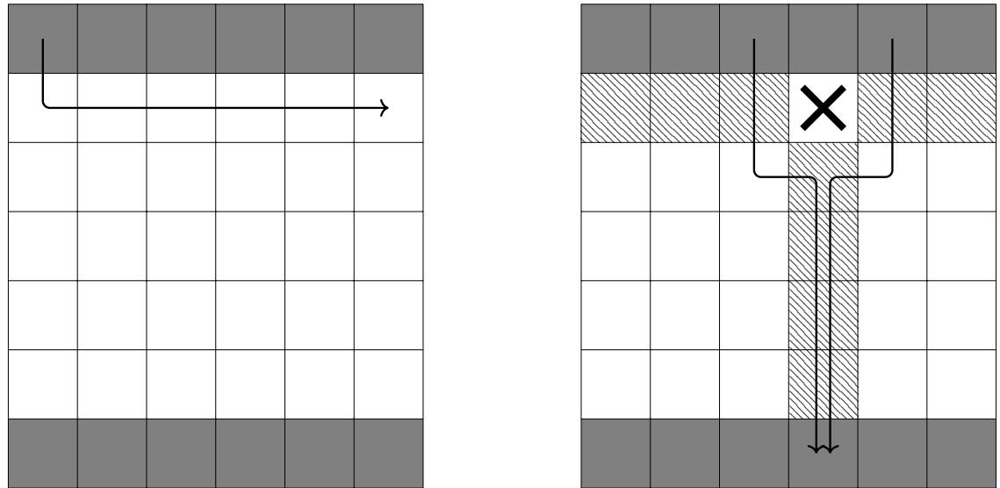
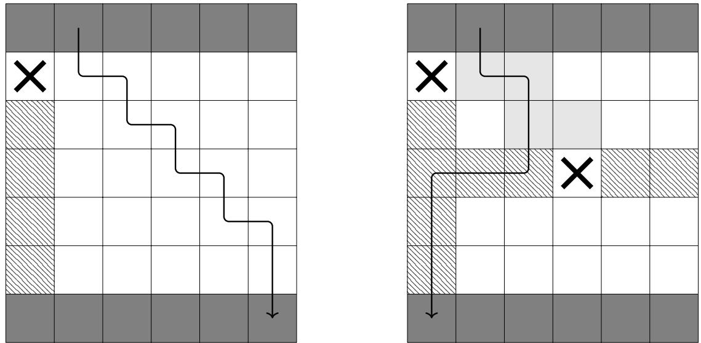
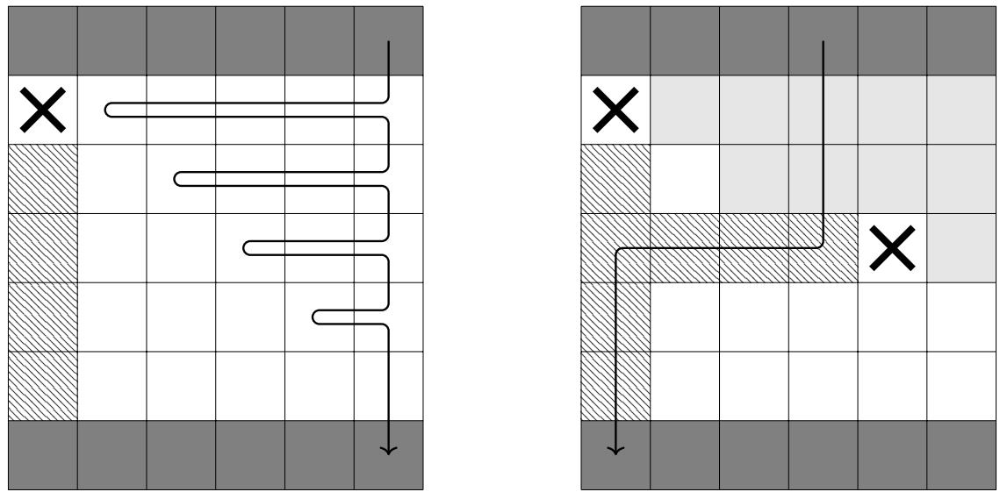
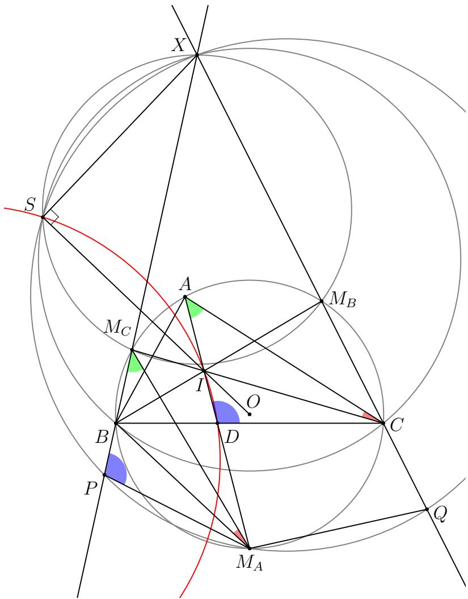
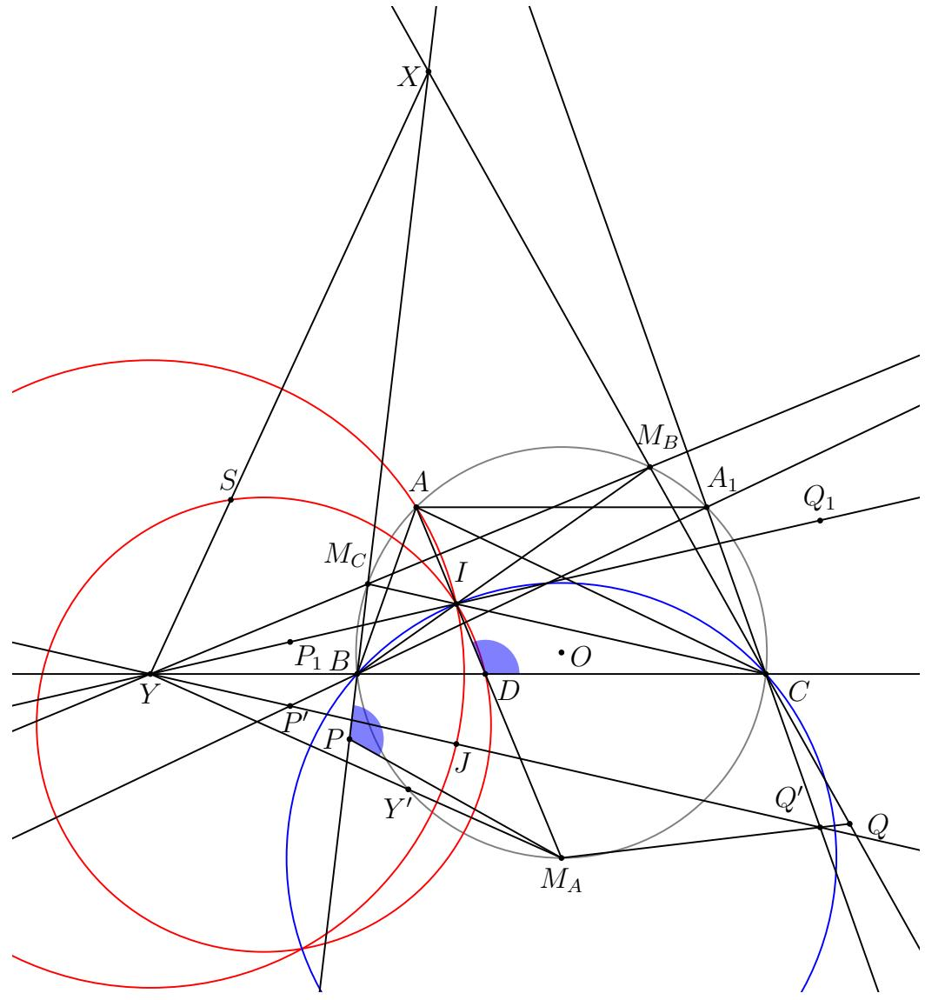
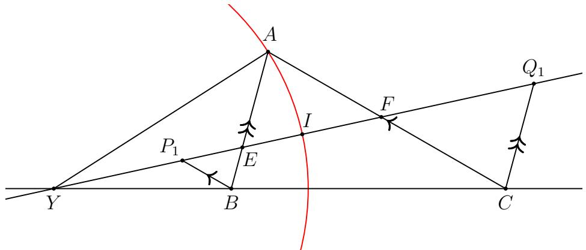
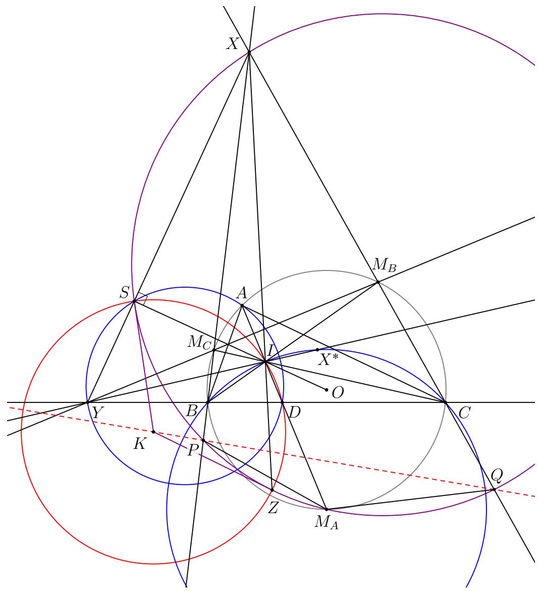
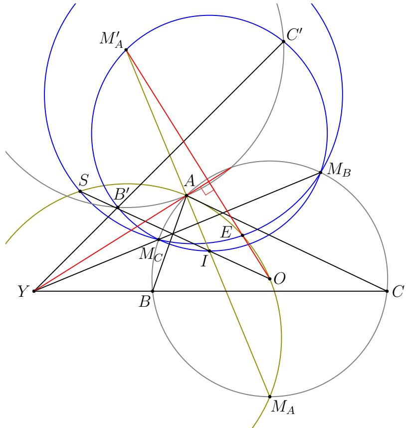
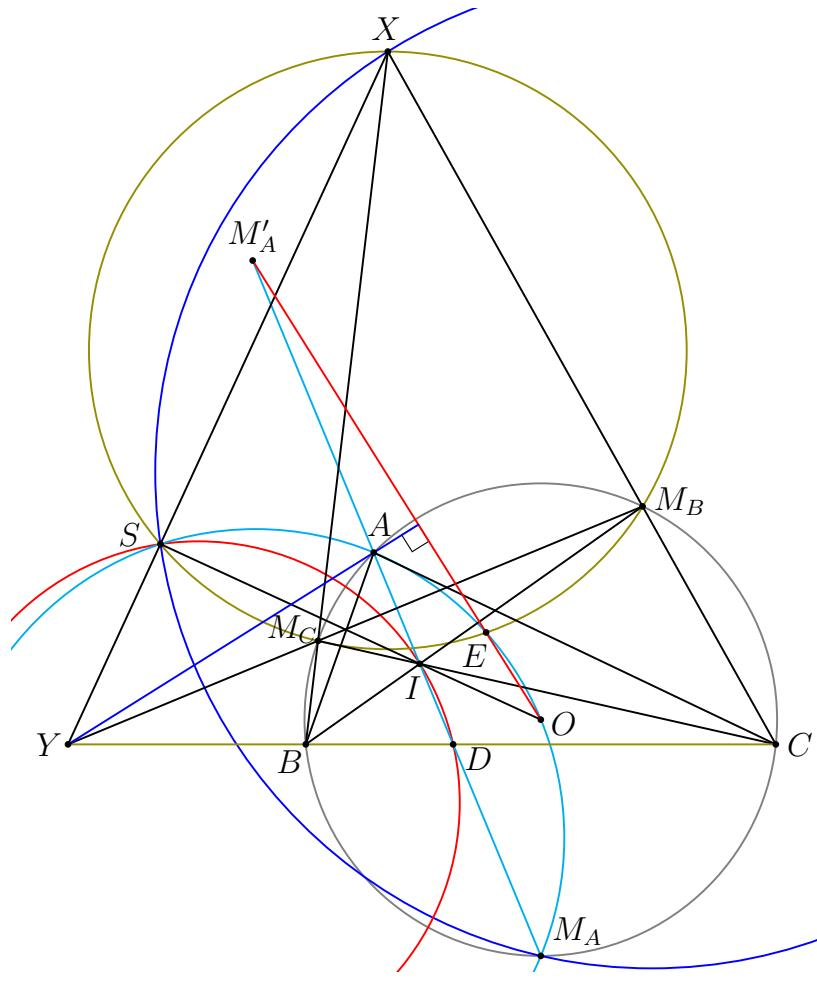

# 入选题目

含解答

# 含解答的入选题目

在下一届国际数学奥林匹克竞赛结束之前，入选题目必须严格保密。IMO总规章第6.6条。

# 贡献国家

IMO 2024组织委员会和题目遴选委员会感谢以下63个国家提交的229道题目提案：

阿尔及利亚，澳大利亚，阿塞拜疆，孟加拉国，白俄罗斯，巴西，保加利亚，加拿大，中国，哥伦比亚，克罗地亚，塞浦路斯，捷克共和国，丹麦，多米尼加共和国，厄瓜多尔，爱沙尼亚，法国，格鲁吉亚，德国，加纳，希腊，香港，印度，印度尼西亚，爱尔兰，伊朗，以色列，日本，哈萨克斯坦，科索沃，拉脱维亚，立陶宛，卢森堡，马来西亚，墨西哥，摩尔多瓦，荷兰，新西兰，挪威，秘鲁，波兰，葡萄牙，罗马尼亚，塞内加尔，塞尔维亚，新加坡，斯洛伐克，斯洛文尼亚，南非，韩国，西班牙，瑞典，瑞士，叙利亚，台湾，泰国，突尼斯，土耳其，乌干达，乌克兰，美国，乌兹别克斯坦。

# 题目遴选委员会

Aron Thomas，艾颖华，Andrew Ng，Géza Kos，郭胤，Alice Carlotti，James Aaronson，Sam Bealing，Adrian Agisilaou，James Cranch，Joseph Myers（主席），姚浩然，Maria-Romina Ivan，Michael Ren，Elisa Lorenzo Garcia

# Problems
# 代数
## A1.
确定所有实数 $\alpha$，使得对于每个正整数 $n$，数

$$
\lfloor \alpha \rfloor + \lfloor 2 \alpha \rfloor + \cdot \cdot \cdot + \lfloor n \alpha \rfloor
$$

是 $n$ 的倍数。（这里 $\lfloor z \rfloor$ 表示不超过 $z$ 的最大整数）

（哥伦比亚）

## A2.
设 $n$ 为一个正整数。求

$$
S = 2 ^ { 0 } x _ { 0 } ^ { 2 } + 2 ^ { 1 } x _ { 1 } ^ { 2 } + \cdot \cdot \cdot + 2 ^ { n } x _ { n } ^ { 2 } ,
$$

的最小可能值，其中 $x _ { 0 }$ ， $x _ { 1 }$ ， $x _ { n }$ ， $x _ { 0 } + x _ { 1 } + \cdot \cdot \cdot + x _ { n } = n$ 是满足 $n$ 的非负整数：

(中国)

## A3.
判断是否对于每一个正实数序列（ $u _ { n }$ ），存在至少一个正整数 $n$ ，使得

$$
\frac { 3 ^ { a _ { 1 } } + 3 ^ { a _ { 2 } } + \cdot \cdot \cdot + 3 ^ { a _ { n } } } { ( 2 ^ { a _ { 1 } } + 2 ^ { a _ { 2 } } + \cdot \cdot \cdot + 2 ^ { a _ { n } } ) ^ { 2 } } < \frac { 1 } { 2 0 2 4 }
$$

成立：

（中国）

## A4.
设 $\mathbb { Z } _ { > 0 }$ 为所有正整数的集合。确定 $\{ 2 ^ { 0 } , 2 ^ { 1 } , 2 ^ { 2 } , \dots \}$ 的所有子集 $\boldsymbol { S }$，使得存在一个函数 $f \colon \mathbb { Z } _ { > 0 } \to \mathbb { Z } _ { > 0 }$ 满足

$$
\begin{array} { r } { S = \{ f ( a + b ) - f ( a ) - f ( b ) \mid a , b \in \mathbb { Z } _ { > 0 } \} . } \end{array}
$$

（泰国）

## A5.
求所有满足以下条件的实数周期数列 $a _ { 1 }$ ， $a _ { 2 }$ ：对所有 $n \geqslant 1$ 成立：

$$
a _ { n + 2 } + a _ { n } ^ { 2 } = a _ { n } + a _ { n + 1 } ^ { 2 } \qquad { \mathrm { a n d } } \qquad | a _ { n + 1 } - a _ { n } | \leqslant 1 .
$$

（Kosouo）

## A6.
设 $a _ { 0 }$ ， $a _ { 1 }$ ， $a _ { 2 } , \ldots .$ ,... 是一个无限严格递增的正整数序列，使得对每个 $n \geqslant 1$ 都有

$$
a _ { n } \in \left\{ { \frac { a _ { n - 1 } + a _ { n + 1 } } { 2 } } , { \sqrt { a _ { n - 1 } \cdot a _ { n + 1 } } } \right\} .
$$

设 $b _ { 1 }$ ， $b _ { 2 }$ ，... 是一个由字母构成的无限序列，定义为

$$
b _ { n } = { \left\{ \begin{array} { l l } { A , } & { { \mathrm { i f ~ } } a _ { n } = { \frac { 1 } { 2 } } ( a _ { n - 1 } + a _ { n + 1 } ) ; } \\ { G , } & { { \mathrm { o t h e r w i s e } } . } \end{array} \right. }
$$

证明：存在正整数 $n _ { 0 }$ 和 $d$ ，使得对所有 $n \geqslant n _ { 0 }$ 都有 $b _ { n + d } = b _ { n }$

（捷克共和国）

## A7.
设 $\mathbb { Q }$ 为有理数集合。设 $f \colon \mathbb { Q } \to \mathbb { Q }$ 是一个函数，满足以下性质：对所有 $x$ ， $y \in \mathbb { Q }$ ，

$$
f ( x + f ( y ) ) = f ( x ) + y \qquad { \mathrm { o r } } \qquad f ( f ( x ) + y ) = x + f ( y ) .
$$

确定 $\{ f ( x ) + f ( - x ) \mid x \in \mathbb { Q } \}$ 中元素个数的最大可能值。

## A8.
设 $p \neq q$ 是互素的正整数。确定所有满足以下条件的无限正整数序列 $a _ { 1 }$ ， $a _ { 2 } , \ldots .$ ，...，使得对所有 $n \geqslant 1$ 成立：

$$
\begin{array} { r l } & { \operatorname* { m a x } ( a _ { n } , a _ { n + 1 } , \ldots , a _ { n + p } ) - \operatorname* { m i n } ( a _ { n } , a _ { n + 1 } , \ldots , a _ { n + p } ) = p \qquad \mathrm { a n d } } \\ & { \operatorname* { m a x } ( a _ { n } , a _ { n + 1 } , \ldots , a _ { n + q } ) - \operatorname* { m i n } ( a _ { n } , a _ { n + 1 } , \ldots , a _ { n + q } ) = q . } \end{array}
$$

# 组合
## C1.
设 $n$ 为正整数。一个有 $n$ 名学生的班级进行了 $n$ 场比赛，每场比赛中他们的排名均无并列。对于正整数 $a$ 和 $b$，若一名学生在至少 $a$ 场比赛中进入前 $b$ 名，则他们有资格获得评级 $( a , b )$。他们的最终得分是他们在所有有资格获得的评级中 $a - b$ 的最大可能值。

求这 $n$ 名学生得分总和的最大可能值。

（澳大利亚）

## C2.
设 $n$ 为一个正整数。将整数 1, 2, 3, ..., $n ^ { 2 }$ 写在一个 $n \times n$ 的方格板的每个格子中，使得每个整数恰好出现在一个格子中，且每个格子恰好包含一个整数。对于每个满足 $d \mid n$ 的整数 $d$，该板的 $d$ -划分是指将整个板划分为 $( n / d ) ^ { 2 }$ 个互不重叠的子板，每个子板大小为 $d \times d$，且每个格子恰好属于一个 $d \times d$ 子板。

我们称 $n$ 是一个“酷数”（cool number），如果可以在 $n \times n$ 的板上安排这些整数，使得对每个满足 $d \mid n$ 且 $1 < d < n$ 的整数 $d$，在该板的 $d$ -划分中，每个 $d \times d$ 子板内所写整数之和都不是 $d$ 的倍数。

求所有偶数的酷数。

(土耳其)

## C3.
设 $n$ 为一个正整数。有 $2 n$ 位骑士围坐在一张圆桌旁。他们组成 $n$ 对搭档，每对搭档都希望握手。一对骑士只有在相邻时才能握手。每一分钟，有一对相邻的骑士交换位置。

求最小的相邻骑士交换次数，使得无论初始排列如何，每位骑士都能在某一时刻与她的搭档相遇并握手。

（白俄罗斯）

## C4.
在一个有 2024 行和 2023 列的方格板上，蜗牛Turbo试图从第一行移动到最后一行。每次尝试中，他可以选择从第一行的任意一个格子出发，然后每次向共享一条边的相邻格子移动一步。如果他到达了最后一行的任意一个格子，他就获胜了。然而，在除第一行和最后一行外的每一行中，都有一个预先设定但隐藏的怪物，共 2022 个怪物分布在 2022 个格子中，且任意两个怪物不在同一列。如果Turbo不幸进入了一个有怪物的格子，他的这次尝试就会结束，并被传送回第一行重新开始下一次尝试。这些怪物不会移动。

假设Turbo最多可以进行 $n$ 次尝试。确定最小的 $n$ 值，使得无论怪物的位置如何，他都存在一种策略保证最终到达最后一行。

（香港）

## C5.
设 $N$ 为一个正整数。Geoff 和 Ceri 进行一个游戏，他们从在黑板上写下数字 1, 2, ..., $N$ 开始。然后他们轮流进行操作，从 Geoff 开始。每次操作包括选择一对整数 $( k , n )$ ，其中 $k \geqslant 0$ 且 $n$ 是黑板上的一个整数，然后擦除黑板上所有满足 $2 ^ { k } \mid n - s$ 的整数 $s$ 。游戏持续进行，直到黑板为空。擦除最后一个整数的玩家输掉游戏。

确定所有使得 Geoff 能够确保获胜的 $N$ 的取值，无论 Ceri 如何操作。

(印度尼西亚)

## C6.
设 $n$ 和 $T$ 为正整数。James 有 $4 n$ 个重量分别为 1, 2, ..., 4n 的弹珠。他将这些弹珠放在一个天平上，使得两边的重量相等。Andrew 可以将一个弹珠从天平的一侧移动到另一侧，但移动后两侧重量的绝对差值至多为 $T$。

求最小的正整数 $T$（用 $n$ 表示），使得无论 James 最初如何放置弹珠，Andrew 都可以通过一系列移动，使每个弹珠最终都位于天平的另一侧。

（加纳）

## C7.
设 $N$ 为一个正整数，且设 $a _ { 1 }$ ， $a _ { 2 }$ ，... 是一个无穷的正整数序列。假设对于每个 $n > N$ ， $a _ { n }$ 等于数字 $a _ { n - 1 }$ 在列表 a1, a2, ..., an-1 中出现的次数。

证明：序列 $a _ { 1 }$ ， $a _ { 3 }$ ， $a _ { 5 }$ ，... 和 $a _ { 2 }$ ， $a _ { 4 }$ ， $a _ { 6 }$ ，... 中至少有一个是最终周期性的。

（澳大利亚）

## C8.
设 $n$ 为一个正整数。给定一个 $n \times n$ 的方格板，左上角的单位方格初始时被染成黑色，其余方格均为白色。然后我们对该方格板进行一系列染色操作。每次操作中，我们选择一个恰好有一个格子为黑色的 $2 \times 2$ 方形，并将该 $2 \times 2$ 方形中其余三个格子染成黑色。

确定所有使得整个方格板都能被染成黑色的 $n$ 的取值。

# 几何
## G1.
设 $A B C D$ 为一个圆内接四边形，满足 $A C < B D < A D$ 且 $\angle D B A < 9 0 ^ { \circ }$ ：点 $E$ 位于过点 $D$ 且平行于 $A B$ 的直线上，使得 $E$ 和 $C$ 位于直线 $A D$ 的两侧，且 $A C = D E$ 。点 $F ^ { \prime }$ 位于过点 $A$ 且平行于 $\boldsymbol C \boldsymbol D$ 的直线上，使得 $F$ 和 $C$ 位于直线 $A D$ 的两侧，且 $B D = A F$ 。

证明：线段 $B C$ 和 $E F$ 的垂直平分线在 $A B C D$ 的外接圆上相交。

（乌克兰）

## G2.
设 $A B C$ 是一个三角形，其中 $A B < A C < B C$，内心为 $I$，内切圆为 $\omega$。设 $X$ 是边 $B C$ 内部的一点，使得过 $X$ 且平行于 $A C$ 的直线与 $\omega$ 相切。类似地，设 $Y$ 是边 $B C$ 内部的一点，使得过 $Y$ 且平行于 $A B$ 的直线与 $\omega$ 相切。设 $A I$ 与三角形 $A B C$ 的外接圆再次相交于点 $P \neq A$。设 $K$ 和 $L$ 分别是 $A B$ 和 $A C$ 的中点。

证明：$\angle K I L + \angle Y P X = 1 8 0 ^ { \circ }$

（波兰）

## G3.
设 $A B C D E$ 是一个凸五边形，且 $M$ 是 $A B$ 的中点。假设线段 $A B$ 在点 $M$ 处与三角形 $C M E$ 的外接圆相切，并且点 $D$ 位于三角形 $A M E$ 和 $B M C$ 的外接圆上。直线 $A D$ 和 $M E$ 相交于点 $K$，直线 $B D$ 和 $M C$ 相交于点 $L$。点 $P$ 和 $Q$ 位于直线 $E C$ 上，使得 $\angle P D C = \angle E D Q = \angle A D B$：

证明直线 $K P$、$L Q$ 和 $M D$ 共点。

（白俄罗斯）

## G4.
设 $A B C D$ 是一个四边形，其中 $A B$ 平行于 $\boldsymbol C \boldsymbol D$ 且 $A B < C D$。直线 $A D$ 和 $B C$ 相交于点 $P$。点 $X \neq C$ 在三角形 $A B C$ 的外接圆上，满足 $P C = P X$。点 $Y \neq D$ 在三角形 $A B D$ 的外接圆上，满足 $P D = P Y$：直线 $A X$ 和 $B Y$ 相交于点 $Q$：

证明 $P Q$ 平行于 $A B$

（乌克兰）

## G5.
设 $A B C$ 是一个三角形，其内心为 $I$，令 $\Omega$ 为三角形 $B I C$ 的外接圆。设 $K$ 是线段 $B C$ 内部的一点，使得 $\angle B A K < \angle K A C$。角 $\angle B K A$ 的平分线与 $\Omega$ 相交于点 $W$ 和 $X$，使得 $A$ 和 $W$ 位于 $B C$ 的同侧；角 $\angle C K A$ 的平分线与 $\Omega$ 相交于点 $Y$ 和 $Z$，使得 $A$ 和 $Y$ 位于 $B C$ 的同侧。

证明：$\angle W A Y = \angle Z A X$

（乌兹别克斯坦）

## G6.
设 $A B C$ 是一个锐角三角形，满足 $A B < A C$，令 $\Gamma$ 为 $A B C$ 的外接圆：点 $X$ 和 $Y$ 位于 $\Gamma$ 上，使得 $X Y$ 和 $B C$ 在 ∠$\angle B A C$ 的外角平分线上相交。假设过 $\Gamma$ 上点 $X$ 和 $Y$ 的切线相交于一点 $T$，且该点与 $A$ 位于 $B C$ 的同侧，并且 $r X$ 和 $T Y$ 分别与 $B C$ 相交于点 $U$ 和 $V$。设 $J$ 为三角形 $T U V$ 中顶点 $T$ 所对的旁切圆的圆心。

证明：$A J$ 平分 $\angle B A C$

## G7.
设 $A B C$ 是一个三角形，其内心为 $I$，满足 $A B < A C < B C$。直线 $A I$、$B I$ 和 $\dot { C } I$ 与三角形 $A B C$ 的外接圆的第二个交点分别为 $M _ { A }$、$M _ { B }$ 和 $M _ { C }$。直线 $A I$ 和 $B C$ 相交于点 $\boldsymbol { D }$，直线 $B M _ { C }$ 和 $C M _ { B }$ 相交于点 $X$。假设三角形 $X M _ { B } M _ { C }$ 和 $X B C$ 的外接圆再次相交于点 $S \ne X$。直线 $B X$ 和 $C X$ 分别再次与三角形 $S X M _ { A }$ 的外接圆相交于点 $P \neq X$ 和 $Q \neq X$。

证明：三角形 $S I D$ 的外心位于 $P Q$ 上。

（泰国）

## G8.
设 $A B C$ 为一个三角形，其中 $A B < A C < B C$，且设 $D$ 为线段 $B C$ 内部的一点。设 $E$ 为三角形 $A B C$ 的外接圆上一点，使得 $A$ 和 $E$ 位于直线 $B C$ 的两侧，并满足 $\angle B A D = \angle E A C$。设 $I$、$I _ { B }$、$I _ { C }$、$J _ { B }$ 和 $J _ { C }$ 分别为三角形 $A B C$、$A B D$、$A D C$、$A B E$ 和 $A E C$ 的内心。

证明：$I _ { B }$、$I _ { C }$、$J _ { B }$ 和 $J _ { C }$ 四点共圆当且仅当 $A I$、$I _ { B } J _ { C }$ 和 $J _ { B } I _ { C }$ 三线共点。

（加拿大）

# 数论
## N1.
找出所有满足以下性质的正整数 $n$：对于 $n$ 的每一个正因数 $d$，都有 $d + 1 \mid n$ 或 $d + 1$ 是素数。

## N2.
确定所有非空有限正整数集 $\boldsymbol { S }$，使得对于任意 $a$ ， $b \in S$，都存在某个 $c \in S$ 满足 $a \mid b + 2 c$ ：

(荷兰)

## N3.
确定所有正整数序列 $a _ { 1 }$ ， $a _ { 2 }$ ，...，使得对于任意一对正整数 $m \leqslant n$，算术平均数和几何平均数

$$
\frac { a _ { m } + a _ { m + 1 } + \cdot \cdot \cdot + a _ { n } } { n - m + 1 } \mathrm { a n d } ( a _ { m } a _ { m + 1 } \cdot \cdot \cdot a _ { n } ) ^ { \frac { 1 } { n - m + 1 } }
$$

均为整数。

（新加坡）

## N4.
确定所有正整数 $a$ 和 $b$，使得存在一个正整数 $g$，满足对所有足够大的 $n$ 都有 $\operatorname* { g c d } ( a ^ { n } + b , b ^ { n } + a ) = g$ ：

（印度尼西亚）

## N5.
设 $\boldsymbol { S }$ 是一个有限的非空素数集合。令 $1 = b _ { 1 } < b _ { 2 } < \cdots$ 为所有正整数构成的序列，其素因子均属于 $\boldsymbol { S }$。证明：除了有限多个正整数 $n$ 外，存在正整数 $a _ { 1 }$，$a _ { 2 }$，…，$a _ { n }$，使得

$$
{ \frac { a _ { 1 } } { b _ { 1 } } } + { \frac { a _ { 2 } } { b _ { 2 } } } + \cdots + { \frac { a _ { n } } { b _ { n } } } = \left\lceil { \frac { 1 } { b _ { 1 } } } + { \frac { 1 } { b _ { 2 } } } + \cdots + { \frac { 1 } { b _ { n } } } \right\rceil .
$$

（克罗地亚）

## N6.
设 $n$ 为一个正整数。我们称一个具有整数系数的多项式 $P$ 是 $n$ -好多项式，如果存在一个次数为 2 且具有整数系数的多项式 $Q$，使得对任意整数 $k$，$Q ( k ) ( P ( k ) + Q ( k ) )$ 都不被 $n$ 整除：

确定所有整数 $n$，使得每个具有整数系数的多项式都是一个 $n$ -好多项式。

（法国）

## N7.
设 $\mathbb { Z } _ { > 0 }$ 表示正整数集，$f \colon \mathbb { Z } _ { > 0 } \to \mathbb { Z } _ { > 0 }$ 是一个函数，满足如下性质：对于 $m$ ， $n \in \mathbb { Z } _ { > 0 }$ ，等式

$$
f ( m n ) ^ { 2 } = f ( m ^ { 2 } ) f ( f ( n ) ) f ( m f ( n ) )
$$

成立当且仅当 $m$ 和 $n$ 互素。

对每个正整数 $n$ ，确定所有可能的 $f ( n )$ 的值。

# Solutions
# 代数
## A1.
确定所有实数 $\alpha$，使得对于每个正整数 $n$，数

$$
\lfloor \alpha \rfloor + \lfloor 2 \alpha \rfloor + \cdot \cdot \cdot + \lfloor n \alpha \rfloor
$$

是 $n$ 的倍数。（这里 $\lfloor z \rfloor$ 表示不超过 $z$ 的最大整数）

（哥伦比亚）
**解法 1**. 首先我们证明所有偶数满足条件。如果 $\alpha = 2 m$，其中 $m$ 是整数，则

$$
\lfloor \alpha \rfloor + \lfloor 2 \alpha \rfloor + \cdot \cdot \cdot + \lfloor n \alpha \rfloor = 2 m + 4 m + \cdot \cdot \cdot + 2 m n = m n ( n + 1 )
$$

是 $n$ 的倍数：

现在我们证明只有这些实数满足题设条件。设 $\alpha = k + \epsilon$，其中 $k$ 是整数且 $0 \leqslant \epsilon < 1$。则数

$$
\begin{array} { r } { \lfloor \alpha \rfloor + \lfloor 2 \alpha \rfloor + \dots + \lfloor n \alpha \rfloor = k + \lfloor \epsilon \rfloor + 2 k + \lfloor 2 \epsilon \rfloor + \dots + n k + \lfloor n \epsilon \rfloor } \\ { = \displaystyle \frac { k n ( n + 1 ) } { 2 } + \lfloor \epsilon \rfloor + \lfloor 2 \epsilon \rfloor + \dots + \lfloor n \epsilon \rfloor } \end{array}
$$

必须是 $n$ 的倍数。我们根据 $k$ 的奇偶性分两种情况讨论：

情况1：$k$ 为偶数。

此时 kn(n+1) 总是 n 的倍数。因此

$$
\lfloor \epsilon \rfloor + \lfloor 2 \epsilon \rfloor + \cdot \cdot \cdot + \lfloor n \epsilon \rfloor
$$

也必须是 $n$ 的倍数：

我们将用强归纳法证明对所有正整数 $n$ 有 $\lfloor n \epsilon \rfloor = 0$。基础情形 $n = 1$ 成立是因为 $0 \leqslant \epsilon < 1$。假设对所有 $1 \leqslant m < n$ 都有 $\lfloor m \epsilon \rfloor = 0$。那么数

$$
\lfloor \epsilon \rfloor + \lfloor 2 \epsilon \rfloor + \cdot \cdot \cdot + \lfloor n \epsilon \rfloor = \lfloor n \epsilon \rfloor
$$

必须是 $n$ 的倍数。由于 $0 \leqslant \epsilon < 1$，则 $0 \leqslant n \epsilon < n$，这意味着数 $\lfloor n \epsilon \rfloor$ 必须等于 $0$：

等式 $\lfloor n \epsilon \rfloor = 0$ 推出 $0 \leqslant \epsilon < 1 / n$。由于这对所有 $n$ 都必须成立，我们得出 $\epsilon = 0$，从而 $\alpha$ 是一个偶数。

情况2：$k$ 为奇数。

我们将用强归纳法证明对所有自然数 $n$ 有 $\lfloor n \epsilon \rfloor = n - 1$。基础情形 $n = 1$ 同样由 $0 \leqslant \epsilon < 1$ 得出。假设对所有 $1 \leqslant m < n$ 有 $\lfloor m \epsilon \rfloor = m - 1$。我们需要数

$$
{ \begin{array} { r l } & { { \frac { k n ( n + 1 ) } { 2 } } + \left\lfloor \epsilon \right\rfloor + \left\lfloor 2 \epsilon \right\rfloor + \cdot \cdot \cdot + \left\lfloor n \epsilon \right\rfloor = { \frac { k n ( n + 1 ) } { 2 } } + 0 + 1 + \cdot \cdot \cdot + ( n - 2 ) + \left\lfloor n \epsilon \right\rfloor } \\ & { \qquad = { \frac { k n ( n + 1 ) } { 2 } } + { \frac { ( n - 2 ) ( n - 1 ) } { 2 } } + \left\lfloor n \epsilon \right\rfloor } \\ & { \qquad = { \frac { k + 1 } { 2 } } n ^ { 2 } + { \frac { k - 3 } { 2 } } n + 1 + \left\lfloor n \epsilon \right\rfloor } \end{array} }
$$

是 $n$ 的倍数。由于 $k$ 是奇数，我们需要 $1 + \lfloor n \epsilon \rfloor$ 是 $n$ 的倍数。又因为 $0 \leqslant \epsilon < 1$，所以 $0 \leqslant n \epsilon < n$，因此 $\lfloor n \epsilon \rfloor = n - 1$，这正是我们想要的。

这意味着对所有 $n$ 有 $\textstyle 1 - { \frac { 1 } { n } } \leqslant \epsilon < 1$，这是荒谬的。因此这种情况没有其他解。
**解法 2**. 如解法1所示，我们验证了所有偶整数满足条件。然后，不失一般性，可假设 $0 \leqslant \alpha < 2$。令 $S _ { n } = \lfloor \alpha \rfloor + \lfloor 2 \alpha \rfloor + \cdot \cdot \cdot + \lfloor n \alpha \rfloor$：注意到

$$
\begin{array} { l l } { { S _ { n } \equiv 0 } } & { { ( \mathrm { m o d } n ) } } \\ { { S _ { n } \equiv S _ { n } - S _ { n - 1 } = \lfloor n \alpha \rfloor } } & { { ( \mathrm { m o d } n - 1 ) } } \end{array}
$$

由于 $\operatorname* { g c d } ( n , n - 1 ) = 1$，(1) 和 (2) 推出

$$
S _ { n } \equiv n { \bigl \lfloor } n \alpha { \bigr \rfloor } { \pmod { n ( n - 1 ) } } .
$$

此外，

$$
0 \leqslant n \lfloor n \alpha \rfloor - S _ { n } = \sum _ { k = 1 } ^ { n } \left( \lfloor n \alpha \rfloor - \lfloor k \alpha \rfloor \right) < \sum _ { k = 1 } ^ { n } \left( n \alpha - k \alpha + 1 \right) = { \frac { n ( n - 1 ) } { 2 } } \alpha + n .
$$

当 $n$ 足够大时，(4) 的右边小于 $n ( n - 1 )$。于是 (3) 强制

$$
0 = S _ { n } - n { \big \lfloor } n \alpha { \big \rfloor } = \sum _ { k = 1 } ^ { n } { \Big ( } { \big \lfloor } n \alpha { \big \rfloor } - { \big \lfloor } k \alpha { \big \rfloor } { \Big ) }
$$

对足够大的 $n$ 成立。

由于当 $1 \leqslant k \leqslant n$ 时 $\lfloor n \alpha \rfloor - \lfloor k \alpha \rfloor \geqslant 0$，由 (5) 可得，对所有足够大的 $n$，上述所有不等式都取等号。特别地，对所有足够大的 $n$ 有 $\lfloor \alpha \rfloor = \lfloor n \alpha \rfloor$，除非 $\alpha = 0$，否则这是荒谬的。
**解法 3**. 如其他解法一样，不失一般性可假设 $0 \leqslant \alpha < 2$。偶整数满足条件，因此我们假设 $0 < \alpha < 2$，并推导出矛盾。

对 $n$ 进行归纳，我们将同时证明

$$
\lfloor \alpha \rfloor + \lfloor 2 \alpha \rfloor + \cdot \cdot \cdot + \lfloor n \alpha \rfloor = n ^ { 2 } ,
$$

$$
\mathrm { a n d } \qquad { \frac { 2 n - 1 } { n } } \leqslant \alpha < 2 .
$$

基础情形为 $n = 1$：若 $\alpha < 1$，考虑 $\begin{array} { r } { m = \left| \frac { 1 } { \alpha } \right| > 1 } \end{array}$，则

$$
\lfloor \alpha \rfloor + \lfloor 2 \alpha \rfloor + \cdot \cdot \cdot + \lfloor m \alpha \rfloor = 1
$$

不是 $m$ 的倍数，因此我们得到 (7)。于是 $\lfloor \alpha \rfloor = 1$，从而 (6) 成立。

归纳步骤：假设对 $n$ 归纳假设成立，则由 (7)

$$
2 n + 1 - \frac { 1 } { n } \leqslant ( n + 1 ) \alpha < 2 n + 2 .
$$

因此，

$$
n ^ { 2 } + 2 n \leqslant \lfloor \alpha \rfloor + \lfloor 2 \alpha \rfloor + \cdot \cdot + \lfloor n \alpha \rfloor + \lfloor ( n + 1 ) \alpha \rfloor = n ^ { 2 } + \lfloor ( n + 1 ) \alpha \rfloor < n ^ { 2 } + 2 n + 2 .
$$

为了得到 $n + 1$ 的倍数，必须有 $\lfloor ( n + 1 ) \alpha \rfloor = 2 n + 1$ 且

$$
\lfloor \alpha \rfloor + \lfloor 2 \alpha \rfloor + \cdot \cdot \cdot + \lfloor n \alpha \rfloor + \lfloor ( n + 1 ) \alpha \rfloor = ( n + 1 ) ^ { 2 }
$$

这两个等式分别给出 (6) 和 (7)。最后，我们注意到 (7) 对所有 $n$ 成立会导致矛盾。
**解法 4**. 如其他解法，不失一般性我们假设 $0 < \alpha < 2$ 并推导出矛盾。对每个 $n$，定义

$$
b _ { n } = { \frac { \lfloor \alpha \rfloor + \lfloor 2 \alpha \rfloor + \cdot \cdot \cdot + \lfloor n \alpha \rfloor } { n } } ,
$$

根据题设条件和我们的假设，这是一个非负整数。注意到

$$
\lfloor ( n + 1 ) \alpha \rfloor \geqslant \left\lfloor \alpha \right\rfloor , \left\lfloor 2 \alpha \right\rfloor , \ldots , \left\lfloor n \alpha \right\rfloor \quad { \mathrm { a n d } } \quad \left\lfloor ( n + 1 ) \alpha \right\rfloor > \left\lfloor \alpha \right\rfloor
$$

对所有 $\textstyle n > { \frac { 1 } { \alpha } }$ 成立。由此可得当 $\textstyle n > { \frac { 1 } { \alpha } }$ 时 $b _ { n + 1 } > b _ { n } \implies b _ { n + 1 } \geqslant b _ { n } + 1$。因此，对所有这样的 $n$，

$$
b _ { n } \geqslant n + C
$$

其中 $C$ 是一个固定的整数。另一方面，$b _ { n }$ 的定义给出

$$
b _ { n } = { \frac { \lfloor \alpha \rfloor + \lfloor 2 \alpha \rfloor + \cdot \cdot \cdot + \lfloor n \alpha \rfloor } { n } } \leqslant { \frac { \alpha + 2 \alpha + \cdot \cdot \cdot + n \alpha } { n } } = { \frac { \alpha } { 2 } } ( n + 1 ) ,
$$

这对足够大的 $n$ 构成矛盾。
**评论**. 上述解法的一个替代结尾如下：

根据定义有 $S _ { n } \leqslant \alpha \frac { n ( n + 1 ) } { 2 }$，另一方面 (5) 意味着对所有足够大的 $n$ 有 $S _ { n } \geqslant \alpha n ^ { 2 } - n$，因此 $\alpha = 0$。

## A2.
设 $n$ 为一个正整数。求

$$
S = 2 ^ { 0 } x _ { 0 } ^ { 2 } + 2 ^ { 1 } x _ { 1 } ^ { 2 } + \cdot \cdot \cdot + 2 ^ { n } x _ { n } ^ { 2 } ,
$$

的最小可能值，其中 $x _ { 0 }$ ， $x _ { 1 }$ ， $x _ { n }$ ， $x _ { 0 } + x _ { 1 } + \cdot \cdot \cdot + x _ { n } = n$ 是满足 $n$ 的非负整数：

(中国)
**解法 1**. 对于固定的 $n$ ，令 $f ( n )$ 表示 $S$ 的最小可能值。考虑如下变体：在所有非负整数的无穷序列 $x _ { 0 }$ ， $x _ { 1 }$ ，... 中，只有有限项非零，且满足 $x _ { 0 } + x _ { 1 } + \cdot \cdot \cdot = n$ ，令 $g ( n )$ 表示

$$
T = 2 ^ { 0 } x _ { 0 } ^ { 2 } + 2 ^ { 1 } x _ { 1 } ^ { 2 } + 2 ^ { 2 } x _ { 2 } ^ { 2 } + \cdot \cdot \cdot .
$$

的最小可能值。

显然有 $g ( n ) \leqslant f ( n )$ 。反之，容易看出，若某个序列 $x _ { 0 }$ ， $x _ { 1 } , \ldots .$ 达到了 $g ( n )$ 的最小值，则必有 $x _ { 0 } \geqslant x _ { 1 } \geqslant \cdot \cdot \cdot$ ，从而 $x _ { n + 1 } = x _ { n + 2 } = \cdot \cdot \cdot = 0$ 。特别地，$f ( n ) = g ( n )$ ：

现在，我们希望得到 $g ( n )$ 的递推公式。

注意到，为了在 $n \geqslant 1$ 时最小化 $T$ ，必须有 $x _ { 0 } \geqslant 1$ ，因为序列 $( x _ { i } )$ 是非增的。注意到，在所有满足 $x _ { 1 } + x _ { 2 } + \cdot \cdot \cdot = m$ 的非负整数无穷序列上，

$$
2 ^ { 1 } x _ { 1 } ^ { 2 } + 2 ^ { 2 } x _ { 2 } ^ { 2 } + \cdot \cdot \cdot = 2 ( 2 ^ { 0 } x _ { 1 } ^ { 2 } + 2 ^ { 1 } x _ { 2 } ^ { 2 } + \cdot \cdot \cdot )
$$

的最小值恰好是 $2 g ( m )$ 。因此，对于 $n \geqslant 1$ ，我们有

$$
g ( n ) = \operatorname* { m i n } _ { x _ { 0 } \in \{ 1 , 2 , \ldots , n \} } \left( x _ { 0 } ^ { 2 } + 2 g ( n - x _ { 0 } ) \right) .
$$

现在我们用数学归纳法证明 $\begin{array} { r } { g ( n ) = \frac { n ( n + 1 ) } { 2 } } \end{array}$ 。显然 $g ( 0 ) = 0$ 成立。假设该结论对 $n = 0$ ， $1$ ，...，$N - 1$ 均已成立。则有

$$
\begin{array} { l } { { x _ { 0 } ^ { 2 } + 2 g ( N - x _ { 0 } ) = x _ { 0 } ^ { 2 } + ( N - x _ { 0 } ) ( N - x _ { 0 } + 1 ) } } \\ { { \ \qquad = 2 x _ { 0 } ^ { 2 } - ( 2 N + 1 ) x _ { 0 } + N ( N + 1 ) } } \\ { { \ \qquad = \displaystyle \frac 1 2 \left[ ( 2 x _ { 0 } - N ) ( 2 x _ { 0 } - N - 1 ) + N ^ { 2 } + N \right] . } } \end{array}
$$

两个连续整数的乘积 $( 2 x _ { 0 } - N ) ( 2 x _ { 0 } - N - 1 )$ 恒为非负，且当且仅当 $2 x _ { 0 }$ 是 $\{ N , N + 1 \}$ 中的偶数时取零。因此不等式 (1) 最终表达式的最小值为 (N² + N)，故 g(N) ≥ N(N+1)，归纳证明完成。
**解法 2**. 考虑如下数表，行与列的下标从 0 开始，且当 $i$ ， $j \geqslant 0$ 时定义 $a _ { i , j } = 2 ^ { i } ( 2 j + 1 )$ ：

<table><tr><td></td><td>j=0 1</td><td>2</td><td>3</td><td>4</td><td>5</td><td></td></tr><tr><td>i=0</td><td>1</td><td>3</td><td>5</td><td>7</td><td>9 11</td><td></td></tr><tr><td>1</td><td>2</td><td>6 10</td><td></td><td>14 18</td><td>22</td><td></td></tr><tr><td>2</td><td>4</td><td>12 20</td><td></td><td>28</td><td>36 44</td><td></td></tr><tr><td>3</td><td>8 24</td><td>40</td><td>56</td><td>72</td><td>88</td><td></td></tr><tr><td>4</td><td>16 48</td><td>80</td><td>112</td><td>144</td><td>176</td><td></td></tr><tr><td>：</td><td></td><td></td><td></td><td></td><td></td><td></td></tr></table>

每个正整数都可以唯一地表示为一个 2 的幂与一个奇数的乘积，因此每个正整数在上述表格中恰好出现一次。容易看出，每一行和每一列中的数都是严格递增的。由于前 $x$ 个正奇数的和为 $x ^ { 2 }$ ，第 $k ^ { \mathrm { t h } }$ 行前 $x _ { k }$ 个数的和为 $2 ^ { k } x _ { k } ^ { 2 }$ ，其中第 $k ^ { \mathrm { t h } }$ 项出现在 $S$ ：

$n$ 行 of the best at wetett 因此，该和可以解释为：从第 0 行取 $n$ 个数，从第 1 行取 $k$ 个数，……，总共取 $x _ { k }$ 个数（其中 $\begin{array} { r } { \sum _ { k = 1 } ^ { n } x _ { k } = n , } \end{array}$ ），然后计算这些 $n$ 个数的总和。特别地，由于表中每行每列都严格递增，$S$ 的最小可能值等于该表中最小的 $n$ 个数之和。

此外，最小的 $n$ 个数，即 1, 2, ..., $n$ ，出现在前 $n$ 行中，因此 $S$ 的最小值为

$$
1 + 2 + \cdots + n = { \frac { n ( n + 1 ) } { 2 } } .
$$
**评论**. 从解法 2 的表格可以看出，本题取等号的情况由

$$
x _ { i } = \left\lfloor { \frac { n } { 2 ^ { i + 1 } } } + { \frac { 1 } { 2 } } \right\rfloor .
$$

给出。因此 $x _ { i }$ 是将 $\frac { n } { 2 ^ { i + 1 } }$ 四舍五入到最近的整数的结果。这也给出了恒等式

$$
n = \sum _ { i = 0 } ^ { \infty } \left\lfloor { \frac { n } { 2 ^ { i + 1 } } } + { \frac { 1 } { 2 } } \right\rfloor ,
$$

的一个证明，该恒等式也可以对 $n$ 用数学归纳法单独证明：当 $n$ 增加 1 时，右边恰好有一项（即对应于 $i = \nu _ { 2 } ( n )$ 的项）增加 1，其余项保持不变。

**评论**. 若将条件“$x _ { i }$ 为非负整数”放宽为“$x _ { i }$ 为非负实数”，则可通过柯西-施瓦茨不等式解决该问题：

$$
\begin{array} { c } { { ( 2 ^ { 0 } + 2 ^ { - 1 } + \dots + 2 ^ { - n } ) ( 2 ^ { 0 } x _ { 0 } ^ { 2 } + 2 ^ { 1 } x _ { 1 } ^ { 2 } + \dots + 2 ^ { n } x _ { n } ^ { 2 } ) \geqslant ( x _ { 0 } + \dots + x _ { n } ) ^ { 2 } = n ^ { 2 } } } \\ { { { } } } \\ \\ { { \Longrightarrow ~ 2 ^ { 0 } x _ { 0 } ^ { 2 } + 2 ^ { 1 } x _ { 1 } ^ { 2 } + \dots + 2 ^ { n } x _ { n } ^ { 2 } \geqslant \displaystyle \frac { n ^ { 2 } } { 2 - 2 ^ { - n } } . } } \end{array}
$$

该放宽问题的取等条件为

$$
x _ { i } = { \frac { 2 ^ { - i } n } { 2 - 2 ^ { - n } } } \approx \left\lfloor { \frac { n } { 2 ^ { i + 1 } } } + { \frac { 1 } { 2 } } \right\rfloor .
$$

事实上，当将实数情形下的最优序列各项四舍五入到最近的整数时，我们便得到了原问题的最优序列。尽管思考实数情形可能有助于推测原问题的取等情形，但它似乎难以直接扩展为完整的解法。

## A3.
判断是否对于每一个正实数序列（ $u _ { n }$ ），存在至少一个正整数 $n$ ，使得

$$
\frac { 3 ^ { a _ { 1 } } + 3 ^ { a _ { 2 } } + \cdot \cdot \cdot + 3 ^ { a _ { n } } } { ( 2 ^ { a _ { 1 } } + 2 ^ { a _ { 2 } } + \cdot \cdot \cdot + 2 ^ { a _ { n } } ) ^ { 2 } } < \frac { 1 } { 2 0 2 4 }
$$

成立：

（中国）
**解法 1**
对于每个正整数 $n$ ，令 $M _ { n } = \operatorname* { m a x } ( a _ { 1 } , a _ { 2 } , \ldots , a _ { n } )$ 。我们首先证明

$$
\frac { 3 ^ { a _ { 1 } } + 3 ^ { a _ { 2 } } + \cdot \cdot \cdot + 3 ^ { a _ { n } } } { ( 2 ^ { a _ { 1 } } + 2 ^ { a _ { 2 } } + \cdot \cdot \cdot + 2 ^ { a _ { n } } ) ^ { 2 } } \leqslant \bigg ( \frac { 3 } { 4 } \bigg ) ^ { M _ { n } } .
$$

对于 $i = 1$ ，2，…， $n$ ，从 $\left( { \frac { 3 } { 2 } } \right) ^ { a _ { i } } \leqslant \left( { \frac { 3 } { 2 } } \right) ^ { M _ { n } }$ 我们可以得到 $\begin{array} { r } { 3 ^ { a _ { i } } \leqslant \left( \frac { 3 } { 4 } \right) ^ { M _ { n } } \cdot 2 ^ { M _ { n } } \cdot 2 ^ { a _ { i } } } \end{array}$ 。对所有 $i$ 求和得

$$
\sum _ { i = 1 } ^ { n } 3 ^ { a _ { i } } \leqslant \left( \frac { 3 } { 4 } \right) ^ { M _ { n } } \cdot 2 ^ { M _ { n } } \cdot \sum _ { i = 1 } ^ { n } 2 ^ { a _ { i } } \leqslant \left( \frac { 3 } { 4 } \right) ^ { M _ { n } } \cdot \left( \sum _ { i = 1 } ^ { n } 2 ^ { a _ { i } } \right) ^ { 2 } ,
$$

这等价于（2）。

现在令 $\mu = \log _ { 4 / 3 } \frac { 1 } { \varepsilon }$ ，使得 $\mu$ 是满足 $\left( { \frac { 3 } { 4 } } \right) ^ { \mu } = \varepsilon$ 的正实数。如果存在一个指标 $n$ 使得 $a _ { n } > \mu$ ，则 $M _ { n } \geqslant a _ { n } > \mu$ ，因此

$$
{ \frac { 3 ^ { a _ { 1 } } + 3 ^ { a _ { 2 } } + \cdot \cdot \cdot + 3 ^ { a _ { n } } } { ( 2 ^ { a _ { 1 } } + 2 ^ { a _ { 2 } } + \cdot \cdot \cdot + 2 ^ { a _ { n } } ) ^ { 2 } } } \leqslant \left( { \frac { 3 } { 4 } } \right) ^ { M _ { n } } < \left( { \frac { 3 } { 4 } } \right) ^ { \mu } = \varepsilon .
$$

否则，我们有 $0 < a _ { i } \leqslant \mu$ 对所有正整数 $i$ 成立，所以

$$
{ \frac { 3 ^ { a _ { 1 } } + 3 ^ { a _ { 2 } } + \cdot \cdot \cdot + 3 ^ { a _ { n } } } { ( 2 ^ { a _ { 1 } } + 2 ^ { a _ { 2 } } + \cdot \cdot \cdot + 2 ^ { a _ { n } } ) ^ { 2 } } } \leqslant { \frac { n \cdot 3 ^ { \mu } } { ( n \cdot 1 ) ^ { 2 } } } = { \frac { 3 ^ { \mu } } { n } } .
$$

如果 $\textstyle n > \left\lfloor { \frac { 3 ^ { \mu } } { \varepsilon } } \right\rfloor$ ，这个值小于 $\varepsilon$ 。
**解法 2**
我们将结合两个上界估计。

首先，从平凡估计开始

$$
\frac { 3 ^ { a _ { 1 } } + \cdot \cdot \cdot + 3 ^ { a _ { n } } } { ( 2 ^ { a _ { 1 } } + \cdot \cdot \cdot + 2 ^ { a _ { n } } ) ^ { 2 } } \leqslant \frac { 3 ^ { a _ { 1 } } + \cdot \cdot \cdot + 3 ^ { a _ { n } } } { 4 ^ { a _ { 1 } } + \cdot \cdot \cdot + 4 ^ { a _ { n } } } .
$$

将Jensen不等式应用于凸函数 $x ^ { \log _ { 3 } 4 }$ ，我们得到

$$
{ \frac { 4 ^ { a _ { 1 } } + \cdot \cdot \cdot + 4 ^ { a _ { n } } } { n } } = { \frac { \left( 3 ^ { a _ { 1 } } \right) ^ { \log _ { 3 } { 4 } } + \cdot \cdot \cdot + \left( 3 ^ { a _ { n } } \right) ^ { \log _ { 3 } { 4 } } } { n } } \geqslant \left( { \frac { 3 ^ { a _ { 1 } } + \cdot \cdot \cdot + 3 ^ { a _ { n } } } { n } } \right) ^ { \log _ { 3 } { 4 } } ,
$$

因此

$$
{ \frac { 3 ^ { a _ { 1 } } + \cdot \cdot \cdot + 3 ^ { a _ { n } } } { ( 2 ^ { a _ { 1 } } + \cdot \cdot \cdot + 2 ^ { a _ { n } } ) ^ { 2 } } } \leqslant { \frac { 3 ^ { a _ { 1 } } + \cdot \cdot \cdot + 3 ^ { a _ { n } } } { 4 ^ { a _ { 1 } } + \cdot \cdot \cdot + 4 ^ { a _ { n } } } } \leqslant { \bigg ( } { \frac { n } { 3 ^ { a _ { 1 } } + \cdot \cdot \cdot + 3 ^ { a _ { n } } } } { \bigg ) } ^ { \log _ { 3 } 4 - 1 } .
$$

于是，当

$$
3 ^ { a _ { 1 } } + \cdot \cdot \cdot + 3 ^ { a _ { n } } > \left( { \frac { 1 } { \varepsilon } } \right) ^ { \frac { 1 } { \log _ { 3 } 4 - 1 } } \cdot n .
$$

时，（1）成立。

其次，显然有

$$
{ \frac { 3 ^ { a _ { 1 } } + \cdot \cdot \cdot + 3 ^ { a _ { n } } } { ( 2 ^ { a _ { 1 } } + \cdot \cdot \cdot + 2 ^ { a _ { n } } ) ^ { 2 } } } \leqslant { \frac { 3 ^ { a _ { 1 } } + \cdot \cdot \cdot + 3 ^ { a _ { n } } } { n ^ { 2 } } } ,
$$

因此，若

$$
3 ^ { a _ { 1 } } + \cdot \cdot \cdot + 3 ^ { a _ { n } } < \varepsilon \cdot n ^ { 2 } .
$$

则（1）成立。

若 $\begin{array} { r } { n > \left( \frac { 1 } { \varepsilon } \right) ^ { 1 + } \frac { 1 } { \log _ { 3 } 4 - 1 } } \end{array}$ ，则 $\left( { \frac { 1 } { \varepsilon } } \right) { \sqrt { \log _ { 3 } 4 - 1 } } \ \cdot n < \varepsilon \cdot n ^ { 2 }$ ，因此（3）和（4）中至少有一个成立。
**解法 3**
定义 $C = \log _ { 4 / 3 } \frac { 2 } { \varepsilon }$ ，使得若 $a _ { i } > C$ 则 $3 ^ { a _ { i } } < \frac { \varepsilon } { 2 } \cdot 4 ^ { a _ { i } }$ 。我们将序列根据其与 $C$ 的大小关系分为“小”项和“大”项：令

$$
{ \mathcal S } _ { n } = \{ i \leqslant n \mid a _ { i } \leqslant C \} \quad \mathrm { a n d } \quad { \mathcal L } _ { n } = \{ i \leqslant n \mid a _ { i } > C \} .
$$

则（1）等价于

$$
\frac { \sum _ { i \in S _ { n } } 3 ^ { a _ { i } } } { \left( \sum _ { i \in S _ { n } } 2 ^ { a _ { i } } + \sum _ { i \in \mathcal { L } _ { n } } 2 ^ { a _ { i } } \right) ^ { 2 } } + \frac { \sum _ { i \in \mathcal { L } _ { n } } 3 ^ { a _ { i } } } { \left( \sum _ { i \in S _ { n } } 2 ^ { a _ { i } } + \sum _ { i \in \mathcal { L } _ { n } } 2 ^ { a _ { i } } \right) ^ { 2 } } < \frac { \varepsilon } { 2 } + \frac { \varepsilon } { 2 } .
$$

若 ${ \mathcal { L } } _ { n }$ 非空，则有

$$
\frac { \sum _ { i \in \mathcal { L } _ { n } } 3 ^ { a _ { i } } } { \left( \sum _ { i \in \mathcal { S } _ { n } } 2 ^ { a _ { i } } + \sum _ { i \in \mathcal { L } _ { n } } 2 ^ { a _ { i } } \right) ^ { 2 } } < \frac { \varepsilon } { 2 } \cdot \frac { \sum _ { i \in \mathcal { L } _ { n } } 4 ^ { a _ { i } } } { \left( \sum _ { i \in \mathcal { L } _ { n } } 2 ^ { a _ { i } } \right) ^ { 2 } } \leqslant \frac { \varepsilon } { 2 } ,
$$

当 ${ \mathcal { L } } _ { n }$ 为空集时（此时左边为零），该不等式也显然成立。

现在假设 $\begin{array} { r } { n \geqslant \frac { 2 } { \varepsilon } \left( \frac { 3 } { 2 } \right) ^ { C } } \end{array}$ 。注意到对于 $i \in S _ { n }$ 有 $\begin{array} { r } { \small \mathrm { 3 } ^ { a _ { i } } \leqslant \left( \frac { 3 } { 2 } \right) ^ { C } 2 ^ { a _ { i } } } \end{array}$ ，因此我们有

$$
\frac { \sum _ { i \in S _ { n } } 3 ^ { a _ { i } } } { \sum _ { i \in S _ { n } } 2 ^ { a _ { i } } + \sum _ { i \in { \cal C } _ { n } } 2 ^ { a _ { i } } \Big ) ^ { 2 } } \leqslant \frac { \left( \frac { 3 } { 2 } \right) ^ { C } \sum _ { i \in S _ { n } } 2 ^ { a _ { i } } } { \left( \sum _ { i \in S _ { n } } 2 ^ { a _ { i } } + \sum _ { i \in { \cal C } _ { n } } 2 ^ { a _ { i } } \right) ^ { 2 } } \leqslant \frac { \left( \frac { 3 } { 2 } \right) ^ { C } } { \sum _ { i \in S _ { n } } 2 ^ { a _ { i } } + \sum _ { i \in { \cal C } _ { n } } 2 ^ { a _ { i } } } < \frac { \left( \frac { 3 } { 2 } \right) ^ { C } } { n } \leqslant \frac { \left( \frac { 1 } { 2 } \right) ^ { C } } { n } .
$$

于是（1）成立。
**解法 4**
对于每个指标 $i ~ = ~ 1$ ，2，...， $n$ ，对数值 $2 ^ { a _ { i } }$ 和 $( n - 1 )$ 应用带权重的AM-GM不等式，权重分别为 $\log _ { 2 } { \frac { 3 } { 2 } } \approx 0 . 5 8 5$ 和 $\log _ { 2 } { \frac { 4 } { 3 } } \approx 0 . 4 1 5$ ，即

$$
\begin{array} { c } { { 2 ^ { a _ { 1 } } + 2 ^ { a _ { 2 } } + \cdot \cdot \cdot + 2 ^ { a _ { n } } \geqslant 2 ^ { a _ { i } } + ( n - 1 ) } } \\ { { > \log _ { 2 } \frac 3 2 \cdot 2 ^ { a _ { i } } + \log _ { 2 } \frac 4 3 \cdot ( n - 1 ) \geqslant \bigl ( 2 ^ { a _ { i } } \bigr ) ^ { \log _ { 2 } \frac 3 2 } \cdot ( n - 1 ) ^ { \log _ { 2 } \frac 4 3 } } } \\ { { = \biggl ( \frac 3 2 \biggr ) ^ { a _ { i } } \cdot ( n - 1 ) ^ { \log _ { 2 } \frac 4 3 } > \biggl ( \frac 3 2 \biggr ) ^ { a _ { i } } \cdot ( n - 1 ) ^ { 2 / 5 } . } } \end{array}
$$

对 $i = 1 , 2 , \dots , n$ 求和得

$$
( 2 ^ { a _ { 1 } } + \cdot \cdot \cdot + 2 ^ { a _ { n } } ) ^ { 2 } = \sum _ { i = 1 } ^ { n } 2 ^ { a _ { i } } { \left( 2 ^ { a _ { 1 } } + 2 ^ { a _ { 2 } } + \cdot \cdot \cdot + 2 ^ { a _ { n } } \right) } > ( n - 1 ) ^ { 2 / 5 } \sum _ { i = 1 } ^ { n } 3 ^ { a _ { i } }
$$

因此

$$
\frac { 3 ^ { a _ { 1 } } + 3 ^ { a _ { 2 } } + \cdot \cdot \cdot + 3 ^ { a _ { n } } } { ( 2 ^ { a _ { 1 } } + 2 ^ { a _ { 2 } } + \cdot \cdot \cdot + 2 ^ { a _ { n } } ) ^ { 2 } } < \frac { 1 } { ( n - 1 ) ^ { 2 / 5 } } .
$$

如果 n ≥ (2）0/2，则 (n-1)2/5 < ε。
**评论**. 这个问题可以以多种形式提出，如下所示：

(i) 可以像上面一样要求学生证明这样的 $n$ 存在；(ii) 可以要求学生证明这对所有足够大的 $n$ 成立；(iii) 可以给定一个具体的正整数 $N$ ，并要求学生对所有 $n > N$ 证明它。

下面的解法为 $N$ 提供了不同的上界估计。

**常用表达**. 我们记 ε = 2024

## A4.
设 $\mathbb { Z } _ { > 0 }$ 为所有正整数的集合。确定 $\{ 2 ^ { 0 } , 2 ^ { 1 } , 2 ^ { 2 } , \dots \}$ 的所有子集 $\boldsymbol { S }$，使得存在一个函数 $f \colon \mathbb { Z } _ { > 0 } \to \mathbb { Z } _ { > 0 }$ 满足

$$
\begin{array} { r } { S = \{ f ( a + b ) - f ( a ) - f ( b ) \mid a , b \in \mathbb { Z } _ { > 0 } \} . } \end{array}
$$

（泰国）
**解法 1**. 显然 $\boldsymbol { S }$ 必须非空。我们从 $1 \leqslant | S | \leqslant 2$ 时的构造开始：

· 如果 $S = \{ 2 ^ { k } \}$，则取 $f ( x ) = c x - 2 ^ { k }$，其中 $c > 2 ^ { k }$ 为任意整数。

· 如果 $S = \{ 2 ^ { k } , 2 ^ { \ell } \}$，其中 $k > \ell$，则取 $f ( x ) = ( 2 ^ { k } - 2 ^ { \ell } ) \lfloor \alpha x \rfloor - 2 ^ { \ell }$，其中 $\alpha > 2$ 不是整数。这是因为对所有 $x$ 和 $y$，有 $\lfloor \alpha ( x + y ) \rfloor - ( \lfloor \alpha x \rfloor + \lfloor \alpha y \rfloor ) \in \{ 0 , 1 \}$，且该函数取到两个值；对 $\alpha$ 的下界保证了 $f$ 的值为正。

注意到，归纳地有：

$$
f ( n ) = 2 ^ { e ( 1 , 1 ) } + 2 ^ { e ( 2 , 1 ) } + \cdot \cdot \cdot + 2 ^ { e ( n - 1 , 1 ) } + n f ( 1 ) .
$$

引理 1. 对任意正整数 $n$ 和 $k$，

$$
\{ e ( 1 , 1 ) , e ( 2 , 1 ) , \ldots , e ( k - 1 , 1 ) \} \subsetneq \{ e ( n , 1 ) , e ( n + 1 , 1 ) , \ldots , e ( n + k - 1 , 1 ) \} .
$$

证明. 我们对 $k$ 进行归纳。当 $k = 1$ 时，第一个多重集为空，这提供了归纳基础。

对于归纳步骤，假设 $k \geqslant 2$，且已知

$$
\{ e ( 1 , 1 ) , e ( 2 , 1 ) , \ldots , e ( k - 2 , 1 ) \} \subset \{ e ( n , 1 ) , e ( n + 1 , 1 ) , \ldots , e ( n + k - 2 , 1 ) \} .
$$

由定义，$f ( n + k ) - f ( n ) - f ( k ) = 2 ^ { e ( n , k ) }$，利用前述观察可得

$$
- f ( n ) - f ( k ) = \left( 2 ^ { \epsilon ( n , 1 ) } + 2 ^ { \epsilon ( n + 1 , 1 ) } + \cdot \cdot \cdot 2 ^ { \epsilon ( n + k - 1 , 1 ) } \right) - \left( 2 ^ { \epsilon ( 1 , 1 ) } + 2 ^ { \epsilon ( 2 , 1 ) } + \cdot \cdot \cdot + 2 ^ { \epsilon ( k - 1 , 1 ) } \right) - \frac { 1 } { 2 ^ { k - 1 } }
$$

根据归纳假设，我们可以写成

$$
\{ e ( n , 1 ) , e ( n + 1 , 1 ) , \ldots , e ( n + k - 2 , 1 ) \} = \{ e ( 1 , 1 ) , e ( 2 , 1 ) , \ldots , e ( k - 2 , 1 ) \} \cup \{ a \}
$$

对某个 $a$。因此

$$
2 ^ { e ( n , k ) } = 2 ^ { a } + 2 ^ { e ( n + k - 1 , 1 ) } - 2 ^ { e ( k - 1 , 1 ) } \ / .
$$

所以 $\{ e ( n , k ) , e ( k - 1 , 1 ) \} = \{ a , e ( n + k - 1 , 1 ) \}$。于是 $e ( k - 1 , 1 ) = a$ 或 $e ( k - 1 , 1 ) = e ( n + k - 1 , 1 )$，无论哪种情况，结论都成立。 □

引理 $\mathcal { Z }$。序列 $e ( 1 , 1 )$，$e ( 2 , 1 )$，$e ( 3 , 1 )$，... 至多取两个不同的值。

证明. 假设存在矛盾，设 $k \geqslant 2$ 是使得 $e ( k , 1 ) \neq e ( 1 , 1 )$ 的最小下标，且存在某个 $\ell > k$ 使得 $e ( \ell , 1 ) \not \in \{ e ( k , 1 ) , e ( 1 , 1 ) \}$。根据引理 1，任意连续 $k$ 个序列值组成的块中，至少有 $k - 1$ 个值等于 $e ( 1 , 1 )$。这迫使

$$
e ( \ell - 1 , 1 ) = e ( \ell - 2 , 1 ) = \dots = e ( \ell - ( k - 1 ) , 1 ) = e ( 1 , 1 )
$$

和

$$
e ( \ell + 1 , 1 ) = e ( \ell + 2 , 1 ) = \cdot \cdot \cdot = e ( \ell + ( k - 1 ) , 1 ) = e ( 1 , 1 ) .
$$

但此时块 $e ( \ell - 1 , 1 )$，$e ( \ell , 1 )$，$e ( \ell + 1 , 1 )$，$e ( \ell + 2 , 1 )$，...，$e ( \ell + ( k - 1 ) , 1 )$ 长度为 $k + 1$ 且不包含 $e ( k , 1 )$，矛盾。 □

最后，对任意 $a$ 和 $b$，我们有

$$
\begin{array} { c } { { f ( a + b ) - f ( a ) - f ( b ) = \left( 2 ^ { e ( a , 1 ) } + 2 ^ { e ( a + 1 , 1 ) } + \cdot \cdot \cdot 2 ^ { e ( a + b - 1 , 1 ) } \right) - \left( 2 ^ { e ( 1 , 1 ) } + 2 ^ { e ( 2 , 1 ) } + \cdot \cdot \cdot + \cdot 2 ^ { e ( a + b - 1 , 1 ) } \right) } } \\ { { = 2 ^ { e ( i , 1 ) } } } \end{array}
$$

对某个 $a \leqslant i \leqslant a + b - 1$。所以 $| S | \leqslant 2$。
**解法 2**. 大小为 $1$ 或 2 的子集可以如解法 1 构造，且 $\boldsymbol { S }$ 必须非空。我们考虑这样的集合 $\boldsymbol { S }$ 满足 $| S | \geqslant 3$，以及对应的函数 $f$，以导出矛盾。我们将 $e ( a , b )$ 与满足 $c + 1 < a + b$ 的 $e ( c , 1 )$ 的值相关联，从而给出解法 1 中引理 2 的另一种证明，且不依赖于该解法中的引理 1。

假设 $a > 1$。我们有 $f ( a + b ) - f ( a ) - f ( b ) = 2 ^ { e ( a , b ) }$ 且也有 $f ( a ) - f ( a - 1 ) - f ( 1 ) =$ $2 ^ { e ( a - 1 , 1 ) }$，所以

$$
f ( a + b ) - f ( a - 1 ) - f ( 1 ) - f ( b ) = 2 ^ { e ( a , b ) } + 2 ^ { e ( a - 1 , 1 ) } .
$$

类似地，$f ( a + b ) - f ( a - 1 ) - f ( b + 1 ) = 2 ^ { e ( a - 1 , b + 1 ) }$ 且 $f ( b + 1 ) - f ( 1 ) - f ( b ) = 2 ^ { e ( b , 1 ) }$，所以

$$
f ( a + b ) - f ( a - 1 ) - f ( 1 ) - f ( b ) = 2 ^ { e ( a - 1 , b + 1 ) } + 2 ^ { e ( b , 1 ) } .
$$

因此要么

$$
e ( a , b ) = e ( a - 1 , b + 1 ) \quad { \mathrm { a n d } } \quad e ( a - 1 , 1 ) = e ( b , 1 )
$$

要么

$$
e ( a , b ) = e ( b , 1 ) \quad { \mathrm { a n d } } \quad e ( a - 1 , b + 1 ) = e ( a - 1 , 1 ) .
$$

对于 $n \geqslant 4$，我们考虑当 $( a , b )$ 取遍所有满足 $a + b = n$ 的配对时的这些可能性。如果对每一对都成立第一种情况（即对所有 $c + d = n - 1$ 有 $e ( c , 1 ) = e ( d , 1 )$），那么所有满足 $a + b = n$ 的 $e ( a , b )$ 都相等（而上述方程不限制该值是否与某个满足 $c + 1 < n$ 的 $e ( c , 1 )$ 相同）。否则，满足 $a + b = n$ 的 $e ( a , b )$ 的值完全由满足 $e ( c , 1 ) \neq e ( n - 1 - c , 1 )$ 的 $e ( c , 1 )$ 的值决定，且这些值不全相等。

具体地，若 $e ( c , 1 ) = j$ 且 $e ( n { - } 1 { - } c , 1 ) = k$ 满足 $j \neq k$，我们有 $e ( c , n - c ) = j = e ( n - c , c )$ 和 $e ( c + 1 , n - c - 1 ) = k = e ( n - c - 1 , c + 1 )$。每一个其他满足 $a + b = n$ 的 $e ( a , b )$ 的值随后由规则 $e ( a , b ) \ = \ e ( a - 1 , b + 1 )$（当 $e ( a - 1 , 1 ) \ = \ e ( b , 1 )$）确定：如果我们有 $e ( c , 1 ) \neq e ( n - 1 - c , 1 )$，且 $e ( c ^ { \prime } , 1 ) \neq e ( n - 1 - c ^ { \prime } , 1 )$，但对所有 $c < d < c ^ { \prime }$ 有 $e ( d , 1 ) = e ( n - 1 - d , 1 )$，那么当 $c < c ^ { \prime } - 1$ 时我们有 $e ( c ^ { \prime } - 1 , n - ( c ^ { \prime } - 1 ) ) = e ( c ^ { \prime } , n - c ^ { \prime } )$；当 $c < c ^ { \prime } - 2$ 时我们有 e(c - 2,n - (c -2)) $\mathbf { \eta } = e ( c ^ { \prime } - 1 , n - ( c ^ { \prime } - 1 ) ) = e ( c ^ { \prime } , n - c ^ { \prime } )$，依此类推直到 $e ( c + 1 , n - c - 1 ) = e ( c ^ { \prime } , n - c ^ { \prime } )$（若 $e ( n - c - 1 , 1 ) \not = e ( c ^ { \prime } , 1 )$ 则导致矛盾）；若 $c + 1 = c ^ { \prime }$ 且 $e ( n - c - 1 , 1 ) \neq e ( c ^ { \prime } , 1 ) ,$，这种矛盾也显然出现。若 $c$ 是使得 $e ( c , 1 ) \neq e ( n - 1 - c , 1 )$ 成立的最小整数，则满足 $a < c$ 的 $e ( a , b )$ 的值类似地被确定为等于 $e ( c , n - c )$（对 $a > n - c$ 同理）。

换句话说，如果我们按 $a$ 从 1 到 $n - 1$ 的升序列出数值，则在 $e ( c , 1 ) \neq e ( n - 1 - c , 1 )$ 时确定的相邻数值对之间的任何间隙都会被先前确定的相邻值的副本填充；如果这种间隙两侧的值不同，则产生矛盾（包括当配对相邻或重叠的退化情况，若 $c + 1 = c ^ { \prime }$）。特别注意，每个 $e ( a , b )$ 的值都是某个满足 $c + 1 \leqslant a + b$ 的 $e ( c , 1 )$ 的值。

如果 $| S | \geqslant 3$，这意味着 $e ( c , 1 )$ 至少取三个不同的值。令 $m$ 满足 $e ( m , 1 )$ 不等于任何满足 $c < m$ 的 $e ( c , 1 )$，且恰好有两个不同的值对应满足 $c < m$ 的 $e ( c , 1 )$（从而有 $m \geqslant 3$）。

由于 $e ( m , 1 )$ 不等于任何满足 $c < m$ 的 $e ( c , 1 )$，我们得知所有满足 $a + b = m + 1$ 的 $e ( a , b )$ 都相等，且对所有 $c + d = m$ 有 $e ( c , 1 ) = e ( d , 1 )$。现在我们考虑由上述规则确定的满足 $a + b = m + 2$ 的 $e ( a , b )$ 的值。由于 $e ( m , 1 ) \neq e ( 1 , 1 )$，我们有 $e ( 1 , m + 1 ) = e ( 1 , 1 )$ 和 $e ( 2 , m ) = e ( m , 1 )$。如果还存在其他 $e ( d , 1 ) \neq e ( m + 1 - d , 1 )$，考虑其中 $d > 1$ 最小的那个；因为 $e ( m , 1 ) \neq e ( d , 1 )$，我们得到矛盾。因此，除了 $e ( m , 1 ) \neq e ( 1 , 1 )$ 外，每个满足 $c + d = m + 1$ 的 $e ( c , 1 ) = e ( d , 1 )$ 都成立。但这些等式形成了一条路径连接所有满足 $c < m$ 的 $e ( c , 1 )$：

$$
e ( 1 , 1 ) = e ( m - 1 , 1 ) = e ( 2 , 1 ) = e ( m - 2 , 1 ) = e ( 3 , 1 ) = \cdot \cdot \cdot
$$

这与我们假设存在恰好两个不同的值矛盾。
**解法 3**. 对于 $1 \leqslant | S | \leqslant 2$ 的构造已在解法 1 中给出，且 $\boldsymbol { S }$ 必须非空。我们假设 $| S | \geqslant 3$ 以导出矛盾。

断言 1. $e ( a , b )$，$e ( b , c )$，和 $e ( a , c )$ 至多取两个不同的值。

证明. 通过以三种不同方式展开 $f ( a + b + c ) \quad$，我们得到

$$
2 ^ { e ( a , b ) } + 2 ^ { e ( c , a + b ) } = 2 ^ { e ( b , c ) } + 2 ^ { e ( a , b + c ) } = 2 ^ { e ( a , c ) } + 2 ^ { e ( b , a + c ) } .
$$

结果由指数的三个多重集相等得出。

对于断言 2 到 4，我们固定 $k$，并令 $N$ 是使得对某个 $a \leqslant N$ 有 $e ( a , N - a + 1 ) = k$ 的最小整数。

断言 2. 对任意满足 $b \leqslant N$ 的 $b$，必须有 $e ( b , N - b + 1 ) = k$。

证明. 假设 $e ( a , N - a + 1 ) = k$ 且 $a < b$。将 $f ( a + ( b - a ) + N - b + 1 )$ 以两种不同方式展开，我们看到

$$
2 ^ { e ( a , b - a ) } + 2 ^ { e ( b , N - b + 1 ) } = 2 ^ { e ( N - b + 1 , b - a ) } + 2 ^ { e ( N - a + 1 , a ) } .
$$

由 $N$ 的最小性，我们必须有 $e ( b , N - b + 1 ) = e ( N - a + 1 , a )$。$a > b$ 的情况可通过将 $a$ 和 $b$ 替换为 $N - a + 1$ 和 $N - b + 1$ 得到。 □

断言 $\mathcal { J }$：对任何满足 $1 < a < N$ 的 $a$，有 $e ( a , 1 ) = e ( N - a + 1 , 1 )$。

证明. 由断言 2，$e ( a , N { - } a { + } 1 ) = k$。再由断言 1，$e ( a , N { - } a { + } 1 )$，$e ( a , 1 )$，和 $e ( N { - } a { + } 1 , 1 )$ 至多取两个不同的值。但由 $N$ 的最小性，我们必须有 $e ( a , N { - } a { + } 1 ) \neq$ $e ( a , 1 ) = e ( N - a + 1 , 1 )$。 □

断言 4. 对任何满足 $1 \leqslant a < N$ 的 $a$，有 $e ( a , 1 ) = e ( N - a , 1 )$。

证明. 由断言 2，$e ( a , N - a + 1 ) = e ( a + 1 , N - a ) = k$。将 $f ( 1 + a + ( N - a ) )$ 以两种不同方式展开，我们看到

$$
2 ^ { e ( 1 , a ) } + 2 ^ { e ( a + 1 , N - a ) } = 2 ^ { e ( 1 , N - a ) } + 2 ^ { e ( N - a + 1 , a ) } .
$$

因此 $e ( 1 , a ) = e ( 1 , N - a )$，如所要求。

如果 $| S | \geqslant 3$，则存在 $1 < N _ { k } < N _ { \ell }$，其中 $N _ { k }$ 和 $N _ { \ell }$ 分别是对应 $k$ 和 $\ell$ 的最小值。但断言 3 和 4 表明对所有 $1 \leqslant a < N _ { \ell }$，$e ( a , 1 )$ 为常数，矛盾。
**常用表达**. 对于本题，使用诸如 $\{ a , b , c \}$ 的符号表示多重集而非集合更为方便，子集关系也相应地按多重集理解。两个解法都使用了 2 的幂的一个性质：若 $2 ^ { a } + 2 ^ { b } = 2 ^ { c } + 2 ^ { d }$，则 $\{ a , b \}$ 和 $\{ c , d \}$ 是相同的多重集。定义 $e ( a , b ) = \log _ { 2 } ( f ( a + b ) - f ( a ) - f ( b ) ) = e ( b , a )$。因此，

$$
f ( a + b ) = 2 ^ { e ( a , b ) } + f ( a ) + f ( b ) .
$$

**评论**. 在函数的构造中，仅当 $k = \ell + 1$ 时才需要 $\alpha > 2$，以确保 $f ( 1 ) \neq 0$。否则，任何非整数的 $\alpha > 1$ 都足够。

## A5.
求所有满足以下条件的实数周期数列 $a _ { 1 }$ ， $a _ { 2 }$ ：对所有 $n \geqslant 1$ 成立：

$$
a _ { n + 2 } + a _ { n } ^ { 2 } = a _ { n } + a _ { n + 1 } ^ { 2 } \qquad { \mathrm { a n d } } \qquad | a _ { n + 1 } - a _ { n } | \leqslant 1 .
$$

（Kosouo）
**解法 1**. 我们将第一个条件重写为

$$
a _ { n + 2 } + a _ { n + 1 } = ( a _ { n + 1 } + a _ { n } ) ( a _ { n + 1 } - a _ { n } + 1 ) .
$$

如果存在正整数 $m$ 使得 $a _ { m + 1 } + a _ { m } = 0$ ，则由方程 (1) 可得对所有正整数 $n \geqslant m$ 有 $a _ { n + 1 } + a _ { n } = 0 $ 。由于数列 $\left( a _ { i + 1 } + a _ { i } \right)$ 是周期的，因此对每个正整数 $i$ 都有 $a _ { i + 1 } + a _ { i } = 0$ 。于是数列 $\left( { { a } _ { i } } \right)$ 具有形式 $c , - c , c , - c , \ldots$ ，其中某个 $| c | \leqslant { \frac { 1 } { 2 } }$ ：

现在假设对每个正整数 $n$ 都有 $a _ { n + 1 } + a _ { n } \neq 0$ 。设 $T$ 为数列的周期。由方程 (1) 得

$$
1 = \prod _ { i = 1 } ^ { T } { \frac { a _ { i + 2 } + a _ { i + 1 } } { a _ { i + 1 } + a _ { i } } } = \prod _ { i = 1 } ^ { T } ( a _ { i + 1 } - a _ { i } + 1 ) .
$$

结合第二个条件 $| a _ { i + 1 } - a _ { i } | \leqslant 1$ ，我们得到 $a _ { i + 1 } - a _ { i } + 1 > 0$ 。利用均值-几何平均不等式（AM-GM）可得

$$
1 = \prod _ { i = 1 } ^ { T } ( a _ { i + 1 } - a _ { i } + 1 ) \leqslant \left( \frac { \sum _ { i = 1 } ^ { T } ( a _ { i + 1 } - a _ { i } + 1 ) } { T } \right) ^ { T } = 1 .
$$

因此等号成立，从而得到

$$
a _ { 2 } - a _ { 1 } = a _ { 3 } - a _ { 2 } = \cdot \cdot \cdot = a _ { T + 1 } - a _ { T } ,
$$

这意味着 $\left( { { a } _ { i } } \right)$ 是一个常数数列。

因此，所有满足题目条件的数列即为上述所列。
**解法 2**. 定义 $s _ { n } = a _ { n + 1 } + a _ { n }$ 和 $d _ { n } = a _ { n + 1 } - a _ { n }$ ，则原数列是周期的当且仅当这两个数列都是周期的。整理给定条件可得 $s _ { n + 1 } =$ 、 $s _ { n } ( 1 + d _ { n } )$ 和 $d _ { n + 1 } = d _ { n } ( s _ { n } - 1 )$ ，其中对所有 $n$ 有 $\left| d _ { n } \right| \leqslant 1$ ：

如果对某个 $n$ 有 $s _ { n } = 0$ ，则对所有 $i \geqslant n$ 有 $s _ { i } = 0$ ，为了使数列为周期的，必须所有 $s _ { i } = 0$ 成立，且数列为 $c$ ， $- c$ ， $c$ ， $- c$ ，...，其中某个 $| c | \leqslant { \frac { 1 } { 2 } }$ 。类似地，如果对某个 $n$ 有 $d _ { n } = 0$ 且数列是周期的，则所有 $d _ { i } = 0$ 成立，且数列为 $c$ ， $c$ ，c，...。

我们断言这些是唯一的周期数列。为此，假设存在一个周期数列，其中没有 $s _ { i }$ 或 $d _ { i }$ 等于 $0$ 。在此假设下，我们将证明 ( $s _ { n }$ ， $( d _ { n }$ ) 具有以下性质。

1. 所有 $s _ { n }$ 均为正数。由于 $\left| d _ { n } \right| \leqslant 1$ 和 $s _ { n + 1 } = s _ { n } ( 1 { + } d _ { n } ) \neq 0$ ，可知 $d _ { n } > - 1$ ，且所有 $s _ { n }$ 同号（全为正或全为负）。若所有 $s _ { n }$ 为负，则 $| d _ { n + 1 } | = | d _ { n } ( s _ { n } - 1 ) | > | d _ { n } |$ ，因此 $| d _ { i } |$ 是严格递增数列，与周期性矛盾。

2. 只要 $d _ { n } > 0$ ，就有 $0 < s _ { n } < 1$ 。假设存在某个 $n$ 使得 $d _ { n } > 0$ 且 $s _ { n } \geqslant 1$ 。由于 $d _ { n + 1 } \neq 0$ ，我们有 $s _ { n } > 1$ ，进而 $d _ { n + 1 } > 0$ ， $s _ { n + 1 } > s _ { n } > 1$ ：归纳地，对所有 $i \geqslant n$ 有 $d _ { i } > 0$ ，且对所有 $i \geqslant n$ 有 $s _ { i + 1 } > s _ { i }$ ，这与周期性矛盾。

现在我们可以得到所需的矛盾。假设 $( a _ { i } )$ 的周期为 $T$ ，则 $\begin{array} { r } { \sum _ { i = 1 } ^ { T } d _ { i } = a _ { T + 1 } - a _ { 1 } = 0 } \end{array}$ ，因此存在某个 $n$ 使得 $d _ { n } > 0$ 。由性质2可得 $0 < s _ { n } < 1$ ，特别是 $s _ { n } < 2$ 。假设我们有 $s _ { i } < 2$ 。若 $d _ { i } < 0$ ，则 $s _ { i + 1 } = s _ { i } ( 1 + d _ { i } ) < s _ { i } < 2$ ；若 $d _ { i } > 0$ ，则由性质2得 $0 < s _ { i } < 1$ ，进而 $s _ { i + 1 } = s _ { i } ( 1 + d _ { i } ) \leqslant 2 s _ { i } < 2$ 。在两种情况下都有 $s _ { i + 1 } < 2$ ，然后通过归纳可得对所有 $k \geqslant n$ 有 $s _ { k } < 2$ 。但此时有 $| d _ { k + 1 } | = | d _ { k } ( s _ { k } - 1 ) | < | d _ { k } |$ ，这与 $\left( d _ { k } \right)$ 是周期数列的事实矛盾。

因此，唯一的周期数列就是上面列出的两种。
**解法 3**. 注意到如果对任意 $n$ 有 $a _ { n + 1 } = - a _ { n }$ ，则 $a _ { n + 2 } = a _ { n } = - a _ { n + 1 }$ ，由周期性可得第一种答案。同样，如果对任意 $n$ 有 $u _ { n + 1 } = u _ { n }$ ，则 $u _ { n + 2 } = u _ { n } = u _ { n + 1 }$ ，由周期性可得第二种答案。如果对任意 $n$ 有 $u _ { n + 2 } = u _ { n }$ ，则 $a _ { n } ^ { 2 } = a _ { n + 1 } ^ { 2 }$ ，因此 $a _ { n + 1 } = \pm a _ { n }$ ，从而属于上述两种情况之一。此后，我们假设该数列既不是上述答案之一，且在整个解题过程中对所有 $n$ 有 $a _ { n } ~ \neq ~ a _ { n + 1 }$ ， $- a _ { n + 1 }$ ， $a _ { n + 2 }$ 。注意到递推关系可重写为

$$
a _ { n + 2 } - a _ { n + 1 } = ( a _ { n + 1 } ^ { 2 } - a _ { n + 1 } ) - ( a _ { n } ^ { 2 } - a _ { n } ) = ( a _ { n + 1 } - a _ { n } ) ( a _ { n + 1 } + a _ { n } - 1 ) .
$$

断言1. 对所有 $n$ 有 $\begin{array} { r } { a _ { n } \leqslant \frac { 1 } { 2 } } \end{array}$ 。

证明。首先，不可能对所有 $n$ 有 $\begin{array} { r } { a _ { n } > \frac { 1 } { 2 } } \end{array}$ 。否则，对所有 $n$ 有 $a _ { n + 1 } + a _ { n } - 1$ 为正，因此(2)表明对所有 $n$ ， $a _ { n + 2 } - a _ { n + 1 }$ 与 $a _ { n + 1 } - a _ { n }$ 同号。这意味着数列单调，与周期性矛盾。

另一方面，若 $\textstyle a _ { n + 1 } \leqslant { \frac { 1 } { 2 } }$ 且 $a _ { n + 2 } > \frac { 1 } { 2 }$ ，则

$$
a _ { n + 1 } ^ { 2 } = a _ { n + 2 } + a _ { n } ^ { 2 } - a _ { n } \geqslant a _ { n + 2 } - { \frac { 1 } { 4 } } > { \frac { 1 } { 4 } } \implies | a _ { n + 1 } | > { \frac { 1 } { 2 } } ,
$$

其中我们用到了对所有 $t \in \mathbb { R }$ 有 $t ^ { 2 } - t \geqslant - \frac 1 4$ 的事实。由于 $\textstyle a _ { n + 1 } \leqslant { \frac { 1 } { 2 } }$ ，这意味着 $a _ { n + 1 } < - \frac { 1 } { 2 }$ ，因此 $| a _ { n + 1 } - a _ { n + 2 } | > 1$ ，矛盾。□

现在由恒等式(2)可知，对所有 $n$ ， $a _ { n + 2 } - a _ { n + 1 }$ 与 $a _ { n + 1 } - a _ { n }$ 符号相反，因此有 $a _ { n } < a _ { n + 1 } \iff a _ { n + 1 } > a _ { n + 2 }$ 。

断言 $\boldsymbol { \mathcal { Z } }$ 。我们有 $a _ { n } > 0 \iff a _ { n + 1 } \leqslant 0$ ：即数列的符号交替变化。

证明。首先，不可能对所有 $n$ 有 $a _ { n } \ > \ 0$ 。事实上，由断言1可知对所有 $n$ 有 $| a _ { n + 1 } + a _ { n } - 1 | < 1$ ，根据(2)这意味着 $\left| a _ { n + 1 } - a _ { n } \right|$ 在 $n$ 上严格递减，与数列周期性矛盾。也不可能对所有 $n$ 有 $a _ { n } \leqslant 0$ ，因为那样会有对所有 $n$ 有 $| a _ { n + 1 } + a _ { n } - 1 | > 1$ （注意由于非恒定假设，我们永远不会遇到 $a _ { n } = a _ { n + 1 } = 0$ ，因此 $\left| a _ { n + 1 } - a _ { n } \right|$ 在 $n$ 上严格递增。

因此，如果 $a _ { n }$ 的符号不交替，则由周期性可知存在某个 $n$ 使得 $a _ { n } > 0$ 且 $a _ { n + 1 } , a _ { n + 2 } \leqslant 0$ ，或 $a _ { n } , a _ { n + 1 } > 0$ 且 $a _ { n + 2 } \leqslant 0$ 。在任一情形下，都有

$$
a _ { n } ^ { 2 } - a _ { n } = a _ { n + 1 } ^ { 2 } - a _ { n + 2 } \geqslant a _ { n + 1 } ^ { 2 } \geqslant 0 \implies a _ { n } > 1
$$

因为 $a _ { n }$ 为正而 $a _ { n + 2 }$ 非正。

在前一种情况下，有 $a _ { n } - a _ { n + 1 } > 1$ ，矛盾。在后一种情况下，由于 $a _ { n + 1 } > a _ { n + 2 }$ ，必须有 $a _ { n } < a _ { n + 1 }$ 。但此时有 $a _ { n + 1 } - a _ { n + 2 } > a _ { n } - a _ { n + 2 } > 1$ ，矛盾。□

现在注意到，对任意 $n$ 不可能有 $a _ { n + 2 } > - a _ { n + 1 } > a _ { n }$ ，否则会有

$$
a _ { n + 1 } ^ { 2 } - a _ { n } ^ { 2 } = a _ { n + 2 } - a _ { n } > - a _ { n + 1 } - a _ { n } > 0 \implies a _ { n } - a _ { n + 1 } > 1 ,
$$

矛盾。类似地，对任意 $n$ 不可能有 $a _ { n } > - a _ { n + 1 } > a _ { n + 2 }$ ，否则会有

$$
a _ { n } ^ { 2 } - a _ { n + 1 } ^ { 2 } = a _ { n } - a _ { n + 2 } > a _ { n } + a _ { n + 1 } > 0 \implies a _ { n } - a _ { n + 1 } > 1 .
$$

排除了这些情况后，我们可以得出结论：对任意 $n$ ， $\left| a _ { n + 1 } \right|$ 不在 $\left| a _ { n } \right|$ 与 $\left| a _ { n + 2 } \right|$ 之间。

设 $k$ 为使得 $| a _ { k } |$ 取最大值的指标。注意到不能有 $| a _ { k - 2 } | = | a _ { k } |$ ，因为那将意味着由断言2得 $u _ { k - 2 } = u _ { k }$ 。也不能有 $| a _ { k - 2 } | \leqslant | a _ { k - 1 } |$ ，因为那将意味着 $| a _ { k - 1 } |$ 位于 $| a _ { k - 2 } |$ 与 $\left| a _ { k } \right|$ 之间。因此必须有 $| a _ { k - 1 } | < | a _ { k - 2 } | < | a _ { k } |$ 。由于 $\left| a _ { k } \right|$ 是最大的，我们不能有 $a _ { k } < 0$ ，因此 $a _ { k } = 0$ 。若 $a _ { k } > 0$ $a _ { k } - a _ { k + 2 } = a _ { k } ^ { 2 } - a _ { k + 1 } ^ { 2 } > 0$ ，则有 $a _ { k } - a _ { k - 2 } = a _ { k - 1 } ^ { 2 } - a _ { k - 2 } ^ { 2 } < 0$ 。
**评论**
答案：满足题目条件的数列为：

$$
\begin{array} { l } { { c , - c , c , - c , \ldots , } } \\ { { d , d , d , d , \ldots , } } \end{array}
$$

其中 $c \in [ - \frac { 1 } { 2 } , \frac { 1 } { 2 } ]$ 且 $d$ 为任意实数。

## A6.
设 $a _ { 0 }$ ， $a _ { 1 }$ ， $a _ { 2 } , \ldots .$ ,... 是一个无限严格递增的正整数序列，使得对每个 $n \geqslant 1$ 都有

$$
a _ { n } \in \left\{ { \frac { a _ { n - 1 } + a _ { n + 1 } } { 2 } } , { \sqrt { a _ { n - 1 } \cdot a _ { n + 1 } } } \right\} .
$$

设 $b _ { 1 }$ ， $b _ { 2 }$ ，... 是一个由字母构成的无限序列，定义为

$$
b _ { n } = { \left\{ \begin{array} { l l } { A , } & { { \mathrm { i f ~ } } a _ { n } = { \frac { 1 } { 2 } } ( a _ { n - 1 } + a _ { n + 1 } ) ; } \\ { G , } & { { \mathrm { o t h e r w i s e } } . } \end{array} \right. }
$$

证明：存在正整数 $n _ { 0 }$ 和 $d$ ，使得对所有 $n \geqslant n _ { 0 }$ 都有 $b _ { n + d } = b _ { n }$

（捷克共和国）
**解法 1**. 我们将证明序列 ( $b _ { n _ { . } }$ ）的最终周期由某个固定次数的 $G$ （可能为零次）后接一个单独的 $A$ 组成：

我们考察序列 $\left( a _ { n } \right)$ 中相邻项的比值。设 $C$ 和 $D$ 是互素的正整数，使得 $a _ { 1 } / a _ { 0 } = ( C + D ) / C$ 。如果 $b _ { n } = G$ ，那么 $a _ { n } / a _ { n - 1 } = a _ { n + 1 } / a _ { n }$ 。如果 $b _ { n } = A$ 且 $a _ { n } / a _ { n - 1 } = ( C + k D ) / ( C + ( k - 1 ) D )$ 对某个正整数 $k$ 成立，则

$$
{ \frac { a _ { n + 1 } } { a _ { n } } } = { \frac { 2 a _ { n } - a _ { n - 1 } } { a _ { n } } } = { \frac { C + ( k + 1 ) D } { C + k D } } .
$$

因此，通过归纳可知，存在一个正整数序列 $\left( k _ { n } \right)$ ，其中 $n \geqslant 1$ ，满足对所有正整数 $n$ 都有 $a _ { n } / a _ { n - 1 } = ( C + k _ { n } D ) / ( C + ( k _ { n } - 1 ) D )$ 。此外，我们有 $k _ { 1 } = 1$ 且

$$
k _ { n + 1 } = { \left\{ \begin{array} { l l } { k _ { n } , } & { { \mathrm { i f ~ } } b _ { n } = G ; } \\ { k _ { n } + 1 , } & { { \mathrm { i f ~ } } b _ { n } = A . } \end{array} \right. }
$$

如果只有有限多个 $n$ 满足 $b _ { n } ~ = ~ A$ ，则题设显然成立（我们可以选择 $d = 1$ ）。因此，我们可以假设对于无穷多个 $n$ 有 $b _ { n } = A$ 。这意味着序列 ( $k _ { n }$ ) 取遍所有正整数值。对于给定的值 $q \geqslant 1$ ，记 $m _ { q }$ 为值 $q$ 最后一次出现的下标，即满足 $k _ { m _ { q } } = q$ 且 $k _ { m _ { q } + 1 } = q + 1$ 的下标：

我们的目标是证明差分序列 $( m _ { q + 1 } - m _ { q } )$ 最终为常数。我们首先证明它是上有界的。为此，固定 $t \geqslant 1$ （我们稍后会选择一个足够大的 $t$ ），并考虑一个序列 $s ( t ) _ { 0 } , s ( t ) _ { 1 } , . . .$ ，其对 $q \geqslant 1$ 定义为 $s ( t ) _ { q } = a _ { m _ { q } } / ( C + q D ) ^ { t }$ 。

我们注意到 $s ( t ) _ { q }$ 的两个性质。第一，简单的代数运算给出

$$
\begin{array} { l } { \displaystyle { + 1 = \frac { a _ { m _ { q + 1 } } } { ( C + ( q + 1 ) D ) ^ { t } } = \frac { a _ { m _ { q } } } { ( C + ( q + 1 ) D ) ^ { t } } \left( \frac { C + ( q + 1 ) D } { C + q D } \right) ^ { m _ { q + 1 } - m _ { q } } } } \\ { \displaystyle { \qquad = \frac { a _ { m _ { q } } } { ( C + q D ) ^ { t } } \left( \frac { C + ( q + 1 ) D } { C + q D } \right) ^ { m _ { q + 1 } - m _ { q } - t } = s ( t ) _ { q } \left( \frac { C + ( q + 1 ) D } { C + q D } \right) ^ { m _ { q + 1 } - m _ { q } - t } } } \end{array}
$$

由此可得

$$
\begin{array} { r } { s ( t ) _ { q } > s ( t ) _ { q + 1 } } \\ { s ( t ) _ { q } = s ( t ) _ { q + 1 } } \\ { s ( t ) _ { q } < s ( t ) _ { q + 1 } } \end{array} \qquad \mathrm { i f ~ a n d ~ o n l y ~ i f } \qquad \left\{ \begin{array} { l l } { m _ { q + 1 } - m _ { q } < t , } \\ { m _ { q + 1 } - m _ { q } = t , } \\ { m _ { q + 1 } - m _ { q } > t . } \end{array} \right.
$$

第二，假设对某个正整数 $q$ 有 $m _ { q + 1 } - m _ { q } \geqslant t$ 。我们断言此时 $s ( t ) _ { q }$ 是一个正整数。事实上，我们有

$$
a _ { m _ { q } + t } = a _ { m _ { q } } \left( \frac { C + ( q + 1 ) D } { C + q D } \right) ^ { t } ,
$$

因为 $k _ { m _ { q } + 1 } = k _ { m _ { q } + 2 } = \cdot \cdot \cdot = k _ { m _ { q } + t } = q + 1$ 。由于 $C + ( q + 1 ) D$ 和 $C + q D$ 互素，所以

$$
s ( t ) _ { q } = \frac { a _ { m _ { q } } } { ( C + q D ) ^ { t } }
$$

是一个整数。

我们选择 $T \geqslant 1$ 使得 $s ( T ) _ { 1 } < 1$ （这样的 $T \geqslant 1$ 存在，因为 $C + D > 1$ ）。然后通过归纳可以证明对所有 $q$ 都有 $s ( T ) _ { q } < 1$ 。事实上，由于 $s ( T ) _ { q } < 1$ 不是正整数，因此根据上述第二个性质，有 $m _ { q + 1 } - m _ { q } < T$ 。于是根据第一个性质，我们得到 $s ( T ) _ { q + 1 } < s ( T ) _ { q } < 1$ ，这正是我们需要的。

这意味着对所有 $q$ 都有 $m _ { q + 1 } - m _ { q } < T$ 。因此存在最大的整数 $T ^ { \prime } \leqslant T$ ，使得等式 $m _ { q + 1 } - m _ { q } = T ^ { \prime }$ 对无穷多个 $q$ 成立：

因此，对于所有足够大的 $q$ ，我们有不等式 $m _ { q + 1 } - m _ { q } \leqslant T ^ { \prime }$ ，而根据第一个性质，这意味着序列 $s ( T ^ { \prime } )$ 从某一点开始递减。此外，我们知道该序列取到无穷多个整数值，因为存在无穷多个 $q$ 使得等式 $m _ { q + 1 } - m _ { q } = T ^ { \prime }$ 成立。因此，序列 $s ( T ^ { \prime } )$ 从某个足够大的下标 $Q$ 开始为常数。

这反过来意味着等式 $m _ { q + 1 } - m _ { q } = T ^ { \prime }$ 对所有 $q \geqslant Q$ 成立。注意 $b _ { n } = A$ 等价于存在整数 $q$ 使得 $n = m _ { q }$ 。因此，当 $n \geqslant Q$ 时，序列 $\left( b _ { n } \right)$ 是周期性的，周期为 $T ^ { \prime }$ ，证明完成。
**解法 2**. 首先注意到，若对所有 $n$ 都有 $b _ { n } = G$ ，则命题立即成立；否则必存在某个 $n$ 使得 $b _ { n } = A$ 。不失一般性，我们可以假设 $n = 1$ ，因为我们可以通过平移序列而不影响命题的真假。

我们定义一个等差数列 $\left( p _ { n } \right)$ ，令 $p _ { 0 } = a _ { 0 } / \operatorname* { g c d } ( a _ { 0 } , a _ { 1 } )$ 且 $p _ { 1 } = a _ { 1 } / \operatorname* { g c d } ( a _ { 0 } , a _ { 1 } )$ ：注意到 $p _ { 0 } < p _ { 1 }$ ，因此 $\left( p _ { n } \right)$ 是一个递增的正整数序列，同时也有 $p _ { 2 } = a _ { 2 } / \operatorname* { g c d } ( a _ { 0 } , a _ { 1 } )$ ：

我们还定义一个正整数序列 $d _ { n } = a _ { n } - a _ { n - 1 }$ 和一个正有理数序列 $q _ { n } = a _ { n } / a _ { n - 1 }$ ：

那么以下事实是定义的直接推论：

$\bullet$ 如果 $b _ { n } = G$ ，那么 $q _ { n + 1 } = q _ { n }$ 且 $d _ { n + 1 } = d _ { n } q _ { n }$ ·如果 $b _ { n } = A$ ，那么 $d _ { n + 1 } = d _ { n }$ ：，

· $q _ { 1 } = p _ { 1 } / p _ { 0 }$ ·如果 $b _ { n } = A$ 且 $q _ { n } = p _ { i } / p _ { i - 1 }$ ，那么 $q _ { n + 1 } = p _ { i + 1 } / p _ { i }$

现在，令 $k _ { i }$ 表示满足 $b _ { n } = G$ 且 $q _ { n } = p _ { i } / p _ { i - 1 }$ 的整数 $n$ 的个数。如果某个 $k _ { i }$ 是无限的，则 $b _ { n }$ 最终恒为 $G$ ；否则，所有 $k _ { i }$ 的值都是非负整数。

$d _ { n }$ 的取值序列可以写成

$$
d _ { 0 } , d _ { 0 } { \frac { p _ { 1 } } { p _ { 0 } } } , \ldots , d _ { 0 } \left( { \frac { p _ { 1 } } { p _ { 0 } } } \right) ^ { k _ { 1 } } , d _ { 0 } \left( { \frac { p _ { 1 } } { p _ { 0 } } } \right) ^ { k _ { 1 } } { \frac { p _ { 2 } } { p _ { 1 } } } , \ldots , d _ { 0 } \left( { \frac { p _ { 1 } } { p _ { 0 } } } \right) ^ { k _ { 1 } } \left( { \frac { p _ { 2 } } { p _ { 1 } } } \right) ^ { k _ { 2 } } , \ldots
$$

特别地，这个序列中的所有项都是正整数。此外，对所有 $i$ ，$p _ { i }$ 和 $p _ { i + 1 }$ 互素，因此以下序列全部由正整数组成：

$$
\begin{array} { r c l } { { } } & { { } } & { { u _ { 0 } = d _ { 0 } p _ { 0 } ^ { - k _ { 1 } } , } } \\ { { } } & { { } } & { { } } \\ { { } } & { { } } & { { u _ { 1 } = d _ { 0 } p _ { 0 } ^ { - k _ { 1 } } p _ { 1 } ^ { k _ { 1 } - k _ { 2 } } , } } \\ { { } } & { { } } & { { } } \\ { { } } & { { } } & { { u _ { 2 } = d _ { 0 } p _ { 0 } ^ { - k _ { 1 } } p _ { 1 } ^ { k _ { 1 } - k _ { 2 } } p _ { 2 } ^ { k _ { 2 } - k _ { 3 } } , } } \\ { { } } & { { } } & { { } } \\ { { } } & { { } } & { { \vdots ~ . } } \end{array}
$$

我们将证明 $k _ { i }$ 最终为常数，这意味着 $b _ { n }$ 的序列最终是周期性的，其周期由 $k$ 个 $G$ 后接一个 $A$ 组成（其中 $k$ 就是该常数值）。

注意到要么 $k _ { i }$ 无界，要么有界且最终达到最大值 $k$ （对某个常数 $k$ ）。在第二种情况下，令 $r _ { 0 }$ 为最小的下标使得 $k _ { r _ { 0 } } = k$ ；在第一种情况下令 $r _ { 0 } = 0$ ：我们将如下构造一个无穷整数序列：

·如果 $k _ { r _ { i } + 1 } \geqslant k _ { r _ { i } }$ ，则 $r _ { i + 1 } = r _ { i } + 1$ · 如果 $k _ { r _ { i } + 1 } < k _ { r _ { i } }$ ，则 $r _ { i + 1 }$ 是大于 $r _ { i }$ 的最小正整数，使得 $k _ { r _ { i + 1 } } \geqslant k _ { r _ { i } }$ ：

注意在第二种情况下，这样的 $r _ { i + 1 }$ 必然存在，这是由 $r _ { 0 }$ 的构造方式决定的。

我们断言 $u _ { r _ { i + 1 } } \leqslant u _ { r _ { i } }$ ，且等号成立当且仅当 $k _ { r _ { i } + 1 } = k _ { r _ { i } }$ （即 $r _ { i + 1 } = r _ { i } + 1 .$ ）。事实上，如果 $k _ { r _ { i } + 1 } \geqslant k _ { r _ { i } }$ ，则

$$
u _ { r _ { i + 1 } } = u _ { r _ { i } + 1 } = u _ { r _ { i } } p _ { r _ { i } } ^ { k _ { r _ { i } } - k _ { r _ { i } + 1 } } \leqslant u _ { r _ { i } } ,
$$

当且仅当 $k _ { r _ { i } } = k _ { r _ { i } + 1 }$ 时等号成立。

否则，我们有

$$
\frac { u _ { r _ { i + 1 } } } { u _ { r _ { i } } } = p _ { r _ { i } } ^ { k _ { r _ { i } } - k _ { r _ { i } + 1 } } p _ { r _ { i } + 1 } ^ { k _ { r _ { i } + 1 } - k _ { r _ { i } + 2 } } \cdot \cdot \cdot p _ { r _ { i + 1 } - 1 } ^ { k _ { r _ { i + 1 } - 1 } - k _ { r _ { i + 1 } } } ,
$$

所以我们只需证明右边严格小于1。但这成立，因为

$$
\begin{array} { r l } & { p _ { r _ { i } } ^ { k _ { r _ { i } } - k _ { r _ { i } + 1 } } p _ { r _ { i } + 1 } ^ { k _ { r _ { i } + 1 } - k _ { r _ { i } + 2 } } \cdot \cdot \cdot p _ { r _ { i + 1 } - 1 } ^ { k _ { r _ { i + 1 } - 1 } - k _ { r _ { i + 1 } } } < p _ { r _ { i } } ^ { k _ { r _ { i } } - k _ { r _ { i } + 2 } } p _ { r _ { i } + 2 } ^ { k _ { r _ { i } + 2 } - k _ { r _ { i } + 3 } } \cdot \cdot \cdot p _ { r _ { i + 1 } - 1 } ^ { k _ { r _ { i + 1 } - 1 } - k _ { r _ { i + 1 } } } } \\ & { \phantom { p _ { r _ { i } } ^ { k _ { r _ { i } } - k _ { r _ { i } + 1 } } } < p _ { r _ { i } + 2 } ^ { k _ { r _ { i } } - k _ { r _ { i } + 3 } } p _ { r _ { i } + 3 } ^ { k _ { r _ { i } + 3 } - k _ { r _ { i } + 4 } } \cdot \cdot \cdot p _ { r _ { i + 1 } - 1 } ^ { k _ { r _ { i + 1 } - 1 } - k _ { r _ { i + 1 } } } } \\ & { \phantom { p _ { r _ { i } } ^ { k _ { r _ { i } } - k _ { r _ { i } + 1 } } } \vdots } \\ & { \phantom { p _ { r _ { i } } ^ { k _ { r _ { i } } - k _ { r _ { i + 1 } } } } < p _ { r _ { i + 1 } - 1 } ^ { k _ { r _ { i } } - k _ { r _ { i + 1 } } } } \\ & { \phantom { p _ { r _ { i } + 1 } ^ { k _ { r _ { i } + 1 } - k _ { r _ { i } + 1 } } } \leqslant p _ { r _ { i } + 1 } ^ { k _ { r _ { i } } - k _ { r _ { i } + 1 } } } \end{array}
$$

其中除最后一个不等式外，每一个都源于 $p _ { j } < p _ { j + 1 }$ 且 $k _ { r _ { i } } ~ > ~ k _ { j }$ 对所有 $j < r _ { i + 1 }$ 成立，最后一个不等式源于 $k _ { r _ { i } } \leqslant k _ { r _ { i + 1 } }$ ：

最后，序列 ${ { u } _ { { { r } _ { i } } } }$ 是一个无穷非增的正整数序列，因此最终必为常数，从而得证。
**常用表达**. 实际上，所有已知的证明都是通过证明序列 ( $b _ { n }$ ）的最终周期总是由若干次（可能为零次）$G$ 后接一个 $A$ 组成：

任何周期长度为 $p \geqslant 1$ 的此类序列都存在。事实上，考虑序列

$$
\begin{array} { r } { \ldots , k ^ { p } , k ^ { p - 1 } ( k + 1 ) , \ldots , k ( k + 1 ) ^ { p - 1 } , ( k + 1 ) ^ { p } , ( k + 1 ) ^ { p - 1 } ( k + 2 ) , \ldots . } \end{array}
$$

2009年春季“城市间数学竞赛”（初级A组第4题）曾研究过恰好满足这一相当自然条件的序列。然而，它提出的问题要简单得多：用本题的语言来说，它只问是否每个这样的序列最终都有 $\left( b _ { n } \right)$ 恒定。那个问题的答案是“否”，这一点由本题的陈述强烈暗示。因此，至少就命题委员会所知，这是一个关于此前已被研究过的序列族的新问题。

**评论**. 上述两种解法在方法上有所不同，但在揭示的结构上有一定重叠。事实上，解法1中的 $C + n D$ 就是解法2中的 $p _ { n }$ ，而解法1中的 $m _ { r + 1 } - m _ { r }$ 实际上等于解法2中的 $k _ { r }$ 。

## A7.
设 $\mathbb { Q }$ 为有理数集合。设 $f \colon \mathbb { Q } \to \mathbb { Q }$ 是一个函数，满足以下性质：对所有 $x$ ， $y \in \mathbb { Q }$ ，

$$
f ( x + f ( y ) ) = f ( x ) + y \qquad { \mathrm { o r } } \qquad f ( f ( x ) + y ) = x + f ( y ) .
$$

确定 $\{ f ( x ) + f ( - x ) \mid x \in \mathbb { Q } \}$ 中元素个数的最大可能值。
**解法 1** 我们首先构造一个函数 $f$ 的例子，使得 $g ( x )$ 有两个取值。我们取函数 $f ( x ) = \left\lfloor x \right\rfloor - \left\{ x \right\}$ ，其中 $\lfloor x \rfloor$ 表示 $x$ 的下取整（即不超过 $x$ 的最大整数），而 $\{ x \} = x - \lfloor x \rfloor$ 表示 $x$ 的小数部分。

首先，我们证明 $f$ 满足 $P ( x , y )$ 。给定 $x , y \in \mathbb { Q }$ ，我们有

$$
\begin{array} { r l } & { f ( x ) + y = \lfloor x \rfloor - \{ x \} + \lfloor y \rfloor + \{ y \} = ( \lfloor x \rfloor + \lfloor y \rfloor ) + ( \{ y \} - \{ x \} ) ; } \\ & { x + f ( y ) = \lfloor x \rfloor + \{ x \} + \lfloor y \rfloor - \{ y \} = ( \lfloor x \rfloor + \lfloor y \rfloor ) + ( \{ x \} - \{ y \} ) . } \end{array}
$$

如果 $\{ x \} < \{ y \}$ ，那么 $f ( x ) + y$ 的小数部分是 $\{ y \} - \{ x \}$ ，下取整是 $\lfloor x \rfloor + \lfloor y \rfloor$ ，所以 $f ( x ) + y  x + f ( y )$ 。类似地，如果 $\{ x \} > \{ y \}$ ，则 $x + f ( y )  f ( x ) + y$ 。最后，如果 $\{ x \} = \{ y \}$ ，则 $f ( x ) + y = x + f ( y ) = \lfloor x \rfloor + \lfloor y \rfloor$ 是整数。在所有情况下，关系式 $P$ 均成立。

最后，我们观察到：若 $x$ 是整数，则 $g ( x ) = 0$ ；若 $x$ 不是整数，则 $g ( x ) = - 2$ 。因此 $g ( x )$ 有两个取值，符合要求。

现在我们证明 $g ( x )$ 的取值不可能超过两个：$P ( x , x )$ 告诉我们 $x + f ( x ) \sim x + f ( x )$ ，换句话说，对所有 $x$ ，

$$
f ( x + f ( x ) ) = x + f ( x ) .
$$

我们从以下引理开始。

引理 $\mathit { 1 }$ ：$f$ 是一个双射，并且满足

$$
f ( - f ( - x ) ) = x .
$$

证明。我们先证明 $f$ 是单射。假设 $f ( x _ { 1 } ) = f ( x _ { 2 } )$ ；那么 $P ( x _ { 1 } , x _ { 2 } )$ 告诉我们 $f ( x _ { 1 } ) + x _ { 2 } \sim f ( x _ { 2 } ) + x _ { 1 }$ 。不妨设 $f ( x _ { 1 } ) + x _ { 2 }  f ( x _ { 2 } ) + x _ { 1 }$ 。但 $f ( x _ { 1 } ) ~ = ~ f ( x _ { 2 } )$ ，所以由(1)得 $f ( f ( x _ { 1 } ) + x _ { 2 } ) = f ( f ( x _ { 2 } ) + x _ { 2 } ) = f ( x _ { 2 } ) + x _ { 2 }$ 。因此 $f ( x _ { 2 } ) + x _ { 1 } = f ( x _ { 2 } ) + x _ { 2 }$ ，如所需。

现在，将(1)应用于 $x = 0$ 得到 $f ( f ( 0 ) ) = f ( 0 )$ ，于是由单射性得 $f ( 0 ) = 0$ 。

应用 $P ( x , - f ( x ) )$ 得到 $0 \sim x + f ( - f ( x ) )$ ，因此要么 $0 = f ( 0 ) = x + f ( - f ( x ) )$ ，要么 $f ( x + f ( - f ( x ) ) ) = 0$ ，这由单射性推出 $x + f ( - f ( x ) ) = 0$ 。无论哪种情况，我们都可推出 $x = - f ( - f ( x ) )$ ，或通过将 $x$ 替换为 $- x$ 得到 $x = f ( - f ( - x ) )$ 。

最后，注意到双射性直接由(2)得出。

由于 $f$ 是双射，它存在逆函数，记作 $f ^ { - 1 }$ 。将(2)重排（将 $x$ 替换为 $- x$ ）得到 $f ( - x ) = - f ^ { - 1 } ( x )$ 。我们有 $g ( x ) = f ( x ) + f ( - x ) = f ( x ) - f ^ { - 1 } ( x )$ 。

假设 $g ( x ) = u$ 且 $g ( y ) = v$ ，其中 $u \ne v$ 均非零。定义 $x ^ { \prime } = f ^ { - 1 } ( x )$ 和 $y ^ { \prime } = f ^ { - 1 } ( y )$ ；根据定义，我们有

$$
\begin{array} { l l } { { x ^ { \prime }  x  x ^ { \prime } + u } } \\ { { y ^ { \prime }  y  y ^ { \prime } + v . } } \end{array}
$$

代入 $P ( x ^ { \prime } , y )$ 得到 $x + y \sim x ^ { \prime } + y ^ { \prime } + v$ ，代入 $P ( x , y ^ { \prime } )$ 得到 $x + y \sim x ^ { \prime } + y ^ { \prime } + u$ 。由于 $u \ne v$ ，这两个结果不相等；又因为 $f$ 是双射，每个值只能有一条入边和一条出边，所以我们必须有 $x ^ { \prime } + y ^ { \prime } + u  x + y  x ^ { \prime } + y ^ { \prime } + v$ 或箭头方向相反的情况。如有必要，交换 $( x , u )$ 和 $( y , v )$ ，不妨设箭头方向如上所述。

此外，由引理1得 $- x ^ { \prime } - u  - x  - x ^ { \prime }$ 。代入 $P ( x + y , - x ^ { \prime } - u )$ 得到 $y \sim y ^ { \prime } + v - u$ ，因此 $y ^ { \prime } + v - u$ 必须是 $y ^ { \prime } + v$ 或 $y ^ { \prime }$ 。这意味着 $u$ 必须是 $0$ 或 $\boldsymbol { v }$ ，这与我们对 $u$ 和 $\boldsymbol { v }$ 的假设矛盾。
**解法 2** 我们再次从引理1开始，并注意 $f ( 0 ) = 0$ 如该引理的证明中所示。$P ( x , - f ( y ) )$ 给出 $x + f ( - f ( y ) ) \sim f ( x ) - f ( y )$ ，利用(2)变为 $x { - } y \sim f ( x ) { - } f ( y )$ 。换句话说，要么 $f ( x - y ) = f ( x ) - f ( y )$ ，要么 $x - y = f ( f ( x ) - f ( y ) )$ 。在后一种情况下，我们推导出

$$
\begin{array} { c } { { f ( - ( x - y ) ) = f ( - f ( f ( x ) - f ( y ) ) ) } } \\ { { f ( y - x ) = f ( - f ( f ( x ) - f ( y ) ) ) } } \\ { { = f ( y ) - f ( x ) . } } \end{array}
$$

因此，$f ( y ) - f ( x )$ 等于 $f ( y - x )$ 或 $- f ( x - y )$ 。将 $y$ 替换为 $x + d$ ，我们推导出 $f ( x + d ) - f ( x ) \in \{ f ( d ) , - f ( - d ) \}$ 。

现在我们证明以下断言。

断言。对于任意 $n \in \mathbb { Z } _ { > 0 }$ 和 $d \in \mathbb { Q }$ ，我们有要么 $g ( d ) = 0$ ，要么 $g ( d ) = \pm g ( d / n )$ 。特别地，如果 $g ( d / n ) = 0$ ，则 $g ( d ) = 0$ 。

证明。我们首先证明：若 $g ( d / n ) ~ = ~ 0$ ，则 $g ( d ) ~ = ~ 0$ 。假设 $g ( d / n ) ~ = ~ 0$ 。那么 $f ( d / n ) = - f ( - d / n )$ ，因此对任意 $x$ 有 $f ( x + d / n ) - f ( x ) = f ( d / n )$ 。反复应用此式，我们得到对任意 $x$ 有 $f ( x + d ) - f ( x ) = n f ( d / n )$ 。将此式用于 $x = 0$ 和 $x = - d$ 并相加，得到 $f ( d ) + f ( - d ) = 0$ ，所以 $g ( d ) = 0$ ，特别是当 $g ( d ) = 0$ 时断言成立。

现在选取 $n \in \mathbb { Z } _ { > 0 }$ 和 $d \in \mathbb { Q }$ 使得 $g ( d ) \neq 0$ ，并注意到我们必须有 $g ( d / n ) \neq$ 0。观察到对任意 $k \in \mathbb { Z }$ ，我们有 $f ( k d / n ) - f ( ( k - 1 ) d / n ) \in \{ f ( d / n ) , - f ( - d / n ) \}$ 。令 $A _ { i }$ 表示满足该差值等于 $f ( d / n )$ 的 $k \in \mathbb { Z }$ 的个数，其中 $i - n < k \leqslant i$ 。

我们推导出：对任意 $i \in \mathbb Z$ ，

$$
\begin{array} { l } { { f ( i d / n ) - f ( i d / n - d ) = \displaystyle \sum _ { i - n < k \leqslant i } f ( k d / n ) - f ( ( k - 1 ) d / n ) } } \\ { { \displaystyle = A _ { i } f ( d / n ) - ( n - A _ { i } ) f ( - d / n ) } } \\ { { \displaystyle = - n f ( - d / n ) + A _ { i } g ( d / n ) . } } \end{array}
$$

由于 $g ( d / n )$ 非零，这是关于 $A _ { i }$ 的非常数线性函数。然而，$f ( i d / n ) - f ( i d / n - d )$ 只能取两个值，因此当 $i$ 变化时，$A _ { i }$ 最多只能取两个值。并且由于 $A _ { i + 1 } - A _ { i } \in \{ - 1 , 0 , 1 \}$ ，这两个值（如果有两个）必须相差1。

现在我们有

$$
\begin{array} { r } { f ( d ) - f ( 0 ) = - n f ( - d / n ) + A _ { n } g ( d / n ) , \qquad \mathrm { a n d } } \\ { f ( 0 ) - f ( - d ) = - n f ( - d / n ) + A _ { 0 } g ( d / n ) . \qquad } \end{array}
$$

将这两式相减（利用 $f ( 0 ) = 0$ ），得到

$$
\begin{array} { c } { { f ( d ) + f ( - d ) = ( A _ { n } - A _ { 0 } ) g ( d / n ) } } \\ { { = \pm g ( d / n ) , } } \end{array}
$$

最后一行成立是因为 $g ( d )$ 非零。

由此立即可知，形如 $g ( x )$ 的非零数（考虑符号）最多只有一个；因为如果 $g ( d )$ 和 $g ( d ^ { \prime } )$ 都非零，那么对某个 $n , n ^ { \prime } \in \mathbb { Z } _ { > 0 }$ 有 $d / n = d ^ { \prime } / n ^ { \prime }$ 。但

$$
g ( d ) = \pm g ( d / n ) = \pm g ( d ^ { \prime } ) .
$$

最后，假设对某个 $d , d ^ { \prime }$ 有 $g ( d ) = c$ 且 $g ( d ^ { \prime } ) = - c$ 对某个非零 $c$ 成立。于是我们有

$$
\begin{array} { r } { f ( d ) + f ( - d ) - f ( d ^ { \prime } ) - f ( - d ^ { \prime } ) = 2 c } \end{array}
$$

整理得

$( f ( d ) - f ( d ^ { \prime } ) ) - ( f ( - d ^ { \prime } ) - f ( - d ) ) = 2 c$

每个括号内的项必须等于 $f ( d - d ^ { \prime } )$ 或 $- f ( d ^ { \prime } - d )$ 。但由于 $c$ 非零，它们不可能相等，所以 $g ( d - d ^ { \prime } ) = f ( d - d ^ { \prime } ) + f ( d ^ { \prime } - d ) = \pm 2 c$ 。这与 $g ( - x ) = \pm c$ 对所有 $x$ 成立的断言矛盾。
**解法 3** 与解法1相同，我们首先建立上述引理1，并记 $f ^ { - 1 } ( x ) =$ 为 $- f ( - x )$ 的逆函数，以及 $g ( x ) = f ( x ) - f ^ { - 1 } ( x )$ 。

我们现在证明以下结论。

引理 $\mathcal { Z }$ 若 $g ( x ) \neq g ( y )$ ，则 $g ( x + y ) = \pm ( g ( x ) - g ( y ) )$ （号

证明。假设存在 $x$ 和 $y$ 使得 $g ( x ) \ \ne \ g ( y )$ 。应用 $P ( x , f ^ { - 1 } ( y ) )$ 得到 $x + y \sim$ $f ( x ) + f ^ { - 1 } ( y )$ ，再应用 $P ( f ^ { - 1 } ( x ) , y )$ 得到 $x + y \sim f ^ { - 1 } ( x ) + f ( y )$ 。

注意到

$$
\begin{array} { c l c r } { { ( f ( x ) + f ^ { - 1 } ( y ) ) - ( f ^ { - 1 } ( x ) + f ( y ) ) = ( f ( x ) - f ^ { - 1 } ( x ) ) - ( f ( y ) - f ^ { - 1 } ( y ) ) } } \\ { { } } & { { } } \\ { { } } & { { = g ( x ) - g ( y ) . } } \end{array}
$$

根据假设，$g ( x ) \neq g ( y )$ ，所以 $f ( x ) + f ^ { - 1 } ( y ) \neq f ^ { - 1 } ( x ) + f ( y )$ 。由于 $f$ 是双射，这意味着这两个值必须是 $f ( x + y )$ 和 $f ^ { - 1 } ( x + y )$ 的某种顺序，因此 $g ( x + y ) = f ( x + y ) - f ^ { - 1 } ( x + y )$ 必为其差的绝对值，即要么是 $g ( x ) - g ( y )$ ，要么是 $g ( y ) - g ( x )$ 。□

断言。若 $x$ 和 $q$ 是有理数，且 $g ( q ) = 0$ ，$n$ 是整数，则 $g ( x + n q ) =$ $g ( x )$ 。

证明。若 $g ( b ) = 0$ 且 $g ( a ) \neq g ( a + b )$ ，则引理告诉我们 $g ( b ) = \pm ( g ( a + b ) - g ( a ) )$ ，这与我们的假设矛盾。因此，当 $g ( b ) = 0$ 时总有 $g ( a ) = g ( a + b )$ 。

简单归纳可得：对任意正整数 $n$ 有 $g ( n b ) = 0$ ，对负整数 $n$ 有 $g ( n b ) = 0$ ，因为 $g ( x ) = g ( - x )$ 。断言立即得证。□

引理3。函数 $g$ 的值域中不能同时包含正数和负数。

证明。假设 $g ( x ) > 0$ 且 $g ( y ) < 0$ 。令 $\boldsymbol { S }$ 为形如 $m x + n y$ 的数的集合，其中 $m , n$ 为整数。我们首先证明 $g ( S )$ 有无穷多个元素。事实上，假设 $g ( S )$ 有限，令 $a \in S$ 使 $g$ 最大，$b \in S$ 使 $- g$ 最大。则 $a + b \in S$ ，且 $g ( a + b ) = g ( a ) - g ( b )$ 或 $g ( b ) - g ( a )$ 。第一种情况得 $g ( a + b ) > g ( a )$ ，第二种情况得 $g ( a + b ) < g ( b )$ ；无论哪种情况都导致矛盾。

现在我们证明：必存在某个非零有理数 $q$ 使得 $g ( q ) = 0$ 。事实上，首先假设对所有 $a$ 有 $a + f ( a ) = 0$ 。那么对所有 $a$ 有 $g ( a ) = f ( a ) + f ( - a ) = 0$ ，因此 $g$ 不取任何非零值。否则，存在某个 $a$ 使得 $a + f ( a ) \neq 0$ ，于是由(1)得对 $q = a + f ( a ) \neq 0$ 有 $f ( q ) = 0$ 。注意到由引理1中的 $f ( - q ) = 0$ 可知 $g ( q ) = 0$ ，如所需。

现在，必存在整数 $s$ 和 $s ^ { \prime }$ 使得 $x s = q s ^ { \prime }$ ，以及整数 $t$ 和 $t ^ { \prime }$ 使得 $y t = q t ^ { \prime }$ 。上面的断言表明 $g ( m x + n y )$ 的值仅取决于 $m$ mod $s$ 和 $n$ mod $t$ ，因此 $g ( m x + n y )$ 只能取有限个值。□

最后，假设 $g ( x ) = u$ 且 $g ( y ) = v$ ，其中 $u \ne v$ 同号。设 $u , v > 0$ （另一种情况类似），并设 $u > v$ 而不失一般性。

$P ( f ^ { - 1 } ( x ) , f ^ { - 1 } ( y ) )$ 给出 $x - y \sim f ^ { - 1 } ( x ) - f ^ { - 1 } ( y ) = f ( x ) - f ( y ) - ( u - v )$ ，$P ( x , y )$ 给出 $x - y \sim f ( x ) - f ( y )$ 。$u - v$ 非零，因此 $f ( x - y )$ 和 $f ^ { - 1 } ( x - y )$ 必为 $f ( x ) - f ( y ) - ( u - v )$ 和 $f ( x ) - f ( y )$ 的某种顺序，又因 $g ( x - y )$ 必须非负，我们有

$$
f ( x ) - f ( y ) - ( u - v ) \to x - y \to f ( x ) - f ( y ) .
$$

然后，$P ( x - y , f ^ { - 1 } ( y ) )$ 告诉我们 $( x - y ) + y \sim ( f ( x ) - f ( y ) ) + ( f ( y ) - v )$ ，所以 $x \sim f ( x ) - v$ ，这与 $v \neq u$ 或 $v > 0$ 矛盾。
**常用表达** 假设 $f$ 是满足题目条件的函数。我们在所有解法中都会使用以下记号：
· $a \sim b$ 如果 $f ( a ) = b$ 或 $f ( b ) = a$ ，
· $a \to b$ 如果 $f ( a ) = b$ ，
· $P ( x , y )$ 表示命题：$f ( x + f ( y ) ) = f ( x ) + y$ 或 $f ( f ( x ) + y ) =$ $x + f ( y )$ ，
· $g ( x ) = f ( x ) + f ( - x )$

在此基础上，条件 $P ( x , y )$ 可以重新表述为 $x + f ( y ) \sim f ( x ) + y$ ，我们的问题是确定 $\{ g ( x ) \mid x \in \mathbb { Q } \}$ 中元素个数的最大可能值。

**评论** 引理1也可以如下证明。我们先证明 $f$ 必须是满射。否则，存在某个 $t$ 不出现在 $f$ 的输出中。$P ( x , t - f ( x ) )$ 告诉我们 $t \sim x + f ( t - f ( x ) )$ ，因此根据假设对所有 $x$ 有 $f ( t ) = x + f ( t - f ( x ) )$ 。但令 $x = f ( t ) - t$ 得到 $t = f ( t - f ( f ( t ) - t ) )$ ，与我们对 $t$ 的假设矛盾。

现在，由满射性，存在某个 $t$ 使得 $f ( t ) = 0$ ；这样的 $t$ 必存在。$P ( t , t )$ 告诉我们 $f ( t ) = t$ ，即 $t = 0$ 且 $f ( 0 ) = 0$ 。其余证明与解法1中的证明相同。

**评论** 引理2也可由解法2中证明的 $f ( x + d ) - f ( x ) \in \{ f ( d ) , - f ( - d ) \}$ 推出。事实上，我们也有 $f ( - x ) - f ( - x - d ) \in \{ f ( d ) , - f ( - d ) \}$ ，将第二个式子从第一个中减去得到 $g ( x + d ) - g ( x ) \in \{ g ( d ) , - g ( d ) , 0 \}$ 。将 $x + d$ 和 $x$ 分别替换为 $x$ 和 $- y$ 即得引理2的结论。

**评论** 利用引理2可以证明：若 $g$ 的像集大小大于2，则其形式必为 $\{ 0 , c , 2 c \}$ 。事实上，若存在 $g ( x ) = c$ 和 $g ( y ) = d$ 且 $0 < c < d$ ，则 $g ( x + y ) = d - c$ （因其必须非负），且只要 $d \neq 2 c$ 就有 $g ( y ) = g ( ( x + y ) + ( - x ) ) = | d - 2 c |$ 。

然而，仅凭引理2的结论无法完全排除 $\{ 0 , c , 2 c \}$ 的可能性；例如，由

$$
\displaystyle g ( x ) = { \left\{ \begin{array} { l l } { 0 , } & { { \mathrm { i f ~ } } x = 2 n { \mathrm { ~ f o r ~ } } n \in \mathbb { Z } ; } \\ { 2 , } & { { \mathrm { i f ~ } } x = 2 n + 1 { \mathrm { ~ f o r ~ } } n \in \mathbb { Z } ; } \\ { 1 , } & { { \mathrm { i f ~ } } x \not \in \mathbb { Z } . } \end{array} \right. }
$$

定义的函数满足引理2的结论（尽管不存在函数 $f$ 能给出这样的 $g$ ）。

**注** 解法1实际上表明该结论在 $\mathbb { R }$ 上也成立。原提案最初是在 $\mathbb { Q }$ 上提交和评审的，正如本文所呈现的那样，问题遴选委员会认为这种形式更适合竞赛，因为它在建立引理1之后允许更多样、更有趣的解法。即使是这里定义在 $\mathbb { Q }$ 上的变体也被发现相当具有挑战性。

## A8.
设 $p \neq q$ 是互素的正整数。确定所有满足以下条件的无限正整数序列 $a _ { 1 }$ ， $a _ { 2 } , \ldots .$ ，...，使得对所有 $n \geqslant 1$ 成立：

$$
\begin{array} { r l } & { \operatorname* { m a x } ( a _ { n } , a _ { n + 1 } , \ldots , a _ { n + p } ) - \operatorname* { m i n } ( a _ { n } , a _ { n + 1 } , \ldots , a _ { n + p } ) = p \qquad \mathrm { a n d } } \\ & { \operatorname* { m a x } ( a _ { n } , a _ { n + 1 } , \ldots , a _ { n + q } ) - \operatorname* { m i n } ( a _ { n } , a _ { n + 1 } , \ldots , a _ { n + q } ) = q . } \end{array}
$$
**解法 1**

令 $k = \mid { \frac { q } { p } } \mid$ 。注意到 $k \geqslant 2$ ：

引理 $\mathit { 1 }$ 如果 $i$ ， $j$ 和 $m$ 是满足 $| i - j | \leqslant m p$ 的正整数，则 $| a _ { i } - a _ { j } | \leqslant m p$ ：

证明。根据给定条件，若 $| i - j | \leqslant p$ ，则 $| a _ { i } - a _ { j } | \leqslant p$ 。因此该引理由对 $m$ 的归纳法及三角不等式得出。□

引理 $\boldsymbol { \mathcal { Z } }$ 。对于固定的 $n$ ，假设 $a _ { i }$ 在 $i \geqslant n$ 上取最小值。则 $i \leqslant n + p - 1$ ：

证明。假设相反，即 $i \geqslant n + p$ 。那么 $\operatorname* { m i n } ( a _ { [ i - p , i + q - p ] } ) = a _ { i }$ 。由于 $q - p \leqslant$ 且 $( k - 1 ) p$ ，由引理1可得 $\operatorname* { m a x } ( a _ { [ i - p , i + q - p ] } ) \leqslant a _ { i } + ( k - 1 ) p < a _ { i } + q$ ，矛盾。□

引理3。对于固定的 $n > q$ ，假设 $a _ { i }$ 在 $i \leqslant n$ 上取最大值。则 $i \geqslant n - p + 1$ 。

证明。设 $a _ { j }$ 在 $j \geqslant n - q$ 上取最小值。则由引理2得 $j \leqslant n - q + p - 1$ 。因此 $\operatorname* { m i n } ( a _ { [ n - q , n ] } ) = a _ { j }$ 且 $a _ { i } \geqslant \operatorname* { m a x } ( a _ { [ n - q , n ] } )$ ，这意味着 $a _ { i } \geqslant a _ { j } + q$ ：

引理2还表明，若 $j \geqslant n$ ，则 $a _ { j } \geqslant \operatorname* { m i n } ( a _ { [ n , n + p ] } )$ 。因此若 $i < j$ ，则有 $a _ { j } \geqslant a _ { i } - p$ ，这与 $a _ { i } \geqslant a _ { j } + q$ 矛盾。故必有 $i > j$ ：

上述不等式也给出 $| a _ { i } - a _ { j } | \geqslant q > ( k - 1 ) p$ ，因此由引理1得 $| i - j | > ( k - 1 ) p$ 。于是 $i > j + ( k - 1 ) p \geqslant n - q + ( k - 1 ) p \geqslant n - p + 1$ 。□

令 $b _ { n }$ 为 $a _ { i }$ 在 $i \geqslant n$ 上的最小值。由引理2，对所有 $n$ 有 $b _ { n + p } > b _ { n }$ 。因此 $b _ { n } = \operatorname* { m i n } ( a _ { [ n , n + p ] } ) = \operatorname* { m i n } ( a _ { [ n , n + q ] } )$ 。令 $c _ { n }$ 为 $a _ { i }$ 在 $i \leqslant n$ 上的最大值。由引理3，对所有 $n > q$ 有 $c _ { n - p } > c _ { n }$ 。因此对 $n > q$ 有 $c _ { n } = \operatorname* { m a x } ( a _ { [ n - p , n ] } ) = \operatorname* { m a x } ( a _ { [ n - q , n ] } )$ ：

所以如果 $n > q$ ，则 $b _ { n } = c _ { n + p } - p = c _ { n + q } - q$ 。因此对 $n > q$ 得到 $b _ { n + q - p } + p = c _ { n + q } = b _ { n } + q$ ，从而 $b _ { n + q - p } = b _ { n } + q - p$ ：

接下来注意到 $b _ { n + p } \leqslant a _ { n + p } \leqslant b _ { n } + p$ 。因此对所有 $n > q$ 有 $b _ { n + p } - b _ { n } \leqslant p$ ，迭代 $( q - p )$ 次得 $b _ { n + p ( q - p ) } - b _ { n } \leqslant p ( q - p )$ 。但利用 $b _ { n + q - p } = b _ { n } + q - p$ 可得 $b _ { n + p ( q - p ) } - b _ { n } = p ( q - p )$ ：由于等号成立，必须有 $b _ { n + p } = b _ { n } + p$ ：

因此对 $n \ > \ q$ ，有 $b _ { n + p } = b _ { n } + p$ 且 $b _ { n + q - p } = b _ { n } + q - p$ 。由于 $p$ 和 $q - p$ 互素，对所有 $n > q$ 有 $b _ { n + 1 } = b _ { n } + 1$ 。只有当 $b _ { n } = a _ { n }$ 时，$b _ { n }$ 和 $b _ { n + 1 }$ 才可能不同，因此我们推出 $\boldsymbol a _ { n + 1 } = \boldsymbol a _ { n } + 1$ ，并存在常数 $C$ 使得对所有 $n > q$ 有 $a _ { n } = n + C$ ：

最后，假设对所有 $n \geqslant N$ 有 $a _ { n } ~ = ~ n + C$ 。则 $p \ = \ \operatorname* { m a x } ( a _ { N - 1 } , N + C + p - 1 ) -$ 且 $\operatorname* { m i n } ( a _ { N - 1 } , N + C )$ 。因此 $a _ { N - 1 } = N + C + p $ 或 $N + C - 1$ 。类似地，$a _ { N - 1 } = N + C + q$ 或 $N + C - 1$ 。因此 $a _ { N - 1 } = N + C - 1$ 。于是通过归纳法，对所有正整数 $n$ 有 $a _ { n } = n + C$ 。由于 $a _ { 1 } \geqslant 1$ ，$C$ 是一个非负整数。

显然可以验证 $a _ { n } = n + C$ 满足给定条件。
**解法 2**

对 $n , x \geqslant 1$ ，定义 $n$ 的 $x$ -宽度为 $\operatorname* { m a x } ( a _ { [ n , n + x ] } ) - \operatorname* { m i n } ( a _ { [ n , n + x ] } )$ 。称正整数 $x$ 为“好”的，如果对所有充分大的 $n$ ，$n$ 的 $x$ -宽度不超过 $x$ ；称 $x$ 为“极好”的，如果对充分大的 $n$ ，$n$ 的 $x$ -宽度等于 $x$ ：

引理 $\mathit { 1 }$ 如果 $p ^ { \prime }$ 是好的，$q ^ { \prime }$ 是极好的，且 $p ^ { \prime } < q ^ { \prime } < 2 p ^ { \prime }$ ，则 $2 p ^ { \prime } - q ^ { \prime }$ 也是好的。

证明。注意到 $0 < q ^ { \prime } - p ^ { \prime } < p ^ { \prime } < q ^ { \prime }$ 。令 $n$ 为一个充分大的正整数。则对 $k \in \left[ n + q ^ { \prime } - p ^ { \prime } , n + p ^ { \prime } \right]$ ，有 $a _ { k } \geqslant \operatorname* { m a x } ( a _ { [ n , n + p ^ { \prime } ] } ) - p ^ { \prime }$ 且 $a _ { k } \geqslant \operatorname* { m a x } \bigl ( a _ { [ n + q ^ { \prime } - p ^ { \prime } , n + q ^ { \prime } ] } \bigr ) - p ^ { \prime }$ ，因为 $p ^ { \prime }$ 是好的，这说明 $a _ { k } \geqslant \operatorname* { m a x } ( a _ { [ n , n + q ^ { \prime } ] } ) - p ^ { \prime }$ 。类似地得到 $a _ { k } \leqslant \operatorname* { m i n } ( a _ { [ n , n + q ^ { \prime } ] } ) + p ^ { \prime }$ ：

因此，对所有 $k \in \left[ n + q ^ { \prime } - p ^ { \prime } , n + p ^ { \prime } \right]$ 有（ $\iota _ { k } \in \lfloor \operatorname* { m a x } ( a _ { [ n , n + q ^ { \prime } ] } ) - p ^ { \prime } , \operatorname* { m i n } ( a _ { [ n , n + q ^ { \prime } ] } ) + p ^ { \prime } \rfloor$ ）。于是，$n + q ^ { \prime } - p ^ { \prime }$ 的 $( 2 p ^ { \prime } - q ^ { \prime } )$ -宽度至多为 $( \operatorname* { m i n } ( a _ { [ n , n + q ^ { \prime } ] } ) + p ^ { \prime } ) - ( \operatorname* { m a x } ( a _ { [ n , n + q ^ { \prime } ] } ) - p ^ { \prime } ) =$ 加上 $2 p ^ { \prime } - q ^ { \prime }$ 。引理得证。□

引理 $\boldsymbol { \mathcal { Z } }$ 设 $p ^ { \prime }$ 是一个好整数，$q ^ { \prime }$ 是一个极好整数，且 $p ^ { \prime } < q ^ { \prime }$ 。对充分大的 $n$ ，取 $s , t \in \lfloor n , n + q ^ { \prime } \rfloor$ 使得 $\operatorname* { m i n } ( a _ { [ n , n + q ^ { \prime } ] } ) = a _ { s }$ 且 $\operatorname* { m a x } ( a _ { [ n , n + q ^ { \prime } ] } ) = a _ { t }$ 。则 $s \in \left\lfloor n , n + p ^ { \prime } \right\rfloor$ 且 $t \in \lfloor n + q ^ { \prime } - p ^ { \prime } , n + q ^ { \prime } \rfloor$ ：

证明。解法1中的引理2和引理3在将 $p$ 和 $q$ 替换为 $p ^ { \prime }$ 和 $q ^ { \prime }$ 后仍成立，论证方式类似。我们可以从解法1的引理2推出关于 $s$ 的结论；从解法1的引理3推出关于 $t$ 的结论。□

引理 $\mathcal { J }$ 如果 $p ^ { \prime }$ 是好的，$q ^ { \prime }$ 是极好的，且 $2 p ^ { \prime } < q ^ { \prime }$ ，则存在正整数 $r$ ，使得对所有充分大的 $n$ 有 $a _ { n + r } - a _ { n } \geqslant r$ ：

证明。令 $r = q ^ { \prime } - 2 p ^ { \prime }$ ，并令 $s$ 和 $t$ 如引理2中所定义。考虑恒等式：

$$
\left( a _ { t } - a _ { n + q ^ { \prime } - p ^ { \prime } } \right) + \left( a _ { n + p ^ { \prime } + r } - a _ { n + p ^ { \prime } } \right) + \left( a _ { n + p ^ { \prime } } - a _ { s } \right) = a _ { t } - a _ { s } = q ^ { \prime } .
$$

由引理2，有 $s \in \ \lfloor n , n + p ^ { \prime } \rfloor$ 且 $t \in \lfloor n + q ^ { \prime } - p ^ { \prime } , n + q ^ { \prime } \rfloor$ ，所以 $a _ { n + p ^ { \prime } } - s \leqslant p ^ { \prime }$ 且 $a _ { t } - a _ { n + q ^ { \prime } - p ^ { \prime } } \leqslant p ^ { \prime }$ 。结合这些结果得 $a _ { n + p ^ { \prime } + r } - a _ { n + p ^ { \prime } } \geqslant q ^ { \prime } - 2 p ^ { \prime } = r$ 。这证明了对充分大的 $n$ 有 $a _ { n + r } - a _ { n } \geqslant r$ 。□

引理4。假设 $( p , q ) \neq ( 1 , 2 )$ 。则存在一个好整数 $p ^ { \prime }$ 使得 $2 p ^ { \prime } < q$ 。

证明。令 $p ^ { \prime }$ 为最小的好正整数。注意到 $p$ 是好的，因此 $p ^ { \prime }$ 存在且小于 $q$ 。

假设相反，即 $2 p ^ { \prime } \geqslant q$ 。若 $2 p ^ { \prime } > q$ ，则由引理1，$2 p ^ { \prime } - q$ 是一个小于 $p ^ { \prime }$ 的好整数，与最小性矛盾。若 $2 p ^ { \prime } = q$ ，则 $p ^ { \prime } < p < 2 p ^ { \prime }$ 。因此可将引理1应用于 $q _ { 0 } = p$ ，得到 $2 p ^ { \prime } - p$ 是一个小于 $p ^ { \prime }$ 的好整数，再次矛盾。□

如果 $\left( p , q \right) = \left( 1 , 2 \right)$ ，问题容易解决。否则，引理3和引理4结合给出某个 $r > 0$ ，使得对充分大的 $n$ 有 $a _ { n + r } - a _ { n } \geqslant r$ 。

通过迭代，得到对所有充分大的 $n$ 有 $a _ { n + p r } - a _ { n } \geqslant p r$ ，从而有 $a _ { n + p } - a _ { n } = p$ 。类似地得到 $a _ { n + q } - a _ { n } = q$ 。由于 $p$ 和 $q$ 互素，我们推出对充分大的 $n$ 有 $a _ { n + 1 } - a _ { n } = 1$ 。因此对充分大的 $n$ 有 $a _ { n } = n + C$ ，然后可用与解法1相同的论证完成证明。
**常用表达**

· 记 $a _ { [ i , j ] }$ 为子列 $a _ { i }$ ， $a _ { i + 1 } , \ldots ,$ $a _ { j }$ 
· 不失一般性，在每个解法中我们假设 $p \ < \ q$ 。单独处理 $p = 1$ 的情况可能更方便。
· 该问题也可针对任意整数（而非正整数）序列提出。参见解法1后的评论以了解证明。

**评论**

这是解法1的一个变体：进行推导直至证明 $b _ { n } - n$ 最终是周期为 $q - p$ 的周期序列。则存在某个 $b _ { n } - n$ 的最小值。设 $n$ 达到这个最小值。由于 $b _ { n + p } - n - p \leqslant b _ { n } - n$ ，$n + p$ 也达到此最小值。又因 $p$ 和 $q - p$ 互素，所有 $n \geqslant q$ 都必须达到此最小值。因此对所有 $n \geqslant q$ 有 $b _ { n + 1 } = b _ { n } + 1$ 。之后同上完成证明。

**评论**

也可以使用引理2的较弱版本而不使用引理3来解决该问题。例如，以下引理起到类似作用。

引理 $\mathcal { Q }$ 设 $b _ { n } ^ { \prime } = \operatorname* { m i n } ( a _ { [ n , n + p ] } )$ 。则 $b _ { n } ^ { \prime } < b _ { n + p } ^ { \prime }$

**评论**

为解决任意整数序列 $a _ { n }$ 的问题，我们将使用以下引理。

引理4。序列 $a _ { n }$ 要么上有界，要么下有界。

证明。假设 $a _ { n }$ 既无上界也无下界。则存在某个 $i$ 使得 $a _ { i } < a _ { 1 } - p$ 。也存在某个 $j$ 使得 $a _ { j } > \operatorname* { m a x } ( a _ { [ 1 , i ] } ) + q$ 。现在令 $a _ { l }$ 在 $a _ { [ 1 , j ] }$ 中取最小值。由于 $a _ { l } \leqslant a _ { i }$ ，有 $a _ { l } < a _ { 1 } - p$ 且 $a _ { l } < a _ { j } - k p$ 。由引理1得 $1 + p < l < j - k p$ 。因此 $\operatorname* { m i n } ( a _ { [ l - p , l + q - p ] } ) = a _ { l }$ 。再次使用引理1得 $\operatorname* { m a x } ( a _ { [ l - p , l + q - p ] } ) \leqslant a _ { l } + ( k - 1 ) p < a _ { l } + q$ ，矛盾。□

由此，上述解法可被调整以证明：对所有 $n$ 有 $a _ { n } = n + C$ ，或对所有 $n$ 有 $a _ { n } = - n + C$ ，其中 $C$ 可为任意常数整数。

# 组合
## C1.
设 $n$ 为正整数。一个有 $n$ 名学生的班级进行了 $n$ 场比赛，每场比赛中他们的排名均无并列。对于正整数 $a$ 和 $b$，若一名学生在至少 $a$ 场比赛中进入前 $b$ 名，则他们有资格获得评级 $( a , b )$。他们的最终得分是他们在所有有资格获得的评级中 $a - b$ 的最大可能值。

求这 $n$ 名学生得分总和的最大可能值。

（澳大利亚）
**解法 1**
答案可以通过所有比赛中的学生名次完全相同来实现。为了证明这是最大值，我们将对比赛结果进行一系列修改，每次修改都不会降低总分，经过 $k$ 次这样的修改后，使得每场比赛的前 $k$ 个位置都相同。称一名学生是在第 $b ^ { \mathrm { t h } }$ 名处被计分，如果他们的得分为 $a - b$，是因为他们在至少 $a$ 场比赛中进入了前 $b$ 名，并且对于该学生而言，$b$ 是满足此性质的最小值。

假设每场比赛的前 $k - 1$ 个位置都相同，考虑那些在第 $k ^ { \mathrm { t h } }$ 名处被计分的学生。如果没有这样的学生，令 $\ell > k$ 为最小值，使得某个学生 $S$ 在第 $\ell ^ { \mathrm { t h } }$ 名处被计分。那么，在每一个 $S$ 出现在从第 $k ^ { \mathrm { t h } }$ 名到第 $\ell ^ { \mathrm { t h } }$ 名（含）之间的比赛中（这样的比赛至少有 $\ell$ 场，否则 $S$ 将基于第 $n ^ { \mathrm { t h } }$ 名获得更高的评级 $0$），将第 $k$ 名到第 $\ell$ 名的学生重新排序，使得 $S$ 获得第 $k ^ { \mathrm { t h } }$ 名（其余顺序任意）。现在 $S$ 在第 $k ^ { \mathrm { t h } }$ 名处被计分，其得分增加了 $\ell - k$，而其他任何得分都没有下降（有些可能上升）。

现在我们知道每场比赛的前 $k - 1$ 个位置都相同，并且至少有一名学生在第 $k ^ { \mathrm { t h } }$ 名处被计分。选择这样的一名学生 $S$。在每一场比赛中，如果 $S$ 排名在第 $k ^ { \mathrm { t h } }$ 名之后，就将其与排在第 $k ^ { \mathrm { t h } }$ 名的学生 $T$ 交换位置，其他学生的位置保持不变。每一次这样的交换使 $S$ 的得分增加 1，而 $T$ 的得分最多减少 1，因此这些交换不会降低总分。此过程结束后，每场比赛的前 $k$ 个位置都相同，且总分未减少。

重复此过程 $n$ 次即可得到所需结果。
**解法 2**
通过让所有 $n$ 场比赛的排名都相同可以达到答案。注意到取 $a = b = n$ 可知每个学生的得分非负。考虑一名学生在各场比赛中的排名为 $r _ { 1 }$，$r _ { 2 }$，…，$r _ { n }$，最终得分为 $s$。我们首先证明：

$$
\sum _ { i } r _ { i } \leqslant n ( n - s ) .
$$

不失一般性，假设 $r _ { 1 } \leqslant r _ { 2 } \leqslant \cdots \leqslant r _ { n }$。则必存在某个 $k$，使得 $s + 1 \leqslant k \leqslant n$ 且 $k - r _ { k } = s$。为了在保持该学生得分为 $s$ 的前提下最大化 $\textstyle \sum _ { i } r _ { i }$，我们可以将每个 $r _ { 1 }$，…，$r _ { k - 1 }$ 替换为 $r _ { k }$，并将每个 $r _ { k + 1 }$，…，$r _ { n }$ 替换为 $n$。此时总和为：

$$
\sum _ { i } r _ { i } \leqslant k r _ { k } + ( n - k ) n = n ^ { 2 } - k ( n - r _ { k } ) = n ^ { 2 } - k ( n + s - k ) \leqslant n ^ { 2 } - s _ { n } .
$$

最后一个不等式成立的原因是：给定 $s + 1 \leqslant k \leqslant n$，当 $k = n$ 时，表达式 $k ( n + s - k )$ 取得最小值。

所有学生在所有比赛中的排名总和为 n²(n+1)。如果所有学生成绩的总和为 $t$，则由（1）可得：

$$
{ \frac { n ^ { 2 } ( n + 1 ) } { 2 } } \leqslant n ^ { 3 } - t n .
$$

整理得 t ≤ n(n−1)，即所求。
**解法 3**
在每场比赛中，给排在第 $k ^ { \mathrm { t h } }$ 名的学生赋予权重 $\textstyle 1 - { \frac { k } { n } }$。如果一名学生在至少 $a$ 场比赛中进入前 $b$ 名，则其权重总和至少为 $\begin{array} { r } { a \left( 1 - \frac { b } { n } \right) = a - b \left( \frac { a } { n } \right) \geqslant a - b } \end{array}$。因此，一名学生在所有比赛中的权重总和至少等于其得分，从而所有学生在所有比赛中的权重总和至少等于所有学生得分的总和。每场比赛的权重总和为 $\textstyle { \frac { n - 1 } { 2 } }$，因此所有比赛的权重总和为 $\frac { n ( n - 1 ) } { 2 }$。当且仅当对每位学生而言，决定其得分的 $b$ 和 $a$ 满足 $a = n$，并且他们在全部 $n$ 场比赛中恰好排在第 $b ^ { \mathrm { t h } }$ 名时，等号成立；也就是说，当且仅当每场比赛中学生的排名都相同时等号成立。
**解法 4**
对每位学生 $S$ 给定一个正整数 $b ( S )$，定义 $a _ { b } ( S )$ 为学生 $S$ 在前 $b ( S )$ 名内完成的比赛场数，并定义 $\mathrm { s c o r e } _ { b } ( S ) = a _ { b } ( S ) - b ( S )$；对于一场比赛 $r$，令 $I _ { b } ( S , r )$ 在学生 $S$ 在第 $r$ 场比赛中进入前 $b ( S )$ 名时为 $1$，否则为 $0$，因此有：

$$
a _ { b } ( S ) = \sum _ { r } I _ { b } ( S , r ) .
$$

于是问题要求的是在所有可能的比赛结果中：

$$
\operatorname* { m a x } _ { b } \sum _ { S } \mathrm { s c o r e } _ { b } ( S ) = \operatorname* { m a x } _ { b } \left( \sum _ { r } \sum _ { S } I _ { b } ( S , r ) - \sum _ { S } b ( S ) \right) .
$$

的最大值。

对于给定的 $b$，和 $\Sigma _ { S } ^ { \prime } I _ { b } ( S , r )$ 在某一场次 $r$ 的排名安排下达到最大值（未必唯一），且这种安排在每场比赛中都相同。因此，当所有学生在每场比赛中的排名都相同时，所有学生得分的总和达到最大值，即得到所求答案。
**评论**
尝试使用以下更简单的比赛结果修改方法是诱人的：寻找两名学生 $S$ 和 $T$，他们分别在第 $k$ 名和第 $\ell$ 名处被计分，其中 $k < \ell$，但在某场比赛中 $S$ 排名在 $T$ 之后，然后在这场比赛中交换这两名学生的名次，使他们的名次顺序与其被计分的名次一致。然而，这样的交换可能会降低总分；例如，假设 $k = 1$ 和 $\ell = 4$，在某场比赛中 $S$ 排名第 $6 ^ { \mathrm { t h } }$，$T$ 排名第 $3 ^ { \mathrm { r d } }$；此时交换这两人会减少计入 $T$ 得分的比赛场数，而不会增加计入 $S$ 得分的场数。

## C2.
设 $n$ 为一个正整数。将整数 1, 2, 3, ..., $n ^ { 2 }$ 写在一个 $n \times n$ 的方格板的每个格子中，使得每个整数恰好出现在一个格子中，且每个格子恰好包含一个整数。对于每个满足 $d \mid n$ 的整数 $d$，该板的 $d$ -划分是指将整个板划分为 $( n / d ) ^ { 2 }$ 个互不重叠的子板，每个子板大小为 $d \times d$，且每个格子恰好属于一个 $d \times d$ 子板。

我们称 $n$ 是一个“酷数”（cool number），如果可以在 $n \times n$ 的板上安排这些整数，使得对每个满足 $d \mid n$ 且 $1 < d < n$ 的整数 $d$，在该板的 $d$ -划分中，每个 $d \times d$ 子板内所写整数之和都不是 $d$ 的倍数。

求所有偶数的酷数。

(土耳其)
**解法 1**
我们首先用数学归纳法证明 $n = 2 ^ { k }$ 是一个酷数。当 $n = 2$ 时，基础情况是平凡的，因为不存在满足条件的 $d$。

假设 $2 ^ { k }$ 是一个酷数，我们构造一个满足条件的 $2 ^ { k + 1 } \times 2 ^ { k + 1 }$ 板的编号方式。

取一个 $2 ^ { k + 1 } \times 2 ^ { k + 1 }$ 的板，并将其划分为四个 $2 ^ { k } \times 2 ^ { k }$ 的子板。根据归纳假设，存在一种对 $2 ^ { k } \times 2 ^ { k }$ 板的编号方式 $P$ 满足所需条件；我们将这种编号方式分别写入这四个子板中。然后，在第二个子板的每个数上加上 $2 ^ { 2 k }$，第三个子板的每个数上加上 $2 \times 2 ^ { 2 k }$，第四个子板的每个数上加上 $3 \times 2 ^ { 2 k }$。此时，$2 ^ { k + 1 } \times 2 ^ { k + 1 }$ 板上的数字正好是 1 到 $2 ^ { 2 ( k + 1 ) }$ 的所有整数。

接着，在第一个子板中找到数字 $2 ^ { 2 k }$，与第二个子板中的 $2 ^ { 2 k } + 2 ^ { k - 1 }$ 交换；在第三个子板中找到 $3 \times 2 ^ { 2 k }$，与第四个子板中的 $3 \times 2 ^ { 2 k } + 2 ^ { k - 1 }$ 交换。

我们断言，这样得到的 $2 ^ { k + 1 } \times 2 ^ { k + 1 }$ 板的编号满足所需条件。对于任意满足 $i < k$ 的 $d = 2 ^ { i }$，考虑任意一个 $2 ^ { i } \times 2 ^ { i }$ 子板。其格子中数字之和在加数步骤和交换步骤中模 $2 ^ { i }$ 不变，因此该和模 $2 ^ { i }$ 同余于对应 $2 ^ { i } \times 2 ^ { i }$ 子板在 $P$ 中的和，而后者非零，符合要求。

对于 $d \ : = \ : 2 ^ { k }$ 的情况，我们可以直接计算 $b \in \{ 0 , 1 , 2 , 3 \}$ 对应的 $( b + 1 ) ^ { \mathrm { t h } }$ 子板的和。其值为

$$
2 ^ { 2 k - 1 } ( 1 + 2 ^ { 2 k } ) + b 2 ^ { 4 k } + ( - 1 ) ^ { b } 2 ^ { k - 1 } \equiv 2 ^ { k - 1 } { \pmod { 2 ^ { k } } } .
$$

因此所有子板都满足条件，故 $2 ^ { k + 1 }$ 是一个酷数，归纳完成。

接下来还需证明没有其他偶数是酷数。设 $n = 2 ^ { s } m$，其中 $s$ 是正整数，$m$ 是大于 1 的奇数。假设存在一种对 $n \times n$ 板的编号满足条件，推出矛盾。

**断言**：在 $2 ^ { \ i }$ -划分中（其中 $1 \leqslant i \leqslant s$），每个 $2 ^ { i } \times 2 ^ { i }$ 子板内数字之和模 $2 ^ { i - 1 }$ 同余于 $2 ^ { \ i }$。

**证明**：对 $i$ 进行归纳。当 $i ~ = ~ 1$ 时，每个 $2 \times 2$ 子板的数字和必须为奇数，成立。假设断言对 $2 ^ { i }$ 成立。在 $2 ^ { i + 1 }$ -划分中，每个 $2 ^ { \imath + 1 } \times 2 ^ { \imath + 1 }$ 子板由四个 $2 ^ { \ i } \times 2 ^ { \ i }$ 子板组成，每个小板的和模 $2 ^ { i - 1 }$ 同余于 $2 ^ { i }$。因此每个 $2 ^ { \imath + 1 } \times 2 ^ { \imath + 1 }$ 子板的和是 $2 ^ { i }$ 的倍数。但根据条件，它不能是 $2 ^ { i + 1 }$ 的倍数，因此必须模 $2 ^ { \ i }$ 同余于 $2 ^ { i + 1 }$。断言得证。

回到原问题，由于 $m$ 是奇数，将所有 $m ^ { 2 }$ 个 $2 ^ { s } \times 2 ^ { s }$ 子板的和相加得

$$
2 ^ { s - 1 } m ^ { 2 } \equiv 2 ^ { s - 1 } { \pmod { 2 ^ { s } } } .
$$

然而，从 1 到 $n ^ { 2 }$ 所有整数的总和为

$$
\frac { n ^ { 2 } ( n ^ { 2 } + 1 ) } { 2 } = 2 ^ { 2 s - 1 } m ^ { 2 } ( 2 ^ { 2 s } m ^ { 2 } + 1 ) \equiv 0 { \pmod { 2 ^ { s } } } .
$$

这导致矛盾。因此 $n$ 不是酷数。
**评论**
当 $n$ 为奇数时，类似的论证表明素数幂是酷数。如果酷数的定义进一步要求在 $d$ -划分中所有 $d \times d$ 子板的和模 $d$ 具有相同的非零剩余类，则酷数恰好就是素数幂。

## C3.
设 $n$ 为一个正整数。有 $2 n$ 位骑士围坐在一张圆桌旁。他们组成 $n$ 对搭档，每对搭档都希望握手。一对骑士只有在相邻时才能握手。每一分钟，有一对相邻的骑士交换位置。

求最小的相邻骑士交换次数，使得无论初始排列如何，每位骑士都能在某一时刻与她的搭档相遇并握手。

（白俄罗斯）
**解法 1**

连接每对骑士之间一条穿过桌子的弦。我们将这些弦称为链。

首先我们证明对于某些排列，至少需要 $n ( n - 1 ) / 2$ 次交换。

**引理 1**. 如果每位骑士初始时都正好坐在她搭档的对面，则所有骑士要与搭档相遇并握手，至少需要 $n ( n { - } 1 ) / 2$ 次交换。

*证明 1*. 在这种排列中，任意两条链最初都是相交的。要使两位骑士相邻，他们的链不能与其他任何链相交，因此每一对相交的链必须在某个时刻被解开。每次相邻骑士的交换最多只能解开一对相交的链，因此所需交换次数至少等于链对的数量，即 $n ( n - 1 ) / 2$。

*证明 2*. 在这种排列中，每对中的两位骑士初始时在桌子周围任一方向上都被 $n - 1$ 个座位隔开，因此每对总共至少需要移动 $n - 1$ 步才能相邻。共有 $n$ 对，而每次交换使两位骑士各移动一步。因此至少需要 $n ( n - 1 ) / 2$ 次移动。

我们现在证明在所有情况下，$n ( n - 1 ) / 2$ 次交换是足够的。我们将证明一个比所需更强的结论：即在所有交换结束后，每位骑士都可以与她的搭档相邻并握手。

首先在桌子中心添加一根柱子。对于每条穿过桌子中心的链，我们任意选择链的一侧，并规定柱子位于该侧。尽管柱子可能位于某条链上，但我们永远不会进行会导致柱子跨越到链另一侧的骑士移动。如果一条链位于某位骑士与柱子之间，则称该链位于这位骑士前方；定义一条链的长度为它位于其前方的骑士人数。则每条链的长度在 0 到 $n - 1$ 之间（含）。

称链 $C$ 包含链 $C ^ { \prime }$，如果 $C$ 和 $C ^ { \prime }$ 不相交，且 $C$ 位于 $C ^ { \prime }$ 与柱子之间。称两条链为相交，如果它们在桌面上交叉；为包含关系，如果一条链包含另一条；否则为不相交。令 $k$、$l$ 和 $m$ 分别表示包含、相交和不相交的链对数量。则有

$$
k + l + m = { \frac { n ( n - 1 ) } { 2 } } .
$$

**引理 2**. $2 k + l$ 次交换足以达到所有骑士与其搭档相邻的位置。

*证明 1*. 我们对 $2 k + l$ 进行归纳：

如果每条链的长度均为 0，则每对骑士均已相邻，命题显然成立。

否则，设 $A$ 和 $B$ 是一对骑士，其链 $C _ { 0 }$ 的长度为 $q \geqslant 1$。令 $S _ { 0 } = A$，并令 $S _ { 1 }$，…，$S _ { q }$ 是链 $C _ { 0 }$ 位于其前方的骑士，按从 $A$ 到 $B$ 的顺序排列。我们知道 $C _ { 0 }$ 位于 $S _ { 1 }$ 前方，对于骑士 $C _ { 1 }$ 的链 $S _ { 1 }$，有三种情况：

若 $C _ { 1 }$ 位于 $S _ { 0 }$ 前方，则 $C _ { 0 }$ 和 $C _ { 1 }$ 相交，我们可以通过交换 $S _ { 0 }$ 和 $S _ { 1 }$ 的位置使它们变为不相交。这将使和 $2 k + l$ 减少 1。

若 $C _ { 1 }$ 既不位于 $S _ { 0 }$ 也不位于 $B$ 前方，则 $C _ { 1 }$ 被 $C _ { 0 }$ 包含，我们可以交换 $S _ { 0 }$ 和 $S _ { 1 }$，使 $C _ { 0 }$ 和 $C _ { 1 }$ 成为一对相交链。这使 $l$ 增加 $1$，$k$ 减少 $1$，从而使和 $2 k + l$ 减少 1。

若 $C _ { 1 }$ 位于 $B$ 前方，则我们无法立即找到有益的交换。

在第三种情况下，我们转而依次考察骑士 $S _ { i }$ 和 $S _ { i + 1 }$，对每个 $i$。每次，我们要么找到一个有益的交换，要么发现骑士 $S _ { i + 1 }$ 的链 $C _ { i + 1 }$ 位于 $B$ 前方。最终，我们要么在上述前两种情况之一中找到一个有益的交换，要么发现骑士 $S _ { q }$ 的链 $C _ { q }$ 位于 $B$ 前方，此时 $C _ { q }$ 和 $C _ { 0 }$ 相交，我们可以通过交换 $S _ { q }$ 和 $B$ 使 $C _ { q }$ 和 $C _ { 0 }$ 变为不相交。

还需注意，仅当一条链被另一条链包含时，其长度才会增加。但这不会发生在包含柱子的链上，因此没有链会跨越柱子。
**解法 2**

*证明 2*. 我们首先忽略座位，让每位骑士自由地走向一个预定的目的地。每对骑士将绕桌子走到他们初始位置之间圆周上的两个中点之一，使得他们之间的链穿过柱子与目的地之间。如果有多个骑士对的目标点相同，我们对目标点做微小调整，使得每对都有唯一的目标点。

然后设想每位骑士以恒定速度（每位骑士的速度可能不同）行走。他们同时开始和停止行走。我们希望计算两位骑士相互超越的次数（无论是反向还是同向但速度不同）。对于任意两对骑士，超越次数取决于他们两条链的关系：

如果两条链相交，则会发生一次超越，涉及的是另一条链位于其与柱子之间的那两位骑士。

如果两条链是包含关系，则会发生两次超越，其中拥有外层链的一位骑士会先后超越拥有内层链的两位骑士。

如果两条链不相交，则不会发生超越。

因此超越次数为 $2 k + l$。如果多对骑士在同一时刻超越，我们可以略微调整行走速度，使超越发生在不同时间。然后我们可以将这一系列超越转换为原问题中的座位交换序列，这表明 $2 k + l$ 次交换已足够。
**解法 3**

**引理 3**. $k \leqslant m$

*证明 1*. 我们对 $n$ 进行归纳。基础情形 $n = 2$ 显然成立。

考虑一条最长的链 $C$，假设它连接骑士 $A$ 和 $B$。令 $x$ 表示与 $C$ 相交的链的数量，令 $y$ 表示被 $C$ 包含的链的数量。注意没有链可以包含 $C$。那么 $C$ 位于每对链相交的骑士中的一位前方，以及所有被 $C$ 包含的链对应的两位骑士前方。因此 $C$ 的长度为 $x + 2 y \leqslant n - 1$。与 $C$ 构成不相交对的链的数量为

$$
n - 1 - x - y \geqslant ( x + 2 y ) - x - y = y .
$$

现在我们可以移除 $A$ 和 $B$ 并使用归纳假设。我们需要证明每条剩余链的长度至多为 $n - 2$，从而链仍然有效。移除 $A$ 和 $B$ 后，没有链的长度会增加。如果某条链 $C$ 原本长度为 $n - 1$，则连接 $A$ 和 $B$ 的链也长度为 $n - 1$。那么 $C$ 必须恰好位于 $A$ 或 $B$ 中的一位前方，因此在移除 $A$ 和 $B$ 后其长度为 $n - 2$。
**解法 4**

*证明 $\mathcal { Z }$*. 令 $k _ { C }$ 表示满足 $C ^ { \prime }$ 包含 $C$ 的链 $C ^ { \prime }$ 的数量。

注意如果 $C$ 包含 $C ^ { \prime }$，则 $k _ { C ^ { \prime } } < k _ { C }$。

我们首先证明至少有 $k _ { C }$ 条链与 $C$ 不相交。令 $x$ 为 $C$ 的长度，令 $\boldsymbol { S }$ 为 $x$ 位被 $C$ 位于其前方的骑士组成的集合，令 $\tau$ 为坐在他们正对面的 $x$ 位骑士组成的集合。$\tau$ 中的骑士的链不可能与 $C$ 构成包含或被包含关系，如果 $\tau$ 中某骑士的链与 $C$ 相交，则她的搭档必在 $\boldsymbol { S }$ 中。因此有

$$
\begin{array} { r l } & { 2 k _ { C } = \mathrm { n u m b e r ~ o f ~ k n i g h t s ~ i n ~ } \mathcal { S } \mathrm { ~ w h o s e ~ c h a i n ~ i s ~ e n c l o s e d ~ b y ~ } C } \\ & { ~ = x - \mathrm { n u m b e r ~ o f ~ k n i g h t s ~ i n ~ } \mathcal { S } \mathrm { ~ w h o s e ~ c h a i n ~ i n t e r s e c t s ~ } C } \\ & { ~ \leqslant x - \mathrm { n u m b e r ~ o f ~ k n i g h t s ~ i n ~ } \mathcal { T } \mathrm { ~ w h o s e ~ c h a i n ~ i n t e r s e c t s ~ } C } \\ & { ~ \leqslant \mathrm { n u m b e r ~ o f ~ k n i g h t s ~ i n ~ } \mathcal { T } \mathrm { ~ w h o s e ~ c h a i n ~ i s ~ d i s j o i n t ~ f r o m ~ } C } \\ & { ~ \leqslant 2 \times \mathrm { n u m b e r ~ o f ~ c h a i n s ~ t h a t ~ a r e ~ d i s j o i n t ~ f r o m ~ } C . } \end{array}
$$

现在令 $m _ { C }$ 表示满足 $C ^ { \prime }$ 与 $C$ 不相交且 $C ^ { \prime }$ 的链 $k _ { C ^ { \prime } } < k _ { C }$ 的数量。我们将证明 $m _ { C } \geqslant k _ { C }$。

令 $\mathcal { R }$ 是一组与 $C$ 不相交的 $k _ { C }$ 条链，使得 $\scriptstyle \sum _ { C ^ { \prime } \in { \mathcal { R } } } k _ { C ^ { \prime } }$ 最小。如果每条链 $C ^ { \prime } \in \mathcal { R }$ 都满足 $k _ { C ^ { \prime } } < k _ { C }$，则结论成立。否则，考虑一条满足 $k _ { C ^ { \prime } } \geqslant k _ { C }$ 的链 $C ^ { \prime }$。那么至少存在 $k _ { C }$ 条链 $C ^ { \prime \prime }$，使得链 $C ^ { \prime }$ 位于 $C ^ { \prime \prime }$ 与柱子之间。这些链都满足 $k _ { C ^ { \prime \prime } } < k _ { C ^ { \prime } }$，且至少有一条不在 $\mathcal { R }$ 中（否则 $\mathcal { R }$ 将包含 $C ^ { \prime }$ 和至少 $k _ { C }$ 条其他链），因此我们可以用这条链替换 $C ^ { \prime }$，得到一个新集合 $\mathcal { R } ^ { \prime }$，其 $\begin{array} { r } { \sum _ { C ^ { \prime } \in \mathcal { R ^ { \prime } } } k _ { C ^ { \prime } } < \sum _ { C ^ { \prime } \in \mathcal { R } } k _ { C ^ { \prime } } } \end{array}$ 更小。但这与 $\mathcal { R }$ 的最小性矛盾。

最后，对所有链 $C$ 求和这些不等式：

$$
k = \sum _ { C } k _ { C } \leqslant \sum _ { C } m _ { C } \leqslant m .
$$

由引理 3 得 $2 k + l \leqslant k + l + m = n ( n - 1 ) / 2$。结合引理 2，我们得出 $n ( n - 1 ) / 2$ 次交换足以达到每位骑士都与其搭档相邻的排列，如所期望。
**常用表达**

解题思路分为三个引理。我们为每个引理提供多种证明。

**评论**

引理 3 的任一证明均可推广，以说明引理 1 中的构型是唯一达到该下界的情形。

## C4.
在一个有 2024 行和 2023 列的方格板上，蜗牛Turbo试图从第一行移动到最后一行。每次尝试中，他可以选择从第一行的任意一个格子出发，然后每次向共享一条边的相邻格子移动一步。如果他到达了最后一行的任意一个格子，他就获胜了。然而，在除第一行和最后一行外的每一行中，都有一个预先设定但隐藏的怪物，共 2022 个怪物分布在 2022 个格子中，且任意两个怪物不在同一列。如果Turbo不幸进入了一个有怪物的格子，他的这次尝试就会结束，并被传送回第一行重新开始下一次尝试。这些怪物不会移动。

假设Turbo最多可以进行 $n$ 次尝试。确定最小的 $n$ 值，使得无论怪物的位置如何，他都存在一种策略保证最终到达最后一行。

（香港）
**解法 1**
首先我们证明当Turbo只有 2 次尝试时，不存在必胜策略。

假设 $( 2 , i )$ 是Turbo在第一次尝试中首次到达第二行的格子。这个格子可能有怪物，如果是这样，Turbo必须立即返回第一行，且他无法到达第一行之后的任何其他格子。

接下来，假设 $( 3 , j )$ 是Turbo在第二次尝试中首次到达第三行的格子。Turbo一定是从 $( 2 , j )$ 移动到该格子的，因此我们知道 $j \neq i$ 。因此，$( 3 , j )$ 上可能有一个怪物，这种情况下Turbo在第二次尝试中也会失败。因此，Turbo无法保证在 2 次尝试内到达最后一行。

接下来，我们给出一个针对 $n = 3$ 的策略。在第一次尝试中，Turbo沿以下路径行进：

$$
1 , 1 )  ( 2 , 1 )  ( 2 , 2 )  \cdot \cdot \cdot  ( 2 , 2 0 2 3 ) .
$$

这条路径经过第二行的所有格子，因此Turbo一定会找到第二行的怪物，他的这次尝试将结束。

如果第二行的怪物不在棋盘边缘（即它位于 $( 2 , i )$ 且 $2 \leqslant i \leqslant 2 0 2 2$），那么Turbo在第二次和第三次尝试中采用以下两条路径：

$$
\begin{array} { r l } & { ( 1 , i - 1 )  ( 2 , i - 1 )  ( 3 , i - 1 )  ( 3 , i )  ( 4 , i )  \cdots  ( 2 0 2 4 , i ) . } \\ & { ( 1 , i + 1 )  ( 2 , i + 1 )  ( 3 , i + 1 )  ( 3 , i )  ( 4 , i )  \cdots  ( 2 0 2 4 , i ) . } \end{array}
$$

这两条路径中可能含有怪物的格子只有 $( 3 , i - 1 )$ 和 $( 3 , i + 1 )$。其中至多一个含有怪物，因此至少有一条路径是成功的。

  
图1：Turbo的第一次尝试，以及第二行怪物不在边缘时的第二次和第三次尝试。叉号表示怪物位置，阴影格子表示确定不含怪物的格子。

如果第二行的怪物在棋盘边缘，不失一般性，可假设它位于 $( 2 , 1 )$。那么在第二次尝试中，Turbo走以下路径：

$$
( 1 , 2 )  ( 2 , 2 )  ( 2 , 3 )  ( 3 , 3 )  \cdots  ( 2 0 2 2 , 2 0 2 3 )  ( 2 0 2 3 , 2 0 2 3 )  ( 2 0 2 4 , 2 0 2 3 )  ( 6 , 2 , 2 0 2 4 , 2 0 2 3 )
$$

  
图2：第二行怪物在边缘时Turbo的第二次和第三次尝试。右侧图中的浅灰色格子表示前一次尝试中访问过的格子。注意并非所有安全格子都被标记为阴影。

如果这条路径上没有怪物，则Turbo获胜。否则，设 $( i , j )$ 是Turbo首次遇到怪物的格子。我们有 $j = i$ 或 $j = i + 1$。那么在第三次尝试中，Turbo走以下路径：

$$
\begin{array} { r l } & { ( 1 , 2 ) \to ( 2 , 2 ) \to ( 2 , 3 ) \to ( 3 , 3 ) \to \cdots \to ( i - 2 , i - 1 ) \to ( i - 1 , i - 1 ) } \\ & { \qquad \to ( i , i - 1 ) \to ( i , i - 2 ) \to \cdots \to ( i , 2 ) \to ( i , 1 ) } \\ & { \qquad \to ( i + 1 , 1 ) \to \cdots \to ( 2 0 2 3 , 1 ) \to ( 2 0 2 4 , 1 ) . } \end{array}
$$

现在注意到：

· 从 $( 1 , 2 )$ 到 $( i - 1 , i - 1 )$ 的格子不含怪物，因为它们在上一次尝试中早于 $( i , j )$ 被访问过。  
· 对于 $1 \leqslant k \leqslant i - 1$，格子 $( i , k )$ 不含怪物，因为在第 $i$ 行只有一个怪物，且它位于 $( i , i )$ 或 $( i , i + 1 )$。  
· 对于 $i \leqslant k \leqslant 2 0 2 4$，格子 $( k , 1 )$ 不含怪物，因为第1列至多有一个怪物，且它位于 $( 2 , 1 )$。

因此Turbo将在第三次尝试中获胜。
**解法 2**
当第二行的怪物位于边缘时，Turbo的策略可以稍作调整。在第二次尝试中，Turbo可以改为走以下路径：

$$
{ \begin{array} { r l } & { ( 1 , 2 0 2 3 )  ( 2 , 2 0 2 3 )  ( 2 , 2 0 2 2 )  \dots  ( 2 , 3 )  ( 2 , 2 )  ( 2 , 3 )  \dots  ( 2 , 2 0 2 3 ) } \\ & {  ( 3 , 2 0 2 3 )  ( 3 , 2 0 2 2 )  \dots  ( 3 , 4 )  ( 3 , 3 )  ( 3 , 4 )  \dots  ( 3 , 2 0 2 3 ) } \\ & {  \dots } \\ & {  ( 2 0 2 2 , 2 0 2 3 )  ( 2 0 2 2 , 2 0 2 2 )  ( 2 0 2 2 , 2 0 2 3 ) } \\ & {  ( 2 0 2 3 , 2 0 2 3 ) } \\ & {  ( 2 0 2 4 , 2 0 2 3 ) . } \end{array} }
$$

如果这条路径上有怪物，比如在格子 $( i , j )$，那么在第三次尝试中，Turbo可以直接向下移动到怪物左侧的格子，而无需重复第二次尝试的路径：

$$
\begin{array} { r l } & { ( 1 , j - 1 )  ( 2 , j - 1 )  \cdots  ( i - 1 , j - 1 )  ( i , j - 1 ) } \\ & { ~  ( i , j - 2 )  \cdots  ( i , 2 )  ( i , 1 ) } \\ & { ~  ( i + 1 , 1 )  \cdots  ( 2 0 2 3 , 1 )  ( 2 0 2 4 , 1 ) . } \end{array}
$$

  
图3：Turbo第二次和第三次尝试的替代策略。
**评论**
解决这个问题的主要难点之一在于确定 $n$ 的正确表达式。学生可能会花费大量时间试图为错误的 $n$ 值证明上下界，然后才找到更好的策略。

学生可能会错误地认为Turbo在单次尝试中不允许回溯到已经访问过的格子。幸运的是，做出这种假设并不会改变问题的答案，尽管它可能使寻找必胜策略稍微困难一些。

## C5.
设 $N$ 为一个正整数。Geoff 和 Ceri 进行一个游戏，他们从在黑板上写下数字 1, 2, ..., $N$ 开始。然后他们轮流进行操作，从 Geoff 开始。每次操作包括选择一对整数 $( k , n )$ ，其中 $k \geqslant 0$ 且 $n$ 是黑板上的一个整数，然后擦除黑板上所有满足 $2 ^ { k } \mid n - s$ 的整数 $s$ 。游戏持续进行，直到黑板为空。擦除最后一个整数的玩家输掉游戏。

确定所有使得 Geoff 能够确保获胜的 $N$ 的取值，无论 Ceri 如何操作。

(印度尼西亚)
**解法 1**
引理 $\mathit { 1 }$：对于任意集合 $\boldsymbol { S }$，$\boldsymbol { S }$ 获胜当且仅当 $J ( S , \emptyset )$ 获胜。类似地，$\boldsymbol { S }$ 获胜当且仅当 $J ( \emptyset , S )$ 获胜。

证明：设 $( k , m )$ 是对 $\boldsymbol { S }$ 的一次操作，令 $\tau$ 为执行该操作后的结果。那么我们可以通过执行操作 $\left( k + 1 , 2 m - 1 \right)$ 将 $J ( S , \emptyset )$ 简化为 $J ( T , \emptyset )$。

反之，设 $( k , m )$ 是对 $J ( S , \emptyset )$ 的一次操作。我们可以将此次操作的结果表示为某个 $\tau$ 对应的 $J ( T , \emptyset )$。那么我们可以通过执行操作 $( \operatorname* { m a x } ( k - 1 , 0 ) , ( k + 1 ) / 2 )$ 将 $\boldsymbol { S }$ 简化为 $\tau$。这给出了从以 $\boldsymbol { S }$ 开始的游戏与以 $J ( S , \emptyset )$ 开始的游戏之间的一个自然双射，从而证明了引理的第一部分。第二部分可通过类似的论证得出。□

引理 $\mathcal { Z }$：如果 $\boldsymbol { S }$ 和 $\tau$ 非空，且至少其中一个失败，则 $J ( S , { \mathcal { T } } )$ 获胜。

证明：如果 $\boldsymbol { S }$ 是失败的，则我们可以使用操作 $( 1 , t )$（对某个 $t \in J ( \mathcal { O } , \mathcal { T } )$）删除 $J ( \emptyset , \tau )$，留下失败的集合 $J ( S , \emptyset )$。类似地，如果 $\tau$ 是失败的，则我们可以使用操作 $( 1 , s )$（对某个 $s \in J ( S , \emptyset )$）删除 $J ( S , \emptyset )$，留下失败的集合 $J ( \emptyset , \tau )$。□

引理 3：如果 $\boldsymbol { S }$ 非空且获胜，则 $J ( S , S )$ 失败。

证明：从这个位置出发，我们可以通过将 $( k , 2 n - 1 )$ 替换为 $( k , 2 n )$，反之亦然，将任何操作序列转换为另一个有效的操作序列。因此我们可以假设初始操作 $( k , m )$ 满足 $m$ 为奇数。我们希望证明任何这样的操作都会使对手处于必胜位置。

操作 $( 0 , m )$ 会立即失败。否则，该操作导致集合 $J ( \mathcal { T } , S )$，其中 $\tau$ 为某个集合。分三种情况。

如果 $\tau$ 为空，则另一名玩家获得必胜集合 $J ( \emptyset , S )$。

如果 $\tau$ 是失败的，则另一名玩家可以选择操作 $( 1 , s )$（对某个 $s \in J ( \mathcal { O } , S )$），留下失败的集合 $J ( T , \emptyset )$。

如果 $\tau$ 是非空且必胜的，则另一名玩家可以选择操作 $( k , m + 1 )$，导致位置 $J ( { \mathcal { T } } , { \mathcal { T } } )$。然后我们可以通过对 $| { \cal S } |$ 的归纳法证明这是一个失败的集合。□

引理 4：$\lfloor 2 n \rfloor$ 获胜当且仅当 $\lfloor n \rfloor$ 失败。

证明：注意到 $\lfloor 2 n \rfloor = J ( \lfloor n \rfloor , \lfloor n \rfloor )$。结果直接由前两个引理得出。□

引理 5：对于任意整数 $n \geqslant 1$，$\lfloor 2 n + 1 \rfloor$ 获胜。

证明：由引理 4 可知，$\lfloor n \rfloor$ 或 $\lfloor 2 n \rfloor$ 中至少有一个失败。如果 $\lfloor n \rfloor$ 失败，则由引理 2 得 $[ 2 n + 1 ] = J ( [ n + 1 ] , [ n ] )$ 获胜。否则，$\lfloor 2 n \rfloor$ 失败，因此通过选择操作 $( k , 2 n + 1 )$（对足够大的 $k$，使得只有 $2 n + 1$ 被消除），$\lfloor 2 n + 1 \rfloor$ 获胜。□

接下来验证原始答案。我们考虑两种情况：

· 假设 $N = 2 ^ { n }$，其中 $n$。当 $N = 1$ 时，Geoff 的每一步操作都会立即失败。因此由引理 4，Geoff 在 $N = 2 ^ { n }$ 时获胜当且仅当他在 $N = 2 ^ { n - 1 }$ 时失败，从而通过归纳可知 Geoff 在 $N = 2 ^ { n }$ 时获胜当且仅当 $n$ 为奇数。

· 否则，$N = t 2 ^ { n }$，其中 $n$，$t > 1$ 且 $t$ 为奇数。由引理 5，Geoff 在 $n = 0$ 时获胜。再由引理 4，Geoff 在 $N = t 2 ^ { n }$ 时获胜当且仅当他在 $N = t 2 ^ { n - 1 }$ 时失败，因此通过对 $n$ 的归纳，Geoff 在 $N = t 2 ^ { n }$ 时获胜当且仅当 $n$ 为偶数。
**常用表达**
我们将说一个集合 $\boldsymbol { S }$ 获胜，如果当前玩家在黑板上的整数集合为 $\boldsymbol { S }$ 时能获胜。否则，我们称 $\boldsymbol { S }$ 失败。

我们令 $J ( S , \mathcal { T } ) = ( 2 S - 1 ) \cup ( 2 \mathcal { T } )$。注意 $\mathbb { Z }$ 的每个子集都可以唯一地表示为某对 $\mathbb { Z }$ 的子集构成的对 $J ( S , { \mathcal { T } } )$。

我们用 $\lfloor n \rfloor$ 表示集合 $\{ 1 , 2 , \ldots , n \}$。

**评论**
我们可以将此游戏表示为部分二叉树上的游戏。这种表示在草稿中可能很常见，因为它有助于探索小规模情形。如果两个集合生成的树在拓扑上等价，则这种等价关系会在以这两个集合开始的游戏之间建立一个自然的双射。这类等价关系显著减少了在探索小 $N$ 时需要考虑的不同情形数量。

构造方法如下：首先考虑一棵无限二叉树。对每个正整数 $n$，我们考虑其二进制表示，从最低位开始，并以无限个前导零结束。我们将这一比特序列映射到二叉树的一条路径上：从根开始，若比特为 $0$ 则选择左子节点，若为 1 则选择右子节点。然后我们可以将每条路径截断，只要达到足以将其与其他路径区分开的深度即可。

在此游戏表示中，合法的操作包括选择一个有两个子节点的节点，并删除其左子节点或右子节点（及其后代）。删除整个图也是一种允许的操作（这会导致立即失败）。

如果两棵树在拓扑上相同，则它们对应的游戏等价。这种等价包括交换任意单个节点的左右子节点，或通过合并上下边来删除只有一个子节点的节点（并将其子节点的深度减一）。

**评论**
我们也可以使用 Grundy 值（也称为 nim 值或 nimber）来分析此游戏。这需要对规则稍作修改：禁止任何会擦除黑板上所有整数的操作，无法进行操作的第一个玩家输。这显然等价于原游戏。

令 $g ( S )$ 表示从集合 $s$ 开始的游戏的 Grundy 值。注意引理 1 中的双射表明：

$$
g ( S ) = g ( J ( S , \emptyset ) ) = g ( J ( \emptyset , S ) ) .
$$

对于任意集合 $V$，令 ${ \mathrm { m e x } } ( V )$ 表示不在 $V$ 中的最小非负整数。对于非负整数 $x$ 和 $y$，递归定义 $j ( x , y )$ 为：

$$
j ( x , y ) = \mathrm { m e x } ( \{ x , y \} \cup \{ j ( w , y ) \mid w < x \} \cup \{ j ( x , z ) \mid z < y \} ) .
$$

小值 $x$ 和 $y$ 对应的 $j ( x , y )$ 值如下：

$$
\begin{array} { r } { \begin{array} { c } { \mathrm { ~ 5 ~ } } \\ { \mathrm { ~ 4 ~ } } \\ { \mathrm { ~ 5 ~ } } \\ { \mathrm { ~ 3 ~ } } \\ { \mathrm { ~ 2 ~ } } \\ { \mathrm { ~ 1 ~ } } \\ { \mathrm { ~ 0 ~ } } \end{array} \left| \begin{array} { c c c c c c } { \mathrm { ~ 7 ~ } } & { 8 } & { 9 } & { 1 } & { 0 } \\ { \mathrm { ~ 3 ~ } } & { 3 } & { 6 } & { 2 } & { 0 } & { 1 } \\ { \mathrm { ~ 4 ~ } } & { 5 } & { 1 } & { 0 } & { 2 } & { 9 } \\ { \mathrm { ~ 3 ~ } } & { 4 } & { 0 } & { 1 } & { 6 } & { 8 } \\ { \mathrm { ~ 2 ~ } } & { 0 } & { 4 } & { 5 } & { 3 } & { 7 } \\ { \mathrm { ~ 1 ~ } } & { 2 } & { 3 } & { 4 } & { 5 } & { 6 } \\ { \mathrm { ~ 0 ~ } } & { 1 } & { 2 } & { 3 } & { 4 } & { 5 } \end{array} \right. } \end{array}
$$

我们可以证明对于任意非空集合 $\boldsymbol { S }$ 和 $\tau$，有 $g ( J ( \mathcal { S } , \mathcal { T } ) ) = j ( g ( \mathcal { S } ) , g ( \mathcal { T } ) )$。其余证明结构与给出的解法类似。

## C6.
设 $n$ 和 $T$ 为正整数。James 有 $4 n$ 个重量分别为 1, 2, ..., 4n 的弹珠。他将这些弹珠放在一个天平上，使得两边的重量相等。Andrew 可以将一个弹珠从天平的一侧移动到另一侧，但移动后两侧重量的绝对差值至多为 $T$。

求最小的正整数 $T$（用 $n$ 表示），使得无论 James 最初如何放置弹珠，Andrew 都可以通过一系列移动，使每个弹珠最终都位于天平的另一侧。

（加纳）
**解法 1**. 我们必须有 $T ' \geqslant 4 n$，否则我们永远无法移动重量为 $4 n$ 的弹珠：我们将证明 $T = 4 n$，即对于任意初始配置，存在一系列移动，在整个过程中两侧重量差的绝对值始终不超过 $4 n$，最终使每个弹珠都到达天平的另一侧。由于移动是可逆的，因此只需完成以下两点：展示至少存在一个配置 $C$，使得可以从该配置实现目标；并证明任何初始配置都可以通过一系列移动到达这样的配置 $C$。

考虑将重量配成对 $( t , 4 n + 1 - t )$。假设天平每边各包含 $n$ 对这样的配对。如果天平一边包含对 $( t , 4 n + 1 - t )$（其中 $1 \leqslant t < 2 n$），另一边包含 $( 2 n , 2 n + 1 )$，则以下移动序列可以在不使两侧重量差的绝对值超过 $4 n$ 的前提下，交换这两对弹珠的位置：

$$
\begin{array} { c } { t , 4 n + 1 - t \mid 2 n , 2 n + 1 } \\ { \qquad \quad t , 2 n , 4 n + 1 - t \mid 2 n + 1 } \\ { \qquad \quad t , 2 n \mid 2 n + 1 , 4 n + 1 - t } \\ { \qquad \quad t , 2 n , 2 n + 1 \mid 4 n + 1 - t } \\ { \qquad 2 n , 2 n + 1 \mid t , 4 n + 1 - t } \end{array}
$$

对该序列执行两次，即可在两边之间交换任意两对 $( t , 4 n + 1 - t )$ 和 $( t ^ { \prime } , 4 n + 1 - t ^ { \prime } )$。因此我们可以在两边之间任意交换配对，从而 $C$ 可以是任意满足每边各有 $n$ 对上述配对的配置。

现在我们证明任何初始配置都可以达到每边各有 $n$ 对上述配对的状态。考虑一种配置，其中一边总重量为 $A - s$，另一边为 $A + s$（其中 $0 \leqslant s \leqslant 2 n$），并且某一对弹珠被分开放置在两边。（若没有配对被分开，则两边重量必相等，结论成立。）合法的移动包括：将任意重量为 $w$（其中 $1 \leqslant w \leqslant 2 n + s$）的弹珠从 $A + s$ 边移到 $A - s$ 边，或将任意重量为 $w$（其中 $1 \leqslant w \leqslant 2 n - s$）的弹珠从 $A - s$ 边移到 $A + s$ 边。假设配对 $( t , 4 n + 1 - t )$（其中 $t \leqslant 2 n$）被分开放置。如果 $t$ 在 $A + s$ 边，或在 $A - s$ 边且 $t \leqslant 2 n - s$，则它可以被移到另一边。否则，$t$ 在 $A - s$ 边且 $t \geqslant 2 n - s + 1$，因此 $4 n + 1 - t \leqslant 2 n + s$ 在 $A + s$ 边，可以被移到另一边。因此我们可以在不拆分其他配对的情况下将这一对合并，重复此操作即可达到所有配对均未被分开的配置。
**解法 2**. 如解法 1 所述，$T \geqslant 4 n$。令 $\delta$ 表示左边重量减去右边重量的差值。若 $| \delta | \leqslant 4 n$，则称该配置为合法的；若一次移动后得到合法配置，则称该移动为合法移动。我们将证明：若 $\delta = 0$，则存在一系列合法移动，使得每个弹珠最终都位于天平的另一侧。

我们单独处理 $n = 1$ 的情况。初始配置中，一边为弹珠 1、4，另一边为 2、3。依次移动弹珠 2、4、3、1 是合法的，且最终每个弹珠都在另一侧。现在假设 $n \geqslant 2$。

重量不超过 $2 n$ 的弹珠称为小弹珠。我们使用以下引理：

引理 1. 若两个合法配置仅在小弹珠的位置上有差异，则存在一系列合法移动将其中一个变为另一个。

证明。首先，我们只移动位置错误的小弹珠，但前提是它们不在较轻的一侧。（若两边相等，则无较轻侧。）这种移动总是合法的。由于每次移动都会减少位置错误的小弹珠数量，最终将无法再进行此类移动。

此时，所有位置错误的小弹珠都在较轻的一侧。因此逐个移动这些弹珠总会增加 $| \delta |$，并在最后使 $| \delta | \leqslant 4 n$。因此每一步移动都是合法的。□

引理 $\boldsymbol { \mathcal { Z } }$ 设 $k \in \mathbb N$。一个正整数可以表示为不超过 $k$ 的不同正整数之和当且仅当它不超过 $k ( k + 1 ) / 2$。

证明。不超过 $k$ 的不同正整数的最大可能和为 $k ( k + 1 ) / 2$。对于反方向，我们对 $k$ 进行归纳。$k = 1$ 的情况是显然的。假设命题对 $k - 1$ 成立。对于不超过 $k$ 的正整数，只需单个项即可表示。对于更大的整数，若在其表达式中包含 $k$，则由归纳假设可知成立。□

另外注意，当 $n \geqslant 2$ 时，$n ( 2 n + 1 ) \geqslant 4 n$ 成立。

令 $2 n < m \leqslant 4 n$。重量大于 $m$ 的弹珠称为大弹珠，重量在 $2 n + 1$ 到 $m$ 之间的弹珠称为中等弹珠。

假设所有大弹珠已在正确的一侧（即与其起始位置相反），$m$ 在错误的一侧，且当前配置合法。则以下步骤给出一系列合法移动，使得 $m$ 移动到正确的一侧，且大弹珠从未被移动。

假设 $m$ 在左侧。在第 2 步中，我们重新排列小弹珠以便移动 $m$。但这只有在右侧的大弹珠和中等弹珠总重量不太大时才可行。因此我们可能需要先将一些中等弹珠从右侧移出，这在第 1 步中完成。

第 1 步：若右侧中等和大弹珠的总重量不超过 $n ( 4 n + 1 ) + 2 n - m$，则跳至第 2 步。由于大弹珠已在正确位置，而 $m$ 在错误位置，右侧的大弹珠总重量至多为 $n ( 4 n + 1 ) - m$。因此右侧必有一个中等弹珠 $m ^ { \prime } < m$。根据第一个假设，将所有小弹珠移到左侧是合法的。然后由引理 2，我们可以将部分小弹珠移回右侧，使得右侧总重量恰好为 $n ( 4 n + 1 ) + 2 n$。此时移动 $m ^ { \prime }$ 是合法的。重复此步骤。由于右侧中等弹珠的总重量递减，此步骤只会执行有限次。

第 2 步：设右侧总重量为 $n ( 4 n + 1 ) + 2 n - m + x$，右侧小弹珠的重量为 $y$。注意 $y \geqslant x$。若 $x \leqslant 0$，则移动 $m$ 是合法的。否则，由引理 2，存在一组小弹珠其总重量为 $y - x$。由引理 1，存在一系列关于小弹珠的合法移动，使得右侧总重量恰好为 $n ( 4 n + 1 ) + 2 n - m$。此时移动 $m$ 是合法的。

对 $m = 4 n$、$4 n - 1$、...、$2 n + 1$ 重复上述过程，可将所有非小弹珠移动到另一侧。再由引理 1 完成证明。
**评论**
答案：$T$ 的最小值为 $4 n$。

## C7.
设 $N$ 为一个正整数，且设 $a _ { 1 }$ ， $a _ { 2 }$ ，... 是一个无穷的正整数序列。假设对于每个 $n > N$ ， $a _ { n }$ 等于数字 $a _ { n - 1 }$ 在列表 a1, a2, ..., an-1 中出现的次数。

证明：序列 $a _ { 1 }$ ， $a _ { 3 }$ ， $a _ { 5 }$ ，... 和 $a _ { 2 }$ ， $a _ { 4 }$ ， $a _ { 6 }$ ，... 中至少有一个是最终周期性的。

（澳大利亚）
**解法 1**. 设 $M > \operatorname* { m a x } ( a _ { 1 } , \ldots , a _ { N } )$ 。我们首先证明某个整数在序列中出现了无限多次。否则，该序列包含任意大的整数。每当一个大于 $M$ 的整数首次出现时，它后面必定跟着一个 1。因此 1 出现了无限多次，矛盾。

现在我们证明每个整数 $x \geqslant M$ 至多出现 $M - 1$ 次。否则，考虑某个 $x \geqslant M$ 首次第 $M ^ { \mathrm { t h } }$ 次出现的时刻。在此之前，每次 $x$ 的出现都前面跟着一个已经出现过 $x \geqslant M$ 次的整数。因此，在 $x$ 第 $M$ 次出现之前，必须已经有至少 $M$ 个数各自出现了至少 $M$ 次，矛盾。

因此，只有有限个数在序列中出现无限多次。设其中最大的为 $k$ 。由于 $k$ 出现无限多次，因此必须有无限多个大于 $M$ 的整数在序列中至少出现 $k$ 次，所以每个整数 1, 2, ..., $k - 1$ 也都会出现无限多次。由于 $k + 1$ 不出现无限多次，因此只有有限个数出现超过 $k$ 次。设其中最大的为 $l \geqslant k$ 。从现在起，我们将满足 $x > l$ 的整数称为“大数”，满足 $l \geqslant x > k$ 的称为“中等数”，满足 $x \leqslant k$ 的称为“小数”。总结一下：每个小数在序列中出现无限多次，而每个大数在序列中至多出现 $k$ 次。

选择足够大的 $N ^ { \prime } > N$ ，使得 $a _ { N ^ { \prime } }$ 是小数，并且在 $a _ { 1 }$ ， $a _ { N ^ { \prime } }$

· 所有中等数都已经完成了它们的所有出现；
· 每个小数已经出现了超过 max $( k , N )$ 次。

由于每个小数已经出现了超过 $k$ 次，从此之后每个小数后面必须跟着一个大数。此外，根据定义，每个大数至多出现 $k$ 次，因此它后面必须跟着一个小数。因此，在 $a _ { N ^ { \prime } }$ 之后，序列在大数和小数之间交替出现。

**引理 $\mathit { 1 }$**. 设 $g$ 是一个在 $a _ { N ^ { \prime } }$ 之后出现的大数。如果 $g$ 后面跟着小数 $h$ ，那么 $h$ 等于在此时刻之前已经至少出现 $g$ 次的小数的个数。

**证明**. 根据 $N ^ { \prime }$ 的定义，紧接在 $g$ 前面的小数已经出现了超过 $\operatorname* { m a x } ( k , N )$ 次，因此 $g > \operatorname* { m a x } ( k , N )$ 。并且由于 $g > N$ ，每个小数的第 $g ^ { \mathrm { t h } }$ 次出现必须发生在 $a _ { N }$ 之后，因而其后跟着 $g$ 。由于共有 $k$ 个小数，而 $g$ 至多出现 $k$ 次，因此 $g$ 必须恰好出现 $k$ 次，每次都跟在一个小数之后且发生在 $a _ { N }$ 之后。因此，在 $h ^ { \mathrm { t h } }$ 第 $g$ 次出现时，恰好有 $h$ 个小数在此之前已经至少出现了 $g$ 次。□

记 $a _ { [ i , j ] }$ 为子序列 $a _ { i }$ ， $a _ { i + 1 } , \dotsc , a _ { j }$

**引理 $\mathcal { Z }$**. 假设 $i$ 和 $j$ 满足以下条件：

(a) $j > i > N ^ { \prime } + 2$ ，
(b) $a _ { i }$ 是小数且 $a _ { i } = a _ { j }$ ，
(c) 在 $a _ { [ i , j - 1 ] }$ 中没有小数值重复出现。

则 $u _ { i - 2 }$ 等于 $a _ { [ i , j - 1 ] }$ 中的某个小数。

**证明**. 设 $\mathcal { L }$ 是在 $a _ { [ 1 , i - 1 ] }$ 中至少出现 $u _ { i - 1 }$ 次的小数集合。由引理1得 $a _ { i } = | \mathcal { T } |$ 。类似地，设 $\mathcal { I }$ 是在 $^ { a } [ 1 , j - 1 ]$ 中至少出现 $a _ { j - 1 }$ 次的小数集合。则由引理 $1$ 得 $a _ { j } = | { \mathcal { I } } |$ ，从而由 (b) 得 $| \mathcal { T } | = | \mathcal { I } |$ 。同时根据定义，$a _ { i - 2 } \in \mathcal { I }$ 且 $a _ { j - 2 } \in \mathcal { I }$ 。

假设小数 $a _ { j - 2 }$ 不在 $\mathcal { L }$ 中。这意味着 $a _ { j - 2 }$ 在 $\boldsymbol { a } _ { [ 1 , i - 1 ] }$ 中出现少于 $u _ { i - 1 }$ 次。由 (c)，$a _ { j - 2 }$ 在 $a _ { [ 1 , j - 1 ] }$ 中至多出现 $u _ { i - 1 }$ 次，因此 $a _ { j - 1 } \leqslant a _ { i - 1 }$ 。结合 $a _ { [ 1 , i - 1 ] } \subset a _ { [ 1 , j - 1 ] }$ ，这推出 $\mathcal { T } \subseteq \mathcal { T }$ 。但由于 $a _ { j - 2 } \in \mathcal { I } \setminus \mathcal { I }$ ，这与 $| \mathcal { T } | = | \mathcal { I } |$ 矛盾。因此 $a _ { j - 2 } \in \mathcal { I }$ ，即它在 $a _ { [ 1 , i - 1 ] }$ 中已至少出现 $u _ { i - 1 }$ 次，并且在 $a _ { [ i , j - 1 ] }$ 中又出现一次。因此 $a _ { j - 1 } > a _ { i - 1 }$ 。

由 (c)，任何在 $a _ { [ 1 , j - 1 ] }$ 中至少出现 $a _ { j - 1 }$ 次的小数也在 $^ { a } [ 1 , i - 1 ]$ 中至少出现 $a _ { i - 1 }$ 次。因此 $\mathcal { I } \subseteq \mathcal { I }$ ，进而 $\mathcal { T } = \mathcal { T }$ 。于是 $a _ { i - 2 } \in \mathcal { I }$ ，所以它必须在 $a _ { [ i , j - 1 ] }$ 中再出现至少 $a _ { j - 1 } - a _ { i - 1 } = 1$ 次。□

对每个满足 $n > N ^ { \prime } + 2$ 的小数 $a _ { n }$ ，令 $p _ { n }$ 为最小的数，使得存在某个满足 $n \leqslant i < n + p _ { n }$ 的 $i$ ，使得 $a _ { n + p _ { n } } = a _ { i }$ 也是小数。换句话说，$a _ { n + p _ { n } } = a _ { i }$ 是在 $a _ { n - 1 }$ 之后第一个重复出现的小数。若 $i > n$ ，则引理2（取 $j = n + p _ { n }$ ）表明 $u _ { i - 2 }$ 在 $a _ { n + p _ { n } }$ 之前再次出现，与 $p _ { n }$ 的最小性矛盾。因此 $i = n$ 。引理2还表明 $p _ { n } \geqslant p _ { n - 2 }$ 。因此 $p _ { n }$ ， $p _ { n + 2 }$ ， $p _ { n + 4 }$ ，... 是一个非递减序列，且上界为 $2 k$ （因为只有 $k$ 个小数）。因此，$p _ { n }$ ， $p _ { n + 2 }$ ， $p _ { n + 4 }$ ，... 最终为常数，小数子序列最终是周期性的，周期至多为 $k$ 。
**解法 2**. 我们沿用解法1直到引理1之后。对每个 $n > N ^ { \prime }$ ，我们记录 1, 2, ..., $k$ 在 $a _ { 1 }$ ，…， $a _ { n }$ 中各出现了多少次。我们将这些信息记录在一个不断更新的 $( k + 1 )$ -元组

$$
( b _ { 1 } , b _ { 2 } , \ldots , b _ { k } ; j )
$$

中，其中每个 $b _ { i }$ 记录了 $i$ 出现的次数。该 $( k + 1 )$ 元组的最后一个元素 $j$ ，也称作活跃元素，表示最近一次出现在 $a _ { 1 }$ ， $a _ { n }$ 中的小数。

随着 $n$ 的增加，当 $a _ { n }$ 是小数时，$( b _ { 1 } , b _ { 2 } , \ldots , b _ { k } ; j )$ 的值会被更新。该 $( k + 1 )$ -元组根据其前一状态确定性地更新。具体而言，当 $a _ { n } = j$ 是小数时，活跃元素被更新为 $j$ ，并使 $b _ { j }$ 增加 $1$ 。下一个大数是 $a _ { n + 1 } = b _ { j }$ 。根据引理1，下一个活跃元素的值，即下一个小数 $a _ { n + 2 }$ ，等于大于或等于新更新的 $b _ { j }$ 的项的数量，即

$$
| \{ i \mid 1 \leqslant i \leqslant k , \ b _ { i } \geqslant b _ { j } \} | .
$$

每个在序列中出现 $i + 1$ 次的足够大的整数也必须出现 $i$ 次，且这两次出现都在初始的 $N$ 块之后。因此存在一个全局常数 $C$ ，使得 $b _ { i + 1 } - b _ { i } \leqslant C$ 。假设对某个 $r$ ， $b _ { r + 1 } - b _ { r }$ 无下界。由于 $b _ { r + 1 } - b _ { r }$ 在更新时变化最多为1，必定存在某次更新使得 $b _ { r + 1 } - b _ { r }$ 减小且 $b _ { r + 1 } - b _ { r } < - ( k - 1 ) C$ 。结合对所有 $i$ 都有 $b _ { i } - b _ { i - 1 } \leqslant C$ 这一事实，由三角不等式可知在该点

$$
\operatorname* { m i n } ( b _ { 1 } , \dots , b _ { r } ) > \operatorname* { m a x } ( b _ { r + 1 } , \dots , b _ { k } ) .
$$

由于 $b _ { r + 1 } - b _ { r }$ 刚刚减小，新的活跃元素是 $r$ 。从此以后，若新的活跃元素不超过 $r$ ，则根据(1)和(2)，下一个要增加的元素再次来自 $b _ { 1 }$ ，…， $b _ { r }$ 。因此此后只有 $b _ { 1 }$ ，…， $b _ { r }$ 会增加，而 $b _ { k }$ 将不再增加，这与 $k$ 必须在序列中出现无限多次的事实矛盾。因此 $| b _ { r + 1 } - b _ { r } |$ 是有界的。

由于 $\lvert b _ { r + 1 } - b _ { r } \rvert$ 有界，可知对每个 $i = 1 , \ldots , k$ ，$| b _ { i } - b _ { 1 } |$ 均有界。这意味着 $( b _ { 1 } - b _ { 1 } , b _ { 2 } - b _ { 1 } , \dotsc , b _ { k } - b _ { 1 } ; j )$ 只有有限多种不同的状态。由于下一个活跃元素完全由 $b _ { 1 }$ ， $b _ { 2 }$ ，…， $b _ { k }$ 之间的相对大小决定，而 $b$ 项的更新依赖于活跃元素，因此活跃元素最终是周期性的。因此，小数子序列（即 $a _ { 1 }$ ， $a _ { 3 }$ ， $a _ { 5 } , \ldots .$ 或 $a _ { 2 }$ ， $a _ { 4 }$ ， $a _ { 6 } , \ldots ,$ ）最终是周期性的。
**注**. 由于每个小数都无限次出现，解法1进一步证明了小数序列的周期为 $k$ 。小数序列的循环部分是 1 到 $k$ 的整数的一个排列。可以证明，从 $1$ 到 $k$ 的每个整数排列都可以通过这种方式实现。

## C8.
设 $n$ 为一个正整数。给定一个 $n \times n$ 的方格板，左上角的单位方格初始时被染成黑色，其余方格均为白色。然后我们对该方格板进行一系列染色操作。每次操作中，我们选择一个恰好有一个格子为黑色的 $2 \times 2$ 方形，并将该 $2 \times 2$ 方形中其余三个格子染成黑色。

确定所有使得整个方格板都能被染成黑色的 $n$ 的取值。
**解法 1**. 我们首先用数学归纳法证明当 $n = 2 ^ { k }$ 时，可以将整个方格板染成黑色。当 $k = 1$ 时的情形是显然的。假设结论对 $k = m$ 成立，考虑 $k = m + 1$ 的情形。将 $2 ^ { m + 1 } \times 2 ^ { m + 1 }$ 的方格板划分为四个 $2 ^ { m } \times 2 ^ { m }$ 的子板。根据归纳假设，先将左上角的 $2 ^ { m } \times 2 ^ { m }$ 子板完全染黑。接着，通过一次操作将中心的 $2 \times 2$ 方形染黑。最后，对剩下的每个 $2 ^ { m } \times 2 ^ { m }$ 子板，从最靠近中心的黑色格子开始，利用归纳假设将其全部染黑。归纳完成。

现在我们证明：如果能够将 $n$ 的方格板全部染黑，则 $n$ 必须是 2 的幂。假设可以将一个 $n \times n$ 的方格板全部染黑，其中 $n > 1$ 。将方格板的左上角记为 $( 0 , 0 )$ ，右下角记为 $( n , n )$ 。每当在一个以 $( i , j )$ 为中心的 $2 \times 2$ 方形中进行一次操作时，我们立即画出一条‘$\mathsf { X } ^ { \prime \prime }$’，连接该方形四个格子的中心（见图4）。同时，将这个 $\mathsf X$ 标记为 $( i , j )$ 。第一次操作意味着在 $( 1 , 1 )$ 处存在一个 $\mathsf X$ ：由于整个方格板最终都被染黑，每个格子的中心必须至少与一个 $\mathsf X$ 相连。所有这些 $\mathsf { X s }$ 构成一个图 $G$ 。

断言 1. 图 $G$ 是一棵树。

证明。由于每次操作都需要一个已存在的黑色格子，除了第一个之外，每一个新画出的 $\mathsf X$ 必须连接到一个已有的 $\mathsf X$ 上。因此所有 X 都与第一个 $\mathsf X$ 相连，故 $G$ 是连通的。假设 $G$ 中存在一个环，考虑环中最晚出现的 $\mathsf X$ ，它必须在至少两个点上连接到之前的 X。但这意味着对应的操作至多只染了两个格子，矛盾。□

注意，在以下论证中，断言 2 至 4 仅需条件：$G$ 是一棵树，且每个格子都与 $G$ 相连。

断言 2. 如果在 $( i , j )$ 处有一个 $\mathsf X$ ，则必有 $1 \leqslant i , j \leqslant n - 1$ 和 $i \equiv j$ （模 2）。

证明。不等式 $1 \leqslant i , j \leqslant n - 1$ 显然成立。称一个位于 $( i , j )$ 的 $\mathsf X$ 为“好”的，若 $i \equiv j$ （模 2），否则称为“坏”的。位于 $( i , j ) = ( 1 , 1 )$ 的第一个 $\mathsf X$ 是“好”的。假设存在一些“坏”的 X。由于 $G$ 连通，必然存在一个“好”的 $\mathsf X$ 与一个“坏”的 $\mathsf X$ 相连。但这只能发生在两点相连的情况下，从而形成环，矛盾。因此所有 $\mathsf { X s }$ 都是“好”的。□

称一个位于 $( i , j )$ 的 $\mathsf X$ 为奇的，若 $i \equiv j \equiv 1$ （模 2），偶的，若 $i \equiv j \equiv 0 { \pmod { 2 } }$ 。

断言 3. 整数 $n$ 必须是偶数。此外，如图 5 所示，必须有 $4 ( n / 2 - 1 )$ 个奇 X 连接方格板边界上的格子。

证明。若 $n$ 为奇数，则左下角格子的四个角点为 $( n , 0 ) , ( n - 1 , 0 ) , ( n - 1 , 1 )$ 和 $( n , 1 )$ ，均不满足断言 2 的条件，因此左下角格子无法与任何 $\mathsf X$ 相连。若 $n$ 为偶数，则方格板边缘上的每个格子恰好有一个角点满足断言 2 的条件，因此连接它的 $\mathsf X$ 唯一确定。于是，边界上的格子与 X 的连接方式如图 5 所示。□

将 $n \times n$ 的方格板划分为 $n ^ { 2 } / 4$ 个 $2 \times 2$ 的大方格块。称每个这样的块为“大格”。若一个大格内部包含一个奇 X，则称其为“填满的”，否则为空。由断言 3 可知，边界上的每个大格都必须是填满的。

断言 4. 每个大格都是填满的。

证明。回忆 X 只能出现在满足 $( i , j )$ 且 $i \equiv j$ （模 2）的位置。假设一个以 $( i , j )$ 为中心的大格是空的。为了使其四个小格被染色，必须在 $( i - 1 , j - 1 )$ 、$( i + 1 , j - 1 )$ 、$( i - 1 , j + 1 )$ 和 $( i + 1 , j + 1 )$ 处有四个偶 X，“包围”该大格（见图 6）。

由断言 3，边界上的大格不可能为空。因此如果存在空的大格，则空与满之间的边界由若干闭合环组成。每个闭合环由若干长度为 2 的线段构成，每条线段分隔一个满大格和一个空大格。

由于每个空大格被偶 X 包围，而每个满大格包含一个奇 $\mathsf X$ ，每条线段的两个端点必须通过 X 相连。由于这些线段构成至少一个闭合环，这意味着存在由 X 组成的环（见图 6），矛盾。因此没有大格是空的。□

因此每个大格都被一个奇 $\mathsf X$ 填满，它们之间的连接由偶 X 提供。现在我们可以将 $n \times n$ 的问题约化为一个 $n / 2 \times n / 2$ 的问题。具体方法如下：以 $( 0 , 0 )$ 为中心，对方格板进行比例为 $1 / 2$ 的位似变换。每个大格被缩为一个普通格子。对于 $\mathsf { X s }$ ，将每个位于 $( i , j )$ 的奇 $\mathsf X$ 替换为点 $( i / 2 , j / 2 )$ ，并将每个位于 $( i , j )$ 的偶 $\mathsf X$ 替换为位于 $( i / 2 , j / 2 )$ 的 $\mathsf X$ 。

我们断言，新的 X 图是一个连接所有 $n / 2 \times n / 2$ 方格板格子的树。首先，原 $n \times n$ 方格板中两个相连的 X 在替换后仍保持连接（注意有些 X 被替换为单点）。对于 $n / 2 \times n / 2$ 方格板中的每个格子，其中心对应原 $n \times n$ 方格板中某个满大格内的奇 $\mathsf X$ ，因此必与图相连。最后，假设新图中存在环。该环由对应于原图中连接大格的偶 X 的 X 构成，形成大格的环。而在每个大格中，四个单位格由一个奇 $\mathsf X$ 连接，这意味着原图中存在环，矛盾。

因此新图的 X 构成一棵树，连接了 $n / 2 \times n / 2$ 方格板的所有格子，这正是断言 2 至 4 所需的条件。因此我们可以重复上述论证，每次将方格板尺寸减半，直到得到 $1 \times 1$ 的基本情况（此时树为单点）。因此 $n$ 必须是 2 的幂，证毕。
**解法 2**. 如解法 1 所述，当 $n = 2 ^ { k }$ 时，可以将整个方格板染成黑色。染色操作等价于 L-三格骨牌（L-tromino）的放置。每在方格板上放置一个 L-三格骨牌，我们按图 7 所示画一个箭头和一个节点。同时在方格板的左上角画一个节点。

断言 1. 箭头和节点构成一棵以左上角为根的有向树。

证明。证明类似于解法 1 中断言 1 的证明，额外说明箭头的方向继承了染色操作的顺序，因此它们必须从左上角的根节点向外指向。□

注意，由于树的所有边都是对角线，节点只能位于满足 $( i , j )$ 且 $i + j \equiv 0$ （模 2）的点上。这意味着我们只能放置某一特定奇偶性的 $\mathsf { L }$ -三格骨牌：即 L-三格骨牌的中心位于满足 $i + j \equiv 0$ （模 2）的点上。在后续证明中，我们将隐含使用这一奇偶性来判断 L-三格骨牌的可能位置。

接下来，我们证明树的某些边配置是不可能的。

断言 2. 不可能存在两条“平行”的边（见图 8）。证明。在这种配置中，两条边可能同向或反向。若同向（见图 8），则对应的两个 L-三格骨牌会重叠。

若反向，则得到图 9 的情形。标记为（$\star$）的格子必须位于 $n \times n$ 方格板内，因此必须被 L-三格骨牌覆盖。只有一种方式能用具有正确奇偶性的 $\mathsf { L }$ -三格骨牌覆盖它们。但这会使箭头形成环，不可能发生。矛盾。□

断言 3. 不可能存在三条边构成“之字形”配置（见图 10）。

证明。假设存在之字形。取距离树根最远的之字形（以图中路径长度衡量）。

不妨设中间边方向为右下。则右边的边必须为右上，因为不能有两个箭头指向同一节点。然后画出对应的 L-三格骨牌，考虑标记为（$\star$）的格子。由于 L-三格骨牌中心的奇偶性，有两种方式覆盖它。

一种可能是将 L-三格骨牌的中心设在该格子的右上角（见图 11），这立即产生另一个之字形。

另一种可能是将 L-三格骨牌的中心设在该格子的左下角（见图 12）。然后需要覆盖标记为 $\big ( { \star \star } \big )$ 的格子。若将 L-三格骨牌中心放在该格子的左上角，则会产生两条平行边，与断言 2 矛盾。因此必须将中心放在该格子的右下角，这又产生一个之字形。

无论哪种情况，我们都得到了一个离根更远的之字形，与最大性假设矛盾。因此不存在之字形。□

现在我们对树的节点进行着色。将根节点染成黄色。对于其他节点，若其出箭头方向与入箭头方向不同，则染成白色，否则染成黑色。

断言 4. 黑节点的任意子节点都是白色的。

证明。假设有一个黑节点及其子节点。根据着色定义，离开黑节点的箭头方向必须与进入它的箭头方向相同，如图 13 左图所示。

标记为（$\star$）的格子必须被 L-三格骨牌覆盖。若该 L-三格骨牌的中心在左下角，则会从黑节点引出一个方向不同的箭头，不可能。因此中心必须在右上角，从而从上方节点引出方向不同的箭头。因此上方节点必须是白色的。□

断言 5. 每个白节点都有三个子节点，且都是黑色的。

证明。参考图 14。假设有一个白节点，如最左图所示。标记为 $( \star )$ 的格子必须被 $\mathsf { L }$ -三格骨牌覆盖。若该 $\mathsf { L }$ -三格骨牌的中心在该格子的右下角，则会形成之字形，由断言 3 知不允许。因此中心必须在左上角。

接着，标记为 $\big ( { \star \star } \big )$ 的格子必须被 L-三格骨牌覆盖。若其中心在右上角，则会形成之字形，因此中心必须在左下角。因此我们证明了每个白节点都有三个子节点。

最后，注意若任一子节点自身还有三个子节点，则会在图中形成平行边，与断言 2 矛盾。因此白节点的所有子节点都必须是黑色的。□

我们现在知道，沿树向下，节点颜色在黑白之间交替，因此所有白节点位于坐标为 $( 2 i , 2 j )$ 的点上，所有黑节点位于坐标为 $( 2 i + 1 , 2 j + 1 )$ 的点上。

现在（假设 $n > 1$）我们构造一个新的方格板，其格子为当前方格板的 $2 \times 2$ 方格。我们将根节点及其子节点替换为一个大格和一个大根节点，并将每个白节点及其三个子节点替换为一个大 L-三格骨牌、大箭头和大节点，如图 15 所示。

每个黑节点要么是根节点的子节点，要么是白节点的子节点，因此每个 L-三格骨牌恰好参与一次替换。此外，任何白节点的父节点是黑节点，而该黑节点的父节点又是白节点或根节点。因此每个大箭头的起点都在一个大节点上。因此我们得到一个由大 L-三格骨牌构成的树状排列。

这表明对于 $n > 1$ ，若一个 $n \times n$ 的方格板能被 $\mathsf { L }$ -三格骨牌铺满并形成一棵树，则 $n$ 为偶数，且一个 $n / 2 \times n / 2$ 的方格板也能被 $\mathsf { L }$ -三格骨牌铺满并形成一棵树。由于 $1 \times 1$ 的方格板可平凡地铺满，我们得出唯一能使 $n \times n$ 方格板被铺满的 $n$ 的取值是 $n = 2 ^ { k }$ 。
**评论**

本题涉及组合几何与图论思想的巧妙结合，通过将染色过程转化为图结构（X 图或有向树），并利用归纳、奇偶性分析和结构归约等方法，最终得出必要条件。关键洞察在于将操作建模为连接单元的图，并证明其为树结构，进而通过递归缩放论证推出维度必须为 2 的幂。

两种解法分别从无向图（X 图）和有向树（带箭头的节点）角度切入，前者强调连通性与环的排除，后者引入节点着色与结构替换，体现了不同抽象层次下的统一结论。

图示在理解操作对应关系（如 X 或箭头位置）中起重要作用，建议结合图 4–15 辅助思考。

# 几何
## G1.
设 $A B C D$ 为一个圆内接四边形，满足 $A C < B D < A D$ 且 $\angle D B A < 9 0 ^ { \circ }$ ：点 $E$ 位于过点 $D$ 且平行于 $A B$ 的直线上，使得 $E$ 和 $C$ 位于直线 $A D$ 的两侧，且 $A C = D E$ 。点 $F ^ { \prime }$ 位于过点 $A$ 且平行于 $\boldsymbol C \boldsymbol D$ 的直线上，使得 $F$ 和 $C$ 位于直线 $A D$ 的两侧，且 $B D = A F$ 。

证明：线段 $B C$ 和 $E F$ 的垂直平分线在 $A B C D$ 的外接圆上相交。

（乌克兰）
**解法 1**. 设 $T$ 为弧 $\widehat { B A C }$ 的中点，设直线 $B A$ 和 $\boldsymbol C \boldsymbol D$ 分别与 $E F$ 相交于点 $K$ 和 $L$ 。注意到 $T$ 位于线段 $B C$ 的垂直平分线上。

由于 $A B C D$ 是圆内接的，故有 $\begin{array} { r } { \frac { B D } { \sin \angle B A D } = \frac { A C } { \sin \angle A D C } } \end{array}$ 。由平行线可得 $\angle D A F = \angle A D C$ 和 $\angle B A D = \angle E D A$ 。因此，

$$
A F \cdot \sin \angle D A F = B D \cdot \sin \angle A D C = A C \cdot \sin \angle B A D = D E \cdot \sin \angle E D A .
$$

所以 $F$ 和 $E$ 到直线 $A D$ 的距离相等，这意味着 $E F$ 平行于 $A D$ 。

我们有 $K A D E$ 和 $F A D L$ 均为平行四边形，因此得到 $K A = D E = A C$ 和 ${ \cal D } { \cal L } = { \cal A } { \cal F } = B { \cal D }$ 。此外，$K E = A D = F L$ ，因此只需证明线段 $K L$ 的垂直平分线经过点 $T$ 。

三角形 $A K C$ 是等腰三角形，因此 $\angle B T C = \angle B A C = 2 \angle B K C$ 。同理可得 $\angle B T C = 2 \angle B L C$ 。由于 $T$ 、$K$ 和 $L$ 都位于 $B C$ 的同一侧，且 $T$ 位于线段 $B C$ 的垂直平分线上，因此 $T$ 是圆 $B K L C$ 的圆心。结论得证。
**解法 2**. 设 $A F$ 和 $D E$ 分别与 $\omega$ 相交于点 $X$ 和 $Y$ ，并令 $T$ 如解法1中所定义。由于 $B D < A D$ 、$D Y \parallel A B$ 和 $\angle B A Y = \angle D B A < 9 0 ^ { \circ }$ ，我们有 $D Y < A B$ ，且 $Y$ 位于直线 $A D$ 与点 $C$ 相对的一侧。又由 $B D < A D$ 可得，$B$ 、$C$ 和 $\boldsymbol { D }$ 均位于线段 $A B$ 的垂直平分线的同一侧，这说明 $A C > A B$ 。结合这些结果，我们得到 $D Y < A B < A C = D E$ ，并且由于 $Y$ 和 $E$ 均位于直线 $A D$ 的同一侧，因此 $Y$ 位于线段 $D E$ 的内部。类似地，$X$ 位于线段 $D F$ 的内部。

由于 $A B$ 平行于 $D Y$ ，我们有 $Y A = B D = F A$ 。同理可得 $X D = A C = E D$ 。

断言：$\mathit { 1 }$ 、$T$ 是弧 $\widehat { X Y }$ 的中点。

证明：由 $A X \parallel C D$ 和 $A B \parallel D Y$ 可得

$$
\angle C A X = \angle A X D = \angle A Y D = \angle Y D B
$$

由于 $T$ 是弧 $\widehat { B A C }$ 的中点，因此有 $\angle B A T = \angle T D C$ ，于是

$$
\angle T A X = \angle C A X + \angle B A C - \angle B A T = \angle Y D B + \angle B D C - \angle T D C = \angle Y D T .
$$

从前文可知 $A B < A C$ ，类似地有 $D C < D B$ ，这表明 $X$ 、$Y$ 和 $T$ 均位于直线 $A D$ 的同一侧。特别地，$T$ 和 $A$ 位于 $X Y$ 的两侧。因此 $T$ 位于角 $\angle X A Y$ 的内角平分线上。由于 $A F = A Y$ ，我们有 $\triangle A T F \cong \triangle A T Y$ ，从而得到 $T ^ { \prime } F ^ { \prime } = T ^ { \prime } Y$ 。

同理可得 $T E = T X$ ，因此 $T E = T F$ ，这意味着 $T$ 位于线段 $E F$ 的垂直平分线上，符合要求。
**解法 3**. 由 $A F = D B$ 、$A C = D E$ 以及

$$
\angle ( A C , A F ) = \angle ( A C , C D ) = \angle ( A B , B D ) = \angle ( D E , D B ) ,
$$

可知三角形 $A C F$ 与三角形 $D E B$ 全等，因此 $C F = B E$ 。

设 $P = B E \cap C F$ 。由于

$$
\angle ( C P , B P ) = \angle ( C F , B E ) = \angle ( A F , D B ) = \angle ( D C , D B ) ,
$$

因此点 $P$ 位于圆 $A B C D$ 上。

最后，设 $T$ 为四边形 $B C F E$ 的密克点，因此 $T$ 位于圆 $E F P$ 和圆 $A B C D$ 上。注意到 $T$ 是将线段 $B E$ 映射到线段 $\boldsymbol { C } \boldsymbol { F }$ 的螺旋相似中心，且由于 $B E = C F$ ，该变换实际上是一个旋转，因此 $T B = T C$ 且 $T E = T F$ ；也就是说，线段 $B C$ 和 $E F$ 的垂直平分线在圆 $A B C D$ 上的点 $T$ 处相交。
**评论**. 即使去掉对圆内接四边形 $A B C D$ 的长度和角度条件，该命题仍然成立，但需要更仔细地考虑点在直线 $D E$ 和 $A F$ 上的不同排列情况。此外，$T$ 也可能位于角 $\angle X A Y$ 的外角平分线上。

## G2.
设 $A B C$ 是一个三角形，其中 $A B < A C < B C$，内心为 $I$，内切圆为 $\omega$。设 $X$ 是边 $B C$ 内部的一点，使得过 $X$ 且平行于 $A C$ 的直线与 $\omega$ 相切。类似地，设 $Y$ 是边 $B C$ 内部的一点，使得过 $Y$ 且平行于 $A B$ 的直线与 $\omega$ 相切。设 $A I$ 与三角形 $A B C$ 的外接圆再次相交于点 $P \neq A$。设 $K$ 和 $L$ 分别是 $A B$ 和 $A C$ 的中点。

证明：$\angle K I L + \angle Y P X = 1 8 0 ^ { \circ }$

（波兰）
**解法 1**. 设 $A ^ { \prime }$ 是 $A$ 关于 $I$ 的对称点，则 $A ^ { \prime }$ 位于角平分线 $A P$ 上。直线 $A ^ { \prime } X$ 和 $A ^ { \prime } Y$ 分别是 $A C$ 和 $A B$ 关于 $I$ 的对称线，因此它们是从 $X$ 和 $Y$ 到 $\omega$ 的切线。众所周知，$P B = P C = P I$，并且由于 $\angle B A P = \angle P A C > 3 0 ^ { \circ }$，$P B = P C$ 大于外接圆半径。因此 $\begin{array} { r } { P I > \frac { 1 } { 2 } A P > A I } \end{array}$；我们得出结论：$A ^ { \prime }$ 位于线段 $A P$ 的内部。

我们在外接圆中有 $\angle A P B = \angle A C B$，且 $\angle A C B = \angle A ^ { \prime } X C$，因为 $A ^ { \prime } X \parallel A C$。因此，$\angle A P B = \angle A ^ { \prime } X C$，所以四边形 $B P A ^ { \prime } X$ 是圆内接四边形。类似地，可得 $C Y A ^ { \prime } P$ 是圆内接四边形。

现在我们准备将 $\angle K I L + \angle Y P X$ 转化为三角形 $A ^ { \prime } C B$ 中的角之和。在点 $A$ 处进行比例系数为 2 的位似变换，得到 $\angle K I L = \angle C A ^ { \prime } B$。在圆 $B P A ^ { \prime } X$ 和 $C Y A ^ { \prime } P$ 中，有 $\angle A P X = \angle A ^ { \prime } B C$ 和 $\angle Y P A = \angle B C A ^ { \prime }$，因此

$$
\angle K I L + \angle Y P X = \angle C A ^ { \prime } B + \left( \angle Y P A + \angle A P X \right) = \angle C A ^ { \prime } B + \angle B C A ^ { \prime } + \angle A ^ { \prime } B C
$$
**解法 2**. 设 $B C = a$、$A C = b$、$A B = c$ 和 $\textstyle s = { \frac { a + b + c } { 2 } }$，并设内切圆、$B$-旁切圆和 $C$-旁切圆的半径分别为 $r$、$r _ { b }$ 和 $r _ { c }$。设内切圆与 $A C$ 和 $A B$ 分别相切于点 $B _ { 0 }$ 和 $C _ { 0 }$；设 $B$-旁切圆与 $A C$ 相切于点 $B _ { 1 }$；设 $C$-旁切圆与 $A B$ 相切于点 $C _ { 1 }$。众所周知，$A B _ { 1 } = s - c$ 且 $\mathrm { a r e a } ( \triangle A B C ) = r s = r _ { c } ( s - c )$。

设过点 $X$ 且平行于 $A C$ 的直线与内切圆相切于点 $E$，过点 $Y$ 且平行于 $A B$ 的直线与内切圆相切于点 $\boldsymbol { D }$。最后，设 $A P$ 与 $B B _ { 1 }$ 相交于点 $F$。

众所周知，点 $B$、$E$ 和 $B _ { 1 }$ 共线，这是由于内切圆与 $B$-旁切圆之间的位似关系，并且 $B E \parallel I K$，因为 $I K$ 是三角形 $B _ { 0 } E B _ { 1 }$ 的一条中位线。类似地，可得 $C$、$D$ 和 $C _ { 1 }$ 共线，且 $C D \parallel I L$。因此，问题归结为证明 $\angle Y P A = \angle C B E$（及其关于顶点 $C$ 的对称形式 $\angle A P X = \angle D C B$），因此只需证明 $F Y \parallel B _ { 1 } C$ 和 $\begin{array} { r } { { \frac { B F } { F B _ { 1 } } } = { \frac { B Y } { Y C } } } \end{array}$ 所确定的四边形 $F Y P B$ 是圆内接四边形。由于 $A C P B$ 是圆内接四边形，即

根据角平分线定理，有

$$
{ \frac { B F } { F B _ { 1 } } } = { \frac { A B } { A B _ { 1 } } } = { \frac { c } { s - c } } .
$$

以点 $C$ 为中心、将内切圆映射到 $C$-旁切圆的位似变换将 $Y$ 映射到 $B$，因此

$$
{ \frac { B C } { Y C } } = { \frac { r _ { c } } { r } } = { \frac { s } { s - c } } .
$$

于是，

$$
{ \frac { B Y } { Y C } } = { \frac { B C } { Y C } } - 1 = { \frac { s } { s - c } } - 1 = { \frac { c } { s - c } } = { \frac { B F } { F B _ { 1 } } } ,
$$

这就完成了证明。
**评论**. 条件 $A B < A C < B C$ 是由命题委员会添加的，目的是减少情况讨论的复杂性。如果没有这个条件，根据点 $A$、$P$ 和 $A ^ { \prime }$ 的不同顺序，还可能存在另外两种构型，如下图所示。这些情况的解法大致相同，但在退化情形下需要额外注意，即当 $A ^ { \prime }$ 与 $P$ 重合时，直线 $A P$ 成为圆 $B P X$ 和 $C P Y$ 的公切线。

## G3.
设 $A B C D E$ 是一个凸五边形，且 $M$ 是 $A B$ 的中点。假设线段 $A B$ 在点 $M$ 处与三角形 $C M E$ 的外接圆相切，并且点 $D$ 位于三角形 $A M E$ 和 $B M C$ 的外接圆上。直线 $A D$ 和 $M E$ 相交于点 $K$，直线 $B D$ 和 $M C$ 相交于点 $L$。点 $P$ 和 $Q$ 位于直线 $E C$ 上，使得 $\angle P D C = \angle E D Q = \angle A D B$：

证明直线 $K P$、$L Q$ 和 $M D$ 共点。

（白俄罗斯）
**解法 1**

(a）注意到条件 $\angle P D C \ = \ \angle A D B$ 等价于 $\angle A D P \ = \ \angle B D C$，而 $\angle E D Q = \angle A D B$ 等价于 $\angle E D A = \angle Q D B$。由直线 $A B$ 与圆 $C M E$ 相切，以及圆 $A M D E$ 和 $C D M E$，我们可得 $\angle E C M = \angle E M A = \angle E D A = \angle Q D B$ 和 $\angle M E C = \angle B M C = \angle B D C = \angle A D P$。利用 $\angle A D P = \angle M E C$，可知点 $D$、$E$、$K$ 和 $P$ 四点共圆，从而得到 $\angle E P K = \angle E D A = \angle E C M$。由此可知 $K P \parallel M C$。类似地可以证明 $C$、$\boldsymbol { D }$、$Q$ 和 $L$ 四点共圆，$\angle L Q C = \angle M E C$，因此有 $L Q \parallel M E$。

(b）设射线 $D A$ 和 $D B$ 分别与圆 $C D E$ 相交于点 $R$ 和 $S$。现在我们观察到 $\angle S E C = \angle S D C = \angle M E C$，因此点 $E$、$M$ 和 $S$ 共线。类似地可得 $C$、$M$ 和 $R$ 共线。由 $\angle S R C = \angle S E C = \angle B M C$ 可知 $R S \parallel A B$。由于 $M$ 平分 $A B$，故有 $K L \parallel R S$。

(c）考虑以点 $D$ 为中心的位似变换，它将 $R S$ 映射到 $K L$。因为 $K P \parallel R C$ 和 $L Q \parallel S E$，该位似变换将共点的直线 $D M$、$R C$ 和 $S E$ 分别映射为 $D M$、$K P$ 和 $L Q$，因此这些直线也共点。
**解法 2**

(a) 如解法1，我们证明以下结论：$\angle E C M \ = \ \angle E M A \ = \ \angle E D A \ = \ \angle E P K$，$\angle M E C = \angle B M C = \angle B D C = \angle L Q C$；点 $C$、$D$、$Q$ 和 $L$ 四点共圆；点 $\boldsymbol { D }$、$E$、$K$ 和 $P$ 四点共圆；$K P \parallel M C$；以及 $L Q \parallel M E$。

(b）注意到三角形 $E K P$ 和 $E M C$ 关于点 $E$ 位似，因此它们的外接圆 $C M E$ 和 $D E K P$ 在点 $E$ 处相切。类似地，圆 $C D Q L$ 与圆 $C M E$ 在点 $C$ 处相切。设圆 $C M E$ 在点 $C$ 和 $E$ 处的切线相交于点 $X$。（当 $C E$ 是圆 $C M E$ 的直径时，可视为极限情况。）此外，设 $E X$ 和 $C X$ 分别再次与圆 $D E A M$ 和 $B C D M$ 相交于点 $A _ { 1 } \neq E$ 和 $B _ { 1 } \neq C$。

我们有 $X E = X C$，因为它们是从点 $X$ 到圆 $C M E$ 的切线长。此外，在圆 $D E A M$ 中，弦 $A M$ 和 $A _ { 1 } E$ 与圆 $C M E$ 相切，因此有 $A _ { 1 } E = A M$。类似地，我们有 $B _ { 1 } C = B M$，因此 $A _ { 1 } E = A M = B M = B _ { 1 } C$。我们得出 $X A _ { 1 } = X B _ { 1 }$，所以点 $X$ 到圆 $D E A M$ 和 $B C D M$ 的幂相等。因此，$X$ 位于这两个圆的根轴上，即为 $D M$。

现在注意到，由 $X C = X E$，点 $X$ 到圆 $C D Q L$ 和 $D E K P$ 的幂相等，因此 $D X$ 是这两个圆的根轴。点 $M$ 位于 $D X$ 上，因此有 $M E \cdot M K = M C \cdot M L$，我们得出 $C$、$E$、$K$ 和 $L$ 四点共圆。于是，由 $\angle M K L = \angle E C M = \angle K M A$ 可得 $K L \parallel A B$。

(c) 由于 $\angle E P K = \angle E M A = \angle Q L K$，我们有 $K L Q P$ 是圆内接四边形。圆 $D E K P$、$C D Q L$ 和 $K L Q P$ 之间的根轴分别为 $D M$、$K P$ 和 $L Q$，因此它们在三个圆的根心处共点。
**解法 3**

(b）我们给出另一个证明 $K L \parallel A B$ 的方法：设 $A D \cap L Q = I$、$B D \cap K P = H$、$A B \cap L Q = U$ 和 $A B \cap K P = V$。由于

$$
\angle D H P = \angle D L M = 1 8 0 ^ { \circ } - \angle C L D = 1 8 0 ^ { \circ } - \angle C Q D = \angle D Q E ,
$$

因此点 $H$ 位于圆 $D P Q$ 上。类似地，我们可得点 $I$ 也在该圆上。因此有 $\angle L I H = \angle Q D B = \angle E D A = \angle E M A$，而 $L Q \parallel M E$ 意味着 $H I \parallel A B$。

设 $A M = B M = d$，则有

$$
{ \frac { B U } { I H } } = { \frac { B L } { L H } } = { \frac { B M } { M V } } = { \frac { d } { d + A V } } \quad { \mathrm { a n d } } \quad { \frac { A V } { I H } } = { \frac { A K } { K I } } = { \frac { A M } { M U } } = { \frac { d } { d + B U } } .
$$

因此 $B U \cdot ( d + A V ) = A V \cdot ( d + B U )$，所以 $B U = A V$。因此，$\triangle M L U \cong \triangle V K M$，这意味着 $K L \parallel A B \parallel H I$。

(c）直线 $M K$、$M L$、$K P$ 和 $L Q$ 构成一个平行四边形。直线 $D M$ 经过 $K L$ 的中点，即该平行四边形的中心，并经过顶点 $M$。因此，$D M$ 必经过对角的顶点，即 $K P$ 和 $L Q$ 的交点。
**常用表达**
每个解法都包含三个独立部分：

(a）证明 $K P \parallel M C$ 和 $L Q \parallel M E$；
(b）证明 $K L \parallel A B$，并可选地证明点 $C$、$E$、$K$ 和 $L$ 四点共圆；
(c）通过位似变换、由直线 $K P$、$M K$、$M L$ 和 $L Q$ 所围成的平行四边形，或三个圆之间的根轴来完成证明。

## G4.
设 $A B C D$ 是一个四边形，其中 $A B$ 平行于 $\boldsymbol C \boldsymbol D$ 且 $A B < C D$。直线 $A D$ 和 $B C$ 相交于点 $P$。点 $X \neq C$ 在三角形 $A B C$ 的外接圆上，满足 $P C = P X$。点 $Y \neq D$ 在三角形 $A B D$ 的外接圆上，满足 $P D = P Y$：直线 $A X$ 和 $B Y$ 相交于点 $Q$：

证明 $P Q$ 平行于 $A B$

（乌克兰）
**解法 1**. 设 $M$ 和 $N$ 分别为 $A D$ 和 $B C$ 的中点，并设 $A B$ 的垂直平分线与过点 $P$ 且平行于 $A B$ 的直线相交于点 $R$。

引理. 三角形 $Q A B$ 和 $R N M$ 相似。

证明. 设 $O$ 为三角形 $A B C$ 的外心，设 $S$ 为 $C X$ 的中点。由于 $N$、$S$ 和 $R$ 分别是从 $O$ 到 $B C$、$C X$ 和 $P R$ 的垂足，因此四边形 $P R N O$ 和 $C N S O$ 是圆内接四边形。此外，$P$、$S$ 和 $O$ 共线，因为 $P C = P X$。由于 $A B C X$ 也是圆内接四边形，我们有

$$
\angle Q A B = \angle X C B = \angle P O N = 1 8 0 ^ { \circ } - \angle N R P = \angle M N R .
$$

类似地，我们有 $\angle A B Q = \angle R M N$，因此三角形 $Q A B$ 和 $R N M$ 相似。

令 $d ( Z , \ell )$ 表示点 $Z$ 到直线 $\ell$ 的垂直距离。利用 $P R \parallel A B$ 以及相似关系 $Q A B \sim R N M$ 和 $P A B \sim P M N$，我们有

$$
{ \frac { d ( Q , A B ) } { A B } } = { \frac { d ( R , M N ) } { M N } } = { \frac { d ( P , M N ) } { M N } } = { \frac { d ( P , A B ) } { A B } } ,
$$

这意味着 $P Q \parallel A B$。
**解法 2**. 设 $B D$ 和 $A C$ 相交于点 $T$，并设过点 $P$ 且平行于 $A B$ 的直线与 $B D$ 相交于点 $V$。接着，设 $Q ^ { \prime }$ 为从 $T$ 向 $P V$ 所作的垂足。最后，设 $Q ^ { \prime } A$ 再次与圆 $A B C$ 相交于点 $X ^ { \prime }$，且 $Q ^ { \prime } B$ 再次与圆 $A B D$ 相交于点 $Y ^ { \prime }$。

断言. $P Q ^ { \prime }$ 外分 $\angle B Q ^ { \prime } D$。

证明. 设 $P I ^ { \prime }$ 与 $\boldsymbol C \boldsymbol D$ 相交于点 $L$。设 $\mathcal { ( X ) } _ { C D }$ 为直线 $\boldsymbol C \boldsymbol D$ 上的无穷远点。由标准的塞瓦-梅涅劳斯构型可知 $( D , C ; L , \infty _ { C D } )$ 是调和点列。因此通过以 $P$ 为中心投影，我们得到

$$
- 1 = ( D , C ; L , \infty _ { C D } ) = ( D , B ; T , V ) .
$$

由于 $( D , B ; T , V )$ 是调和点列，且 $\angle V Q ^ { \prime } T = 9 0 ^ { \circ }$（由构造），断言得证。

现在由于

$$
\angle Q ^ { \prime } P D = \angle B A D = 1 8 0 ^ { \circ } - \angle D Y ^ { \prime } B = 1 8 0 ^ { \circ } - \angle D Y ^ { \prime } Q ^ { \prime }
$$

我们得知 $Q ^ { \prime } P D Y ^ { \prime }$ 四点共圆。根据上述断言，$P$ 是弧 ${ \widehat { D Q ^ { \prime } Y ^ { \prime } } }$ 的中点，故 $P D = P Y ^ { \prime }$。

由于 $Y$ 是圆 $A B D$ 上唯一不等于 $D$ 且满足 $P D = P Y$ 的点，因此 $Y ^ { \prime } = Y$。

同理，$X ^ { \prime } = X$，故 $Q ^ { \prime } = Q$，证毕。
**解法 3**. 设 $A X$ 第二次与圆 $P C X$ 相交于点 $Q ^ { \prime }$。则

$$
\angle A Q ^ { \prime } P = \angle X Q ^ { \prime } P = \angle X C P = \angle X C B = 1 8 0 ^ { \circ } - \angle B A X = \angle Q ^ { \prime } A B
$$

因此 $P Q ^ { \prime }$ 平行于 $A B$。于是，只需证明 $Q ^ { \prime }$ 等于 $Q$。为此，我们试图证明圆 $P C X$ 和 $P D Y$ 的公共弦平行于 $A B$，因为这样由对称性可知 $Q ^ { \prime }$ 也是 $B Y$ 与圆 $P D Y$ 的第二个交点。

设圆 $P C X$ 和 $P D Y$ 的圆心分别为 $O _ { X }$ 和 $O _ { Y }$。设圆 $A B C$ 和 $A B D$ 的圆心分别为 $\mathit { O } _ { C }$ 和 $O _ { D }$。

注意到 $P$、$O _ { X }$ 和 $\mathit { O } _ { C }$ 共线，因为它们都位于 $C X$ 的垂直平分线上；同理，$P$、$O _ { Y }$ 和 $O _ { D }$ 共线于 $D Y$ 的垂直平分线上。考虑 $O _ { X }$ 和 $O _ { C }$ 在 $B C$ 上的投影，以及 $O _ { Y }$ 和 $O _ { D }$ 在 $A D$ 上的投影，我们有

$$
\frac { P O _ { X } } { P O _ { C } } = \frac { \frac { P C } { 2 } } { \frac { P B + P C } { 2 } } = \frac { \frac { P D } { 2 } } { \frac { P A + P D } { 2 } } = \frac { P O _ { Y } } { P O _ { D } } .
$$

因此 $O _ { X } O _ { Y }$ 平行于 $O _ { C } O _ { D }$，而后者垂直于 $A B$，符合要求。
**评论**. 本题来自乌克兰，是一道几何竞赛题，涉及平行线、圆、调和点列、相似三角形与对称性等多个高级几何概念。三种解法分别从不同角度切入：解法1使用中点与垂直距离结合相似三角形；解法2运用射影几何中的调和点列与无穷远点；解法3则通过圆心与对称性分析公共弦的方向。这些方法体现了现代平面几何问题解决的多样性与深度。

## G5.
设 $A B C$ 是一个三角形，其内心为 $I$，令 $\Omega$ 为三角形 $B I C$ 的外接圆。设 $K$ 是线段 $B C$ 内部的一点，使得 $\angle B A K < \angle K A C$。角 $\angle B K A$ 的平分线与 $\Omega$ 相交于点 $W$ 和 $X$，使得 $A$ 和 $W$ 位于 $B C$ 的同侧；角 $\angle C K A$ 的平分线与 $\Omega$ 相交于点 $Y$ 和 $Z$，使得 $A$ 和 $Y$ 位于 $B C$ 的同侧。

证明：$\angle W A Y = \angle Z A X$

（乌兹别克斯坦）
**解法 1**． 设 $\Gamma$ 为圆 $A B C$，$\omega$ 为圆 $A Y Z$。设 $O$、$M$ 和 $S$ 分别为 $\Gamma$、$\Omega$ 和 $\omega$ 的圆心。设 $A K$ 与 $\Gamma$ 再次相交于点 $P$，并设角 $\angle Z A Y$ 的平分线再次与 $\omega$ 相交于点 $N$。

由点 $K$ 对圆 $\Gamma$ 和 $\Omega$ 的幂，我们有 $K A \cdot K P = K B \cdot K C = K Y \cdot K Z$，因此 $P$ 也在 $\omega$ 上。于是，$\Gamma$、$\Omega$ 和 $\omega$ 两两的公共弦分别为 $A P \perp O S$、$B C \perp O M$ 和 $Y Z \perp M S$，因此我们有 $\angle O M S = \angle C K Y = \angle Y K A = \angle M S O$。由于 $M$ 在 $\Gamma$ 和 $O M = O S$ 上，故 $S$ 也在 $\Gamma$ 上。注意到 $N$ 在 $M S$ 上，因为 $N Y = N Z$，所以

$$
\angle P A N = \frac { 1 } { 2 } \angle P S N = \frac { 1 } { 2 } \angle P S M = \frac { 1 } { 2 } \angle P A M .
$$

因此，$A N$ 不仅平分 $\angle P A M$，也平分 $\angle Z A Y$，这意味着 $\angle Z A K = \angle I A Y$，因为 $K$ 在 $A P$ 上，且 $I$ 在 $A M$ 上。
**解法 2**. 如解法1中定义 $M$ 和 $P$，并回顾 $A Y P Z$ 是共圆的。设 $Q$ 为过点 $P$ 且平行于 $B C$ 的直线与圆 $A B C$ 的第二个交点，并设 $J$ 为三角形 $A P Q$ 的内心。

由于 $P Q$ 平行于 $B C$ 和 $\angle B A P < \angle P A C$，角 $\angle A P Q$ 的平分线平行于角 $\angle A K C$ 的平分线。因此，$P J$ 平行于 $Y Z$。由于 $M$ 是圆 $A P Q$ 上弧 $\hat { P } \hat { Q }$ 的中点，我们有 $M P = M J$。又因为线段 $Y Z$ 和 $P J$ 平行，且它们的垂直平分线上有一个公共点 $M$，所以 $P J Y Z$ 是共圆的，且与 $J Y = P Z$ 共圆。由此可知 $J$ 也在圆 $A Y P Z$ 上，且 $\angle Z A P = \angle J A Y = \angle I A Y$。
**解法 3**. 如前几种解法，设 $M$ 为 $\Omega$ 的圆心。设 $L$ 为 $A M$ 与 $B C$ 的交点，设 $L ^ { \prime }$ 为 $L$ 关于 $Y Z$ 的对称点。设圆 $M Y Z$ 再次与 $A M$ 相交于点 $T$。

注意到，由于 $M$ 是圆 $A B C$ 上弧 $\hat { B } \hat { C }$ 的中点，且 $L$ 是角 $\angle B A C$ 平分线的垂足，我们有 $M A \cdot M L = M I ^ { 2 } = M Y ^ { 2 }$。由幂的性质可知，$M Y$ 与圆 $A L Y$ 相切，因此 $\angle L A Y = \angle L Y M$。利用有向角，我们有

$$
\measuredangle A Y T = \measuredangle M T Y - \measuredangle M A Y = \measuredangle M Z Y - \measuredangle L Y M = \measuredangle Z Y M - \measuredangle L Y M = \measuredangle Z Y L =
$$

其中我们用到了 $M Y = M Z$ 成立，以及 $L$ 和 $L ^ { \prime }$ 关于 $Y Z$ 对称的事实。因此，$Y T$ 和 $Y L ^ { \prime }$ 在 $\angle A Y Z$ 中是等角共轭的。类似地，我们可得 $Z T ^ { \prime }$ 和 $Z L ^ { \prime }$ 在 $\angle Y Z A$ 中是等角共轭的。这意味着 $T$ 和 $L ^ { \prime }$ 是三角形 $A Y Z$ 中的等角共轭点，因此我们可以得出 $\angle Z A K = \angle I A Y$，因为 $L ^ { \prime }$ 在 $A K$ 上，而 $T$ 在 $A I$ 上。
**常用表达**. 每个解法中的关键步骤都是证明 $\angle Z A K = \angle I A Y$ 和 $\angle W A K = \angle I A X$。该问题由这些等式推出，因为我们随后有

$$
\angle W A Y = \angle W A K + \angle K A I + \angle I A Y = \angle I A X + \angle K A I + \angle Z A K = \angle Z A X .
$$

我们现在给出若干证明来说明 $\angle Z A K = \angle I A Y$，而 $\angle W A K = \angle I A X$ 可类似地得出。

**评论**. 类似情形下对 $\angle W A K = \angle I A X$ 的证明略有不同。在这种情况下，应将 $J$ 定义为三角形 $A P Q$ 的 $A$-旁心，使得 $P J$ 是角 $\angle A P Q$ 和 $P J \parallel W X$ 的外角平分线。其余证明完全相同。

**评论**. 由于条件 $\angle B A K < \angle K A C$，点 $L ^ { \prime }$ 和 $T$ 位于三角形 $A Y Z$ 内部。然而，若尝试对 $\angle W A K = \angle I A X$ 写出同样的证明，则对应的点 $L _ { 1 } ^ { \prime }$ 和 $T _ { 1 }$ 将位于三角形 $A W X$ 外部。因此，本解法使用了有向角，以便直接适用于这种情况。也有可能 $L _ { 1 } ^ { \prime }$ 位于圆 $A W X$ 上，而 $T _ { 1 }$ 是无穷远点。在这种情况下，可通过解释有向角追踪来证明等角共轭性，且该情形作为其他构型的极限情况也可导出等角共轭性。

**注**. 原始提案指出，此题是更一般性质的特例：

凸四边形 $A B C D$ 内接于圆 $\omega$。$A C$ 与 $B D$ 之间的角平分线与圆 $\omega$ 相交于四个点，构成凸四边形 $P Q R S$。则关于点 $X$ 的以下条件

$$
X A \cdot X C = X B \cdot X D \qquad { a n d } \qquad \measuredangle ( X P , X Q ) = \measuredangle ( X S , X R )
$$

是等价的。

问题遴选委员会认为，这一推广的证明超出了竞赛范围，并认为原题更为合适。

## G6.
设 $A B C$ 是一个锐角三角形，满足 $A B < A C$，令 $\Gamma$ 为 $A B C$ 的外接圆：点 $X$ 和 $Y$ 位于 $\Gamma$ 上，使得 $X Y$ 和 $B C$ 在 ∠$\angle B A C$ 的外角平分线上相交。假设过 $\Gamma$ 上点 $X$ 和 $Y$ 的切线相交于一点 $T$，且该点与 $A$ 位于 $B C$ 的同侧，并且 $r X$ 和 $T Y$ 分别与 $B C$ 相交于点 $U$ 和 $V$。设 $J$ 为三角形 $T U V$ 中顶点 $T$ 所对的旁切圆的圆心。

证明：$A J$ 平分 $\angle B A C$
**解法 1**. 设 $N$ 为 $\widehat { B A C }$ 在 $\Gamma$ 上的中点，且设 $N X$ 和 $N Y$ 分别与 $B C$ 相交于点 $W$ 和 $Z$。

断言：四边形 $W X Y Z$ 是圆内接四边形，其外心为 $J$。

证明：由于 $N$ 是 $\widehat { B A C }$ 的中点，$W$ 和 $Z$ 位于 $B C$ 上，且 $X$ 和 $Y$ 分别是 $N W$ 和 $N Z$ 与 $\Gamma$ 的第二个交点，因此可得 $W X Y Z$ 是共圆的。

过点 $N$ 作一条平行于 $B C$ 的直线，分别与 $x U$ 和 $T V$ 相交于点 $U ^ { \prime }$ 和 $V ^ { \prime }$。那么 $U ^ { \prime }$ 是圆 $\Gamma$ 在点 $N$ 和 $X$ 处切线的交点，故有 $U ^ { \prime } N = U ^ { \prime } X$。由于 $N U ^ { \prime } \parallel B C$，三角形 $U ^ { \prime } N X$ 与 $U W X$ 相似，因此也有 $U W = U X$。于是，线段 $W X$ 的垂直平分线即为 ∠$\angle X U W$ 的内角平分线，也就是 ∠$\angle V U T$ 的外角平分线。类似地，线段 $Y Z$ 的垂直平分线是 ∠$\angle T V U$ 的外角平分线。这意味着四边形 $W X Y Z$ 的外心是 ∠$\angle V U T$ 和 ∠$\angle T V U$ 的外角平分线的交点，即为 $J$。□

设 $A N$ 与 $B C$ 相交于点 $L$，因此 $X Y$ 也经过点 $L$。根据点 $L$ 关于圆 $\Gamma$ 和圆 $W X Y Z$ 的幂，我们有 $L A \cdot L N = L X \cdot L Y = L W \cdot L Z$，因此 $W A N Z$ 也是共圆的。从而，$A$ 是四边形 $W X Y Z$ 的密克点。由于 $W X Y Z$ 是一个以外心为 $J$ 的圆内接四边形，且其对边 $W X$ 和 $Y Z$ 相交于点 $N$，我们得到 $A N \perp A J$。由于 $A N$ 是 ∠$\angle B A C$ 的外角平分线，这表明 $A J$ 是 ∠$\angle B A C$ 的内角平分线。
**解法 2**. 设 ∠$\angle B A C$ 的内角平分线和外角平分线分别与 $B C$ 相交于点 $K$ 和 $L$。设 $A K$ 再次与圆 $A B C$ 相交于点 $M$，并设 $D$ 为圆 $\Gamma$ 在点 $B$ 和 $C$ 处切线的交点。设 $\Omega$ 为三角形 $T U V$ 的 $T$-旁切圆，设 $\omega$ 为三角形 $D B C$ 的内切圆。

断言：点 $T$、$K$ 和 $\boldsymbol { D }$ 共线。

证明：注意到 $B C$ 和 $X Y$ 分别是点 $T$ 和 $D$ 关于圆 $\Gamma$ 的极线。根据 La Hire 定理，$T D$ 是点 $L$ 关于圆 $\Gamma$ 的极线。由于 $( B , C ; K , L ) = - 1$，点 $K$ 也在点 $L$ 的极线上，因此三点共线。□

断言：三角形 $D B C$ 的内心为 $M$。

证明：我们有 $\angle M B C = \angle M A C = \textstyle { \frac { 1 } { 2 } } \angle B A C = \textstyle { \frac { 1 } { 2 } } \angle D B C$，因此 $B M$ 平分 ∠$\angle D B C$。同理，$C M$ 平分 ∠$\angle B C D$，因此 $M$ 是三角形 $D B C$ 的内心。□

断言：圆 $\Omega$ 和 $\omega$ 的两条外公切线的交点为 $K$。

证明：设 $K ^ { \prime }$ 为圆 $\Omega$ 和 $\omega$ 的两条外公切线的交点。由于 $\Omega$ 和 $\omega$ 均与 $B C$ 相切，且位于与 $A$ 相反的一侧，因此 $K ^ { \prime }$ 位于 $B C$ 上。由于 $T$ 是圆 $\Gamma$ 和 $\Omega$ 的外公切线交点，$D$ 是圆 $\Gamma$ 和 $\omega$ 的外公切线交点，根据蒙日定理，点 $K ^ { \prime }$ 位于直线 $T D$ 上。由于 $K ^ { \prime }$ 同时在 $B C$ 和 $T D$ 上，它与点 $K$ 重合。□

因此，$K$ 与圆 $\Omega$ 和 $\omega$ 的圆心（分别为 $M$ 和 $J$）共线。由于 $K$ 和 $M$ 都位于 ∠$\angle B A C$ 的角平分线上，因此 $J$ 也位于该角平分线上。
**评论**. 可以证明圆 $A U V$ 和 $A B C$ 相切，并且从点 $U$ 和 $V$ 引向圆 $A B C$ 的切线（不同于 $_ { \mathit { 1 0 } }$ 和 $T V$）相交于直线 $^ { \prime } i \kappa$ 上的一点 $W$。利用这些性质，将原问题转化为关于四边形 $T U W V$ 的如下新问题：

设 ABCD 是一个具有内切圆 $\omega$ 的凸四边形，且 $A C$ 和 $B D$ 相交于点 $P$。点 $E$ 位于 ω 上，使得三角形 $A C E$ 的外接圆与 $\omega$ 相切。证明：若 $B$ 和 $E$ 位于直线 $A C$ 的同侧，则三角形 ABC 中顶点 $B$ 所对的旁切圆圆心位于直线 $E P$ 上。

虽然这个命题形式优美，但问题遴选委员会对其难度存疑，并不确定是否存在不依赖还原到原题的解法。因此认为原命题更适合作为竞赛题。

## G7.
设 $A B C$ 是一个三角形，其内心为 $I$，满足 $A B < A C < B C$。直线 $A I$、$B I$ 和 $\dot { C } I$ 与三角形 $A B C$ 的外接圆的第二个交点分别为 $M _ { A }$、$M _ { B }$ 和 $M _ { C }$。直线 $A I$ 和 $B C$ 相交于点 $\boldsymbol { D }$，直线 $B M _ { C }$ 和 $C M _ { B }$ 相交于点 $X$。假设三角形 $X M _ { B } M _ { C }$ 和 $X B C$ 的外接圆再次相交于点 $S \ne X$。直线 $B X$ 和 $C X$ 分别再次与三角形 $S X M _ { A }$ 的外接圆相交于点 $P \neq X$ 和 $Q \neq X$。

证明：三角形 $S I D$ 的外心位于 $P Q$ 上。

（泰国）
**解法 1**.

设 $O$ 为 $\triangle A B C$ 的外心。首先，根据 Miquel 点 $S$ 的标准性质，我们有：

：$\triangle S M _ { C } M _ { B } \sim \triangle S B C \sim \triangle S P Q ; ~ ( *$）· $I$ 且 $S$ 关于圆 $A B C$ 互为反演：，：$\angle O S X = 9 0 ^ { \circ }$：

**断言 1**. $\angle M _ { A } P B = \angle C D A$

**证明**. 由上述可知 $\triangle O M _ { A } I \sim \triangle O S M _ { A }$ 且

$$
\angle M _ { A } P B = \angle M _ { A } P X = \angle M _ { A } S X = 9 0 ^ { \circ } + \angle M _ { A } S O = 9 0 ^ { \circ } + \angle O M _ { A } I = \angle M _ { A } B A = 9 0 ^ { \circ }
$$

**断言 2**. $\begin{array} { r } { { \frac { M _ { C } B } { B P } } = { \frac { M _ { B } C } { C Q } } = { \frac { A I } { I D } } } \end{array}$

**证明**. 注意到 $\angle P M _ { C } M _ { A } = \angle B M _ { C } M _ { A } = \angle D A C$ 且 $\angle M _ { C } M _ { A } B = \angle I C D$。结合断言 1 可得 $M _ { C } P M _ { A } B \sim A D C I$。因此，$\begin{array} { r } { \frac { M _ { C } B } { B P } = \frac { A I } { I D } } \end{array}$。类似地，$\begin{array} { r } { { \frac { M _ { B } C } { C Q } } = { \frac { A I } { I D } } } \end{array}$： □

**断言 3**. $\begin{array} { r } { { \frac { D P } { D Q } } = { \frac { I B } { I C } } } \end{array}$

**证明**. 首先，注意到 $\angle I C B = \angle A M _ { B } M _ { C }$ 且 $\angle C B I = \angle M _ { B } M _ { C } A$，这说明 $\triangle I B C \sim \triangle A M _ { C } M _ { B }$。结合断言 2，并利用线性关系，足以证明 $\triangle D P Q \sim \triangle I B C$，从而证得该断言。 □

**断言 4**. $\begin{array} { r } { { \frac { I P } { I Q } } = { \frac { I B } { I C } } } \end{array}$

**证明**. 将 $\triangle I B M _ { C } \sim \triangle I C M _ { B }$ 与断言 2 结合，可得 $I B M _ { C } P \sim I C M _ { B } Q$，从而得出结论。 □

最后，我们有

$$
{ \frac { S P } { S Q } } = { \frac { S B } { S C } } = { \frac { B M _ { C } } { C M _ { B } } } = { \frac { I B } { I C } }
$$

由 $( * )$ 和 $\triangle I B M _ { C } \sim \triangle I C M _ { B }$ 得出。结合断言 3 和断言 4，我们得到

$$
{ \frac { I B } { I C } } = { \frac { D P } { D Q } } = { \frac { I P } { I Q } } = { \frac { S P } { S Q } } ,
$$

这表明圆 $S I D$ 是关于 $P$ 和 $Q$ 的阿波罗尼斯圆，从而得出所需结论。
**解法 2**. 我们使用解法 1 中的断言 1。我们将证明 $P$ 和 $Q$ 在圆 $S I D$ 中互为反演，从而推出结论。在圆 $B I C$ 中进行反演变换，并记点 $\bullet$ 的反演点为 $\bullet ^ { \prime }$：

  
**断言 1**. $S ^ { \prime } = J$，其中 $J$ 是 $I$ 关于直线 $B C$ 的反射点：

**证明**. 我们知道 $S$ 和 $I$ 在圆 $A B C$ 中互为反演。将此命题在圆 $B I C$ 中反演，可知 $S ^ { \prime }$ 和 $I$ 关于直线 $B C$ 互为反演，而这等价于关于直线 $B C$ 的反射。

令 $Y = M _ { B } M _ { C } \cap B C$。由 $\angle I M _ { C } M _ { B } = \angle M _ { B } M _ { C } A$ 和 $\angle A M _ { B } M _ { C } = \angle M _ { C } M _ { B } I$，我们看出 $A$ 和 $I$ 关于直线 $M _ { B } M _ { C }$ 对称，因此 $Y A = Y I$。我们知道圆 $S I D$ 映射为圆 $A I J$，而根据前述评论，该圆的圆心为 $Y$。将“$P$ 和 $Q$ 关于圆 $S I D$ 互为反演”这一结论在圆 $B I C$ 中反演，问题转化为只需证明 $P ^ { \prime }$ 和 $Q ^ { \prime }$ 关于圆 $A I J$ 互为反演，即等价于证明 $Y P ^ { \prime } \cdot Y Q ^ { \prime } = Y A ^ { 2 }$：

**断言 $\mathcal { Z }$**. 圆 $X S M _ { A }$ 在圆 $B I C$ 的反演下映射为直线 $Y J$：

**证明**. 由于圆 $B I C$ 的圆心为 $M _ { A }$，其反演像是一个直线。根据断言 1，该直线经过 $J$，因此只需证明圆 $X S M _ { A }$ 经过 $Y ^ { \prime }$。通过对直线 $B C$ 在圆 $B I C$ 中反演，我们得知 $B C M _ { A } Y ^ { \prime }$ 四点共圆，因此

$$
Y S \cdot Y X = Y B \cdot Y C = Y Y ^ { \prime } \cdot Y M _ { A } .
$$

其中我们用到了 $Y$、$S$ 和 $X$ 共线这一 Miquel 点的标准性质。因此 $Y ^ { \prime }$ 位于圆 $X S M _ { A }$ 上，符合要求。 □

令 $A _ { 1 }$ 为 $A$ 关于线段 $B C$ 的垂直平分线的反射点。使用解法 1 中的断言 1，

$$
\angle P ^ { \prime } B M _ { A } = \angle M _ { A } P B = \angle C D A = 1 8 0 ^ { \circ } - \angle A C M _ { A } = 1 8 0 ^ { \circ } - \angle M _ { A } B A _ { 1 } .
$$

因此，$P ^ { \prime }$、$B$ 和 $A _ { 1 }$ 共线。类似地，$Q ^ { \prime }$、$C$ 和 $A _ { 1 }$ 共线。令 $P _ { 1 }$ 和 $Q _ { 1 }$ 分别为 $P ^ { \prime }$ 和 $Q ^ { \prime }$ 关于 $B C$ 的反射点。由于 $P ^ { \prime }$ 和 $Q ^ { \prime }$ 位于直线 $Y J$ 上，故 $P _ { 1 }$ 和 $Q _ { 1 }$ 位于直线 $Y I$ 上。此外，由前述共线关系，我们得到 $B P _ { 1 } \parallel A C$ 和 $C Q _ { 1 } \parallel A B$：

我们现在将原问题化归为以下命题：

**断言 $\mathcal { J }$**（反演后的问题）。设 $A B C$ 为一个三角形，其内心为 $I$。令 $Y$ 为 $B C$ 上一点，使得 $Y A = Y I$。令 $P _ { 1 }$ 和 $Q _ { 1 }$ 为 $Y I$ 上两点，使得 $B P _ { 1 } \parallel A C$ 且 $C Q _ { 1 } \parallel A B$：则 $Y A ^ { : 2 } = Y P _ { 1 } \cdot Y Q _ { 1 }$：

**证明**. 设 $Y I$ 分别与 $A B$ 和 $A C$ 相交于点 $E$ 和 $F$。由平行线关系，可知 $\triangle B E P _ { 1 }$ 与 $\triangle C Q _ { 1 } F$ 以 $Y$ 为中心位似。因此我们有

$$
\frac { Y E } { Y P _ { 1 } } = \frac { Y Q _ { 1 } } { Y F } \implies Y P _ { 1 } \cdot Y Q _ { 1 } = Y E \cdot Y F .
$$

此外，$A I$ 平分 $\angle E A F$ 和 $Y A = Y I$，因此以 $Y$ 为圆心、$Y A$ 为半径的圆是 $\triangle A E F$ 关于内角和外角平分线在 $A$ 处的足点的阿波罗尼斯圆。这给出 $Y E \cdot Y F = Y A ^ { 2 }$。结合这些结果即可证明该断言。 □
**解法 3**. 如解法 1 所述，令 $O$ 为 $\triangle A B C$ 的外心。令 $X I$ 再次与圆 $X S M _ { A }$ 相交于点 $Z \neq X$，令 $Y = B C \cap M _ { B } M _ { C }$。令 $X ^ { * }$ 为 $X$ 在圆 $A B C$ 中的反演点。我们将使用解法 1 开头提到的 Miquel 点 $S$ 的性质，并额外使用 $S$ 位于直线 $X Y$ 上这一事实：

**断言 1**. $Y S A D$ 四点共圆。

**证明**. 由 $O M _ { A } \bot B C$ 和 $Y S \bot O S$ 可得 $\angle D Y S = 1 8 0 ^ { \circ } - \angle S O M _ { A }$。对共线三点 $A$、$I$ 和 $M _ { A }$ 在圆 $A B C$ 中反演，可得 $A S M _ { A } O$ 四点共圆，从而有

$$
\angle S O M _ { A } = \angle S A M _ { A } = \angle S A D \implies \angle S A M _ { B }
$$

证毕。

**断言 2**. $X ^ { * }$ 位于圆心为 $M _ { A }$ 的圆 $B I C$ 上： 证明。这直接由将圆 $S B C X$ 在圆 $A B C$ 中反演得出。

**断言 3**. $Z$ 位于圆 $S I D$ 上： 证明。我们有

$$
I Z S = \angle X M _ { A } S = \angle O M _ { A } S - \angle O M _ { A } X = \angle M _ { A } I O - \angle M _ { A } X ^ { * } O = \angle D I O - \angle M _ { A } R
$$

其中倒数第二步通过在圆 $A B C$ 中反演得到角度相等。

对圆内接四边形 $B M _ { C } M _ { B } C$ 应用 Brocard 定理，可得 $Y$、$I$ 和 $X ^ { * }$ 共线，且 $\angle Y X ^ { * } O = 9 0 ^ { \circ }$。这给出

$$
\angle M _ { A } X ^ { * } { \cal O } = 9 0 ^ { \circ } - \angle I X ^ { * } M _ { A } = 9 0 ^ { \circ } - \angle M _ { A } I X ^ { * } = 9 0 ^ { \circ } - \angle A I Y ,
$$

其中第二个等式由断言 2 得出。我们有 $A$ 和 $I$ 关于直线 $M _ { B } M _ { C }$ 对称。因此，

$$
9 0 ^ { \circ } - \angle A I Y = 9 0 ^ { \circ } - \angle Y A D = 9 0 ^ { \circ } - \angle Y S D = \angle D S O
$$

其中第二步由断言 1 得出，最后一步使用了 OS⊥YS。综合以上，

$$
\angle I Z S = \angle D I O - \angle D S O = \angle I D S ,
$$

证毕。

令从 $S$ 和 $Z$ 到圆 $X S M _ { A }$ 的切线相交于点 $K$。由标准的 Ceva-Menelaus 构型可知，

$$
\begin{array} { r } { - 1 = \left( X Y , X I ; X B , X C \right) \stackrel { X } { = } \left( S , Z ; P , Q \right) . } \end{array}
$$

这表明 $K$ 位于直线 $P Q$ 上。于是我们有

$$
\angle Z K S = 1 8 0 ^ { \circ } - 2 \angle S X Z = 2 \left( 9 0 ^ { \circ } - \angle S X I \right) = 2 \left( 1 8 0 ^ { \circ } - \angle S I Z \right) ,
$$

其中我们使用了 $\angle I S X = 9 0 ^ { \circ }$。由于 $K$ 位于 $S Z$ 的垂直平分线上，这足以说明 $K$ 是圆 $S I D Z$ 的圆心，证毕。
**解法 4**. 解法 1 通过证明 $\begin{array} { r } { { \frac { S P } { S Q } } = { \frac { I P } { I Q } } = { \frac { D P } { D Q } } } \end{array}$ 成立，从而说明圆 $S I D$ 是关于 $P$ 和 $Q$ 的阿波罗尼斯圆。我们展示一种替代方法，仅需证明两个比值 $\frac { S P } { S Q }$、$\textstyle { \frac { I P } { I Q } }$ 和 $\frac { D P } { D Q }$ 相等即可。这种方法可能出现在遗漏了解法 1 中某些观察的情况下，例如未证明断言 3。

**断言**. 若我们已证明上述三个比值中的两个相等，则只需证明圆 $S I D$ 与圆 $S X M _ { A }$ 正交，而该圆与 $S P Q$ 是同一个圆。

**证明**. 假设我们已证明正交性。若 $\begin{array} { r } { { \frac { S P } { S Q } } = { \frac { I P } { I Q } } } \end{array}$ 或 $\begin{array} { r } { { \frac { S P } { S Q } } = { \frac { D P } { D Q } } } \end{array}$，则立即可得圆 $S I D$ 是关于 $P$ 和 $Q$ 的阿波罗尼斯圆。若 $\begin{array} { r } { { \frac { I P } { I Q } } = { \frac { D P } { D Q } } } \end{array}$ DP 且 $S$ 不在由该公共比值定义的阿波罗尼斯圆 $c$ 上，则 $I$ 和 $D$ 将位于两个不同的、与圆 $S P Q$ 正交的圆上，即圆 $S I D$ 和 $c$。这意味着 $I$ 和 $\boldsymbol { D }$ 关于圆 $S P Q$ 互为反演，但这与 $I$ 和 $D$ 均在圆 $S P Q$ 内部矛盾。 □

在整个解法中，我们将使用解法 1 开头提到的 $S$ 的性质。如前几解法中一样定义 $O$ 和 $Y$，并令 $E$ 为圆 $S O M _ { A }$ 和 $S M _ { B } M _ { C }$ 的第二个交点：

**引理**. 我们有 $O E \bot A Y$

**证明**. 令 $M _ { A } ^ { \prime }$、$B ^ { \prime }$ 和 $C ^ { \prime }$ 分别为 $M _ { A }$、$B$ 和 $C$ 关于直线 $M _ { B } M _ { C }$ 的反射点。如解法 3 所述，$A$ 和 $I$ 关于 $M _ { B } M _ { C }$ 对称。由于 $M _ { A }$ 是圆 $B I C$ 的圆心，故 $M _ { A } ^ { \prime }$ 是圆 $A B ^ { \prime } C ^ { \prime }$ 的圆心。另一方面，$Y$ 位于 $M _ { B } M _ { C }$ 上，因此我们有 $Y B \cdot Y C = Y B ^ { \prime } \cdot Y C ^ { \prime }$。于是，$Y$ 位于圆 $A B C$ 和 $A B ^ { \prime } C ^ { \prime }$ 的根轴上，故 $O M _ { A } ^ { \prime } ~ \bot ~ A Y$。最后，注意圆 $S O M _ { A }$ 和 $S M _ { B } M _ { C }$ 在圆 $A B C$ 中的反演像分别为直线 $I M _ { A }$ 和圆 $I M _ { B } M _ { C }$，因此 $E$ 和 $M _ { A } ^ { \prime }$ 在圆 $A B C$ 中互为反演。因此，$E$ 位于 $O M _ { A } ^ { \prime }$ 上，引理得证。 □

令 $\tau$ 表示以 $S$ 为中心、半径为 $\sqrt { S I \cdot S O }$ 的反演与关于直线 $S I$ 的反射的复合变换。根据 Miquel 点的标准性质，$\tau$ 交换 $X$ 和 $Y$，以及圆 $A B C$ 上任意两点 $Z _ { 1 }$ 和 $Z _ { 2 }$ 与 $I \in Z _ { 1 } Z _ { 2 }$。因此，$\tau$ 交换点对 $( A , M _ { A } )$、$( B , M _ { B } )$、$( C , M _ { C } )$、$( O , I )$ 和 $( X , Y )$。由于 $D = A I \cap B C$ 和 $E$ 是圆 $S O M _ { A }$ 和 $S M _ { B } M _ { C }$ 的交点，故有 $\mathcal { T } ( D ) = E$。因此，$\tau$ 将圆 $S I D$ 和 $S X M _ { A }$ 映射为直线 $O E$ 和 $A Y$，再根据引理，圆 $S I D$ 和 $S X M _ { A }$ 正交，符合要求。

**评论**. 条件 $A B < A C$ 确保了 $S \ne X$。我们还需要避免情况 $\angle B A C = 6 0 ^ { \circ }$，因为此时 $B M _ { C } \parallel C M _ { B }$：

## G8.
设 $A B C$ 为一个三角形，其中 $A B < A C < B C$，且设 $D$ 为线段 $B C$ 内部的一点。设 $E$ 为三角形 $A B C$ 的外接圆上一点，使得 $A$ 和 $E$ 位于直线 $B C$ 的两侧，并满足 $\angle B A D = \angle E A C$。设 $I$、$I _ { B }$、$I _ { C }$、$J _ { B }$ 和 $J _ { C }$ 分别为三角形 $A B C$、$A B D$、$A D C$、$A B E$ 和 $A E C$ 的内心。

证明：$I _ { B }$、$I _ { C }$、$J _ { B }$ 和 $J _ { C }$ 四点共圆当且仅当 $A I$、$I _ { B } J _ { C }$ 和 $J _ { B } I _ { C }$ 三线共点。

（加拿大）
**解法 1**． 设 $X$ 为 $I _ { B } J _ { C }$ 与 $J _ { B } I _ { C }$ 的交点。我们将在 $A B < A C < B C$ 的条件下，证明以下两个条件等价：

(1) $A X$ 平分 $\angle B A C$；
(2) $I _ { B }$、$I _ { C }$、$J _ { B }$ 和 $J _ { C }$ 四点共圆。

设圆 $A I B$ 和 $A I C$ 分别再次与 $B C$ 相交于点 $P$ 和 $Q$。注意到 $A B = B Q$ 和 $A C = C P$，因为圆 $A I B$ 和 $A I C$ 的圆心分别位于 $\zeta I$ 和 $B I$ 上。因此，由三角不等式可知，$B$、$P$、$Q$ 和 $C$ 按此顺序共线，且 $B Q + P C = A B + A C > B C$。

**断言 1**． 点 $P$、$J _ { B }$ 和 $I _ { C }$ 共线，且点 $Q$、$I _ { B }$ 和 $J _ { C }$ 共线。

**证明**． 我们有

$$
\angle A J _ { B } B = 9 0 ^ { \circ } + \frac { 1 } { 2 } \angle A E B = 9 0 ^ { \circ } + \frac { 1 } { 2 } \angle A C B = \angle A I B = \angle A P B ,
$$

$A B J _ { B } P$ 是共圆的。由于 $A$ 是 $A B E$ 与 $A D C$ 之间的螺旋相似中心，它也是 $A B J _ { B }$ 与 $A D I _ { C }$ 之间的螺旋相似中心。因此，$A$ 是自交四边形 $B D I _ { C } J _ { B }$ 的密格尔点，故 $P$ 位于 $J _ { B } I _ { C }$ 上。类似地，可得 $Q$ 位于 $I _ { B } J _ { C }$ 上： □

在接下来的整个解法中，我们将使用有向角。

**证明 (1) ⇒ (2)**． 假设 (1) 成立。由断言 1 及相似关系 $A B D I _ { B } \sim A E C J _ { C }$ 和 $A B E J _ { B } \sim A D C I _ { C }$ 可知

$$
{ } _ { B } X I _ { C } = \measuredangle J _ { C } Q C + \measuredangle B P J _ { B } = \measuredangle J _ { C } A C + \measuredangle B A J _ { B } = \measuredangle I _ { B } A D + \measuredangle D A I _ { C } = \measuredangle I _ { B } A I _ { C } .
$$

因此 $A I _ { B } X I _ { C }$ 是共圆的。此外，由于 $X \in A I$，我们有

$$
\measuredangle I _ { B } A X = \measuredangle B A I - \measuredangle B A I _ { B } = \measuredangle I _ { B } A I _ { C } - \measuredangle I B _ { A } D = \measuredangle D A I _ { C } .
$$

利用这些结果，我们得到

$$
\measuredangle I _ { B } I _ { C } P = \measuredangle I _ { B } A X = \measuredangle D A I _ { C } = \measuredangle B A J _ { B } = \measuredangle B P J _ { B } ,
$$

因此 $I _ { B } I _ { C } \parallel B C$。于是

$$
\rlap / { 4 } I _ { B } I _ { C } J _ { B } = \rlap / { 4 } B P J _ { B } = \rlap / { 4 } B I J _ { B } = \rlap / { 4 } I _ { B } I J _ { B } ,
$$

所以 $I I _ { B } J _ { B } I _ { C }$ 是共圆的。类似地，可得 $I I _ { C } J _ { C } I _ { B }$ 是共圆的，因此 $I _ { B } J _ { B } J _ { C } I _ { C }$ 是共圆的，从而证得 (2)。 □

**证明 (2) ⇒ (1)**． 假设 (2) 成立。

**断言 2**． 圆 $I B C$、$I J _ { B } I _ { C }$ 和 $I I _ { B } J _ { C }$ 在点 $I$ 处相切。

**证明**． 利用共圆四边形 $B I J _ { B } P$，我们有

$$
\measuredangle I B C = \measuredangle I B P = \measuredangle I J _ { B } P = \measuredangle I J _ { B } I _ { C } .
$$

由于 $C$、$I _ { C }$ 和 $I$ 共线，圆 $I J _ { B } I _ { C }$ 和 $I B C$ 在点 $I$ 处的切线重合，因此圆 $I J _ { B } I _ { C }$ 和 $I B C$ 在点 $I$ 处相切。类似地，圆 $I I _ { B } J _ { C }$ 和 $I B C$ 在点 $I$ 处相切，因此这三个圆都在点 $I$ 处相切： □

**断言 3**． 点 $I$ 位于圆 $I _ { B } J _ { B } J _ { C } I _ { C }$ 上。

**证明**． 假设 $I$ 不在圆 $I _ { B } J _ { B } J _ { C } I _ { C }$ 上。则圆 $I I _ { B } J _ { C }$、$I J _ { B } I _ { C }$ 和 $I _ { B } J _ { B } J _ { C } I _ { C }$ 互不相同。对这三个圆应用根轴定理。根据断言 2，圆 $I I _ { B } J _ { C }$ 和 $I J _ { B } I _ { C }$ 的根轴是圆 $I B C$ 在点 $I$ 处的切线。由于 $I _ { B } J _ { C }$ 和 $J _ { B } I _ { C }$ 相交于点 $X$，故 $I X$ 必须与圆 $I B C$ 相切。

然而，由断言 1 可知，$X$ 是 $P I _ { C }$ 与 $Q I _ { B }$ 的交点。由于 $\boldsymbol { D }$ 位于线段 $B C$ 的内部，$I _ { B }$ 位于线段 $B I$ 的内部，且 $I _ { C }$ 位于线段 $\zeta I$ 的内部。因此，$I _ { B }$、$P$、$Q$ 和 $I _ { C }$ 都按此顺序位于三角形 $I B C$ 的周界上，故 $X$ 必在三角形 $I B C$ 的内部。这意味着 $I X$ 不可能与圆 $B I C$ 相切，因此 $I$ 必须位于圆 $I _ { B } J _ { B } J _ { C } I _ { C }$ 上： □

由断言 2 和断言 3 可知，圆 $I I _ { B } I _ { C }$ 和 $I B C$ 相切，因此 $I _ { B } I _ { C } \parallel B C$。由于 $I _ { B } J _ { B } J _ { C } I _ { C }$ 是共圆的，我们有

$$
I _ { C } J _ { B } J _ { C } = \measuredangle I _ { C } I _ { B } J _ { C } = \measuredangle P Q I _ { B } = \measuredangle P Q J _ { C }
$$

因此 $P J _ { B } J _ { C } Q$ 是共圆的。对圆 $A I P J _ { B }$、$A I Q J _ { C }$ 和 $P J _ { B } J _ { C } Q$ 应用根轴定理，可知 $A I$、$I _ { B } J _ { C }$ 和 $J _ { B } I _ { C }$ 在点 $X$ 共点，从而证得 (1)。
**解法 2**． 设 $X$ 为 $I _ { B } J _ { C }$ 与 $J _ { B } I _ { C }$ 的交点。如同解法 1，我们将证明条件 (1) 和 (2) 等价。为此，我们引入新条件：

(3)

并证明在 $A B < A C < B C$ 的条件下，(3) 与 (1) 和 (2) 均等价。

注意 $A B D \stackrel { + } { \sim } A E C$ 和 $A B E \stackrel { + } { \sim } A D C$，其中 ${ ^ \downarrow }$ 表示正相似。我们将使用以下事实。

**事实**． 对于点 $P$、$P _ { 1 }$、$P _ { 2 }$、$P _ { 3 }$ 和 $P _ { 4 }$，以下正相似关系

$$
P P _ { 1 } P _ { 2 } \stackrel { + } { \sim } P P _ { 3 } P _ { 4 } \quad \mathrm { a n d } \quad P P _ { 1 } P _ { 3 } \stackrel { + } { \sim } P P _ { 2 } P _ { 4 }
$$

是等价的。

**证明 (1) ⇒ (3)**． 设 $A I _ { B }$ 和 $A I _ { C }$ 分别与 $B C$ 相交于点 $S$ 和 $T$。设 $A J _ { B }$ 与 $B E$ 相交于点 $K$，$A J _ { C }$ 与 $C E$ 相交于点 $L$，且 $K T$ 与 $S L$ 相交于点 $Y$。

**断言 1**． 直线 $A Y$ 平分 $\angle B A C$。

**证明**． 设 $Y ^ { \prime }$ 为 $K T$ 与 ∠$\angle B A C$ 的平分线的交点。由于

$$
\angle B A K = \frac { 1 } { 2 } \angle B A E = \frac { 1 } { 2 } \angle D A C = \angle T A C ,
$$

$A Y ^ { \prime }$ 也平分 ∠$\angle K A T$。因此，$Y ^ { \prime }$ 是三角形 AKT 中 ∠$\angle K A T$ 的角平分线足。利用上述事实，我们有

$$
\begin{array} { r l } { A B E \stackrel { + } { \sim } A D C \implies A B E K \stackrel { + } { \sim } A D C T } \\ { \implies A B D \stackrel { + } { \sim } A K T \stackrel { + } { \sim } A E C } \\ { \implies A B D S \stackrel { + } { \sim } A K T Y ^ { \prime } \stackrel { + } { \sim } A E C L } \\ { \implies A B E K \stackrel { + } { \sim } A S L Y ^ { \prime } \stackrel { + } { \sim } A D C T . } \end{array}
$$

由于 $K$ 位于 $B E$ 上，故 $Y ^ { \prime }$ 位于 $S L$ 上，因此 $Y = Y ^ { \prime }$ 且 $A Y$ 平分 ∠$\angle B A C$。

我们证明 $X$ 位于 $A Y$ 上当且仅当 $I _ { B } I _ { C } \parallel B C$，这蕴含了 $A Y$、$I _ { B } J _ { C }$、$J _ { B } I _ { C }$、$X _ { 1 }$、$X _ { 2 }$、$A B D$、$A E C$、$\begin{array} { r } { { \frac { A I _ { B } } { A S } } \ = \ { \frac { A J _ { C } } { A L } } } \end{array}$、$I _ { B } J _ { C } \parallel S L$、$J _ { B } I _ { C } \parallel K T$ 的等价性。因此，$X _ { 1 }$ 和 $X _ { 2 }$ 与 $X$ 重合当且仅当

$$
{ \frac { A I _ { B } } { A S } } = { \frac { A X _ { 1 } } { A Y } } = { \frac { A X _ { 2 } } { A Y } } = { \frac { A I _ { C } } { A T } } ,
$$

这等价于 $I _ { B } I _ { C } \parallel B C$。

**证明 (2) ⇒ (3)**． 设 $A J _ { B }$ 和 $A J _ { C }$ 分别与圆 $A B C$ 相交于点 $M$ 和 $N$，并设 $I _ { B } ^ { \prime }$ 和 $I _ { C } ^ { \prime }$ 分别为 $A B D$ 和 $A D C$ 的 $A$-旁心。

**断言 2**． 直线 $I _ { B } I _ { C }$、$I _ { B } ^ { \prime } I _ { C } ^ { \prime }$ 和 $B C$ 共点或两两平行。

**证明**． 我们在射影平面中进行讨论。设 $I _ { B } I _ { C }$ 和 $I _ { B } ^ { \prime } I _ { C } ^ { \prime }$ 分别与 $B C$ 相交于点 $Z$ 和 $Z ^ { \prime }$。注意到 $Z$ 是 △$A B D$ 和 △$A D C$ 内切圆的两条外公切线的交点，而 $A D$ 是这两个内切圆的一条内公切线，因此 $( A D , A Z ; A I _ { B } , A I _ { C } ) = - 1$。将同样的论证应用于 △$A B D$ 和 △$A D C$ 的 $A$-旁切圆，可得 $( A D , A Z ^ { \prime } ; A I _ { B } ^ { \prime } , A I _ { C } ^ { \prime } ) = - 1$，这意味着 $Z = Z ^ { \prime }$。因此，$I _ { B } I _ { C }$、$I _ { B } ^ { \prime } I _ { C } ^ { \prime }$ 和 $B C$ 共点（可能在无穷远处）。 □

**断言 3**． 直线 $J _ { B } I _ { C }$ 与 $C M$ 平行，且直线 $I _ { B } J _ { C }$ 与 $B N$ 平行。

**证明**． 利用上述事实，我们有

$$
A B E \stackrel { + } { \sim } A D C \implies A B E J _ { B } \stackrel { + } { \sim } A D C I _ { C } \implies A J _ { B } I _ { C } \stackrel { + } { \sim } A B D .
$$

因此 $\angle ( B D , J _ { B } I _ { C } ) = \angle B A J _ { B } = \angle B C M$，故 $J _ { B } I _ { C } \parallel C M$。类似地，可得 $I _ { B } J _ { C } \parallel B N$。

**断言 4**． △$J _ { B } J _ { C }$ 与 △$I _ { B } ^ { \prime } I _ { C } ^ { \prime }$ 之间的螺旋相似中心为 $A$。

**证明**． 由于 $I _ { B }$ 和 $I _ { B } ^ { \prime }$ 分别是 △$A B D$ 的内心和 $A$-旁心，我们有 $A B I _ { B } ^ { \prime } \stackrel { + } { \sim } A I _ { B } D$。结合相似关系 $A B D \stackrel { + } { \sim } A E C$，这意味着 $A B I _ { B } ^ { \prime } \stackrel { + } { \sim } A J _ { C } C$，因此 $A B \cdot A C = A I _ { B } ^ { \prime } \cdot A J _ { C }$ 且 $\angle B A I _ { B } ^ { \prime } = \angle J _ { C } A C$。类似地，可得 $A B \cdot A C = A J _ { B } \cdot A I _ { C } ^ { \prime }$ 且 $\angle B A J _ { B } = \angle I _ { C } ^ { \prime } A C$。综上可得 $A I _ { B } ^ { \prime } { \cdot } A J _ { C } = A J _ { B } { \cdot } A I _ { C } ^ { \prime }$ 且 $\angle J _ { B } A J _ { C } = \angle I _ { B } ^ { \prime } A I _ { C } ^ { \prime }$，因此 $A J _ { B } J _ { C } \stackrel { + } { \sim } A I _ { B } ^ { \prime } I _ { C } ^ { \prime }$： □

接下来使用有向角。由断言 3 可知，$I _ { B } J _ { B } J _ { C } I _ { C }$ 共圆当且仅当

$$
\begin{array} { r c l } { { } } & { { } } & { { \leqslant I _ { B } I _ { C } J _ { B } = \preceq I I _ { B } J _ { C } J _ { B } \iff \preceq I I _ { B } I _ { C } J _ { B } + \preceq M C B = \preceq I _ { B } J _ { C } J _ { B } + \preceq M N B } } \\ { { } } & { { } } & { { \iff \preceq ( I _ { B } I _ { C } , B C ) = \preceq ( M N , J _ { B } J _ { C } ) . } } \end{array}
$$

由断言 4 可得

$$
\begin{array} { l l } { { \ltimes \ltimes \ltimes J _ { B } J _ { C } , I _ { B } ^ { \prime } I _ { C } ^ { \prime } \ltimes \ltimes J _ { B } ^ { \prime } A I _ { B } ^ { \prime } } } \\ { { \ l } } \\ { { \ l } } \\ { { \ l } } \\ { { \ l } } \\ { { \ l } } \\ { { \ l } } \end{array} \ltimes \ltimes E { A I _ { B } } + \ l \times M A B
$$

这等价于 $\measuredangle ( B C , I _ { B } ^ { \prime } I _ { C } ^ { \prime } ) = \measuredangle ( M N , J _ { B } J _ { C } )$。因此，$I _ { B } J _ { B } J _ { C } I _ { C }$ 共圆当且仅当

$$
\measuredangle ( I _ { B } I _ { C } , B C ) = \measuredangle ( B C , I _ { B } ^ { \prime } I _ { C } ^ { \prime } ) .
$$

假设 $I _ { B } I _ { C }$ 与 $B C$ 平行。由断言 2，$I _ { B } ^ { \prime } I _ { C } ^ { \prime }$ 也与 $B C$ 平行，因此有 $\measuredangle ( I _ { B } I _ { C } , B C ) = \measuredangle ( B C , I _ { B } ^ { \prime } I _ { C } ^ { \prime } ) = 0 ^ { \circ }$。于是条件 $( * )$ 成立，故 $I _ { B } J _ { B } J _ { C } I _ { C }$ 共圆。

现在假设 $I _ { B } I _ { C }$ 不与 $B C$ 平行，但 $I _ { B } J _ { B } J _ { C } I _ { C }$ 共圆。由断言 2，$I _ { B } I _ { C }$、$I _ { B } ^ { \prime } I _ { C } ^ { \prime }$ 和 $B C$ 在某点 $Z$ 共点。由于 $I _ { B }$ 和 $I _ { C }$ 分别位于线段 $B I$ 和 $C I$ 上，故 $Z$ 必在线段 $B C$ 外部。由于 $A$ 是 △$A B D$ 的内切圆与 $A$-旁切圆的两条外公切线的交点，而 $Z D$ 是这两圆的一条内公切线，因此 $( Z A , Z D ; Z I _ { B } , Z I _ { B } ^ { \prime } ) = - 1$。由 (*) 可知，$Z D$ 平分 ∠$\angle I _ { B } Z I _ { B } ^ { \prime }$，故 $\angle A Z D = 9 0 ^ { \circ }$：即 $Z$ 是从 $A$ 到 $B C$ 的垂足。但这意味着 ∠$\angle A B C$ 或 ∠$\angle B C A$ 为钝角，与 $A B < A C < B C$ 矛盾： □
**解法 3**． 设 $\omega _ { B }$ 和 $\omega _ { C }$ 分别表示圆 $A I B$ 和 $A I C$。引入 $P$、$Q$ 和 $X$ 如解法 1 所述，并回顾解法 1 中断言 1 可知 $P$、$J _ { B }$ 和 $I _ { C }$ 共线，且 $J _ { B }$ 位于 $\omega _ { B }$ 上。由此，可通过如下方式基于 $X$ 定义 $J _ { B }$ 和 $I _ { C }$：令 $I _ { C } = X P \cap C I$ 和 $J _ { B } \neq P$ 为直线 $X P$ 与圆 $\omega _ { B }$ 的第二个交点。类似地，定义 $I _ { B } = X Q \cap B I$ 和 $J _ { C } \neq Q$ 为直线 $X Q$ 与圆 $\omega _ { C }$ 的第二个交点。注意，这使点 $I _ { B }$、$I _ { C }$、$J _ { B }$ 和 $J _ { C }$ 的定义脱离了点 $D$ 和 $E$。

设 $\ell$ 为一条过点 $I$ 的直线。现在让 $X$ 沿 $\ell$ 变化，同时固定 $\triangle A B C$ 以及点 $I$、$P$ 和 $Q$。利用上述定义构造点 $I _ { B }$、$I _ { C }$、$J _ { B }$ 和 $J _ { C }$。我们将分类讨论这四个点共圆的所有情况。在接下来的解法中，我们使用有向角和有向长度。

出于非退化考虑，我们排除 $X = I$ 和 $X$ 位于直线 $B C$ 上的情况，这意味着 $I _ { B }$、$J _ { B } \ne B$ 以及 $I _ { C }$、$J _ { C } \neq C$。我们也排除 $\ell$ 与圆 $\omega _ { B }$ 或 $\omega _ { C }$ 相切的情况。这些情形具有类似结论，可作为极限情况处理。

**断言 1**． 当 $X$ 在 $\ell$ 上变化时，直线 $I _ { B } J _ { B }$ 经过 $\omega _ { B }$ 上的一个定点，直线 $I _ { C } J _ { C }$ 经过 $\omega _ { C }$ 上的一个定点。

**证明**． 设 $U \neq J _ { B }$ 为 $I _ { B } J _ { B }$ 与 $\omega _ { B }$ 的第二个交点。由正弦定律得

$$
\frac { I J _ { B } U } { U J _ { B } B } = \frac { \sin \preceq I J _ { B } I _ { B } } { \sin \preceq I _ { B } J _ { B } B } = \frac { \sin \preceq J _ { B } I I _ { B } } { \sin \preceq J _ { B } B I _ { B } } \cdot \frac { I I _ { B } } { I _ { B } B } = \frac { \sin \preceq J _ { B } I B } { \sin \preceq J _ { B } B I } \cdot \frac { I I _ { B } } { I _ { B } B } = \frac { \sin \preceq X P Q } { \sin \preceq X P I } \cdot \frac { I I } { I _ { B } }
$$

同时有

$$
{ \frac { I I _ { B } } { I _ { B } B } } = { \frac { \sin \measuredangle I Q I _ { B } } { \sin \measuredangle I _ { B } Q B } } \cdot { \frac { | I Q | } { | B Q | } } = { \frac { \sin \measuredangle I Q X } { \sin \measuredangle X Q P } } \cdot { \frac { | I Q | } { | B Q | } } .
$$

结合这些并应用塞瓦定理于 △$\triangle P I Q$ 中的点 $X$，得到

$$
{ \frac { \xi I J _ { B } U } { U J _ { B } B } } = { \frac { \sin \xi X P Q } { \sin \xi X P I } } \cdot { \frac { \sin \ z I Q X } { \sin \xi X Q P } } \cdot { \frac { | I Q | } { | B Q | } } = { \frac { \sin \ z X I Q } { \sin \xi X I P } } \cdot { \frac { | I Q | } { | B Q | } } = { \frac { \sin \ z ( \ell , I Q ) } { \sin \ z ( \ell , I P ) } } \cdot { \frac { | I Q | } { | B Q | } }
$$

该值不依赖于 $X$ 在 $\ell$ 上的选择。由于 $\measuredangle I J _ { B } U + \measuredangle U J _ { B } B = \measuredangle I J _ { B } B = \measuredangle I A B$ 固定，这足以说明点 $U$ 在 $\omega _ { B }$ 上是固定的。

类似地，若定义 $V \ne J _ { C }$ 为 $I _ { C } J _ { C }$ 与 $\omega _ { C }$ 的第二个交点，则可得 $V$ 在 $\omega _ { C }$ 上固定： □

设 $G \neq X$ 和 $H \ne X$ 分别为 $\ell$ 与圆 $\omega _ { B }$ 和 $\omega _ { C }$ 的第二个交点，它们存在是因为我们假设 $\ell$ 不与 $\omega _ { B }$ 或 $\omega _ { C }$ 相切。

**断言 2**． 点 $U$、$G$ 和 $Q$ 共线，且点 $V$、$H$ 和 $P$ 共线。

**证明**． 取 $X = G$，我们有 $J _ { B } = G$ 和 $I _ { B } = X Q \cap B I$。这两点都位于直线 $\mathcal { Q } G$ 上，由断言 1 可知 $U$、$G$、$Q$ 共线。类似地，$V$、$H$、$P$ 共线。 □

**断言 3**． 点 $I _ { B }$、$I _ { C }$、$J _ { B }$、$J _ { C }$ 共圆当且仅当点 $P$、$Q$、$G$、$H$ 共圆。特别地，这仅依赖于 $\ell$，而不依赖于 $X$ 在 $\ell$ 上的选择。

**证明**． 我们有

$$
\begin{array} { l } { { \notin I _ { C } J _ { B } I _ { B } = \preceq P J _ { B } U = \preceq P G U = \preceq P G Q } } \\ { { \notin I _ { C } J _ { C } I _ { B } = \preceq V J _ { C } Q = \preceq V H Q = \preceq P H Q . } } \end{array}
$$

因此 $\measuredangle I _ { C } J _ { B } I _ { B } = \measuredangle I _ { C } J _ { C } I _ { B } \Longleftrightarrow \measuredangle P G Q = \measuredangle P H Q$，断言得证。

**断言 4**． $P$、$Q$、$G$、$H$ 共圆当且仅当 $\ell \in \{ I A , I P , I Q , t \}$，其中 $t$ 是圆 $B I C$ 在点 $I$ 处的切线。

**证明**． 当 $\ell = I A$ 时，有 $G = H = A$，因此断言 3 中的共圆条件成立。类似地，当 $\ell = I P$ 或 $\ell = I Q$ 时，有 $G = P$ 或 $H = Q$，共圆条件也成立。

现在考虑 $\ell \not \in \{ I A , I P , I Q \}$ 的情况。此时容易看出四个点 $P$、$Q$、$G$ 和 $H$ 互不相同。此时有 $\angle Q P G = \angle B P G = \angle B I G$，因此

$$
{ } ^ { 5 } Q G H \ \mathrm { c o n c y c l i c } \iff { \forall } \ Q H G = { \exists } Q P G \iff { \exists } Q H G = { \exists } B I G \iff Q H \ \| \ B I .
$$

又有 $\measuredangle C Q H = \measuredangle C I H$，故

$$
B I C \Longleftrightarrow \varnothing C I H = \varnothing C B I \Longleftrightarrow \varnothing C Q H = \varnothing C B I \Longleftrightarrow Q H \parallel B I .
$$

因此，在这种情况下，$P$、$Q$、$G$、$H$ 共圆当且仅当 $\ell$ 与圆 $B I C$ 相切，如断言所述。

现在我们回到使用点 $D$ 和 $E$ 来定义点 $I _ { B }$、$I _ { C }$、$J _ { B }$、$J _ { C }$ 和 $X$，恢复原始设定。

**断言 5**． 设 $\Gamma$ 为过点 $P$ 和 $Q$ 且与 $I P$ 和 $I Q$ 相切的圆（其存在性由 $I P = I Q = I A$ 保证）。则 $X$ 位于 $\Gamma$ 上。此外，$X$ 与 $A$ 位于 $B C$ 的同侧，且不在直线 $B C$ 上。

**证明**． 我们有

$$
\begin{array} { r l } & { \measuredangle X P I = \measuredangle J _ { B } P I = \measuredangle J _ { B } A I = \measuredangle B A I - \measuredangle B A J _ { B } = \measuredangle J _ { B } A J _ { C } - \measuredangle J _ { B } A E } \\ & { \qquad = \measuredangle E A J _ { C } = \measuredangle J _ { C } A C = \measuredangle J _ { C } Q C = \measuredangle X Q P , } \end{array}
$$

因此圆 $X P Q$ 与 $I P$ 相切。类似地，圆 $X P Q$ 与 $I Q$ 相切，故 $X$ 位于 $\Gamma$ 上。

由于 $D$ 位于线段 $B C$ 的内部，$I _ { C }$ 位于线段 $\zeta I$ 的内部。又因 $X$ 是 $P I _ { C }$ 与 $\Gamma$ 的第二个交点，且 $I P$ 与 $\Gamma$ 相切，故 $X$ 位于 $\hat { P } \hat { Q }$ 上 $\Gamma$ 的内部，且与 $A$ 位于 $B C$ 的同侧。这证明了断言的第二部分。 □

由断言 5 可知，在原问题中不可能有 $\ell \in \{ I P , I Q \}$。此外，如解法 1 的断言 2 所示，$X$ 位于 △$I B C$ 内部，这意味着 $\ell \neq t$。因此，断言 4 中唯一剩下的可能是 $\ell = A I$。于是有

$$
I _ { B } I _ { C } J _ { B } J _ { C } { \mathrm { ~ c o n c y c l i c } } \underbrace { { \mathrm { C l a i m } } 3 } _ { \begin{array} { c } { { P Q G H \mathrm { ~ c o n c y c l i c } } } \end{array} } \underbrace { { \mathrm { C l a i m } } 4 } _ { \begin{array} { c } { { \mathrm { } } } \\ { { \mathrm { } } } \end{array} } \underbrace { { } } X { \mathrm { ~ l i e s ~ o n ~ } } A I ,
$$

问题得证。
**评论**． 尽管为了简洁我们在解法中使用了调和丛，但存在不使用射影几何来证明断言 2 并得出最终矛盾的方法。断言 2 可通过梅涅劳斯定理的应用加以证明，而最终的矛盾可通过“三角形的旁切圆总是大于其内切圆”这一事实得出。

**评论**． 条件 $A B < A C < B C$ 在各个解法中起着关键作用。在解法 1 中，它用于断言 3 的证明，以确保 $X$ 位于 △$I B C$ 的内部。在解法 2 中，它用于最后一步，以确保 ∠$\angle A B C$ 和 ∠$\angle B C A$ 不可能是钝角。在解法 3 中，它用于排除情况 $\ell = t$。如果去掉该条件，命题不再成立：每当 ∠$\angle A B C$ 或 ∠$\angle B C A$ 为钝角时，总存在某个点 $D$ 在 $B C$ 上使得 $I _ { B } J _ { B } J _ { C } I _ { C }$ 共圆，但 $A I$、$I _ { B } J _ { C }$ 和 $J _ { B } I _ { C }$ 不共点。这个反例构型可通过解法 3 构造：令 $X$ 为 $t$ 与 $\Gamma$ 的交点，且该点与 $A$ 位于 $B C$ 的同侧，然后按解法所述构造点 $I _ { B }$、$I _ { C }$、$J _ { B }$ 和 $J _ { C }$，再反推出 $D$。

反之，只要 ∠$\angle A B C$ 和 ∠$\angle B C A$ 均非钝角，命题就成立，这一点可由解法 2 看出。因此这是使原命题成立的关于 △$A B C$ 的最弱可能条件。

当 $X$ 位于圆 $I B C$ 在点 $I$ 处的切线上时，解法 1 中断言 3 的证明不会产生矛盾：此时圆 $I I _ { B } J _ { C }$ 和 $I J _ { B } I _ { C }$ 是不同的，且 $X$ 是圆 $I I _ { B } J _ { C }$、$I J _ { B } I _ { C }$ 和 $I _ { B } J _ { B } I _ { C } J _ { C }$ 的根心。解法 2 的最后一步也不会产生矛盾，事实上，$I _ { B } I _ { C }$ 和 $B C$ 相交于从 $A$ 到 $B C$ 的垂足处。

对于方向 (1) ⇒ (2)，不存在构型问题。此蕴含关系在对 △$A B C$ 无任何限制的情况下均成立，且解法 1 和解法 2 的证明无需修改即可适用。

# 数论
## N1.
找出所有满足以下性质的正整数 $n$：对于 $n$ 的每一个正因数 $d$，都有 $d + 1 \mid n$ 或 $d + 1$ 是素数。
**解法 1**. 容易验证 $n = 1$、2、4、12 都满足条件。我们需要证明它们是仅有的可能情况。我们将 $n = 2 ^ { k } m$ 写成 $k$ 的形式，其中 $k$ 是非负整数，$m$ 是奇数。由于 $m \mid n$，所以要么 $m + 1$ 是素数，要么 $m + 1 \mid n$。

前一种情况下，由于 $m + 1$ 是偶数，它必须等于 2，因此 $n \ = \ 2 ^ { k }$。如果 $k \geqslant 3$，则导致矛盾，因为 $8 \mid n$，但 $9 \nmid n$。因此 $k \leqslant 2$，故 $n \in \{ 1 , 2 , 4 \}$。

后一种情况下，我们有 $m + 1 \mid 2 ^ { k } m$ 且 $m + 1$ 与 $m$ 互素，因而 $m + 1 \mid 2 ^ { k }$。这意味着 $m + 1 = 2 ^ { j }$，其中 $2 \leqslant j \leqslant k$（因为 $j = 1$ 导致 $m = 1$，这已在前面讨论过）。

于是我们有 $2 ^ { k } + 1 \nmid n$：由于 $2 ^ { k } + 1$ 是奇数，它必须整除 $m$，但它大于 $m$。因此根据题设条件，$2 ^ { k } + 1$ 是素数。如果 $k = 2$，那么 $j$ 也必须为 2，这就给出了解 $n = 1 2$。此外，对于 $2 ^ { k - 1 } + 1 \nmid n$，由于它是奇数，必须整除 $m$。然而，方程 $2 ^ { k - 1 } + 1 \mid 2 ^ { j } - 1$ 在 $j \leqslant k$ 时无解：左边大于右边，除非 $j = k$，此时左边略大于右边的一半。

由于我们有 $2 ^ { k } \mid n$ 和 $2 ^ { k } + 1 \nmid n$，以及 $2 ^ { k - 1 } \mid n$ 和 $2 ^ { k - 1 } + 1 \nmid n$，我们必须让 $2 ^ { k } + 1$ 和 $2 ^ { k - 1 } + 1$ 均为素数。然而，若 $a$ 为奇数，则 $2 ^ { a } + 1$ 是 3 的倍数，所以我们必须有 $2 ^ { k } + 1 = 3$（不可能，因为它导致 $k = 1$）或 $2 ^ { k - 1 } + 1 = 3$，这给出 $j = k = 2$，从而得到 $n = 1 2$。
**解法 2**. 我们像解法 1 一样进行，直到确定 $n = 2 ^ { k } ( 2 ^ { j } - 1 )$ 且 $j \leqslant k$。现在我们有 $2 ^ { j } \mid n$，但 $2 ^ { j } + 1 \nmid n$，因为它是奇数且不整除 $2 ^ { j } - 1$。因此 $2 ^ { j } + 1$ 是素数。费马素数理论告诉我们必须有 $j = 2 ^ { h }$ 且 $h > 0$。

然后 $2 ^ { 2 ^ { h } } - 1$ 模 9 同余于 3 或 6，取决于 $h$ 是奇数还是偶数。特别地，它不能被 9 整除，因此 $n = 2 ^ { k } ( 2 ^ { 2 ^ { h } } - 1 )$ 也不能被 9 整除；所以我们必须有 $k \leqslant 2$，因为如果 $k \geqslant 3$，则 $8 \mid n$，但 $9 \nmid n$，而 9 不是素数。
**解法 3**. 设 $p$ 是不整除 $n$ 的最小正整数。由于 $p - 1$ 是 $n$ 的一个因数，$p$ 必须是素数。设 $1 \leqslant r \leqslant p - 1$ 是 $n$ 除以 $p$ 的余数。由于 $p - r < p$，我们有 $p - r \mid n$，因此我们可以考虑因数 $\begin{array} { r } { d = \frac { n } { p - r } } \end{array}$。

由于 $p \mid n - r$，我们有 $p \mid n + p - r$，从而 $p \mid d + 1$。因此 $d + 1 \nmid n$；所以它必须是素数。另一方面，这个素数能被 $p$ 整除，因此我们得出 $d + 1 = p$，这意味着 $n = ( p - 1 ) ( p - r )$。

由 $p - 2 , p - 3 \mid n$ 得到 $( p - 2 ) ( p - 3 ) \mid 2 ( p - r )$，由此可得

$$
( p - 2 ) ( p - 3 ) \leqslant 2 ( p - r ) \leqslant 2 ( p - 1 ) .
$$

解这个二次不等式得 $p \leqslant 5$，这意味着 $n \in \{ 1 , 2 , 4 , 8 , 1 2 , 1 6 \}$。在这一集合中，$n = 8$ 和 $n = 1 6$ 不是解。
**解法 4**. 我们假设 $n$ 不是 $1$ 或 2。

由于 $n \mid n$ 和 $n + 1 \nmid n$，我们知道 $n + 1$ 是素数。因此它是奇数，所以 $2 \mid n$；由于 $n > 2$，我们有 ${ \frac { n } { 2 } } \mid n$ 和 $\textstyle { \frac { n } { 2 } } + 1 \nmid n$，故 $\frac { n } { 2 } + 1$ 是素数。因此它也是奇数，所以 $4 \mid n$。

我们必须有 $\textstyle { \frac { n } { 4 } } + 1 \mid n$ 或 ${ \frac { n } { 4 } } + 1$ 是素数。

前一种情况，$\frac { n } { 4 } \mid 4 ( \frac { n } { 4 } + 1 ) - n$，因此 $\frac { n } { 4 } + 1 \mid$ 4。这意味着 $n = 4$ 或 $n = 1 2$。

后一种情况，若 $n \neq 4$，则 $\textstyle { \frac { n } { 4 } } + 1$ 必须是奇数。因此我们有 $n = 8 m$，其中 $2 m + 1$、$4 m + 1$、$8 m + 1$ 都是素数；$n = 8$ 不成立，因此 $3 \mid m$（否则这些数中有一个会被 3 整除）。因此 $2 4 \mid n$，故 $2 5 \mid n$，因为 25 不是素数。

现在假设 $p$ 是不整除 $n$ 的最小正整数：如解法 3 所示，我们知道 $p$ 是素数，而我们目前的推导表明 $p \geqslant 7$。如果 $p ^ { 2 } - 1 = ( p - 1 ) ( p + 1 )$ 是小于 $p$ 的互素整数的乘积，则它整除 $n$，而 $p ^ { 2 }$ 不是素数，因此也整除 $n$（矛盾）；$p - 1$ 和 $p + 1$ 是偶数且最大公因数不超过 2，因此它们乘积的所有奇素幂因子都小于 $p$，唯一 $p ^ { 2 } - 1$ 不是小于 $p$ 的互素整数乘积的情况是其中一个（比如 $2 ^ { m }$）是 2 的幂（其中 $m \geqslant 3$）。如果 $p = 2 ^ { m } - 1$，则 $3 p - 1 = 4 ( 3 \times 2 ^ { m - 2 } - 1 )$ 且 $3 \times 2 ^ { m - 2 } - 1$ 是小于 $p$ 的奇整数，因此 $3 p - 1 \mid n$，从而 $3 p \mid n$。最后，如果 $p = 2 ^ { m } + 1$，则 $m$ 是偶数且 $2 p - 1 = 2 ^ { m + 1 } + 1$ 是 3 的倍数；唯一可能是 3 的幂的情况是 $m = 2$，但我们有 $m \geqslant 3$，因此 $2 p - 1$ 是小于 $p$ 的互素整数的乘积，再次导致矛盾。
**解法 5**. 如解法 4 所示，我们可推出若 $n > 2$，则 $n$ 必须是偶数。我们将 $n = 2 \cdot 3 ^ { k } \cdot r$ 写作 $k$ 的形式，其中 $k$ 是非负整数，$3 \nmid r$ 是奇数。

由于 $r$ 和 $2 r$ 模 3 不同且非零，其中必有一个模 3 同余于 2。我们设它是 $a r$，其中 $a \in \{ 1 , 2 \}$。

由于 $\mid n$，我们必须有 $a r + 1$ 要么是素数，要么是 $n$ 的因子。第一种情况，$a r + 1 = 3$，因为 $3 \mid a r + 1$，因此 $n = 2 \cdot 3 ^ { k } \cdot r$，其中 $r = 2 / a$ 是 $1$ 或 2。注意到我们必须有 $k \leqslant 1$（否则 $9 \mid n$ 但 $1 0 \nmid n$），我们可以通过分情况讨论得出只有 $n \in \{ 2 , 4 , 1 2 \}$ 是可能的。

否则，$a r + 1 \mid n$。由于 $a r + 1$ 与 $r$ 互素，实际上必须有 $a r + 1 \mid 2 \cdot 3 ^ { k }$，又因假设 $3 \ | \ a r \ + \ 1$，我们得出 $k \geqslant 1$。特别地，$3 ^ { k } + 1$ 是至少为 4 的偶数，因此不是素数，必须整除 $n$。由于它与 3 互素，实际上必须有 $3 ^ { k } + 1 \mid 2 r$。

设 $q _ { 1 }$ 和 $q _ { 2 }$ 满足 $q _ { 1 } ( a r + 1 ) = 2 \cdot 3 ^ { k }$ 且 $q _ { 2 } ( 3 ^ { k } + 1 ) = 2 r$。我们有 $q _ { 1 } a r < 2 \cdot 3 ^ { k }$ 和 $q _ { 2 } 3 ^ { k } < 2 r$，将这两个式子相乘得 $q _ { 1 } q _ { 2 } a < 4$。

如果 $a = 2$，则 $q _ { 1 } = q _ { 2 } = 1$，因此 $2 r + 1 = 2 \cdot 3 ^ { k }$，这是不可能的（两边模 2 考虑）。

如果 $a \ = \ 1$，则 $r$ 必须模 3 同余于 2，因此 $q _ { 2 } ( 3 ^ { k } + 1 ) = 2 r$ 表明 $q _ { 2 }$ 模 3 同余于 1，从而 $q _ { 2 } = 1$。因此我们得出 $2 r = 3 ^ { k } + 1$。于是我们得出 $q _ { 1 } ( 3 ^ { k } + 3 ) = 4 \cdot 3 ^ { k }$，整理得 $3 ^ { k - 1 } ( 4 - q _ { 1 } ) = q _ { 1 }$，从而 $3 ^ { k - 1 } \leqslant q _ { 1 } < 4$，因此 $k \leqslant 2$。通过分情况讨论可得，只有 $n = 1 2$ 是可能的。
**评论**
题目来源：加纳（Ghana）

## N2.
确定所有非空有限正整数集 $\boldsymbol { S }$，使得对于任意 $a$ ， $b \in S$，都存在某个 $c \in S$ 满足 $a \mid b + 2 c$ ：

(荷兰)
**解法 1**. 不失一般性，我们可以将 $\boldsymbol { S }$ 的所有元素除以任意一个公因数，使得这些元素不再全为偶数。由于当 $a$ 为偶数且 $b$ 为奇数时，$a \uparrow b + 2 c$ 成立，因此 $\boldsymbol { S }$ 中的所有元素均为奇数。

我们分三种情况讨论：

情况1：$| S | = 1$ ：集合 ${ \mathcal { S } } = \{ t \}$ 显然满足条件。

情况2：$| S | = 2$ ：

设 $\boldsymbol { \mathcal { S } } = \{ \boldsymbol { r } , \boldsymbol { s } \}$ 且 $r \ < \ s$，那么要么 $s \mid r + 2 r$，要么 $s \mid r + 2 s$，无论哪种情况都有 $s \mid 3 r$。我们不能有 $s = 3 r / 2$，因为我们已假设 $r$ 是奇数，因此 $s = 3 r$ 且 $\boldsymbol { S } = \{ \boldsymbol { r } , 3 \boldsymbol { r } \}$，通过检查 $a$ 和 $b$ 的各种情况可知该集合显然满足条件。

情况3：$| S | \geqslant 3$

如果 $\boldsymbol { S }$ 的所有元素都是奇数，则对任意 $b$，$c \in S$，有 $b + 2 c \not \equiv b$ (mod 4)。若存在 $a \mid b + 2 c$ 且 $a \equiv b$ (mod 4)，这意味着存在某个 $k$ 使得 $b + 2 c = k a$ 且 $k \equiv 3$ (mod 4)，于是 $k \geqslant 3$。设 $a$ 是 $\boldsymbol { S }$ 中的最大元素且 $b < a$，则有 $b + 2 c < 3 a$，矛盾。因此当 $a$ 为最大元素时，不存在 $b < a$ 使得 $b \equiv a$ (mod 4)（从而除最大元素外的所有元素在模4下同余）。

设 $d$ 和 $e$ 分别为 $\boldsymbol { S }$ 中的最大和次大元素。令 $f \neq d , e$ 为 $\boldsymbol { S }$ 中任意其他元素。存在某个 $c \in S$ 使得 $e \mid f + 2 c$，且 $e \not \equiv f + 2 c$ (mod 4)，所以 $f + 2 c \geqslant 3 e$，因此 $c > e$。由于 $e$ 是 $\boldsymbol { S }$ 的次大元素，故 $c = d$，因此 $e \mid f + 2 d$，这对所有满足 $f < e$ 的 $f \in S$ 都成立，但最多只能对一个这样的 $f$ 成立。因此 $| S | \leqslant 3$。

因此 $\boldsymbol { S }$ 的元素为 $d > e > f$，根据上述讨论，不失一般性可假设这些元素全为奇数，$e \equiv f$ (mod 4)，且 $d \not \equiv e$ (mod 4)。我们已有 $e \mid f + 2 d$。此外，存在某个 $c \in S$ 使得 $d \mid f + 2 c$，且 $c \neq d$，因为 $d > f$，所以 $d \nmid f$，因此 $c \leqslant e$；由于 $f + 2 e < 3 e$，我们得到 $e > d / 3$。由于 $f + 2 c$ 为奇数且 $f + 2 c < 3 d$，我们有 $f + 2 c = d$。

子情况3.1：$c = f$

此时 $d = 3 f$ 且 $e \mid f + 2 d = 7 f$。由于 $e > f$ 且 $e \equiv f$ (mod 4)，我们有 $e = 7 f / 3$，这些元素是某个 $\{ 3 , 7 , 9 \}$ 的倍数。但 $a = 7$ 和 $b = 9$ 没有对应的 $c$ 值。

子情况3.2：$c = e$

此时 $d = f + 2 e$ 且 $e \mid f + 2 d = 3 f + 4 e$，因此 $e \mid 3 f$。但在 $e > f$ 且 $e \equiv f$ (mod 4) 的情况下这是不可能的。
**解法 2**. 如解法1中所述，我们将问题归结为 $\boldsymbol { S }$ 的所有元素均为奇数的情形。由于所有单元素集合均满足给定条件，我们证明：若 $| S | \geqslant 2$，则必有 $| S | = 2$ 且 ${ \cal { S } } = \{ t , 3 t \}$，其中 $t$ 为某个正整数。

设 $d$ 为最大元素。对任意满足 $e \neq d$ 的 $e \in S$，必须存在某个 $f \in S$ 使得 $\textit { d } | \textit { e } + 2 f$。这意味着 $2 f \equiv - e$ (mod $d$)，因此 $2 f \equiv d - e$ (mod $d$)。现在 $d - e$ 是偶数（因为 $\boldsymbol { S }$ 中所有元素均为奇数），而 $d$ 是奇数，因此 $\scriptstyle { \frac { d - e } { 2 } }$ 是整数，且有 $\textstyle f \equiv { \frac { d - e } { 2 } }$ (mod $d$)。进一步地，$\textstyle 0 < { \frac { d - e } { 2 } } < d$，同时我们也必须有 $0 < f \leqslant d$，因此 $\begin{array} { r } { f = \frac { d - e } { 2 } } \end{array}$。我们得出结论：对任意满足 $e \neq d$ 的 $e \in S$，整数 $\frac { d - e } { 2 }$ 也在 $\boldsymbol { S }$ 中，且不等于 $d$。

记 $e _ { 1 } < e _ { 2 } < \cdots < e _ { k } < d$ 为 $\boldsymbol { S }$ 的元素，其中 $k \geqslant 1$。则 $\begin{array} { r } { \frac { d - e _ { 1 } } { 2 } > \frac { d - e _ { 2 } } { 2 } > } \end{array}$、$\begin{array} { r } { \dots > { \frac { d - e _ { k } } { 2 } } } \end{array}$ 及 dek 也都是 S 的元素，且都不等于 d。因此我们必须有 e1 $\begin{array} { r } { e _ { 1 } = \frac { d - e _ { k } } { 2 } } \end{array}$ d-ek 且 $\begin{array} { r } { e _ { k } = \frac { d - e _ { 1 } } { 2 } } \end{array}$，所以 $2 e _ { 1 } + e _ { k } = d = 2 e _ { k } + e _ { 1 }$。我们得出 $e _ { 1 } = e _ { k }$，因此 $k = 1$，同时也得到 $d = 2 e _ { k } + e _ { 1 } = 3 e _ { 1 }$。因此 $\boldsymbol { S } = \{ e _ { 1 } , 3 e _ { 1 } \}$ 对某个正整数 $e _ { 1 }$ 成立。
**解法 3**. 如解法1中所述，我们将问题归结为 $\boldsymbol { S }$ 的所有元素均为奇数的情形。由于所有单元素集合均满足给定条件，我们证明：若 $| S | \geqslant 2$，则必有 $| S | = 2$ 且 ${ \cal { S } } = \{ t , 3 t \}$，其中 $t$ 为某个正整数。

设 $d$ 为最大元素，$e \in S$ 为任意其他元素。我们定义：若在 $\{ 1 , \ldots , d \}$ 中存在唯一元素 $y$ 使得 $x \equiv y$ (mod $d$)，且该元素属于 $\boldsymbol { S }$，则称 $x \in S$ (mod $d$)。根据 $d$ 为最大元素的选择，若 $x \neq d$，则 $x \not \equiv 0$ (mod $d$)。给定条件意味着：若 $b \in S$，则 $- { \frac { b } { 2 } } \in { \mathcal { S } }$ (mod $d$)。重复此过程可得 $\begin{array} { r } { - \frac { b } { 2 } \in \mathcal { S } \Rightarrow \frac { b } { 4 } \in \mathcal { S } } \end{array}$ (mod $d$)，通过迭代可得对所有 $k$ 有 $\begin{array} { r } { b \in \mathcal { S } \Rightarrow \frac { b } { ( - 2 ) ^ { k } } \in \mathcal { S } } \end{array}$ (mod $d$)。由于 $d$ 为奇数，存在某个 $g$ 使得 $( - 2 ) ^ { g } \equiv 1$ (mod $d$)，因此令 $k = g - 1$，我们得到

现在，若 $\begin{array} { r } { e > \frac { d } { 2 } } \end{array}$，则 $- 2 e \in { \mathcal { S } } { \mathrm { ~ ( m o d ~ } } d { \mathrm { ) } }$ 且 $d - 2 e < 0$，因此 $2 d - 2 e \in S$，这与集合中无偶数元素矛盾。因此对任意 $e \in { \mathcal { S } } \setminus \{ d \}$ 有 $\begin{array} { r } { e < \frac { d } { 2 } } \end{array}$，所以我们有 $e \in S \Rightarrow d - 2 e \in S$。由于 $d - 2 e \neq d$，必须有 $\begin{array} { r } { d - 2 e < \frac { d } { 2 } } \end{array}$，整理得 $\textstyle e > { \frac { d } { 4 } }$。

设 $\lambda \in ( 0 , 1 )$ 为正实数，并假设我们已经证明了对任意 $e \in { \mathcal { S } } \setminus \{ d \}$ 10 $d - 2 e > \lambda d$ Wg $\begin{array} { r } { e < \frac { ( 1 - \lambda ) d } { 2 } } \end{array}$ $\begin{array} { r } { d - 2 e < \frac { ( 1 - \lambda ) d } { 2 } } \end{array}$ $\textstyle e > { \frac { ( 1 + \lambda ) d } { 4 } }$ $\begin{array} { r } { \lambda _ { 0 } = \frac { 1 } { 4 } } \end{array}$ $\begin{array} { r } { \lambda _ { i } = \frac { 1 + \lambda _ { i - 1 } } { 4 } } \end{array}$ $i \geqslant 1$ $e \in { \mathcal { S } } \backslash \{ d \}$ 以及所有 $\lambda _ { i }$ 4，$e > \lambda _ { i } d$。注意到序列 $\lambda _ { i }$ 是递增且上有界的（上界为¹），因此它收敛于某个极限 l，满足 l = 1+l,s Wbe $\begin{array} { r } { \ell = \frac { 1 } { 3 } } \end{array}$。因此 $\begin{array} { r } { e \geqslant \frac { d } { 3 } } \end{array}$，但此时 $\begin{array} { r } { d - 2 e \geqslant \frac { d } { 3 } } \end{array}$ $\begin{array} { r } { e \leqslant \frac { d } { 3 } } \end{array}$ $e$ $\frac { d } { 3 }$
**评论**. 我们可以以另一种方式完成解法3：在证明了若 $e \in { \mathcal { S } } \setminus \{ d \}$ 则 $d - 2 e \in S \setminus \{ d \}$ 之后，注意到

$$
( d - 2 e ) - \frac { d } 3 = \frac { 2 d } 3 - 2 e = - 2 \left( e - \frac { d } 3 \right) .
$$

考虑使 $\left| e - \frac { d } { 3 } \right|$ 最大的 $e \in { \mathcal { S } } \backslash \{ d \}$。如果 $\begin{array} { r } { e \neq \frac { d } { 3 } } \end{array}$，则上述推导表明 $\begin{array} { r } { | ( d - 2 e ) - \frac { d } { 3 } | > | e - \frac { d } { 3 } | } \end{array}$，矛盾。因此 ${ \mathcal { S } } \setminus \{ d \}$ 为空集或等于 $\{ \frac { d } { 3 } \}$，证毕。

## N3.
确定所有正整数序列 $a _ { 1 }$ ， $a _ { 2 }$ ，...，使得对于任意一对正整数 $m \leqslant n$，算术平均数和几何平均数

$$
\frac { a _ { m } + a _ { m + 1 } + \cdot \cdot \cdot + a _ { n } } { n - m + 1 } \mathrm { a n d } ( a _ { m } a _ { m + 1 } \cdot \cdot \cdot a _ { n } ) ^ { \frac { 1 } { n - m + 1 } }
$$

均为整数。

（新加坡）
**解法 1**. 我们称一个整数序列 $b _ { 1 }$ ， $b _ { 2 }$ ，... 是“好”的，如果对任意一对正整数 $m \leqslant n$，算术平均数 bm+bm+++bn 是整数。那么题设条件等价于：对所有素数 $p$，序列 $\left( { { a } _ { i } } \right)$ 和 $\left( \nu _ { p } ( a _ { i } ) \right)$ 都是“好”的。

断言 1. 如果 $\left( b _ { i } \right)$ 是一个“好”序列，则对所有整数对 $m$ ， $n$，有 $n - m \mid b _ { n } - b _ { m }$。

证明. 这是因为 $n - m$ 整除 $b _ { m } + b _ { m + 1 } + \cdot \cdot \cdot + b _ { n - 1 }$ 和 $b _ { m + 1 } + b _ { m + 2 } + \cdot \cdot \cdot + b _ { n }$，然后取差值即可。□

断言 2. 如果 $\left( b _ { i } \right)$ 是一个“好”序列，且某个整数 $b$ 在其中出现无限多次，则 $\left( b _ { i } \right)$ 是常数序列。

证明. 设 $b _ { n _ { 1 } }$ ， $b _ { n _ { 2 } }$ ， $b _ { n _ { 3 } }$ ，... 都等于 $b$。则对所有 $m$，有 $b - b _ { m } = b _ { n _ { j } } - b _ { m }$ 被无限多个不同的整数 $n _ { j } - m$ 整除，因此它必须为零。故该序列为常数。□

现在，对给定的素数 $p$，我们考察序列 $\left( \nu _ { p } ( a _ { i } ) \right)$。令 $k = \nu _ { p } ( a _ { 1 } )$。则断言 1 告诉我们，对所有 $n$，有 $a _ { 1 } \equiv a _ { n p ^ { k + 1 } + 1 }$ (mod $p ^ { k + 1 }$)，这意味着对所有 $n$ 有 $\nu _ { p } ( a _ { n p ^ { k + 1 } + 1 } ) = k$：我们现在知道 $k$ 在这个“好”序列中出现了无限多次，因此根据断言 2，序列 $\left( \nu _ { p } ( a _ { i } ) \right)$ 是常数。这对所有素数 $p$ 成立，所以 $\left( a _ { i } \right)$ 实际上必须是常数。
**解法 2**. 如解法 1 中的断言 1 所示，我们有 $u _ { i + r } \equiv u _ { i }$ (mod $r$)，这说明序列 $a _ { i }$ 模 $p$ 是周期性的，周期为 $p$。此外，通过类似的论证，可知 $a _ { i + r } / a _ { i }$ 是某个有理数的 $r ^ { \mathrm { t h } }$ 次幂。

现在假设对某个 $i \not \equiv j$ (mod $p$)，有 $a _ { i }$，$a _ { j } \not \equiv 0$ (mod $p$)。由于 $p$ 和 $p - 1$ 互素，我们可以找到某个 $i ^ { \prime } \equiv i$ (mod $p$) 和 $j ^ { \prime } \equiv j$ (mod $p$)，使得 $p - 1 \mid i ^ { \prime } - j ^ { \prime }$。于是 $a _ { i ^ { \prime } } / a _ { j ^ { \prime } }$ 是一个完全 $( p - 1 ) ^ { \mathrm { t h } }$ 次幂，因此

$$
a _ { i ^ { \prime } } = t u ^ { p - 1 } , \quad a _ { j ^ { \prime } } = t v ^ { p - 1 }
$$

对某些不被 $p$ 整除的正整数 $t$，$u$，$\boldsymbol { v }$ 成立。根据费马小定理，$u ^ { p - 1 }$ 和 $v ^ { p - 1 }$ 必须模 $p$ 同余于 1。所以我们必须有

$$
a _ { i } \equiv a _ { i ^ { \prime } } \equiv t \equiv a _ { j ^ { \prime } } \equiv a _ { j } { \pmod { p } } .
$$

因此所有不被 $p$ 整除的 $a _ { i }$ 的值在模 $p$ 下同余：

为了使连续 $p$ 项的和能被 $p$ 整除，这意味着所有 $a _ { i }$ 在模 $p$ 下同余。由于这对所有素数 $p$ 成立，因此该序列必为常数。
**解法 3**. 固定一个任意下标 $m$。首先，我们证明对于足够大的 $n$，$a _ { m }$ 整除 $a _ { n }$。令 $n$ 足够大，使得对每个素数 $p$ 都有 $n > \nu _ { p } ( a _ { m } ) + m$。根据解法 1 中的断言 1，我们有

$$
\nu _ { p } ( a _ { m } ) \equiv \nu _ { p } ( a _ { n } ) { \pmod { n - m } } .
$$

由于 $\nu _ { p } ( a _ { m } ) < n - m$，可得 $\nu _ { p } ( a _ { m } ) \leqslant \nu _ { p } ( a _ { n } )$。这对每个素数 $p$ 成立，所以 $a _ { m } \mid a _ { n }$。

接下来，假设存在某个下标 $k$，使得 $a _ { m }$ 不整除 $a _ { k }$。根据前述结论，这样的 $k$ 存在最大值。于是 $\boldsymbol { a } _ { k + 1 }$，$\boldsymbol { a } _ { k + 2 }$，... 都能被 $a _ { m }$ 整除。但此时应用第一个条件得到

$$
a _ { m } \mid a _ { k } + a _ { k + 1 } + \cdot \cdot \cdot + a _ { k + a _ { m } - 1 } ,
$$

所以 $a _ { m }$ 整除 $a _ { k }$，矛盾。因此每一项 $a _ { n }$ 都能被 $a _ { m }$ 整除。

由于 $m$ 是任意的，我们现在有 $a _ { m } \mid a _ { n }$ 且反之亦然，对所有 $m$，$n$ 成立。因此该序列必为常数。
**评论**. 答案：唯一满足条件的序列是常数序列（显然满足条件）。

## N4.
确定所有正整数 $a$ 和 $b$，使得存在一个正整数 $g$，满足对所有足够大的 $n$ 都有 $\operatorname* { g c d } ( a ^ { n } + b , b ^ { n } + a ) = g$ ：

（印度尼西亚）
**解法 1**. 显然，当 $( a , b ) = ( 1 , 1 )$ 时我们可以取 $g = 2$。假设 $( a , b )$ 满足题设条件，令 $N$ 为一个正整数，使得对所有 $n \geqslant N$ 都有 $\operatorname* { g c d } ( a ^ { n } + b , b ^ { n } + a ) = g$ ：

引理. 我们有 $g = \operatorname* { g c d } ( a , b )$ 或 $g = 2 \operatorname* { g c d } ( a , b )$。

证明. 注意到 $a ^ { N } + b$ 和 $a ^ { N + 1 } + b$ 都能被 $g$ 整除。因此

$$
a ( a ^ { N } + b ) - ( a ^ { N + 1 } + b ) = a b - b = a ( b - 1 )
$$

能被 $g$ 整除。类似地，$b ( a - 1 )$ 能被 $g$ 整除。它们的差 $a - b$ 就能被 $g$ 整除，所以 $g$ 也能整除 $a ( b - 1 ) + a ( a - b ) = a ^ { 2 } - a$。于是所有 $a$ 的幂在模 $g$ 下同余，即 $a + b \equiv a ^ { N } + b \equiv 0$ (mod $g$)。因此 $2 a = ( a + b ) + ( a - b )$ 和 $2 b = ( a + b ) - ( a - b )$ 都能被 $g$ 整除，故 $g \mid 2 \operatorname* { g c d } ( a , b )$。另一方面，显然有 $\operatorname* { g c d } ( a , b ) \mid g$，引理得证。□

令 $d = \operatorname* { g c d } ( a , b )$，并将 $a = d x$ 和 $b = d y$ 写成互素的正整数 $x$ 和 $y$ 的形式。我们有

$$
\operatorname* { g c d } \left( ( d x ) ^ { n } + d y , ( d y ) ^ { n } + d x \right) = d \operatorname* { g c d } \left( d ^ { n - 1 } x ^ { n } + y , d ^ { n - 1 } y ^ { n } + x \right) ,
$$

因此引理告诉我们

$$
\operatorname* { g c d } \left( d ^ { n - 1 } x ^ { n } + y , d ^ { n - 1 } y ^ { n } + x \right) \leqslant 2
$$

对所有 $n \geqslant N$ 成立。定义 $K = d ^ { 2 } x y + 1$，注意到 $K$ 与 $d$、$x$ 和 $y$ 均互素。根据欧拉定理，当 $n \equiv - 1$ (mod $\varphi ( K )$) 时，有

$$
d ^ { n - 1 } x ^ { n } + y \equiv d ^ { - 2 } x ^ { - 1 } + y \equiv d ^ { - 2 } x ^ { - 1 } ( 1 + d ^ { 2 } x y ) \equiv 0 { \pmod { K } } ,
$$

所以 $K \mid d ^ { n - 1 } x ^ { n } + y$。类似地，我们有 $K \mid d ^ { n - 1 } y ^ { n } + x$。取这样的 $n$ 同时满足 $n \geqslant N$，可得

$$
K \mid \operatorname* { g c d } ( d ^ { n - 1 } x ^ { n } + y , d ^ { n - 1 } y ^ { n } + x ) \leqslant 2 .
$$

这只可能在 $d = x = y = 1$ 时成立，从而得到唯一解 $( a , b ) = ( 1 , 1 )$。
**解法 2**. 在证明引理之后，可以如下完成解答。

对于 $a b + 1$ 的任意素因子 $p$，$p$ 与 $a$ 和 $b$ 均互素。取一个 $n \geqslant N$，使得 $n \equiv - 1$ (mod $p - 1$)。由费马小定理，有

$$
\begin{array} { r l } & { a ^ { n } + b \equiv a ^ { - 1 } + b = a ^ { - 1 } ( 1 + a b ) \equiv 0 \pmod p , } \\ & { b ^ { n } + a \equiv b ^ { - 1 } + a = b ^ { - 1 } ( 1 + a b ) \equiv 0 \pmod p , } \end{array}
$$

则 $p$ 整除 $g$。根据引理，有 $p \mid 2 \operatorname* { g c d } ( a , b )$，因此 $p = 2$。于是 $a b + 1$ 是 2 的幂，且 $a$ 和 $b$ 均为奇数。

如果 $( a , b ) \neq ( 1 , 1 )$，那么 $a b + 1$ 被 4 整除，因此 $\{ a , b \} = \{ - 1 , 1 \}$ (mod 4)。对于奇数 $n \geqslant N$，我们有

$$
a ^ { n } + b \equiv b ^ { n } + a \equiv ( - 1 ) + 1 = 0 { \pmod { 4 } } ,
$$

于是 $4 \mid g$。但根据引理，有 $\nu _ { 2 } ( g ) \leqslant \nu _ { 2 } ( 2 \operatorname* { g c d } ( a , b ) ) = 1$，矛盾。因此问题的唯一解是 $( a , b ) = ( 1 , 1 )$。
**评论**. 答案：唯一解是 $( a , b ) = ( 1 , 1 )$

## N5.
设 $\boldsymbol { S }$ 是一个有限的非空素数集合。令 $1 = b _ { 1 } < b _ { 2 } < \cdots$ 为所有正整数构成的序列，其素因子均属于 $\boldsymbol { S }$。证明：除了有限多个正整数 $n$ 外，存在正整数 $a _ { 1 }$，$a _ { 2 }$，…，$a _ { n }$，使得

$$
{ \frac { a _ { 1 } } { b _ { 1 } } } + { \frac { a _ { 2 } } { b _ { 2 } } } + \cdots + { \frac { a _ { n } } { b _ { n } } } = \left\lceil { \frac { 1 } { b _ { 1 } } } + { \frac { 1 } { b _ { 2 } } } + \cdots + { \frac { 1 } { b _ { n } } } \right\rceil .
$$

（克罗地亚）
**解法 1**

更一般地，注意到对所有 $i$ 上求和 $\frac { 1 } { b _ { i } }$ 的结果为

$$
\begin{array} { l } { \displaystyle \sum _ { i } \frac { 1 } { b _ { i } } = \prod _ { i } \left( 1 + \frac { 1 } { p _ { i } } + \frac { 1 } { p _ { i } ^ { 2 } } + \dots \right) } \\ { \displaystyle = \prod _ { p \in \mathcal { S } } \frac { p } { p - 1 } . } \end{array}
$$

特别地，若 $n$ 足够大，则有

$$
\left\lceil \sum _ { j = 1 } ^ { n } \frac { 1 } { b _ { j } } \right\rceil = \left\lceil \prod _ { p \in \mathcal { S } } \frac { p } { p - 1 } \right\rceil .
$$

在接下来的证明中，我们仅考虑使该等式成立的足够大的 $n$。接下来处理特殊情况 ${ \mathcal { S } } = \{ 2 , 3 \}$，此时该乘积为 3。首先设

$$
a _ { i } = { \left\{ \begin{array} { l l } { 1 , } & { { \mathrm { i f ~ } } 2 b _ { i } \leqslant b _ { n } { \mathrm { ; } } } \\ { 2 , } & { { \mathrm { i f ~ } } 2 b _ { i } > b _ { n } . } \end{array} \right. }
$$

于是有

$$
\sum _ { i \leqslant n } { \frac { a _ { i } } { b _ { i } } } = \left\{ { \frac { 2 } { 3 ^ { t } } } , \quad { \mathrm { i f ~ } } b _ { n } \geqslant 3 ^ { t } ; \right.
$$

因此

$$
\begin{array} { r } { \displaystyle \sum _ { i \leqslant n } \displaystyle \frac { a _ { i } } { b _ { i } } = \displaystyle \sum _ { t \geqslant 0 } \displaystyle \frac { 2 } { 3 ^ { t } } } \\ { = \displaystyle 3 - \displaystyle \frac { 1 } { 3 ^ { T } } } \end{array}
$$

其中 $T$ 是满足 $3 ^ { t } \leqslant b _ { n }$ 的最大 $t \geqslant 0$。于是，将 $a _ { j }$ 增加 1（其中 $b _ { j } = 3 ^ { T }$）可得到一组满足条件的 $a _ { i }$ 序列。

否则，我们可以假设 $| { \cal S } | > 1$ 且 ${ \cal S } \ \ne \ \{ 2 , 3 \}$，这意味着乘积 $\textstyle { \big \vert } \ln _ { p \in S } { \frac { p } { p - 1 } }$ 不是整数。事实上：

· 若 $| S | > 2$，则分母至少被 2 整除两次，因此整体分数的分母也被 2 整除；

· 若 $| S | = 2$ 且 $2 \notin S$，则 2 整除分母但不整除分子；

· 若 $S = \{ 2 , p \}$，则乘积为 $2 p / ( p - 1 )$，当 $p > 3$ 时不是整数。

由此可知，对于某个固定的 $\alpha > 0$，有

$$
\left\lceil \prod _ { p \in { \cal S } } { \frac { p } { p - 1 } } \right\rceil = \prod _ { p \in { \cal S } } { \frac { p } { p - 1 } } + \alpha ,
$$

从而可得

$$
\left\lceil \sum _ { i = 1 } ^ { n } { \frac { 1 } { b _ { i } } } \right\rceil - \sum _ { i = 1 } ^ { n } { \frac { 1 } { b _ { i } } } > \alpha .
$$

现在只需证明以下断言。

断言：假设 $n$ 足够大，令 $e _ { p }$ 为最大的非负整数，使得 $p ^ { e _ { p } } \leqslant b _ { n }$。令 $\begin{array} { r } { M = \prod _ { p \in S } p ^ { e _ { p } } } \end{array}$。若 $u$ 是满足 $u / M > \alpha$ 的正整数，则存在非负整数 $a _ { i }$，使得

$$
\sum _ { i } { \frac { a _ { i } } { b _ { i } } } = { \frac { u } { M } } .
$$

将每个 $i$ 中的 $a _ { i }$ 替换为 $a _ { i } + 1$ 后，原题结论即得证。

为证明这一点，选取某个常数 $c$ 使得 $\textstyle \sum _ { p \in S } p ^ { - c } < \alpha$，并假设 $n$ 足够大，使得对每个 $p \in S$ 都有 $p ^ { c } < b _ { n }$；特别地，如上所定义的 $p ^ { c } \mid M$ 成立。

对每个 $p \in S$，令 $i _ { p }$ 满足 $b _ { i _ { p } } = p ^ { e _ { p } }$，并选择最小的非负整数 $a _ { i _ { p } }$，使得

$$
p ^ { e _ { p } - c } \Bigm \lvert a _ { i _ { p } } \left( \frac { M } { p ^ { e _ { p } } } \right) - u .
$$

这样的 $a _ { i _ { p } }$ 必然存在且不超过 $p ^ { e _ { p } - c }$；事实上，$\frac { M } { p ^ { e _ { p } } }$ 是与 $p$ 互素的整数，因此可取 $a _ { i _ { p } }$ 等于 $u$ 乘以其在模 $p ^ { e _ { p } - c }$ 下的乘法逆元。这些 $a _ { i _ { p } }$ 对总和的贡献之和至多为

$$
\sum _ { p \in S } { \frac { p ^ { e _ { p } - c } } { p ^ { e _ { p } } } } = \sum _ { p \in S } p ^ { - c } < \alpha .
$$

因此我们有

$$
{ \frac { u } { M } } = \sum _ { p \in S } { \frac { a _ { i _ { p } } } { p ^ { e _ { p } } } } + { \frac { r } { \prod _ { p \in S } p ^ { c } } } ,
$$

其中 $r$ 是整数（由 $a _ { i _ { p } }$ 和 $r$ 的选取方式决定），而 $u$ 是非负的（由上界保证）。只需令 $a _ { i } = r$，其中 $b _ { i } = \textstyle { \big \vert } \operatorname { l } _ { p \in S } p ^ { c }$，即可完成证明。
**解法 2**

我们像解法 1 一样归约为前述断言，并提供一种构造 $a _ { i }$ 的替代方法：

令 $p _ { 0 } \in S$ 为 $\boldsymbol { S }$ 中最小的素数。令 $z _ { 0 } = u / M$。我们通过以下迭代过程构造序列 $z _ { 0 }$，$z _ { 1 }$，$z _ { 2 } , . . . .$ 以及 $a _ { i }$ 的值：要构造 $z _ { j + 1 }$，

· 选取整除 $z _ { j }$ 分母的最大素数 $p \in S$，并令 $\mu$ 为 $p$ 整除 $z _ { j }$ 分母的次数；

· 选取最大的 $\nu$ 使得 $p _ { 0 } ^ { \nu } p ^ { \mu } \leqslant b _ { n }$，并令 $i \leqslant n$ 满足 $b _ { i } = p _ { 0 } ^ { \nu } p ^ { \mu }$；

· 选取 $0 \leqslant a _ { i } < p$ 使得 $z _ { k } - a _ { i } / b _ { i }$ 的分母中至多含有 $\mu - 1$ 个 $p$ 的因子，并令 $z _ { k + 1 } = z _ { k } - a _ { i } / b _ { i }$；

· 继续此过程，直到 $p _ { 0 }$ 是唯一整除 $z _ { k }$ 分母的素数为止。

注意，在第三步中我们总能选择合适的 $a _ { i }$；根据构造，$z _ { k } b _ { i }$ 的分母不含 $p$ 的因子，因此必可表示为 $\mathbb { Z } _ { p }$ 中的一个元素。

每次执行此操作时，根据构造有 $b _ { i } > M / p _ { 0 }$，因此

$$
\frac { a _ { i } } { b _ { i } } < \frac { p p _ { 0 } } { M } \leqslant \frac { p _ { 0 } p _ { 1 } } { M } ,
$$

其中 $p _ { 1 }$ 是 $\boldsymbol { S }$ 中最大的素数。而执行此操作的次数至多为

$$
\sum _ { \stackrel { p \in S } { p > p _ { 0 } } } e _ { p } \leqslant | S | \log _ { 2 } ( M ) ,
$$

因此我们所分配的 $a _ { i } / b _ { i }$ 之和至多为 $| S | p _ { 0 } p _ { 1 } \log _ { 2 } ( M ) / M$。

选取足够大的值使得 $\log _ { 2 } ( M ) / M < \alpha$；从 $r$ 中减去上述所选的 $a _ { i } / b _ { i }$ 后，根据上述界限可知结果为正。直接设定，我们得到形如 $r / p _ { 0 } ^ { \epsilon _ { p _ { 0 } } }$ $a _ { i } = r$ 的量，其中 $r$ 根据构造为整数，且 $b _ { i } = p _ { 0 } ^ { e _ { p _ { 0 } } }$，从而完成证明。
**解法 3**

如同解法 1，我们可以单独处理 $| { \cal S } | = 1$ 和 ${ \mathcal { S } } = \{ 2 , 3 \}$；否则，我们可以像该解法中那样定义 $\alpha$。同样地，定义 $e _ { p }$ 为满足 $p ^ { e _ { p } } \leqslant b _ { n }$ 的最大非负整数，如解法 1 所述。

我们将证明：当 $n$ 足够大时，可以选择某个 $j \leqslant n$ 和正整数 $a _ { i }$，使得

$$
\sum _ { i \neq j } { \frac { a _ { i } } { b _ { i } } } - \sum _ { i \neq j } { \frac { 1 } { b _ { i } } } < \alpha .
$$

并且所有 $\frac { a _ { i } } { b _ { i } }$ 都是 $\frac { 1 } { b _ { j } }$ 的整数倍。然后我们令 $a _ { j }$ 为使得左边和为整数的最小正整数，这显然具有所需性质。

具体地，选择 $j$ 使得 $\begin{array} { r } { b _ { j } \ = \ \prod _ { p \in S } p ^ { \lfloor e _ { p } / \rfloor S \prod } } \end{array}$，根据构造它小于 $b _ { n }$。对每个 $i \neq j$，设 $a _ { i } = b _ { i } / \operatorname* { g c d } \left( b _ { i } , b _ { j } \right)$。我们有

$$
\sum _ { i \neq j } { \frac { a _ { i } } { b _ { i } } } - \sum _ { i \neq j } { \frac { 1 } { b _ { i } } } < \sum _ { i \neq j } { \frac { a _ { i } } { b _ { i } } } .
$$

若 $a _ { i } > 1$，则必存在某个 $p \in S$ 使得 $p ^ { \lfloor e _ { p } /  S  \rfloor + 1 } \mid b _ { i }$，因此

$$
\frac { a _ { i } } { b _ { i } } = \frac { 1 } { \operatorname* { g c d } \left( b _ { i } , b _ { j } \right) } \leqslant \frac { 1 } { p ^ { \lfloor e _ { p } / \lvert S \rvert ] } } < \frac { p } { b _ { n } ^ { 1 / \lvert S \rvert } } ,
$$

最后一个不等式成立是因为 $p ^ { e _ { p } + 1 } > b _ { n }$。

现在 $\begin{array} { r } { n \leqslant \prod _ { p \in { \cal S } } ( \log _ { p } ( b _ { n } ) + 1 ) \leqslant ( 2 \log b _ { n } ) ^ { | { \cal S } | } } \end{array}$，所以

$$
\sum _ { i \neq j } \frac { a _ { i } } { b _ { i } } \leqslant \frac { ( 2 \log b _ { n } ) ^ { | \mathcal { S } | } } { b _ { n } ^ { 1 / | \mathcal { S } | } } ,
$$

因此我们可以选择足够大的 $n$，使得该量小于 $\alpha$，符合要求。
**评论**

$\boldsymbol { S }$ $p$ t，g $b _ { i } = p ^ { i - 1 }$ $a _ { 1 }$ $a _ { n }$ $\begin{array} { r } { 2 \ = \ \left| \sum _ { i = 0 } ^ { n - 1 } { \frac { 1 } { p ^ { i } } } \right| \ = \ \sum _ { i = 0 } ^ { n - 1 } { \frac { a _ { i } } { p ^ { i - 1 } } } } \end{array}$ $a _ { 1 } = a _ { 2 } = \cdot \cdot \cdot = a _ { n - 1 } = 1 $ $a _ { n } =$ $p ^ { n - 1 } - ( p + p ^ { 2 } + \ldots + p ^ { n - 2 } )$ ：

## N6.
设 $n$ 为一个正整数。我们称一个具有整数系数的多项式 $P$ 是 $n$ -好多项式，如果存在一个次数为 2 且具有整数系数的多项式 $Q$，使得对任意整数 $k$，$Q ( k ) ( P ( k ) + Q ( k ) )$ 都不被 $n$ 整除：

确定所有整数 $n$，使得每个具有整数系数的多项式都是一个 $n$ -好多项式。

（法国）
**解法 1**. 首先注意到，没有任何多项式是 1-好多项式（因为 $Q ( X ) ( P ( X ) + Q ( X ) )$ 模 1 总有根），而多项式 $P ( X ) = 1$ 不是 2-好多项式（因为 $Q ( X ) ( Q ( X ) + 1 )$ 总能被 2 整除）。

现在，如果 $P$ 是某个 $Q$ 下的 $d$ -好多项式，那么 $Q \cdot ( P + Q )$ 在模 $d$ 下没有根。因此，对于所有满足 $d \mid n$ 的 $n$，$Q \cdot ( P + Q )$ 在模 $n$ 下也一定没有根，所以 $P$ 必须是 $n$ -好多项式。于是，只需证明当 $n$ 是奇素数或 $n = 4$ 时，所有多项式都是 $n$ -好多项式即可。

我们先处理 $n = 4$ 的情况。我们将构造一个 $Q$，使得 $Q ( X )$ 永远不被 4 整除，且 $Q ( X ) + P ( X )$ 始终为奇数；这显然表明 $P$ 是 4-好多项式。注意，模 2 下的任何函数必须是常数或线性的——换句话说，存在 $a , b \in \{ 0 , 1 \}$，使得对所有 $X$ 有 $P ( X ) = a X + b$ mod 2 成立。如果 $a = 0$，则令 $Q ( X ) = 4 X ^ { 2 } + b + 1$；如果 $a = 1$，则令 $Q ( X ) = X ^ { 2 } + b + 1$；在所有情况下，$Q$ 都将满足所需性质。

剩下的任务是证明任意多项式在 $p$ 为奇素数时是 $p$ -好多项式。我们将证明：对于任意定义在模 $p$ 上的函数 $f$，存在一个在模 $p$ 下无根的二次多项式 $Q$，使得对所有 $x$ 有 $Q ( x ) \neq f ( x )$ mod $p$；由此可得关于 $P$ 的结论，只需将 $f$ 替换为 $- P$ 即可。在接下来的证明中，我们将视所有等式为模 $p$ 成立。

假设存在一个不满足上述条件的函数 $f$；换句话说，$f$ 具有这样的性质：对于任意在模 $p$ 下无根的二次多项式 $Q$，都存在某个 $x$ 使得 $Q ( x ) = f ( x )$。不失一般性，我们可以假设 $f$ 在模 $p$ 下无根。为了说明这一点，假设存在某个 $u$ 使得 $f ( u ) = 0$，并令 $g$ 为满足 $g ( x ) = f ( x )$ 对于 $x \neq u$ 且 $g ( u ) = 1$ 的函数。对于任意在模下无根的 $Q$，我们知道存在某个 $x \neq u$ 使得 $P ( x ) = f ( x )$，因此对该 $x$ 有 $P ( x ) = g ( x )$。特别地，$g$ 也不是 $p$ -好多项式。

现在，首先假设存在某个非零的 $t$，使得 $t$ 不在 $f$ 的像中。那么我们可以取 $Q ( X ) = p X ^ { 2 } + t$；这个二次多项式永远不会等于 $f$，也永远不会为零。因此，$f$ 必须在模 $p$ 的非零剩余类上是满射的。共有 $p$ 种选择方式来选取 $X$，以及 $p - 1$ 个非零剩余类模 $p$，因此必定存在某个模 $p$ 的 $x _ { 1 } \neq x _ { 2 }$，使得 $f ( x _ { 1 } ) = f ( x _ { 2 } )$，并且 $f$ 是从模 $p$ 中不等于 $x _ { 2 }$ 的剩余类集合到模 $p$ 的非零剩余类集合的一个双射。

现在注意到，我们可以任选 $b$ 和 $c$，其中 $b$ 非零，并将 $f ( X )$ 替换为 $g ( X ) =$ $f ( b X + c )$；如果存在某个无根的 $Q$ 使得对所有 $x$ 有 $Q ( x ) \neq g ( x )$，那么 $Q ( X / b { - } c / b )$ 就适用于 $f$。选择 $b$ 和 $c$ 使得 $b x _ { 1 } + c = 1$ 且 $b x _ { 2 } + c = - 1$；这样的 $b$ 和 $c$ 必定存在（可取 $b = 2 / ( x _ { 1 } - x _ { 2 } )$ 和 $c = ( x _ { 1 } + x _ { 2 } ) / ( x _ { 2 } - x _ { 1 } ) )$）。将 $g$ 重命名为 $f$，我们看到可以假设 $f ( 1 ) = f ( - 1 )$。

令 $r ^ { \prime }$ 为模 $p$ 的一个二次非剩余。选择 $y \ne 0$ 使得 $f ( y ) = ( 1 - r ^ { \prime } ) f ( 0 )$，这必定存在，因为右边非零且 $1 - r ^ { \prime }$ 不等于 1。选择 $r = y ^ { 2 } / r ^ { \prime }$，这是一个二次非剩余。

考虑 $\phi ( X ) = f ( X ) / ( X ^ { 2 } - r )$。根据定义，$\phi ( 1 ) = \phi ( - 1 )$ 且 $\phi ( 0 ) = \phi ( y )$，因此 $\phi$ 的像中至多有 $p - 2$ 个值。选择某个非零的 $a$ 不在 $\phi$ 的像中，因此 $f ( X ) / ( X ^ { 2 } - r )$ 永远不等于 $a$。二次多项式 $Q ( X ) = a ( X ^ { 2 } - r ) $ 永远不为零，也永远不等于 $f ( X )$，这就完成了证明。
**解法 2**. 给定一个模 $p$ 的函数 $f$，使得 $f$ 在模 $\mathbb { Z } / p \mathbb { Z }$ 的非零元素上是满射的且 $f ( 1 ) = f ( - 1 )$，我们提供一种替代方法来构造一个非零的二次多项式 $Q ( X )$，使得 $Q ( X ) \neq f ( X )$。令 $r$ 为模 $p$ 的最小二次非剩余（因此 $r - 1$ 是一个平方数），并令 $a$ 取遍模 $p$ 的所有非零元素；我们将证明可以对某些 $a$ 的选择找到合适的 $Q _ { a } ( X ) = a ( X ^ { 2 } - r )$。注意，这种形式的任何二次多项式都不会为零。

假设没有这样的 $Q _ { a }$ 起作用。那么对于每个 $a$，存在某个 $x$ 使得 $a ( x ^ { 2 } - r ) = f ( x )$。我们可以假设 $x \neq - 1$，因为如果等式对 $x = - 1$ 成立，则它也对 $x = 1$ 成立。然而，$a ( x ^ { 2 } - r ) = f ( x )$ 意味着 $a = f ( x ) / ( x ^ { 2 } - r )$，因此 $f ( x ) / ( x ^ { 2 } - r )$ 必须是从 $\{ x \neq - 1 \}$ 到非零 $a$ 集合的满射，从而是一个双射。特别地，对于每个 $a$，存在唯一的 $x _ { a }$ 使得 $f ( x _ { a } ) = a ( x _ { a } ^ { 2 } - r )$。

我们现在有

$$
\begin{array} { c } { { \displaystyle \prod _ { t \neq 0 } t = \prod _ { a \neq 0 } f ( x _ { a } ) } } \\ { { = \displaystyle \prod _ { a \neq 0 } a \prod _ { a \neq 0 } ( x _ { a } ^ { 2 } - r ) } } \\ { { = \displaystyle \prod _ { a \neq 0 } a \prod _ { x \neq - 1 } ( x ^ { 2 } - r ) } } \end{array}
$$

其中第一个等式成立是因为 $f$ 在模 $p$ 的非零剩余类上是满射的，第二个等式来自 $x _ { a }$ 的定义。这两个乘积相互抵消，意味着 $\begin{array} { r } { \prod _ { x \neq - 1 } ( x ^ { 2 } - r ) = 1 } \end{array}$。

但我们也有

$$
\prod _ { x \ne - 1 } ( x ^ { 2 } - r ) = ( - r ) ( 1 - r ) \left( \prod _ { x = 2 } ^ { ( p - 1 ) / 2 } ( x ^ { 2 } - r ) \right) ^ { 2 } .
$$

然而，这是矛盾的，因为 $- r ( 1 - r ) = r ( r - 1 )$ 不是一个二次剩余（根据我们对 $r$ 的选择）。
**解法 3**. 如同解法 1，我们将问题归约为 $p$ 为奇素数且 $f$ 为模 $p$ 的函数，该函数无根且在模 $p$ 的非零剩余类集合上是满射的情况，尽管我们不对 $x _ { 1 }$ 和 $x _ { 2 }$ 在 $f ( x _ { 1 } ) = f ( x _ { 2 } )$ 处的取值做任何假设。

我们将再次考虑形如 $Q _ { a , b , c } ( X ) = a R ( b X + c )$ 的二次多项式，其中 $R ( X ) = X ^ { 2 } - r$ 对某个固定的二次非剩余 $r$ 成立，$a$ 和 $b$ 在模 $p$ 下非零，且 $c$ 是模 $p$ 的任意剩余类。

对于每个固定的 $b$ 和 $c$，必须恰好有 $n$ 对 $( a , x )$ 使得 $a R ( b x + c ) = f ( x )$，因为对于每个 $x$ 恰好有一个 $a$ 的取值。如果某个 $a$ 不出现在任何这样的对中，则我们已完成，故假设并非如此。换句话说，恰好存在一个 $a$，使得有两个这样的 $x$，而对于所有其他 $a$ 只有一个这样的 $x$。

因此，对于每个 $( b , c )$，恰好存在一个无序对 $\{ x _ { 1 } , x _ { 2 } \}$，使得对某个 $a$ 有 $f ( x _ { i } ) = a R ( b x _ { i } + c )$；换句话说，恰好存在一个无序对 $\{ x _ { 1 } , x _ { 2 } \}$ 使得 $f ( x _ { 1 } ) / R ( b x _ { 1 } + c ) = f ( x _ { 2 } ) / R ( b x _ { 2 } + c )$。

现在，我们证明对于每个无序对 $\{ x _ { 1 } , x _ { 2 } \}$，至少存在一对 $( b , c )$ 使得 $f ( x _ { 1 } ) / R ( b x _ { 1 } + c ) = f ( x _ { 2 } ) / R ( b x _ { 2 } + c )$。事实上，令 $t = f ( x _ { 1 } ) / f ( x _ { 2 } )$。必须存在某个 $x _ { 1 } ^ { \prime } , x _ { 2 } ^ { \prime }$ 使得 $R ( x _ { 1 } ^ { \prime } ) / R ( x _ { 2 } ^ { \prime } ) = t$；这是因为 $R ( X )$ 和 $t R ( X )$ 都在模 $p$ 下取 $\textstyle { \frac { p + 1 } { 2 } }$ 个非零值，因此由抽屉原理它们的交集非空。选择满足 $b x _ { 1 } + c = x _ { 1 } ^ { \prime }$ 和 $b x _ { 2 } + c = x _ { 2 } ^ { \prime }$ 的 $b$ 和 $c$ 即得结论。

进一步注意，若 $( b , c )$ 和 $\{ x _ { 1 } , x _ { 2 } \}$ 满足该关系，则 $( - b , - c )$ 和 $\{ x _ { 1 } , x _ { 2 } \}$ 也满足，因为 $R ( b x + c ) = R ( - b x - c )$。由于 $b$ 非零，这意味着每对 $\{ x _ { 1 } , x _ { 2 } \}$ 至少对应两对 $( b , c )$。然而，由于共有 $p ( p - 1 )$ 对满足 $b$ 非零的 $( b , c )$，以及 $p ( p - 1 ) / 2$ 个无序对 $\{ x _ { 1 } , x _ { 2 } \}$，每个 $\{ x _ { 1 } , x _ { 2 } \}$ 必须恰好对应两对 $( b , c )$ 和 $( - b , - c )$，其中 $( b , c )$ 为某值。

现在，由于 $f$ 的像只有 $p - 1$ 个元素，必定存在某些 $x _ { 1 }$、$x _ { 2 }$ 使得 $f ( x _ { 1 } ) = f ( x _ { 2 } )$。选择任意 $b$、$c$ 使得 $b x _ { 1 } + c = - ( b x _ { 2 } + c )$，因此 $R ( b x _ { 1 } + c ) = R ( b x _ { 2 } + c )$ 且 $f ( x _ { 1 } ) / R ( b x _ { 1 } + c ) = f ( x _ { 2 } ) / R ( b x _ { 2 } + c )$。对于任意非零的 $b$ 都存在这样的一对 $b$、$c$，因此至少有 $p - 1$ 这样的对，而当 $p \geqslant 5$ 时这个数量大于 2。

最后，对于特殊情况 $p = 3$，我们观察到对于每个 $x$ 至少存在一个允许的 $Q ( x )$ 取值，因此通过拉格朗日插值法必定存在这样的二次多项式 $Q$。
**解法 4**. 同样地，我们将问题归约为 $p$ 为奇素数且 $f$ 为模 $p$ 的函数；我们将证明存在一个处处非零的二次多项式，使得 $Q ( x ) = f ( x )$ 无根。我们可以像解法 3 一样单独处理 $p = 3$ 的情况，因此假设 $p \geqslant 5$。

我们将证明以下更一般的命题：设 $p \geqslant 5$ 为素数，且 $\mathcal { A } _ { 1 }$、$\boldsymbol { \mathcal { A } } _ { 2 }$、...、$A _ { p }$ 是 $\mathbb { Z } / p \mathbb { Z }$ 的子集，且对所有 $i$ 有 $| { \mathcal { A } } _ { i } | = 2$。则存在一个次数不超过 2 的多项式 $Q \in \mathbb { Z } / p \mathbb { Z } | X ]$，使得对所有 $i$ 有 $Q ( i ) \notin { \mathcal { A } } _ { i }$。事实上，将此命题应用于集合 $\mathcal { A } _ { i } = \{ 0 , f ( i ) \}$（必要时添加 $p X ^ { 2 }$）可得到满足所需性质的二次多项式 $Q$。

从 $\mathbb { Z } / p \mathbb { Z }$ 中均匀随机选择 $Q$ 的系数，并令 $T$ 表示满足 $Q ( i ) \in \mathcal { A } _ { i }$ 的 $i$ 的数量的随机变量。注意到对于 $k \leqslant 3$，我们有

$$
\mathbb { E } \left[ { \binom { T } { k } } \right] = 2 ^ { k } { \binom { p } { k } } p ^ { - k } .
$$

原因如下：令 $k \leqslant 3$。若 $S \subseteq \mathbb { Z } / p \mathbb { Z }$ 的大小为 $k$，且 $( a _ { i } ) _ { i \in \mathcal { S } }$ 是一个 $k$ -元组，则 $Q ( i ) = a _ { i }$ 在 $\boldsymbol { S }$ 上等于 $p ^ { - k }$ 的概率为；当 $k = 3$ 时这由拉格朗日插值得出，当 $k < 3$ 时则通过对 $k = 3$ 情况求和得出。期望值等于大小为 $k$ 的 $S \subseteq \mathbb { Z } / p \mathbb { Z }$ 的数量乘以对每个 $i \in S$ 有 $Q ( i ) \in \mathcal { A } _ { i }$ 的概率，即等于右边，因为每个 $A _ { i }$ 的大小为 2。

现在注意到我们有恒等式

$( t - 1 ) ( t - 3 ) ( t - 4 ) = - 1 2 + 1 2 { \binom { t } { 1 } } - 1 0 { \binom { t } { 2 } } + 6 { \binom { t } { 3 } }$

$$
\begin{array} { l } { { [ ( T - 1 ) ( T - 3 ) ( T - 4 ) ] = - 1 2 + 1 2 \mathbb { E } \left[ \binom { T } { 1 } \right] - 1 0 \mathbb { E } \left[ \binom { T } { 2 } \right] + 6 \mathbb { E } \left[ \binom { T } { 3 } \right] } } \\ { { \mathrm { } = - 1 2 + 1 2 \cdot 2 - 1 0 \cdot 2 \left( 1 - \frac { 1 } { p } \right) + 6 \cdot \frac { 4 } { 3 } \left( 1 - \frac { 1 } { p } \right) \left( 1 - \frac { 2 } { p } \right) } } \\ { { \mathrm { } = - \frac { 4 } { p } + \frac { 1 6 } { p ^ { 2 } } . } } \end{array}
$$

当 $p \geqslant 5$ 时该式为负。由于对所有整数 $t > 0$ 有 $( t - 1 ) ( t - 3 ) ( t - 4 ) \geqslant 0$，因此 $T = 0$ 以正概率成立，这意味着必定存在某个 $Q$ 使得对所有 $i$ 有 $Q ( i ) \notin { \mathcal { A } } _ { i }$，这正是我们所希望的。
**评论**. 实际上，无需从多项式 $P$ 过渡到函数 $f$，因为模 $p$ 的任何函数都可以表示为多项式。具体来说，与其将 $f$ 变为 $g$，不如将 $P ( X )$ 替换为 $P ( X ) + 1 - ( X - u ) ^ { p - 1 }$，这是一个除了在 $X = u$ 处外保持不变的多项式。

**评论**. 根据威尔逊定理，我们知道模 $p$ 的所有非零元素的乘积为 $- 1$，但这一事实对解题并非必要，因此我们选择在不引用它的情况下呈现解答。

**评论**. 实际上可以证明

$$
\prod _ { x \neq - 1 } ( x ^ { 2 } - r ) = { \frac { - 4 r } { 1 - r } } .
$$

为此，注意到多项式 $X ^ { \frac { p - 1 } { 2 } } - 1$ 以 $\frac { p - 1 } { 2 }$ 个二次剩余为其根，因此有

$$
\prod \quad ( X - s ) = X ^ { \frac { p - 1 } { 2 } } - 1
$$

于是

$$
\prod _ { x \neq 0 } ( X - x ^ { 2 } ) = ( X ^ { \frac { p - 1 } { 2 } } - 1 ) ^ { 2 } .
$$

由于 $r$ 是一个二次非剩余，根据欧拉准则有 $r ^ { \frac { p - 1 } { 2 } } = - 1$，结果随之得出。

因此，可以将条件“$r$ 是最小的二次非剩余”替换为“$r$ 是一个不等于 $- \frac { 1 } { 3 }$ 的二次非剩余”（这对所有 $p \geqslant 3$ 都是可能的）。

**评论**. 在此论证中，我们不能自由选择其他多项式代替 $R ( T ) \ =$ $( T - 1 ) ( T - 3 ) ( T - 4 )$。事实上，可以通过比较 $\binom { T } { K }$ 的系数证明：若 $R$ 的次数不超过 3，则 $R ( T )$ 的期望值在 $p$ 趋于无穷时趋于 ${ \frac { 1 } { 3 } } ( R ( 4 ) + 2 R ( 1 ) )$，因此 $R$ 必须同时以 1 和 4 为根。特别地，$R$ 必须具有形式 $R ( T ) = ( T - 1 ) ( T - 4 ) ( T - d )$，其中 $d \geqslant 3$ 为某常数；若 $d < 4$，则该论证适用于任何满足 $p > 4 / ( 4 - d )$ 的 $p$。

## N7.
设 $\mathbb { Z } _ { > 0 }$ 表示正整数集，$f \colon \mathbb { Z } _ { > 0 } \to \mathbb { Z } _ { > 0 }$ 是一个函数，满足如下性质：对于 $m$ ， $n \in \mathbb { Z } _ { > 0 }$ ，等式

$$
f ( m n ) ^ { 2 } = f ( m ^ { 2 } ) f ( f ( n ) ) f ( m f ( n ) )
$$

成立当且仅当 $m$ 和 $n$ 互素。

对每个正整数 $n$ ，确定所有可能的 $f ( n )$ 的值。
**解法 1**. 我们先进行一系列直接的推导：

· 由 $P ( 1 , 1 )$ ，我们有 $f ( 1 ) ^ { 2 } = f ( 1 ) f ( f ( 1 ) ) ^ { 2 }$ ，所以 $f ( 1 ) = f ( f ( 1 ) ) ^ { 2 }$ ；
· 由 $P ( 1 , f ( 1 ) )$ ，我们有 $f ( f ( 1 ) ) ^ { 2 } = f ( 1 ) f ( f ( f ( 1 ) ) ) f ( f ( f ( 1 ) ) )$ ，所以 $f ( f ( f ( 1 ) ) ) = 1$ ；
· 由 $P ( 1 , f ( f ( 1 ) ) )$ ，我们有 $f ( f ( f ( 1 ) ) ) ^ { 2 } = f ( 1 ) f ( f ( f ( f ( 1 ) ) ) ) f ( f ( f ( f ( 1 ) ) ) )$ ，这简化为 $1 = f ( 1 ) ^ { 3 }$ ，所以 $f ( 1 ) = 1$ ；
· 由 $P ( 1 , n )$ 我们推出 $f ( n ) = f ( f ( n ) )$ 对所有 $n$ 成立；
· 由 $P ( m , 1 )$ 我们推出 $f ( m ) = f ( m ^ { 2 } )$ 对所有 $m$ 成立；

$$
f ( m n ) ^ { 2 } = f ( m ) f ( n ) f ( m f ( n ) )
$$

成立当且仅当 $m$ 和 $n$ 互素；称此为 $Q ( m , n )$ ；

· 由 $Q ( m , f ( n ) )$ ，我们有 $f ( m f ( n ) ) \ = \ f ( m ) f ( n )$ 当且仅当 $m$ 和 $f ( n )$ 互素；称此为 $R ( m , n )$ 。

**断言**. 如果 $f ( a ) = 1$ ，那么 $a = 1$ 。

**证明**. 如果 $a \neq 1$ ，那么 $Q ( a , a )$ 给出 $f ( a ) ^ { 2 } \neq f ( a ) ^ { 2 } f ( a f ( a ) )$ 。如果 $f ( a ) = 1$ ，则两边都简化为 1，矛盾。 □

**断言**. 如果 $n \neq 1$ ，那么 $\operatorname* { s c d } ( n , f ( n ) ) \neq 1$ 。

**证明**. 如果 $\operatorname* { g c d } ( n , f ( n ) ) = 1$ ，那么 $Q ( f ( n ) , n )$ 给出 $f ( n f ( n ) ) ^ { 2 } \ = \ f ( n ) ^ { 3 }$ ，而 $Q ( n , f ( n ) )$ 给出 $f ( n f ( n ) ) ^ { 2 } = f ( n ) ^ { 2 } f ( n f ( n ) )$ ，两者合起来得到 $f ( n ) = 1$ ，矛盾。 □

**断言**. 对所有 $n$ ，我们有 $\operatorname { r a d } ( n ) \mid f ( n )$ 。

**证明**. 对任意素数 $p \ | \ n$ ，设 $n \ : = \ : p ^ { v } n ^ { \prime }$ 其中 $p \nmid n ^ { \prime }$ 。由 $Q ( p ^ { v } , n ^ { \prime } )$ 我们有 $f ( n ) ^ { 2 } =$ $f ( p ^ { v } ) f ( n ^ { \prime } ) f ( p ^ { v } f ( n ^ { \prime } ) )$ 。由于 $\operatorname* { g c d } ( p ^ { v } , f ( p ^ { v } ) ) \neq 1$ ，可得 $p \mid f ( p ^ { v } )$ ，所以 $p \mid f ( n )$ ，从而 $\operatorname { r a d } ( n ) \mid f ( n )$ 。 □

**断言**. 如果 $n$ 与 $f ( k )$ 互素，则 $f ( n )$ 与 $f ( k )$ 互素。

**证明**. 由 $Q ( f ( k ) , n )$ 我们有 $f ( n f ( k ) ) ^ { 2 } = f ( k ) f ( n ) f ( f ( k ) f ( n ) )$ ；对左边应用 $R ( n , k )$ ，我们得出 $f ( k ) f ( n ) = f ( f ( k ) f ( n ) )$ 。再应用 $R ( f ( n ) , k )$ ，我们得出 $f ( n )$ 与 $f ( k )$ 互素，如所需。 □

**断言**. 如果 $p$ 是素数，则 $f ( \boldsymbol p )$ 是 $p$ 的幂。

**证明**. 假设不然。我们知道 $p \mid f ( p )$ ；设 $q \neq p$ 是另一个满足 $q \mid f ( p )$ 的素数。如果对某个正整数 $N$ ，我们有 $p \nmid f ( N )$ ，则 $f ( \boldsymbol p )$ 与 $f ( N )$ 互素，所以 $q \nmid f ( N )$ ，因此 $q \nmid N$ ；于是若 $q \mid N$ ，则 $p \mid f ( N )$ （特别地，取 $N = q$ 可得 $p \mid f ( q )$ ）。

类似地，如果 $q \nmid f ( N )$ ，则 $f ( q )$ 与 $f ( N )$ 互素；由于 $p \mid f ( q )$ ，这意味着 $p \nmid f ( N )$ ，$\operatorname { s o } p \nmid N$ 。所以若 $p \mid N$ ，则 $q \mid f ( N )$ 。

结合 $\operatorname { r a d } ( n ) \mid f ( n )$ ，这意味着对任何不与 $p q$ 互素的 $n$ ，我们有 $p q \mid f ( n )$ 。

设 $m = \operatorname* { m i n } \{ \nu _ { p } ( f ( x ) ) \mid x$ 不与 $p q \}$ 互素，并设 $X$ 是一个不与 $p q$ 互素的正整数，使得 $\nu _ { p } ( f ( X ) ) = m$ 。上述论证表明 $m \geqslant 1$ 。我们可以写成 $f ( X ) =$ $p ^ { m } q ^ { y } X ^ { \prime }$ ，其中 $y \geqslant 1$ ，$p \nmid X ^ { \prime }$ 且 ${ q } \nmid X ^ { \prime }$ 。由于 $f ( f ( X ) ) = f ( X )$ ，我们有 $f ( p ^ { m } q ^ { y } X ^ { \prime } ) = p ^ { m } q ^ { y } X ^ { \prime }$ 。应用 $Q ( p ^ { m } , q ^ { y } X ^ { \prime } )$ 得到 $( p ^ { m } q ^ { y } X ^ { \prime } ) ^ { 2 } \ : = \ : f ( p ^ { m } ) f ( q ^ { y } X ^ { \prime } ) f ( p ^ { m } f ( q ^ { y } X ^ { \prime } ) )$ 。右边被 $p ^ { 3 m }$ 整除，但左边仅被 $p ^ { 2 m }$ 整除，产生矛盾。 □

**断言**. 对任意整数 $n$ ，有 $\operatorname { r a d } ( f ( n ) ) = \operatorname { r a d } ( n )$ 。

**证明**. 我们已经知道 $\operatorname { r a d } ( n ) \mid f ( n )$ ，因此只需证明没有其他素数整除 $f ( n )$ 。如果 $p$ 是素数且 $p \nmid n$ ，前一个断言表明 $n$ 与 $f ( \boldsymbol p )$ 互素，因此 $f ( n )$ 与 $f ( \boldsymbol p )$ 互素；即 $p \nmid f ( n )$ 。因此整除 $f ( n )$ 和 $n$ 的素数集合完全相同。 □

最后只需构造函数，说明所有满足 $\operatorname { r a d } ( f ( n ) ) = \operatorname { r a d } ( n )$ 的 $f ( n )$ 的值都是可能的。给定 $e ( p ) \geqslant 1$ ，对每个素数 $p$ ，令

$$
f ( n ) = \prod _ { p \mid n } p ^ { e ( p ) }
$$

并通过检查每个素数的指数来验证其满足题设条件。
**解法 2**. 如同解法 1，我们看到确实存在函数 $f$ 满足给定条件并产生所有给定的 $f ( n )$ 的值，并沿用解法 1 中的以下事实：

· $f ( 1 ) = 1$ ：对所有 $m$ 有 $f ( m ) = f ( m ^ { 2 } )$ ；
· 对所有 $n$ 有 $f ( n ) = f ( f ( n ) )$ ；
· $f ( m n ) ^ { 2 } = f ( m ) f ( n ) f ( m f ( n ) )$ 当且仅当 $m$ 和 $n$ 互素；称此为 $Q ( m , n )$ 。

将 $Q ( m , n )$ 与 $Q ( n , m )$ 结合，得到当且仅当 $m$ 和 $n$ 互素时成立。现在假设 $m$ 与 $n$ 和 $f ( n )$ 都互素。我们有 $f ( m n ) ^ { 2 } = f ( m ) f ( n ) f ( m f ( n ) )$ ，两边平方得

$$
\begin{array} { l } { f ( m n ) ^ { 4 } = f ( m ) ^ { 2 } f ( n ) ^ { 2 } f ( m f ( n ) ) ^ { 2 } } \\ { \quad \quad = f ( m ) ^ { 2 } f ( n ) ^ { 2 } f ( m ) f ( f ( n ) ) f ( m f ( f ( n ) ) ) } \\ { \quad \quad = f ( m ) ^ { 3 } f ( n ) ^ { 3 } f ( m f ( n ) ) . } \end{array}
$$

因此 $f ( m f ( n ) ) = f ( m ) f ( n )$ ，所以 $f ( m n ) ^ { 2 } = f ( m ) ^ { 2 } f ( n ) ^ { 2 }$ ，故 $f ( m n ) = f ( m ) f ( n ) = f ( m f ( n ) ) =$ $f ( n f ( m ) )$ 。

如果 $m$ 与 $n$ 和 $f ( n )$ 都互素，但 $n$ 与 $f ( m )$ 不互素，则我们有

$$
\begin{array} { r l } & { f ( n f ( m ) ) ^ { 2 } \neq f ( n ) f ( f ( m ) ) f ( n f ( f ( m ) ) ) } \\ & { \quad \quad = f ( n ) f ( m ) f ( n f ( m ) ) } \\ & { \quad \quad = f ( n f ( m ) ) ^ { 2 } , } \end{array}
$$

矛盾。因此，在已知 $m$ 和 $n$ 互素的前提下，$m$ 与 $f ( n )$ 互素当且仅当 $n$ 与 $f ( m )$ 互素。特别地，若 $p$ 和 $q$ 是不同的素数，则 $p \mid f ( q )$ 当且仅当 $q \mid f ( p )$ ；同样地，对任意正整数 $k$ ，有 $p \mid f ( q ^ { k } )$ 当且仅当 $q \mid f ( p )$ 。更一般地，若 $p \nmid n$ ，则 $p \mid f ( n )$ 当且仅当 $n$ 与 $f ( \boldsymbol p )$ 不互素。

现在构造一个图，顶点是所有素数，两个素数 $p \neq q$ 之间有边当且仅当 $p \mid f ( q )$ （因而 $q \mid f ( p ) )$ ）；每个顶点度数有限。对任意整数 $n$ ，整除 $f ( n )$ 的素数包括图中任一素数 ${ \boldsymbol { q } } \ | \ n$ 的邻点，以及可能的一些额外素数 $p \mid n$ 。

若 $p$ 和 $q$ 是不同素数，我们有 $f ( p f ( q ) ) = f ( q f ( p ) )$ 。左边被图中所有是 $p$ 的邻点或邻点的邻点的素数整除，也可能被 $p$ 以及一些 $q$ 的邻点整除；交换 $p$ 和 $q$ 后对右边也有相应结论。因此，任何是 $q$ 的邻点的邻点的素数必须是：$p$ ，$q$ ，与 $q$ 距离为 1，或与 $p$ 距离为 $1$ 或 2。对任何与 $q$ 距离为 2 的素数 $r$ ，它距离不超过 2 的素数只有有限个，因此通过选择合适的素数 $p$ （依赖于 $q$ ），我们得出：任何是 $q$ 的邻点的邻点的素数实际上是 $q$ 本身或 $q$ 的邻点。

因此图的连通分支是（有限的）完全图。若 $m$ 仅被一个分支中的素数整除，$n$ 仅被另一分支中的素数整除，则 $f ( m n ) = f ( m ) f ( n )$ 。若 $n$ 被某一分支中多个素数整除，考虑对 $n$ 的素幂因子依次应用表达式可知 $f ( n )$ 被该分支中所有素数整除。然而，尽管 $f ( p ^ { k } )$ 被 $p$ 所在分支中除可能 $p$ 外的所有素数整除，我们尚不知 $p \mid f ( p ^ { k } )$ 是否成立。现在我们按分支的阶数分类讨论。

对任意素数 $p$ ，不可能有 $f ( p ^ { k } ) = 1$ ，因为 $Q ( p ^ { k } , p ^ { k } )$ 给出

$$
f ( p ^ { 2 k } ) ^ { 2 } \neq f ( p ^ { k } ) f ( p ^ { k } ) f ( p ^ { k } f ( p ^ { k } ) ) ,
$$

利用 $f ( m ^ { 2 } ) = f ( m )$ 简化后得到 $1 \neq 1$ 。因此对于阶为 1 的分支，$f ( p ^ { k } )$ 是 $p$ 的正整数幂，故与 $p$ 有相同的素因子集合，符合要求。

现在考虑阶至少为 2 的分支。由于 $f ( f ( n ) ) \ : = \ : f ( n )$ ，若分支阶数至少为 3，则对任何素因子均属于该分支的 $n \ne 1$ ，$f ( n )$ 被该分支中所有素数整除。若分支阶数为 2，如上所述，这对 $n = p ^ { k }$ 可能例外。但如果分支中的素数是 $p$ 和 $q$ ，且 $f ( p ^ { k } ) = q ^ { \ell }$ ，则 $f ( q ^ { \ell } ) = f ( f ( p ^ { k } ) ) = f ( p ^ { k } ) = q ^ { \ell }$ ，这与 $p \mid f ( q ^ { \ell } )$ 矛盾。因此，对任何阶至少为 2 的分支，以及任何素因子属于该分支的 $n \neq 1$ ，$f ( n )$ 被该分支中所有素数整除。

在阶至少为 2 的分支中，令 $m$ 为该分支中所有素数的乘积，令 $t$ 为最大值，使得对所有素因子属于该分支的 $n \ne 1$ 有 $m ^ { t } \mid f ( n )$ ；我们已知 $t \geqslant 1$ 。若 $m$ 和 $n$ 是大于 1 的互素数，且其素因子均属于该分支，则 $Q ( m , n )$ 告诉我们 $m ^ { 3 t / 2 } \mid f ( m n )$ 。对任意素因子属于该分支的 $n ^ { \prime } \neq 1$ ，$f ( n ^ { \prime } )$ 被该分支中所有素数整除，因此可表示为这样的乘积，所以 $m ^ { 3 t / 2 } \mid f ( f ( n ^ { \prime } ) ) = f ( n ^ { \prime } )$ 。但这意味着 $t \geqslant 3 t / 2$ ，矛盾。因此所有分支的阶均为 $1$ ，证毕。
**常用表达**. 我们将给定的性质称为 $P ( m , n )$ 。我们用符号 $\operatorname { r a d } ( n )$ 表示 $n$ 的根（radical）：即整除 $n$ 的不同素数的乘积。

**评论**. 一个更快但不够直观的证明 $f ( 1 ) = 1$ 的方法是：令 $f ( n ) = M$ 为 $f$ 取到的最小值；则 $P ( 1 , n )$ 给出 $M ^ { 2 } = f ( n ) ^ { 2 } = f ( 1 ) f ( f ( n ) ) ^ { 2 } \geqslant M ^ { 3 }$ ，所以 $M = 1$ 且 $f ( 1 ) = 1$ 。